# Qwen CLI Logging

## Introduction to Qwen CLI Logging

Qwen CLI (Qwen Code, `qwen-code`, npm package `@qwen-code/qwen-code`) is a TypeScript-based agentic coding CLI. It was forked from Google's Gemini CLI (the upstream copyright header is still present in `packages/core/src/telemetry/constants.ts`) and retains Gemini's OpenTelemetry-based telemetry infrastructure. Logging in Qwen CLI operates across **four distinct surfaces**: session transcripts (JSONL chat history), a structured debug log (plain text), OpenTelemetry-based telemetry (logs + metrics + distributed-tracing spans), and hook events (lifecycle callbacks). **There is no SQLite database anywhere** — all persistent data is file-based.

### Log Locations

Qwen CLI stores its data under `~/.qwen/` with the following structure (verified against real files on this host):

| Path | Format | Description |
|------|--------|-------------|
| `~/.qwen/projects/{sanitized-cwd}/chats/{session-id}.jsonl` | JSONL | Session transcripts (primary audit trail), one file per session |
| `~/.qwen/projects/{sanitized-cwd}/meta.json` | JSON | Per-project metadata (`version`, `createdAt`, `updatedAt`) |
| `~/.qwen/projects/{sanitized-cwd}/memory/MEMORY.md` | Markdown | Per-project auto-memory store |
| `~/.qwen/tmp/{project-hash}/logs.json` | JSON | Lightweight per-project session/message log (JSON array) |
| `~/.qwen/debug/{session-id}.txt` | text | Structured debug/diagnostic log per session |
| `~/.qwen/debug/latest` | symlink | Points to the most recent session's debug log |
| `~/.qwen/file-history/{session-id}/...` | JSON | File snapshots for `/rewind` (purged by `cleanupPeriodDays`) |
| `~/.qwen/settings.json` | JSON | User-global config (nested format, `$version` field) |
| `~/.qwen/{installation_id,tip_history.json,oauth_creds.json}` | mixed | Install identity, tip impressions, auth tokens |
| `{telemetry.outfile}` (e.g. `.qwen/telemetry.log`) | text | OpenTelemetry file output (when `telemetry.enabled` + `outfile` set) |
| `~/.qwen/log/otel-*.log` | text | OpenTelemetry SDK diagnostics channel (resource-attribute warnings) |

The `{sanitized-cwd}` segment is derived from the working directory where `qwen` was launched, with path separators replaced by dashes (e.g. `-Users-ken--claudine-worktrees-rusty-biscuit-sniff-sniff`). The `{project-hash}` under `tmp/` is a SHA-256 hash of the project root path. **There is no date sharding** — transcripts are sharded by sanitized cwd only (contrast with Codex's `sessions/YYYY/MM/DD/` tree).

### Organization, Splitting, and Archival

Qwen CLI implements **no rotation and no archival** of transcripts or debug logs. The only boundaries are:

- **Session boundary** — each session gets its own `{session_id}.jsonl` transcript and its own `debug/{session_id}.txt`.
- **Project boundary** — `tmp/{project-hash}/logs.json` and `projects/{sanitized-cwd}/meta.json` aggregate per project.
- **Time-based purge (state only)** — `~/.qwen/file-history/` snapshots used by `/rewind` are purged by a background pass (at most once per day) when older than `general.cleanupPeriodDays` (default 30; `0` ≈ 1 hour). This is the only automatic cleanup and it targets undo state, not logs.

Session transcript files accumulate indefinitely under `chats/` until manually deleted. The debug log directory grows one `.txt` per session (observed files 40–44 KB each). There is no built-in log rotation or compaction.

### Log File Formats

**Session Transcripts (JSONL):** Each line is a self-contained JSON object using a linked-list structure with `uuid` and `parentUuid` fields (observed, version `0.15.6`):

```json
{
  "uuid": "05a2ea20-37fd-4ae8-a0b3-b2efb7557c1f",
  "parentUuid": null,
  "sessionId": "deacb1fb-03ca-4401-8f22-5e1e74595ea4",
  "timestamp": "2026-05-07T19:31:29.445Z",
  "type": "system",
  "cwd": "/Users/ken/.claudine/worktrees/rusty-biscuit/unchained/unchained-ai",
  "version": "0.15.6",
  "gitBranch": "unchained",
  "subtype": "slash_command",
  "systemPayload": { "phase": "invocation", "rawCommand": "/auth" }
}
```

Observed `type` values: `system`, `user`, `assistant`, `tool`, `result`. Observed `subtype` (for `type: "system"`): `slash_command`, `session_start`, `success`, `error`. `systemPayload.phase` for slash commands: `invocation`, `result`.

**Debug Logs (`debug/{session-id}.txt`):** Plain text, one record per line. Format is `ISO-8601-UTC [LEVEL] [COMPONENT] message` (observed):

```
2026-05-07T19:31:23.668Z [DEBUG] [PRECONNECT] Preconnecting to: https://dashscope-us.aliyuncs.com/compatible-mode/v1
2026-05-07T19:31:23.684Z [INFO] [THEME_DETECT] Detected theme from OSC 11 background query: dark
2026-05-07T19:31:23.777Z [ERROR] [FILE_COMMAND_LOADER] Failed to read file .../commands/meta:get-smart.md: ENOENT
```

Levels: `DEBUG`, `INFO`, `WARN`, `ERROR`. Component tags include `PRECONNECT`, `THEME_DETECT`, `EARLY_INPUT`, `THEME_MANAGER`, `BUNDLED_SKILL_LOADER`, `SKILL_COMMAND_LOADER`, `HOOK_REGISTRY`, `TRUSTED_HOOKS`, `SKILL_MANAGER`, `FILE_COMMAND_LOADER`, `MessageBus`, and others. This is a rich, structured diagnostic surface for startup, skill loading, hook registration, and theming.

**Per-Project Session Logs (`logs.json`):** A JSON array of objects with `sessionId`, `messageId`, `type`, `message`, and `timestamp` fields (observed):

```json
[
  { "sessionId": "f4d63ac8-...", "messageId": 0, "type": "user", "message": "/exit", "timestamp": "2026-04-08T23:25:00.405Z" }
]
```

This is sparse in practice (observed files hold only a handful of entries, e.g. a single `/exit`) — it is not a full transcript index.

**OpenTelemetry Logs:** When telemetry is enabled with file output (`telemetry.outfile`), logs are written as JSON following the OpenTelemetry `ReadableLogRecord` structure with `body` (string) and `attributes` (key-value map). Each event carries `event.name` and `event.timestamp`. When `telemetry.includeSensitiveSpanAttributes` is enabled, native spans additionally carry verbatim user prompts, system prompts (hash-deduped), tool I/O, and model output, truncated at `sensitiveSpanAttributeMaxLength` (default 1 MiB).

### Database Usage

Qwen CLI does **not** use SQLite or any other database. A `find ~/.qwen -name "*.sqlite*"` on this host returned zero database files. All state is stored as flat files (JSON, JSONL, Markdown, text) on disk. (Claudine separately introduces a SQLite reporting layer that *ingests* these files — that is a downstream consumer, not part of Qwen's native architecture.)

### Major Log Event Types

Qwen CLI distinguishes the following categories of **telemetry log events** (authoritative source: [`packages/core/src/telemetry/constants.ts`](https://github.com/QwenLM/qwen-code/blob/main/packages/core/src/telemetry/constants.ts); human-readable listing: [Telemetry docs](https://qwenlm.github.io/qwen-code-docs/en/developers/development/telemetry/)):

| Event Name | Category | Description |
|------------|----------|-------------|
| `qwen-code.config` | Session | CLI configuration at startup |
| `qwen-code.user_prompt` | User Input | User submits a prompt |
| `qwen-code.user_retry` | User Input | User retries a prompt |
| `qwen-code.tool_call` | Tool Usage | Each tool/function call |
| `qwen-code.file_operation` | Tool Usage | File create/read/update |
| `qwen-code.tool_output_truncated` | Tool Usage | Tool output exceeded threshold |
| `qwen-code.api_request` | API | Request to LLM API |
| `qwen-code.api_response` | API | Response from LLM API |
| `qwen-code.api_error` | API | API request failure |
| `qwen-code.api_cancel` | API | API request cancelled |
| `qwen-code.api_retry` | API | HTTP-status retry (429/5xx) at LLM call site |
| `qwen-code.malformed_json_response` | API | Unparseable JSON from API |
| `qwen-code.flash_fallback` | Fallback | Switched to flash model |
| `qwen-code.ripgrep_fallback` | Fallback | Switched from ripgrep to grep |
| `qwen-code.chat.content_retry` | Resilience | Content-error retry (e.g. empty stream) |
| `qwen-code.chat.content_retry_failure` | Resilience | All content retries exhausted |
| `qwen-code.chat.invalid_chunk` | Resilience | Invalid chunk from stream |
| `qwen-code.slash_command` | Command | Slash command execution |
| `qwen-code.slash_command.model` | Command | Model switched via `/model` |
| `qwen-code.skill_launch` | Features | Skill invocation |
| `qwen-code.chat_compression` | Session | Context compression |
| `qwen-code.conversation_finished` | Session | Conversation ended |
| `qwen-code.next_speaker_check` | Session | Next-speaker determination |
| `qwen-code.subagent_execution` | Agent | Subagent start/stop |
| `qwen-code.hook_call` | Hooks | Hook execution |
| `qwen-code.auth` | Auth | Authentication event |
| `qwen-code.ide_connection` | IDE | IDE connection event |
| `qwen-code.workflow_keyword` | Workflow | Workflow keyword trigger fired |
| `qwen-code.workflow_run` | Workflow | Workflow run reached terminal state |
| `qwen-code.arena_session_started` | Arena | Arena session start |
| `qwen-code.arena_agent_completed` | Arena | Arena agent completed |
| `qwen-code.arena_session_ended` | Arena | Arena session ended |
| `qwen-code.prompt_suggestion` | UX | Prompt suggestion outcome |
| `qwen-code.speculation` | UX | Speculative execution outcome |
| `qwen-code.memory.extract` | Memory | Auto-memory extraction |
| `qwen-code.memory.dream` | Memory | Memory consolidation (dream) |
| `qwen-code.memory.recall` | Memory | Memory retrieval |
| `qwen-code.user_feedback` | Feedback | User rating event |
| `qwen-code.extension_{install,uninstall,enable,disable,update}` | Extensions | Extension lifecycle events |
| `qwen-code.startup.performance` | Performance | Startup timing |
| `qwen-code.memory.usage` | Performance | Runtime memory usage |
| `qwen-code.performance.{baseline,regression}` | Performance | Performance baselines/regressions |
| `loop_detected` | Debug | Loop detection (no `qwen-code.` prefix — documented inconsistency) |
| `kitty_sequence_overflow` | Debug | Kitty graphics buffer overflow (no prefix) |

In addition to **log events**, Qwen emits **distributed-tracing spans** that form a tree rooted at `qwen-code.interaction` (each prompt turn is a trace root with its own `traceId`; cross-prompt correlation uses the `session.id` attribute):

| Span Name | Wraps |
|-----------|-------|
| `qwen-code.interaction` | Root span for each user prompt turn |
| `qwen-code.llm_request` | A single LLM API call (TTFT, tokens, retry timing) |
| `qwen-code.tool` | Full tool lifecycle (approval wait + execution) |
| `qwen-code.tool.execution` | Tool execution phase (after approval) |
| `qwen-code.tool.blocked_on_user` | Time spent awaiting user approval |
| `qwen-code.hook` | Each pre/post-tool-use hook fire site |
| `qwen-code.subagent` | A single subagent invocation (parents its LLM/tool/hook spans) |
| `qwen-code.daemon.request` | A daemon (`qwen serve`) HTTP request |

## Logging Schema

### Informal (Source-Level) Schema

Qwen CLI has an **informal** schema: there is no standalone JSON Schema, OpenAPI, protobuf, or capnp artifact. What exists is **TypeScript class definitions** that serialize to OpenTelemetry attributes. Against this topic's vocabulary (`formal` / `informal` / `none`), TypeScript types are **informal** — they are not a machine-readable schema contract. (The prior research flagged `has_official_schema: true`; this is corrected to `informal` for consistency with the sibling provider research.)

The authoritative sources are:

- [`packages/core/src/telemetry/types.ts`](https://github.com/QwenLM/qwen-code/blob/main/packages/core/src/telemetry/types.ts) — all telemetry event class definitions
- [`packages/core/src/telemetry/constants.ts`](https://github.com/QwenLM/qwen-code/blob/main/packages/core/src/telemetry/constants.ts) — event/span name string constants
- [`packages/core/src/telemetry/loggers.ts`](https://github.com/QwenLM/qwen-code/blob/main/packages/core/src/telemetry/loggers.ts) — logging functions that emit OTel records and record metrics
- [Telemetry docs](https://qwenlm.github.io/qwen-code-docs/en/developers/development/telemetry/) — human-readable listing of log events, metrics, and spans with their attribute schemas

### Representative Rust Schema

Below is a representative Rust schema derived from the official TypeScript types and the documented attribute lists. Each log event shares a common `BaseTelemetryEvent` structure with `event.name` and `event.timestamp`. (The `tool_call` event's `metadata` attribute carries diff-stat fields `model_added_lines`/`model_removed_lines`/`user_added_lines`/`user_removed_chars` etc. for file-writing tools — these were previously mis-documented on the `file_operation` event.)

```rust
use serde::{Deserialize, Serialize};

#[derive(Debug, Clone, Serialize, Deserialize)]
pub struct BaseTelemetryEvent {
    #[serde(rename = "event.name")]
    pub event_name: String,
    #[serde(rename = "event.timestamp")]
    pub event_timestamp: String,
}

#[derive(Debug, Clone, Serialize, Deserialize)]
pub struct ConfigEvent {
    #[serde(flatten)]
    pub base: BaseTelemetryEvent,
    pub session_id: String,
    pub model: String,
    pub sandbox_enabled: bool,
    #[serde(default, skip_serializing_if = "Option::is_none")]
    pub core_tools_enabled: Option<String>,
    pub approval_mode: String,
    pub debug_enabled: bool,
    pub truncate_tool_output_threshold: u64,
    pub mcp_servers: String,
    pub telemetry_enabled: bool,
    pub mcp_servers_count: u32,
    pub output_format: String,
    pub ide_enabled: bool,
    pub interactive_shell_enabled: bool,
}

#[derive(Debug, Clone, Serialize, Deserialize)]
pub struct UserPromptEvent {
    #[serde(flatten)]
    pub base: BaseTelemetryEvent,
    pub prompt_length: u64,
    pub prompt_id: String,
    #[serde(default, skip_serializing_if = "Option::is_none")]
    pub auth_type: Option<String>,
    #[serde(default, skip_serializing_if = "Option::is_none")]
    pub prompt: Option<String>,
}

#[derive(Debug, Clone, Serialize, Deserialize)]
#[serde(rename_all = "snake_case")]
pub enum ToolCallStatus { Success, Error, Cancelled }

#[derive(Debug, Clone, Serialize, Deserialize)]
#[serde(rename_all = "snake_case")]
pub enum ToolCallDecision { Accept, Reject, AutoAccept, Modify }

#[derive(Debug, Clone, Serialize, Deserialize)]
#[serde(rename_all = "snake_case")]
pub enum ToolType { Native, Mcp }

#[derive(Debug, Clone, Serialize, Deserialize)]
pub struct ToolCallEvent {
    #[serde(flatten)]
    pub base: BaseTelemetryEvent,
    pub function_name: String,
    #[serde(default)]
    pub function_args: serde_json::Value,
    pub duration_ms: u64,
    pub status: ToolCallStatus,
    pub success: bool,
    #[serde(default, skip_serializing_if = "Option::is_none")]
    pub decision: Option<ToolCallDecision>,
    #[serde(default, skip_serializing_if = "Option::is_none")]
    pub error: Option<String>,
    pub prompt_id: String,
    #[serde(default, skip_serializing_if = "Option::is_none")]
    pub response_id: Option<String>,
    pub tool_type: ToolType,
    #[serde(default, skip_serializing_if = "Option::is_none")]
    pub content_length: Option<u64>,
    #[serde(default, skip_serializing_if = "Option::is_none")]
    pub mcp_server_name: Option<String>,
    /// File-writing tools carry diff-stat fields here
    /// (model_added_lines, model_removed_lines, user_added_lines,
    ///  model_added_chars, model_removed_chars, ...).
    #[serde(default, skip_serializing_if = "Option::is_none")]
    pub metadata: Option<serde_json::Value>,
}

#[derive(Debug, Clone, Serialize, Deserialize)]
pub struct ApiResponseEvent {
    #[serde(flatten)]
    pub base: BaseTelemetryEvent,
    pub response_id: String,
    pub model: String,
    #[serde(default, skip_serializing_if = "Option::is_none")]
    pub status_code: Option<serde_json::Value>,
    pub duration_ms: u64,
    pub input_token_count: u64,
    pub output_token_count: u64,
    pub cached_content_token_count: u64,
    pub thoughts_token_count: u64,
    pub total_token_count: u64,
    #[serde(default, skip_serializing_if = "Option::is_none")]
    pub response_text: Option<String>,
    pub prompt_id: String,
    #[serde(default, skip_serializing_if = "Option::is_none")]
    pub subagent_name: Option<String>,
}

#[derive(Debug, Clone, Serialize, Deserialize)]
pub struct ApiRetryEvent {
    #[serde(flatten)]
    pub base: BaseTelemetryEvent,
    pub model: String,
    #[serde(default, skip_serializing_if = "Option::is_none")]
    pub prompt_id: Option<String>,
    pub attempt_number: u32,
    #[serde(default, skip_serializing_if = "Option::is_none")]
    pub error_type: Option<String>,
    pub error_message: String,
    #[serde(default, skip_serializing_if = "Option::is_none")]
    pub status_code: Option<serde_json::Value>,
    pub retry_delay_ms: u64,
    /// Equals retry_delay_ms — backoff sleep, NOT HTTP round-trip.
    pub duration_ms: u64,
    #[serde(default, skip_serializing_if = "Option::is_none")]
    pub subagent_name: Option<String>,
}

#[derive(Debug, Clone, Serialize, Deserialize)]
pub struct SlashCommandEvent {
    #[serde(flatten)]
    pub base: BaseTelemetryEvent,
    pub command: String,
    #[serde(default, skip_serializing_if = "Option::is_none")]
    pub subcommand: Option<String>,
    #[serde(default, skip_serializing_if = "Option::is_none")]
    pub status: Option<SlashCommandStatus>,
}

#[derive(Debug, Clone, Serialize, Deserialize)]
#[serde(rename_all = "snake_case")]
pub enum SlashCommandStatus { Success, Error }

#[derive(Debug, Clone, Serialize, Deserialize)]
#[serde(rename_all = "snake_case")]
pub enum SubagentStatus { Started, Completed, Failed, Cancelled }

#[derive(Debug, Clone, Serialize, Deserialize)]
pub struct SubagentExecutionEvent {
    #[serde(flatten)]
    pub base: BaseTelemetryEvent,
    pub subagent_name: String,
    pub status: SubagentStatus,
    #[serde(default, skip_serializing_if = "Option::is_none")]
    pub terminate_reason: Option<String>,
    #[serde(default, skip_serializing_if = "Option::is_none")]
    pub result: Option<String>,
    #[serde(default, skip_serializing_if = "Option::is_none")]
    pub execution_summary: Option<String>,
}

#[derive(Debug, Clone, Serialize, Deserialize)]
pub struct HookCallEvent {
    #[serde(flatten)]
    pub base: BaseTelemetryEvent,
    pub hook_event_name: String,
    pub hook_type: HookTelemetryType,
    pub hook_name: String,
    pub hook_input: serde_json::Value,
    #[serde(default, skip_serializing_if = "Option::is_none")]
    pub hook_output: Option<serde_json::Value>,
    #[serde(default, skip_serializing_if = "Option::is_none")]
    pub exit_code: Option<i32>,
    pub duration_ms: u64,
    pub success: bool,
    #[serde(default, skip_serializing_if = "Option::is_none")]
    pub error: Option<String>,
}

#[derive(Debug, Clone, Serialize, Deserialize)]
#[serde(rename_all = "snake_case")]
pub enum HookTelemetryType { Command, Http, Function }

#[derive(Debug, Clone, Serialize, Deserialize)]
#[serde(rename_all = "snake_case")]
pub enum AuthActionType { Auto, Manual, #[serde(rename = "coding-plan")] CodingPlan }

#[derive(Debug, Clone, Serialize, Deserialize)]
#[serde(rename_all = "snake_case")]
pub enum AuthStatus { Success, Error, Cancelled }

#[derive(Debug, Clone, Serialize, Deserialize)]
pub struct AuthEvent {
    #[serde(flatten)]
    pub base: BaseTelemetryEvent,
    pub auth_type: String,
    pub action_type: AuthActionType,
    pub status: AuthStatus,
    #[serde(default, skip_serializing_if = "Option::is_none")]
    pub error_message: Option<String>,
}

/// Session-transcript JSONL line (linked-list shape, observed on disk).
#[derive(Debug, Clone, Serialize, Deserialize)]
pub struct SessionTranscriptEntry {
    pub uuid: String,
    #[serde(default, skip_serializing_if = "Option::is_none")]
    pub parent_uuid: Option<String>,
    #[serde(rename = "parentUuid", default, skip_serializing_if = "Option::is_none")]
    pub parent_uuid_legacy: Option<String>,
    #[serde(rename = "sessionId")]
    pub session_id: String,
    pub timestamp: String,
    #[serde(rename = "type")]
    pub entry_type: String,
    #[serde(default, skip_serializing_if = "Option::is_none")]
    pub cwd: Option<String>,
    #[serde(default, skip_serializing_if = "Option::is_none")]
    pub version: Option<String>,
    #[serde(default, rename = "gitBranch", skip_serializing_if = "Option::is_none")]
    pub git_branch: Option<String>,
    #[serde(default, skip_serializing_if = "Option::is_none")]
    pub subtype: Option<String>,
    #[serde(default, skip_serializing_if = "Option::is_none")]
    pub message: Option<serde_json::Value>,
    #[serde(default, skip_serializing_if = "Option::is_none")]
    pub system_payload: Option<serde_json::Value>,
    #[serde(flatten)]
    pub extra: serde_json::Map<String, serde_json::Value>,
}
```

### Stream-JSON / JSON Output (Headless)

Headless mode (`qwen -p`) emits a closely-related but distinct event set on stdout. With `--output-format json`, messages are buffered into an array; with `--output-format stream-json`, the same shapes are emitted line-delimited in real time. The `result` event is the authoritative carrier of per-invocation cost:

```rust
/// Headless stream-json / json output message (documented shape).
#[derive(Debug, Clone, Serialize, Deserialize)]
#[serde(tag = "type")]
pub enum StreamMessage {
    #[serde(rename = "system")]
    System { subtype: String, uuid: String, session_id: String, #[serde(default)] model: Option<String> },
    #[serde(rename = "assistant")]
    Assistant { uuid: String, session_id: String, message: AssistantMessage, #[serde(default)] parent_tool_use_id: Option<String> },
    #[serde(rename = "result")]
    Result {
        subtype: String,            // "success" | "error"
        uuid: String,
        session_id: String,
        is_error: bool,
        duration_ms: u64,
        result: String,
        #[serde(default)]
        usage: Option<serde_json::Value>,
    },
}
```

`--include-partial-messages` additionally emits `message_start` / `content_block_delta` events for real-time UI updates.

## Informational Content versus Hook Events

Claudine's current Qwen implementation leverages **hook events** plus the wrapper's stream-json parser. This section analyzes when filesystem logs beat hooks, and vice-versa.

### When Filesystem Logs Are the Better Source

| Scenario | Why Transcripts / Files Win |
|----------|------------------------------|
| **Token & cost analysis** | Only `api_response` telemetry and the stream `result` event expose token counts (`input`/`output`/`cached`/`thoughts`/`total`). Hooks carry **no** token or billing data. |
| **Post-hoc session replay** | Transcripts form a full conversation tree via `parentUuid`, reconstructing every turn. Hooks only fire at configured lifecycle points. |
| **Historical / cross-session analysis** | Transcripts persist indefinitely. Hooks only fire if Claudine is installed *at session time* — past sessions are invisible to hooks. |
| **Startup / diagnostics** | The `debug/{session_id}.txt` surface captures skill-loading, hook-registry, theming, and preconnect diagnostics that hooks never surface. |
| **API latency & error detail** | The `api_response`, `api_error`, `api_cancel`, and `api_retry` telemetry events carry `duration_ms`, `status_code`, `error_type`, `retry_delay_ms`, and `attempt_number`. |
| **Tool-call metadata** | Telemetry captures `duration_ms`, `decision`, `tool_type` (native vs MCP), `content_length`, and diff stats (in `metadata`) per tool call. Hooks receive input but not full outcome metadata. |
| **Distributed-tracing detail** | The span tree (`interaction` → `llm_request`/`tool`/`hook`/`subagent`) gives TTFT, retry timing, approval-wait time, and per-hook latency that hooks alone cannot reconstruct. |
| **Metrics aggregation** | OTel counters/histograms (`tool.call.count`, `api.request.latency`, `token.usage`, `api.request.breakdown` by phase) enable time-series analysis raw hooks cannot provide. |

### When Hook Events Are the Better Source

| Scenario | Why Hook Events Win |
|----------|------------------------------|
| **Real-time interception** | Hooks fire synchronously during the agentic loop and can block, modify, or approve actions (`PreToolUse` deny). Files are read-only. |
| **Input modification** | `PreToolUse` can return `updatedInput` to rewrite tool parameters before execution — impossible with log analysis. |
| **Context injection** | `UserPromptSubmit`, `SessionStart`, `SubagentStart`, and `Stop` hooks can inject `additionalContext` dynamically. No file mechanism can do this. |
| **Permission automation** | The permission hook enables programmatic approval/denial based on policy — an active control plane, not passive observability. |
| **Zero-overhead observability** | For a wrapper like Claudine that must react to lifecycle without parsing large JSONL files, hooks provide a lightweight, event-driven interface. |
| **Guaranteed delivery** | Hooks are pushed to Claudine. Reading transcripts requires filesystem polling / file-watching and detecting new lines. |

### Other Sources for Data Enrichment

| Source | What It Provides | Strategy |
|--------|------------------|----------|
| **`stream-json` `result` event** | Authoritative per-invocation `duration_ms`, `usage`, `is_error`, `result` text. | Claudine's wrapper should prefer this for live cost/usage over hook-derived estimates. |
| **`--include-partial-messages`** | Sub-second `message_start`/`content_block_delta` token deltas. | Low-latency streaming UI / progress reporting. |
| **`debug/{session_id}.txt`** | Startup, skill-load, hook-registry, theming, preconnect diagnostics. | Correlate tool-unavailability or auth failures with startup state. |
| **`~/.qwen/log/otel-*.log`** | OTel SDK diagnostics — reserved-key drops, malformed resource attributes. | Debug "why isn't my custom attribute appearing on telemetry." |
| **`meta.json` / `tip_history.json`** | Project creation time, session count, tip impressions (unix-ms). | Build per-project timelines; correlate engagement with sessions. |
| **OpenTelemetry collector integration** | When `telemetry.otlpEndpoint` is set, Qwen exports to an OTLP collector (Jaeger, Prometheus, Aliyun SLS/ARMS). | Enterprise centralized observability with dashboards and alerting. |
| **`/stats` and `/bug` slash commands** | In interactive mode, `/stats` exposes current session token usage; `/bug` captures session state. | Quick in-session introspection. |
| **`qwen serve` daemon event bus** | The daemon mode exposes a Typed Event Schema v1 over an SSE event bus (see daemon docs `09-event-schema`, `10-event-bus`). | Tap the daemon for multi-session / multi-channel observability. |

### Recommended Hybrid Strategy

Claudine should keep **hooks + stream-json for real-time action, policy, and per-invocation cost**, and **ingest transcripts + debug logs for historical analysis, token/cost aggregation, and startup diagnostics**. The stream `result` event is the authoritative cost source for live runs; the transcript + `api_response` telemetry are authoritative for historical cost reconstruction. The biggest untapped observability surfaces are the `debug/{session_id}.txt` diagnostic log and the distributed-tracing span tree.

```mermaid
flowchart LR
    A[Qwen Code CLI] -->|hooks| B[Claudine handle]
    A -->|stream-json| C[Claudine wrap]
    A -->|transcript JSONL| D[projects/&#42;/chats/&#42;.jsonl]
    A -->|debug log| E[debug/&#42;.txt]
    A -->|telemetry| F[outfile / OTLP collector]
    A -->|per-project| G[tmp/&#42;/logs.json + meta.json]
    A -->|statusline stdin JSON| H[statusLine.command]
    B --> I[Claudine JSONL -> SQLite]
    C --> I
    D --> J[claudine logs sync]
    E -.diagnostics.-> J
    F -.metrics/spans.-> J
    G --> J
    J --> I
```



## Sources

- [Qwen Code Official Documentation — Overview](https://qwenlm.github.io/qwen-code-docs/en/users/overview/)
- [Qwen Code Configuration — Settings](https://qwenlm.github.io/qwen-code-docs/en/users/configuration/settings/)
- [Qwen Code Headless Mode](https://qwenlm.github.io/qwen-code-docs/en/users/features/headless/)
- [Qwen Code Hooks Documentation](https://qwenlm.github.io/qwen-code-docs/en/users/features/hooks/)
- [Qwen Code Status Line](https://qwenlm.github.io/qwen-code-docs/en/users/features/status-line/)
- [Observability with OpenTelemetry (Telemetry)](https://qwenlm.github.io/qwen-code-docs/en/developers/development/telemetry/)
- [Daemon — Typed Event Schema v1](https://qwenlm.github.io/qwen-code-docs/en/developers/daemon/09-event-schema/)
- [Daemon — Observability & Debugging](https://qwenlm.github.io/qwen-code-docs/en/developers/daemon/19-observability/)
- [QwenLM/qwen-code GitHub Repository](https://github.com/QwenLM/qwen-code)
- [Telemetry Types (source)](https://github.com/QwenLM/qwen-code/blob/main/packages/core/src/telemetry/types.ts)
- [Telemetry Constants (source)](https://github.com/QwenLM/qwen-code/blob/main/packages/core/src/telemetry/constants.ts)
- [Telemetry Loggers (source)](https://github.com/QwenLM/qwen-code/blob/main/packages/core/src/telemetry/loggers.ts)
- Host evidence: `~/.qwen/projects/**/*.jsonl`, `~/.qwen/tmp/*/logs.json`, `~/.qwen/debug/*.txt`, `~/.qwen/{settings.json,meta.json,tip_history.json,installation_id}` (observed 2026-07-01)

## Changelog

- **2026-07-01** — Full re-research against observed host state (Qwen Code `0.15.6`) and current docs. Discovered the `~/.qwen/debug/{session_id}.txt` debug-log surface (plain text, `[LEVEL] [COMPONENT]`, plus a `latest` symlink) — absent from prior research. Corrected the OTel diagnostics path to `~/.qwen/log/otel-*.log` (prior research's `~/.qwen/tmp/{hash}/otel/collector.log` is outdated); confirmed prior research's `~/.qwen/tmp/{hash}/shell_history` is not present on this host. Documented the telemetry config overhaul (nested `telemetry.*`: `otlpEndpoint`, per-signal endpoint overrides, `outfile`, `includeSensitiveSpanAttributes`, `sensitiveSpanAttributeMaxLength` raised to 1 MiB, `resourceAttributes`, `metrics.includeSessionId`; `target` deprecated). Added the distributed-tracing span tree (`interaction`/`llm_request`/`tool`/`tool.execution`/`tool.blocked_on_user`/`hook`/`subagent`/`daemon.request`) as a first-class surface. Added new log events (`api_retry`, `chat.content_retry`/`content_retry_failure`/`invalid_chunk`, `workflow_keyword`/`workflow_run`, `slash_command.model`, `next_speaker_check`, performance/memory events). Documented new on-disk state (`meta.json`, `memory/MEMORY.md`, `tip_history.json`, `installation_id`, `extract-cursor.json`, `file-history/` for `/rewind`). Noted the `settings.json` migration to nested categories with `$version` and the new `qwen serve` daemon mode (Typed Event Schema v1 + SSE bus + daemon metrics). Recorded the documented `loop_detected`/`kitty_sequence_overflow` prefix inconsistency. Reclassified `has_official_schema` from `true` to `informal` (TypeScript types, not a standalone schema artifact). Set `requires_claudine_update: true`.
