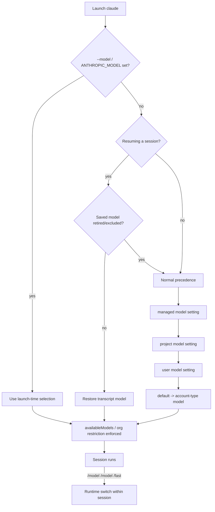

# Claude Code Model Support

## Model's Available

Claude Code (Anthropic's agentic CLI, observed against the `v2.1.198` line) is a **first-party model provider** solution: out of the box it talks only to Anthropic's own model families over the Anthropic Messages API (and its Bedrock / Vertex AI "Agent Platform" / Microsoft Foundry / Claude Platform on AWS dialects). It does **not** ship with any OpenAI-compatible or generic local-model backend.

### Model aliases (the primary interface)

Users almost never type a full model ID. Claude Code exposes a small set of **aliases** that resolve to the recommended version for the active provider and account type:

| Alias | Resolves to (Anthropic API) | Notes |
|-------|------------------------------|-------|
| `default` | Opus 4.8 (API) / Opus 4.7 (Claude Platform on AWS) / Sonnet 5 (Pro & sub seats) / Sonnet 4.5 (Bedrock, Vertex, Foundry) | Special value that **clears** any override and reverts to the recommended model for the account type. Not itself a model alias. |
| `best` | Fable 5 where accessible, else latest Opus | Highest-capability automatic choice. |
| `fable` | Claude Fable 5 | Long autonomous sessions; not the default on any tier. Flagged requests auto-fallback to Opus. |
| `opus` | Opus 4.8 (API) / 4.7 (AWS) / 4.6 (Bedrock, Vertex, Foundry) | Complex reasoning. |
| `sonnet` | Sonnet 5 (API) / 4.6 (AWS) / 4.5 (Bedrock, Vertex, Foundry) | Daily coding tasks. |
| `haiku` | Claude Haiku | Fast/efficient; also the background model. |
| `sonnet[1m]` / `opus[1m]` | Sonnet / Opus with a 1M-token context window | No-op where the alias already resolves to a native-1M model (e.g. Sonnet 5 on the API). |
| `opusplan` | `opus` in plan mode, `sonnet` in execution | Hybrid plan/execute mode. |

To pin a specific version instead of a floating alias, use the full model name (e.g. `claude-opus-4-8`, `claude-sonnet-5`) or set the corresponding `ANTHROPIC_DEFAULT_*_MODEL` variable.

### Underlying models available out of the box

| Model ID (exact) | Alias | Context window | Default on |
|------------------|-------|----------------|------------|
| `claude-fable-5` | `fable` | 1M | — (never the default; opt-in only) |
| `claude-opus-4-8` | `opus` | 1M (always on API) | Anthropic API, Max, Team Premium, Enterprise pay-as-you-go |
| `claude-opus-4-7` | — | 1M (auto-upgrade tiers) | Claude Platform on AWS |
| `claude-opus-4-6` | `opus` (Bedrock/Vertex/Foundry) | 1M | — |
| `claude-sonnet-5` | `sonnet` | 1M (native; no 200K variant on API) | Pro, Team Standard, Enterprise subscription seats |
| `claude-sonnet-4-6` | `sonnet` (AWS) | 1M (credits required) | — |
| `claude-sonnet-4-5` | `sonnet` (Bedrock/Vertex/Foundry) | 200K | Bedrock, Vertex, Foundry |
| `claude-haiku-4-5` | `haiku` | 200K | — (background/small-fast model) |

### Adding bespoke models

Claude Code has no native OpenAI-compatible / Ollama / llama.cpp backend. Bespoke and local models are registered through three channels:

1. **Anthropic-compatible endpoint** (`anthropic_compatible`) — set `ANTHROPIC_BASE_URL` to any endpoint that speaks the Anthropic Messages format, then point `ANTHROPIC_MODEL` (or add an `ANTHROPIC_CUSTOM_MODEL_OPTION`) at any model string the endpoint accepts. Claude Code itself never emits the OpenAI Chat Completions protocol, so the endpoint must speak Anthropic Messages natively — as the major local runners do (Ollama, oMLX, LM Studio, llama.cpp `b7187`+, vLLM `v0.11.1`+) — or a translating gateway must front it. Per-runner setup lives in the `model-config` topic.
2. **Cloud-provider plugin** (`provider_plugin`) — for Bedrock, Vertex AI, Foundry, and Claude Platform on AWS, register provider-form IDs via `modelOverrides` (Anthropic ID → Bedrock inference-profile ARN / Vertex version name / Foundry deployment name) and pin aliases with `ANTHROPIC_DEFAULT_{FABLE,OPUS,SONNET,HAIKU}_MODEL`.
3. **Gateway model discovery** (`other`) — with `CLAUDE_CODE_ENABLE_GATEWAY_MODEL_DISCOVERY=1`, Claude Code queries the gateway's `GET /v1/models` at startup and adds returned `claude`/`anthropic`-prefixed IDs to the `/model` picker (cached at `~/.claude/cache/gateway-models.json`).

> ℹ️ The major local runners (Ollama, oMLX, LM Studio, llama.cpp `b7187`+, vLLM `v0.11.1`+) serve the Anthropic Messages API natively, so `ANTHROPIC_BASE_URL` can point directly at them — no gateway required. A translating gateway is needed only for endpoints that speak solely the OpenAI protocol.

## Model Configuration Details

### Schema — informal

Anthropic publishes **no formal schema artifact** (no JSON Schema, OpenAPI, or protobuf) for Claude Code's model configuration. What exists is **informal**: a prose-and-tables [model configuration](https://code.claude.com/docs/en/model-config) page, a set of loosely-typed `settings.json` keys (`model`, `availableModels`, `enforceAvailableModels`, `fallbackModel`, `modelOverrides`, `effortLevel`, `advisorModel`, `alwaysThinkingEnabled`), a family of `ANTHROPIC_*` environment variables, and the CLI flags. The on-the-wire contract to a gateway is documented separately on the [Gateway protocol reference](https://code.claude.com/docs/en/llm-gateway-protocol) page (including a machine-readable `GET /protocol` served by the Claude apps gateway).

### How a model is selected — mechanisms and precedence

Claude Code lists its model-selection mechanisms explicitly **in order of priority**:

1. **During session** — `/model <alias|name>` (or `/model` for the picker). Highest precedence at runtime within an open session. As of v2.1.153, `Enter` saves the choice as the default for new sessions (writing the `model` field in user settings); `s` switches for the current session only. Related runtime commands: `/fast`, `/effort`, `/config`.
2. **At startup** — `claude --model <alias|name>` (also `--fallback-model`, `--advisor`, `--effort`, `--settings`, `--agents`). Applies to the launched session only.
3. **Environment variable** — `ANTHROPIC_MODEL` (session-scoped). Plus the alias-pinning family `ANTHROPIC_DEFAULT_{FABLE,OPUS,SONNET,HAIKU}_MODEL`, `CLAUDE_CODE_SUBAGENT_MODEL`, `ANTHROPIC_CUSTOM_MODEL_OPTION`, `CLAUDE_CODE_ENABLE_GATEWAY_MODEL_DISCOVERY`, and the provider-format selectors `CLAUDE_CODE_USE_{BEDROCK,VERTEX,FOUNDRY}`.
4. **Settings** — the `model` field in `settings.json`, layered managed > project > user. Related keys: `availableModels`, `enforceAvailableModels`, `fallbackModel`, `modelOverrides`, `effortLevel`, `advisorModel`, `alwaysThinkingEnabled`.

**Precedence summary:** `interactive_command (/model) > cli_flag (--model) > env_var (ANTHROPIC_MODEL) > config_file (model setting)`, with config files layered managed > project > user. `--model` and `ANTHROPIC_MODEL` are session-scoped. Resumed sessions (`--resume`/`--continue`) restore the transcript's saved model (unless retired or excluded by `availableModels`), but a launch-time `--model`/`ANTHROPIC_MODEL` — and, as of v2.1.195, an `ANTHROPIC_DEFAULT_OPUS_MODEL`-family variable — overrides the restored model. Organization restrictions and the `availableModels` allowlist are enforced on top of every surface.

### Programmatic model enumeration — not available

Claude Code **cannot** enumerate its model catalog programmatically. There is:

- **No `claude models` / `claude list-models` subcommand** (the CLI reference has none).
- **No `--list-models` flag** and no model-catalog API.
- **No config dump** that emits the resolved model list.

The `/model` picker is the sole native catalog view and it is **interactive-only** — it requires a TTY. (`claude agents --json` prints background *sessions*, not models.) Gateway discovery populates that same interactive picker; it is gateway-driven, not a Claude Code catalog API. Non-interactive consumers (wrappers, SDK users) must instead read the **resolved** model from the stream-json terminal `result.modelUsage` field — they cannot list the menu of choices.

### Related model-behavior configuration

| Concern | Mechanism | Notes |
|---------|-----------|-------|
| **Effort / adaptive reasoning** | `--effort`, `/effort`, `effortLevel`, `CLAUDE_CODE_EFFORT_LEVEL` | Levels `low`/`medium`/`high`/`xhigh`/`max` (+ `ultracode` session-only). `low`–`xhigh` persist; `max`/`ultracode` are session-only. Env var wins over all. |
| **Extended thinking** | `/config` toggle, `alwaysThinkingEnabled`, `MAX_THINKING_TOKENS`, Option/Alt+T | Cannot be turned off on Fable 5. |
| **1M context** | `sonnet[1m]`/`opus[1m]` suffix, `CLAUDE_CODE_DISABLE_1M_CONTEXT` | Native on Fable 5, Sonnet 5, Opus 4.7/4.8 (API). |
| **Fallback chain** | `--fallback-model`, `fallbackModel` | Tried on overload/unavailability; max 3 after dedup; turn-only. |
| **Advisor (second model)** | `--advisor`, `advisorModel` | Server-side advisor tool with its own model. |
| **Allowlist** | `availableModels`, `enforceAvailableModels` | Enforced across every model-selection surface. |

## Sources

- [Claude Code — Model configuration](https://code.claude.com/docs/en/model-config) *(primary source: aliases, defaults, precedence, env vars, availableModels, modelOverrides, effort, fallback, Fable 5 fallback)*
- [Claude Code — CLI reference](https://code.claude.com/docs/en/cli-reference) *(`--model`, `--fallback-model`, `--advisor`, `--effort`, `--settings`, `--agents` flags; subcommands)*
- [Claude Code — Gateway protocol reference](https://code.claude.com/docs/en/llm-gateway-protocol) *(API formats, model discovery via `/v1/models`, feature pass-through, `ANTHROPIC_BASE_URL`)*
- [Claude Code — LLM gateway](https://code.claude.com/docs/en/llm-gateway) *(routing Claude through a gateway)*
- [Claude Code — Settings](https://code.claude.com/docs/en/settings) *(settings files & precedence, `model`/`availableModels`/`modelOverrides`/`fallbackModel` keys)*
- [Claude Code — Environment variables](https://code.claude.com/docs/en/env-vars) *(`ANTHROPIC_MODEL`, `ANTHROPIC_DEFAULT_*_MODEL`, `CLAUDE_CODE_SUBAGENT_MODEL`, `CLAUDE_CODE_*` toggles)*
- [Claude Code — Sub-agents](https://code.claude.com/docs/en/sub-agents) *(subagent `model` frontmatter, `CLAUDE_CODE_SUBAGENT_MODEL`)*
- [Claude Code — Advisor](https://code.claude.com/docs/en/advisor) *(`advisorModel`, `--advisor`)*
- [Claude Code — Headless / programmatic mode](https://code.claude.com/docs/en/headless) *(stream-json `result.modelUsage`)*
- [Claude Code — Amazon Bedrock](https://code.claude.com/docs/en/amazon-bedrock) · [Google Vertex AI](https://code.claude.com/docs/en/google-vertex-ai) · [Microsoft Foundry](https://code.claude.com/docs/en/microsoft-foundry) · [Claude Platform on AWS](https://code.claude.com/docs/en/claude-platform-on-aws) *(provider-form model IDs, alias resolution per provider, Mantle endpoint)*
- [Anthropic Platform — Models overview](https://platform.claude.com/docs/en/about-claude/models/overview) *(current & legacy full model IDs across providers)*
- [Anthropic Platform — Context windows (1M token)](https://platform.claude.com/docs/en/build-with-claude/context-windows#1m-token-context-window) · [Effort](https://platform.claude.com/docs/en/build-with-claude/effort) · [Extended thinking](https://platform.claude.com/docs/en/build-with-claude/extended-thinking)

## Changelog

- **2026-07-03** — Corrected the local-model claim (curation edit, cross-validated against the `local_runners` and `model-config` research): Ollama, oMLX, LM Studio, llama.cpp (`b7187`+), and vLLM serve the Anthropic Messages API natively, so a direct `ANTHROPIC_BASE_URL` override works with **no** translating gateway; a gateway is required only for OpenAI-only endpoints. Also removed the `custom_models` frontmatter block — user-side model extension belongs solely to the `model-config` topic.
- **2026-07-01** — Initial research for `claude.md` (this file), observed against the Claude Code `v2.1.198` documentation line. Established Claude Code as a first-party/Anthropic-only model provider with no native OpenAI-compatible or local backend. Documented the alias system (`default`/`best`/`fable`/`opus`/`sonnet`/`haiku`/`sonnet[1m]`/`opus[1m]`/`opusplan`) and the account-dependent `default` resolution; enumerated the underlying out-of-the-box models (Fable 5, Opus 4.8/4.7/4.6, Sonnet 5/4.6/4.5, Haiku 4-5). Captured the full selection surface — `/model` runtime command, `--model`/`--fallback-model`/`--advisor`/`--effort` flags, `ANTHROPIC_MODEL` + `ANTHROPIC_DEFAULT_*_MODEL` + `CLAUDE_CODE_SUBAGENT_MODEL` + `ANTHROPIC_CUSTOM_MODEL_OPTION` env vars, and the `model`/`availableModels`/`enforceAvailableModels`/`fallbackModel`/`modelOverrides`/`effortLevel`/`advisorModel` settings keys — with the documented precedence (`/model` > `--model` > `ANTHROPIC_MODEL` > `model` setting; managed > project > user). Recorded that there is **no** programmatic model catalog (no `claude models` subcommand; `/model` is interactive-only) and that non-interactive consumers must read `result.modelUsage`. Documented the three bespoke-model channels (Anthropic-compatible gateway, Bedrock/Vertex/Foundry provider plugin, gateway `/v1/models` discovery). Classified schema as `informal`. Set `requires_claudine_update: true` against Claudine's `model_catalog` module.
