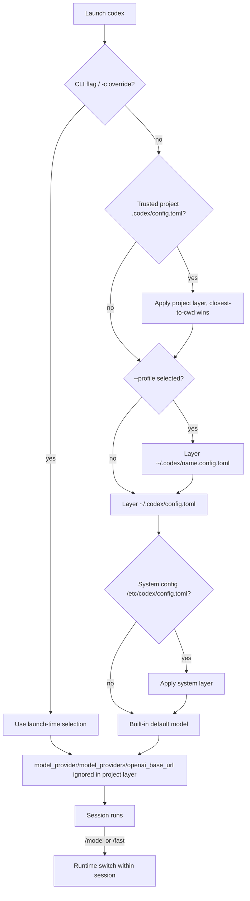

# Codex CLI Model Support

## Models Available

Codex CLI (OpenAI's open-source, Rust-based coding agent, observed against the current `developers.openai.com/codex` documentation line) is a **first-party OpenAI model consumer**: out of the box it talks to OpenAI models over the Responses API (Chat Completions API support is present but deprecated and slated for removal). It also ships built-in providers for local open-source backends (Ollama, LM Studio) and Amazon Bedrock, plus a generic custom-provider table for any Responses-API-compatible endpoint.

### Recommended models (available by default)

| Model ID (exact) | Context window | Default | Notes |
|------------------|----------------|---------|-------|
| `gpt-5.5` | not documented in Codex docs | yes | Newest frontier model; the documented starting point. Strongest for complex coding, computer use, knowledge work, research. ChatGPT or API-key auth. |
| `gpt-5.4` | not documented | — | Flagship frontier model for professional work; strong coding, reasoning, tool use, agentic workflows. |
| `gpt-5.4-mini` | not documented | — | Fast, efficient mini model for responsive coding and subagents; lower cost. |
| `gpt-5.3-codex-spark` | not documented | — | Text-only research preview for near-instant, real-time coding iteration. ChatGPT Pro only; no image input. |

> If no model is configured, Codex defaults to the current recommended model — `gpt-5.5`. Context-window sizes are not published on the Codex models page; configure an explicit override via `model_context_window` when you need to pin one.

### Deprecated models

`gpt-5.2` and `gpt-5.3-codex` are **deprecated for ChatGPT sign-in**. Scripts, config files, or `codex exec --model` commands referencing them should move to a current model. Some may still be reachable via API-key auth — check the [API models page](https://developers.openai.com/api/docs/models) for current availability.

> Codex does not expose a Claude-style alias system (`opus`/`sonnet`/...). Users pass the full model ID (e.g. `gpt-5.5`).

### Adding bespoke / local models

Codex has four channels for non-default models:

1. **Local open-source provider** (`local`) — `codex --oss` switches to the `oss` provider; `oss_provider` (`ollama` or `lmstudio`) selects the backend (both are built-in, reserved provider IDs). `--oss` validates that Ollama is running.
2. **Responses-API-compatible custom provider** (`openai_compatible`) — define `[model_providers.<id>]` with a `base_url`, an `env_key` (or command-backed `[model_providers.<id>.auth]`), and `wire_api = "responses"`, then set `model_provider = "<id>"` and `model` to any string the endpoint accepts. Works for Mistral, Azure OpenAI, LLM proxies/routers, and OpenAI data-residency endpoints. To redirect only the built-in OpenAI provider, set `openai_base_url` instead of redefining `[model_providers.openai]`.
3. **Amazon Bedrock** (`provider_plugin`) — the built-in `amazon-bedrock` provider with `[model_providers.amazon-bedrock.aws]` (`profile`, `region`); set `model` to a Bedrock model ID.
4. **Custom JSON model catalog** (`other`) — `model_catalog_json` points at a JSON catalog loaded on startup (overridable per profile). It populates the `/model` picker and `codex debug models` but does not define an endpoint, so it pairs with a custom provider entry.

> ⚠️ Chat Completions API support is deprecated. `wire_api` now accepts only `"responses"`, so a raw OpenAI-Chat-Completions-only endpoint will not keep working long-term — use a Responses-compatible gateway/provider.

## Model Configuration Details

### Schema — informal

Codex publishes **no formal schema artifact** (no JSON Schema, OpenAPI, or protobuf) for its model configuration. What exists is **informal**: a searchable prose-and-tables [Configuration Reference](https://developers.openai.com/codex/config-reference) enumerating every `config.toml` / `requirements.toml` key with its type and allowed values, plus the [Config basics](https://developers.openai.com/codex/config-basic) and [Advanced Config](https://developers.openai.com/codex/config-advanced) guides. The `--strict-config` flag will error on unknown `config.toml` fields, which implies a known field set, but that set is not published as a machine-readable schema. The model catalog itself is JSON-shaped and inspectable via `codex debug models`, but its schema is likewise not published.

### How a model is selected — mechanisms and precedence

Codex resolves configuration in a documented layered order ([Config basics — Configuration precedence](https://developers.openai.com/codex/config-basic#configuration-precedence)), and the interactive `/model` command can then change the active model within a session:

1. **During a session** — `/model <id>` (or `/model` for the picker). Highest precedence at runtime within an open thread. Related runtime commands: `/fast` (catalog-driven Fast service tier), `/status` (read resolved model), `/debug-config` (read effective layers).
2. **At launch** — CLI flags and `--config`/`-c` overrides: `--model`/`-m`, `-c model=...`, `--oss`, `--profile`. Applies to the launched session only (`-c` values parse as TOML).
3. **Project config** — `.codex/config.toml` walked from project root to cwd, closest wins, **trusted projects only**.
4. **Profile** — `~/.codex/<name>.config.toml`, selected with `--profile <name>`.
5. **User config** — `~/.codex/config.toml`.
6. **System config** — `/etc/codex/config.toml` on Unix.
7. **Built-in defaults**.

**Precedence summary:** `interactive_command (/model) > cli_flag (--model / -c / --oss / --profile) > config_file project > config_file profile > config_file user > config_file system > built-in defaults`. For security, project-local `.codex/config.toml` **ignores** `model_provider`, `model_providers`, and `openai_base_url` (and prints a startup warning), so provider/model routing must come from a user/system/profile layer or a CLI flag. On managed machines, `requirements.toml` can further constrain allowed policies.

> **Notable absence:** unlike Claude Code, Codex has **no dedicated model-selection environment variable** (there is no `CODEX_MODEL`). The documented env vars are `CODEX_HOME`, `CODEX_SQLITE_HOME`, `CODEX_API_KEY` / `CODEX_ACCESS_TOKEN` (auth, not model), `CODEX_CA_CERTIFICATE` / `SSL_CERT_FILE`, `RUST_LOG`, and installer vars. Provider `env_key` vars carry API keys, not model choices.

### Programmatic model enumeration — available

Codex **can** enumerate its model catalog programmatically — a capability Claude Code lacks:

- **`codex debug models`** *(Experimental)* — prints the raw model catalog Codex sees **as JSON**.
  - `--bundled` skips the remote refresh and prints only the catalog compiled into the current binary.
  - Example: `codex debug models` or `codex debug models --bundled`.
- **`/status`** — in-session confirmation of the resolved active model.
- **`/debug-config`** — prints the effective config-layer stack and policy sources.
- **`codex exec`** *(non-interactive)* — streams the active model in its JSONL output.

The catalog can also be extended or replaced via the `model_catalog_json` config key (a path to a JSON file loaded on startup, overridable per profile), and it is refreshed from a remote models endpoint unless `--bundled` is used.

### Related model-behavior configuration

| Concern | Mechanism | Notes |
|---------|-----------|-------|
| **Reasoning effort** | `model_reasoning_effort` (`minimal`\|`low`\|`medium`\|`high`\|`xhigh`), and `/model` (effort picker where available) | Responses API only; `xhigh` is model-dependent. |
| **Reasoning summaries** | `model_reasoning_summary` (`auto`\|`concise`\|`detailed`\|`none`), `model_supports_reasoning_summaries` | Force-send or suppress reasoning metadata. |
| **Verbosity** | `model_verbosity` (`low`\|`medium`\|`high`) | Responses API only; Chat Completions providers ignore it. |
| **Context window** | `model_context_window`, `model_auto_compact_token_limit` | Pin a window and the auto-compaction threshold. |
| **Fast service tier** | `/fast`, `features.fast_mode` | Catalog-driven; only for models that advertise a Fast tier. |
| **Profile-scoped model** | `--profile <name>` → `~/.codex/<name>.config.toml` | Profile files can set `model`, `model_reasoning_effort`, and `model_catalog_json`. |
| **Scoped overrides** | `review_model`, `memories.consolidation_model`, `memories.extract_model`, `agents.<name>.config_file` | Per-feature / per-subagent model overrides. |
| **Provider selection** | `model_provider`, `model_providers.<id>`, `openai_base_url`, `oss_provider` | Routing; built-in IDs `openai`/`ollama`/`lmstudio`/`amazon-bedrock` are reserved. |
| **Catalog extension** | `model_catalog_json` | Custom JSON catalog loaded on startup. |

## Sources

- [Codex CLI — Overview](https://developers.openai.com/codex/cli) *(install, what Codex is, links to features/reference)*
- [Codex — Models](https://developers.openai.com/codex/models) *(primary source: recommended models gpt-5.5/gpt-5.4/gpt-5.4-mini/gpt-5.3-codex-spark, deprecated gpt-5.2/gpt-5.3-codex, `/model`, `--model`/`-m`, `model = ...` config, Chat Completions deprecation)*
- [Codex — Config basics](https://developers.openai.com/codex/config-basic) *(configuration precedence, `model` key, feature flags incl. `fast_mode`)*
- [Codex — Advanced Config](https://developers.openai.com/codex/config-advanced) *(profiles, `-c` overrides, custom model providers, `openai_base_url`, Amazon Bedrock provider, OSS mode / `oss_provider`, project config security restrictions, model reasoning/verbosity/limits)*
- [Codex — Configuration Reference](https://developers.openai.com/codex/config-reference) *(authoritative informal schema: every `config.toml`/`requirements.toml` key — `model`, `model_provider`, `model_providers.*`, `model_catalog_json`, `model_context_window`, `model_reasoning_effort`, `model_reasoning_summary`, `model_verbosity`, `memories.*_model`, `agents.<name>.config_file`, built-in provider IDs)*
- [Codex — Environment variables](https://developers.openai.com/codex/environment-variables) *(documents `CODEX_HOME`, `CODEX_API_KEY`, `CODEX_ACCESS_TOKEN`, etc. — and confirms there is no model-selection env var)*
- [Codex CLI — Command line options](https://developers.openai.com/codex/cli/reference) *(global flags `--model`/`-m`, `--config`/`-c`, `--oss`, `--profile`/`-p`, `--strict-config`; the `codex debug models [--bundled]` subcommand)*
- [Codex CLI — Slash commands](https://developers.openai.com/codex/cli/slash-commands) *(`/model`, `/fast`, `/status`, `/debug-config`, `/review` using `review_model`)*
- [Codex — Customization / Subagents](https://developers.openai.com/codex/subagents) *(subagent roles and `agents.<name>.config_file` config layers)*
- [Codex — Amazon Bedrock](https://developers.openai.com/codex/amazon-bedrock) *(built-in `amazon-bedrock` provider setup)*
- [openai/codex — repo](https://github.com/openai/codex) *(open-source Rust implementation; `docs/config.md` redirects to the developers.openai.com config pages)*
- [OpenAI API — Models](https://developers.openai.com/api/docs/models) *(current and legacy model availability for API-key auth)*

## Changelog

- **2026-07-01** — Initial research for `codex.md` (this file), observed against the current `developers.openai.com/codex` documentation line. Established Codex CLI as a first-party OpenAI / Responses-API consumer with built-in Ollama, LM Studio, and Amazon Bedrock providers plus a generic custom-provider table. Documented the recommended model set (`gpt-5.5`, `gpt-5.4`, `gpt-5.4-mini`, `gpt-5.3-codex-spark`) and the deprecated models (`gpt-5.2`, `gpt-5.3-codex`); noted Codex has no alias system and publishes no context-window numbers. Captured the full selection surface — `/model` and `/fast` runtime commands; `--model`/`-c`/`--oss`/`--profile` flags; and the `model` / `model_provider` / `model_providers.*` / `model_catalog_json` / `model_context_window` / `model_reasoning_*` / `model_verbosity` config keys, profile files, and scoped overrides (`review_model`, `memories.*_model`, `agents.<name>.config_file`) — with the documented layered precedence (`/model` > CLI flags > project > profile > user > system > defaults) and the project-config security restriction on provider keys. Recorded that, uniquely among the wrapped providers, Codex has **no** model-selection environment variable and **does** expose a programmatic catalog via `codex debug models [--bundled]`. Documented the four bespoke-model channels (local `--oss`, Responses-compatible custom provider, Bedrock plugin, custom JSON catalog). Classified schema as `informal`. Set `requires_claudine_update: true` against Claudine's `model_catalog` module.
