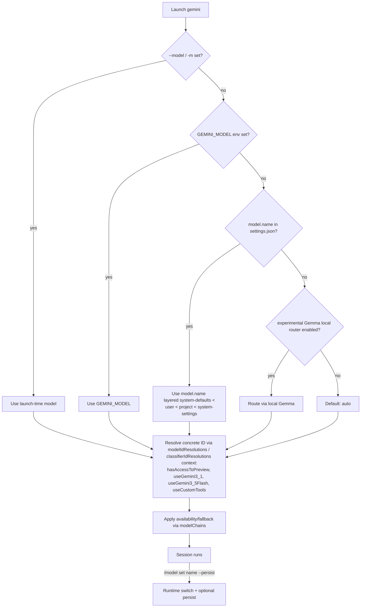

# Gemini CLI Model Support

## Model's Available

Gemini CLI (Google's open-source agentic CLI, observed against the **v0.49.0** release line) is a **first-party Google model provider**: out of the box it talks only to Google's own Gemini / Gemma families over the Gemini API (and the Vertex AI / Code Assist dialects of the same). It does **not** ship any OpenAI-compatible, Anthropic-compatible, or generic local-model backend.

### Tiers, aliases, and the `auto` router (the primary interface)

Users rarely type a concrete model ID. Gemini CLI exposes a small set of **tier aliases** that resolve to the appropriate model for the account and feature flags, plus an **`auto` router** that is the documented default:

| Alias | Tier | Default concrete model | Notes |
|-------|------|------------------------|-------|
| `auto` | auto | `gemini-3-pro-preview` (preview) / `gemini-2.5-pro` (no preview) | **Default when nothing is specified.** With `useGemini3_1` → `gemini-3.1-pro-preview`. Router picks Pro for complex prompts and Flash for simple ones. |
| `pro` | pro | `gemini-3-pro-preview` (preview) / `gemini-2.5-pro` | Highest-reasoning tier. |
| `flash` | flash | `gemini-3-flash-preview` (preview) / `gemini-3.5-flash` (`useGemini3_5Flash`) / `gemini-2.5-flash` | Fast/balanced tier. |
| `flash-lite` | flash-lite | `gemini-3.1-flash-lite` / `gemini-2.5-flash-lite` | Fastest tier; also the background/utility model. |

The concrete target of each alias is chosen by the **`modelConfigs.modelIdResolutions`** / **`classifierIdResolutions`** rules based on context flags (`hasAccessToPreview`, `useGemini3_1`, `useGemini3_5Flash`, `useCustomTools`, `requestedModels`). To pin a specific version, pass the full model ID (e.g. `gemini-3.1-pro-preview`, `gemini-2.5-flash`) to `--model`, `GEMINI_MODEL`, or `model.name`.

### Models available out of the box

The built-in `modelConfigs.modelDefinitions` registry (visible in the formal schema) declares the catalog. Visible (`isVisible: true`) entries:

| Model ID (exact) | Alias | Tier / Family | Preview | Context | Default on |
|------------------|-------|---------------|---------|---------|------------|
| `gemini-3-pro-preview` | `pro` | pro / gemini-3 | yes | 1M | `auto` / `pro` (preview accounts) |
| `gemini-3-flash-preview` | `flash` | flash / gemini-3 | yes | 1M | Auto (Gemini 3) simple prompts; `preview`/`auto-preview` last-resort fallback |
| `gemini-3.1-pro-preview` | — | pro / gemini-3 | yes | 1M | — (rolling out; access-gated) |
| `gemini-3.1-flash-lite` | `flash-lite` | flash-lite / gemini-3 | no | 1M | `flash-lite` alias (current resolution) |
| `gemini-3.5-flash` | — | flash / gemini-3 | no | 1M | — (selected when `useGemini3_5Flash`) |
| `gemini-2.5-pro` | `pro` | pro / gemini-2.5 | no | 1M | `auto` / `pro` (no preview); GA fallback |
| `gemini-2.5-flash` | `flash` | flash / gemini-2.5 | no | 1M | `flash` alias (legacy/cheatsheet resolution) |
| `gemini-2.5-flash-lite` | `flash-lite` | flash-lite / gemini-2.5 | no | 1M | background/utility (classifier, summarizer, prompt-completion) |
| `gemma-4-31b-it` | — | custom / gemma-4 | no | — | — (open model via Gemini API; `experimental.gemma`) |
| `gemma-4-26b-a4b-it` | — | custom / gemma-4 | no | — | — (open model via Gemini API) |

Hidden registry entries: `gemini-3.1-pro-preview-customtools` (`isVisible:false`, selected via `useCustomTools`), the tier router aliases `auto` / `pro` / `flash` / `flash-lite`, and the family-scoped routers `auto-gemini-3` / `auto-gemini-2.5`.

> 📝 All Gemini-family models document a **1M-token context window**. Gemma context windows are not documented in the configuration reference.

### Adding bespoke models

Gemini CLI has no native OpenAI-compatible / Anthropic-compatible / Ollama backend. Bespoke and local models are registered through four channels:

1. **Catalog entries & named presets** (`other`) — declare model metadata (tier/family/features) in `modelConfigs.modelDefinitions` and named presets in `modelConfigs.customAliases` / `customOverrides`. This adds *catalog* entries; the underlying wire backend must still be a Gemini-/Vertex-compatible endpoint. Editing `modelDefinitions` requires a restart; runtime edits of the resolution machinery require `experimental.dynamicModelConfiguration: true`.
2. **Local Gemma router** (`local`) — `experimental.gemmaModelRouter.*` (or the `gemini gemma setup` command) runs a local Gemma model via a LiteRT-LM shim to make *routing decisions* locally. This routes to a hosted Gemini model using local classification, rather than exposing a local model as the chat model.
3. **Vertex AI** (`provider_plugin`) — the first-party cloud backend. Set `GOOGLE_CLOUD_PROJECT` (+ `GOOGLE_CLOUD_LOCATION`) and authenticate via ADC, a service-account key, or `GOOGLE_API_KEY`; or set `GOOGLE_GENAI_USE_VERTEXAI=true` per the README/auth docs. Same model IDs as the Gemini API path.
4. **Compatible gateway** (`other`) — redirect Gemini-API or Vertex requests at a gateway/proxy via `GOOGLE_GEMINI_BASE_URL`, `GOOGLE_VERTEX_BASE_URL`, or `GOOGLE_GENAI_API_VERSION`. The endpoint must speak the Gemini or Vertex API — Gemini CLI never emits OpenAI Chat Completions or Anthropic Messages.

> ⚠️ A raw local OpenAI-compatible endpoint (Ollama, LM Studio, llama.cpp server) is **not** directly usable. You must front it with a gateway that exposes the Gemini or Vertex API.

## Model Configuration Details

### Schema — formal

Unlike Claude Code, Gemini CLI publishes a **formal, machine-readable schema**: a JSON Schema at [`schemas/settings.schema.json`](https://raw.githubusercontent.com/google-gemini/gemini-cli/main/schemas/settings.schema.json) in the repo (hosted at the raw GitHub URL). It is generated from source and is intended for editor autocomplete/validation of the entire `settings.json` — including the `model.*` block and the extensive `modelConfigs.*` block. This is the authoritative contract for model configuration; the configuration reference page describes the same keys in prose with their default JSON values.

### How a model is selected — mechanisms and precedence

The [Model routing](https://geminicli.com/docs/cli/model-routing/) page documents the model-selection order explicitly:

1. **`--model` / `-m` CLI flag** — a model specified at launch is always used. Accepts an alias (`auto`/`pro`/`flash`/`flash-lite`) or a concrete name. Default value is `auto`.
2. **`GEMINI_MODEL` environment variable** — used if `--model` is not passed; "overrides the hardcoded default."
3. **`model.name` in `settings.json`** — the persistent initial model. Settings files layer **system-defaults < user (`~/.gemini/settings.json`) < project (`.gemini/settings.json`) < system-settings**, then environment variables, then CLI arguments (general config precedence).
4. **Local model (experimental)** — if the Gemma local router (`experimental.gemmaModelRouter`) is enabled, it routes the request locally instead of resolving a hosted Gemini model.
5. **Default** — if none of the above is set, the default is `auto`.

At runtime, **`/model`** (and `/model set <name> [--persist]`, `/model manage`) switches the session model; `/model set --persist` also writes `model.name` for future sessions. Note: `/model` does **not** override sub-agent models, so model-usage reports may show other models.

After a name is chosen, the concrete model ID is resolved by `modelConfigs.modelIdResolutions` / `classifierIdResolutions` (context-aware), and availability/fallback is governed by `modelConfigs.modelChains`.

**Precedence summary:** `interactive_command (/model) > cli_flag (--model/-m) > env_var (GEMINI_MODEL) > config_file (model.name) > local_router (experimental Gemma) > default (auto)`, with settings.json layered system-defaults < user < project < system-settings.

### Programmatic model enumeration — not available

Gemini CLI **cannot** enumerate its model catalog programmatically. There is:

- **No `gemini models` / `gemini list-models` subcommand** and **no `--list-models` flag** (the CLI surface is `gemini`, `gemini update`, `gemini extensions`, `gemini mcp`, `gemini skills`, `gemini gemma`).
- **No model-catalog API** exposed by the CLI.

The `/model` command opens an **interactive** picker/dialog (requires a TTY) and is the sole runtime catalog view. The catalog itself is *statically* declared in `modelConfigs.modelDefinitions` and formally described by the JSON Schema — both machine-readable, but neither is dumped by a CLI command. For the *resolved* model non-interactively, read `--output-format stream-json` events, `/chat debug` (dumps the latest API request JSON), or the `BeforeModel`/`AfterModel` hook `LLMRequest.model` field.

### Related model-behavior configuration

| Concern | Mechanism | Notes |
|---------|-----------|-------|
| **Plan-Mode routing** | `general.plan.modelRouting` (default `true`) | Auto-switches Pro (planning) / Flash (implementation) by Plan Mode phase. |
| **Model steering (hints)** | `experimental.modelSteering` (default `false`) | User hints to guide the model during tool execution. Experimental. |
| **Availability / fallback chains** | `modelConfigs.modelChains` | Per-chain (`preview`, `auto-preview`, `default`) ordered models with retry/`isLastResort` and `actions`/`stateTransitions` for terminal/transient/not_found/unknown failures. |
| **Context compression** | `model.compressionThreshold` (default `0.5`) | Fraction of context at which compression triggers. |
| **Loop detection** | `model.disableLoopDetection` (default `false`) | Toggle infinite-loop detection. |
| **Retry budget** | `general.maxAttempts` (default `10`, max 10) | Max attempts for the main chat model. |
| **Quota / overage** | `billing.overageStrategy` (`ask`/`always`/`never`) | How quota exhaustion is handled when AI credits are available. |
| **Sub-agent model** | agent frontmatter `model` field | Per-subagent override; `/model` does not affect it. |
| **Gemma (open models)** | `experimental.gemma` (default `true`) | Enables Gemma 4 models via the Gemini API. |
| **Dynamic config** | `experimental.dynamicModelConfiguration` (default `false`) | Master switch for runtime edits of definitions/resolutions/chains. |

## Sources

- [Gemini CLI — GitHub repository](https://github.com/google-gemini/gemini-cli) *(README: Gemini 3 / 1M context, install, `-m` example, Vertex AI env vars)*
- [Gemini CLI — `schemas/settings.schema.json` (formal JSON Schema)](https://raw.githubusercontent.com/google-gemini/gemini-cli/main/schemas/settings.schema.json) *(authoritative contract for `model.*` and `modelConfigs.*`)*
- [Gemini CLI — Configuration reference](https://geminicli.com/docs/reference/configuration/) *(settings layers, `model.*`, full `modelConfigs.*` defaults: aliases, modelDefinitions, modelIdResolutions, classifierIdResolutions, modelChains; env vars `GEMINI_MODEL`, `GOOGLE_GEMINI_BASE_URL`, `GOOGLE_VERTEX_BASE_URL`, `GOOGLE_GENAI_API_VERSION`; schema tip)*
- [Gemini CLI — Model selection (`/model`)](https://geminicli.com/docs/cli/model/) *(Auto/Pro/Manual options, `/model` does not override sub-agents)*
- [Gemini CLI — Model routing](https://geminicli.com/docs/cli/model-routing/) *(ModelAvailabilityService, fallback, Local Gemma routing, **selection precedence**)*
- [Gemini CLI — Model steering (experimental)](https://geminicli.com/docs/cli/model-steering/)
- [Gemini CLI — Gemini 3 on Gemini CLI](https://geminicli.com/docs/get-started/gemini-3/) *(Gemini 3 Pro/Flash, Gemini 3.1 Pro Preview rollout, Auto vs Pro routing, capacity fallback, `gemini -m gemini-3.1-pro-preview`)*
- [Gemini CLI — CLI cheatsheet](https://geminicli.com/docs/cli/cli-reference/) *(`--model`/`-m` default `auto`, model aliases `auto`/`pro`/`flash`/`flash-lite`, `--output-format stream-json`)*
- [Gemini CLI — Command reference](https://geminicli.com/docs/reference/commands/) *(`/model manage`, `/model set <name> [--persist]`, `/settings`, `/stats model`, `/chat debug`)*
- [Gemini CLI — Authentication setup](https://geminicli.com/docs/get-started/authentication/) *(OAuth, `GEMINI_API_KEY`, Vertex AI ADC/service-account/`GOOGLE_API_KEY`, `GOOGLE_CLOUD_PROJECT`)*
- [Gemini CLI — Model configuration (generation settings)](https://geminicli.com/docs/cli/generation-settings/)
- [Gemini CLI — Hooks reference (Stable Model API)](https://geminicli.com/docs/hooks/reference) *(BeforeModel/AfterModel `LLMRequest.model` / `LLMResponse` — the stable wire shape for the resolved model)*
- [Gemini CLI — Subagents](https://geminicli.com/docs/core/subagents/) *(per-agent `model` frontmatter override)*
- [Gemini CLI — Releases (v0.49.0 latest stable)](https://github.com/google-gemini/gemini-cli/releases)

## Changelog

- **2026-07-01** — Initial research for `gemini.md` (this file), observed against the Gemini CLI `v0.49.0` release line. Established Gemini CLI as a first-party Google/Gemini-only provider (Gemini API + Vertex AI/Code Assist dialects) with no native OpenAI- or Anthropic-compatible backend. Classified the schema as **formal** (machine-readable JSON Schema at `schemas/settings.schema.json` covering `model.*` and `modelConfigs.*`). Documented the tier-alias system (`auto` default router, `pro`/`flash`/`flash-lite`) and the context-based resolution machinery (`modelIdResolutions` / `classifierIdResolutions` keyed on `hasAccessToPreview`/`useGemini3_1`/`useGemini3_5Flash`/`useCustomTools`); enumerated the out-of-the-box catalog (gemini-3-pro-preview, gemini-3-flash-preview, gemini-3.1-pro-preview, gemini-3.1-flash-lite, gemini-3.5-flash, gemini-2.5-pro/flash/flash-lite, gemma-4-31b-it, gemma-4-26b-a4b-it) plus hidden entries. Captured the full selection surface — `/model` runtime command (`/model set [--persist]`, `/model manage`), `--model`/`-m` flag, `GEMINI_MODEL` env var, `model.name` setting, experimental local Gemma router — with the documented precedence (`--model` > `GEMINI_MODEL` > `model.name` > local router > default `auto`) and settings-file layering. Recorded the rich `modelConfigs.*` machinery (aliases with `extends`, customAliases/customOverrides, modelDefinitions, modelIdResolutions/classifierIdResolutions, availability modelChains) and the `experimental.dynamicModelConfiguration` gate. Documented availability/fallback via `ModelAvailabilityService` + `modelChains`, Plan-Mode Pro/Flash routing, and the Gemini-specific auth/backend routing env vars. Recorded that there is **no** programmatic model catalog (no `gemini models` subcommand; `/model` is interactive-only) and that non-interactive consumers must read the resolved model from stream-json events / `/chat debug` / the BeforeModel hook. Documented the four bespoke-model channels (catalog entries/customAliases, local Gemma router, Vertex AI provider plugin, Gemini/Vertex-compatible gateway via base-URL overrides). Set `requires_claudine_update: true` against Claudine's `model_catalog` module.
