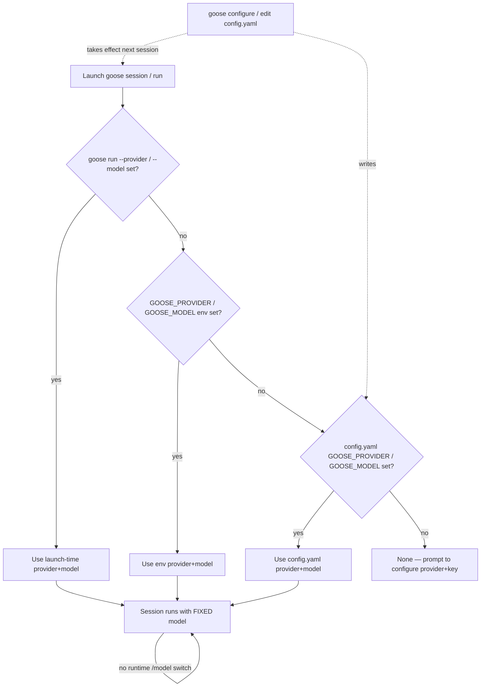

# Goose CLI Model Support

## Models Available

Goose (Block / Agentic AI Foundation's open-source agent, observed against the current `goose-docs.ai` documentation line; repo moved from `github.com/block/goose` to **[github.com/aaif-goose/goose](https://github.com/aaif-goose/goose)** and the docs site moved from `block.github.io/goose` to **[goose-docs.ai](https://goose-docs.ai)**) is fundamentally a **multi-provider** agent, not a first-party model consumer. Out of the box it ships integrations for **~40 LLM providers** plus local, CLI-pass-through, and ACP providers — and it ships a large **declarative model catalog per provider** (JSON files under [`crates/goose/src/providers/declarative/`](https://github.com/aaif-goose/goose/tree/main/crates/goose/src/providers/declarative)) that populates the model picker.

> ⚠️ **No working model out of the box.** `GOOSE_PROVIDER` and `GOOSE_MODEL` are both **required** and default to `None`. On first run goose prompts you to configure a provider and supply credentials before any model is usable. There is no goose-wide default model — only per-provider picker defaults.

### Built-in providers

| Category | Providers |
|----------|-----------|
| **First-party API providers** | Amazon Bedrock, Amazon SageMaker TGI, Anthropic, Azure OpenAI, ChatGPT Codex (OAuth), Databricks, GCP Vertex AI, Gemini (Google AI), GitHub Copilot (device-flow OAuth), Groq, Mistral AI, OpenAI, OpenRouter, Snowflake, Tetrate Agent Router (PKCE OAuth), VMware Tanzu, xAI, Cerebras, Perplexity, OVHcloud, Scaleway, SaladCloud, LiteLLM |
| **Aggregators / gateways** | OpenRouter, Tetrate, Routstr, FuturMix, EmpirioLabs, Novita, Avian, NEAR AI Cloud, iFlytek Spark, iFlytek Astron MaaS, Venice |
| **Local model runners** | Ollama, Ollama Cloud, LM Studio, Atomic Chat, Docker Model Runner, Ramalama |
| **CLI pass-through (deprecated)** | `cursor-agent`, `claude-code`, `codex`, `gemini-cli` |
| **ACP providers** | `claude-acp`, `codex-acp` |

Each provider authenticates via its own env-key family (e.g. `ANTHROPIC_API_KEY`, `OPENAI_API_KEY` + `OPENAI_HOST`, `OLLAMA_HOST`, `GROQ_API_KEY`, `AZURE_OPENAI_*`, `AWS_*`). See the [Supported LLM Providers](https://goose-docs.ai/docs/getting-started/providers) page for the full parameter table. goose's own guidance is that it **"works best with Claude 4 models"** because it leans heavily on tool calling — the [Berkeley Function-Calling Leaderboard](https://gorilla.cs.berkeley.edu/leaderboard.html) is the recommended selection aid.

### Representative built-in catalog models

Because goose ships a declarative catalog per provider (rather than one fixed lineup), the "available" model IDs depend on the chosen provider. The table below lists representative IDs the docs explicitly feature; the exact strings goose accepts come from each provider's `declarative/<provider>.json`.

| Model ID (exact) | Provider(s) | Context window | Notes |
|------------------|-------------|----------------|-------|
| `claude-sonnet-4-5` | Anthropic | 200K | Picker default for the Anthropic provider (shown as "(default)"). goose's recommended family. |
| `claude-4.5-sonnet` | Anthropic | — | Alternate string in the documented `config.yaml` example. |
| `gpt-5` | Tetrate / OpenAI | — | "(Recommended)" in the first-run quickstart picker. |
| `gemini-2.5-pro` | Gemini / FuturMix | 1M | Gemini 3 models add a configurable thinking level. |
| `gemini-2.0-flash` | Gemini | — | Used in the documented Gemini configure example. |
| `qwen2.5` | Ollama (local) | 4096 default | Any tool-calling local model works; goose auto-lists installed Ollama models. |

### Adding bespoke / local models

goose has five channels for non-default models:

1. **Local model runner** (`local`) — pick a built-in local provider. **Ollama** is primary (`OLLAMA_HOST`, default `localhost:11434`; auto-lists installed models; raise the 4096 default context via `OLLAMA_CONTEXT_LENGTH`/`GOOSE_INPUT_LIMIT`). **LM Studio** (`localhost:1234`), **Atomic Chat** (`localhost:1337`), and **Docker Model Runner** (via the OpenAI provider with `OPENAI_HOST=http://localhost:12434` + `OPENAI_BASE_PATH=/engines/llama.cpp/v1/chat/completions`) speak OpenAI-compatible APIs. **Ramalama** reuses the Ollama provider (`OLLAMA_HOST=http://0.0.0.0:8080`, requires `--runtime-args=--jinja`). Models without tool calling can only do chat completion and need all extensions disabled.
2. **OpenAI-compatible endpoint** (`openai_compatible`) — two routes. Point the built-in **OpenAI provider** at any OpenAI-compatible server (vLLM, KServe, Docker Model Runner, enterprise proxies) via `OPENAI_HOST` (+ `OPENAI_BASE_PATH`, `OPENAI_CUSTOM_HEADERS`, `OPENAI_ORGANIZATION`, `OPENAI_PROJECT`); or register a **custom provider** (see below) with `engine: "openai"`.
3. **Anthropic-compatible endpoint** (`anthropic_compatible`) — redirect the built-in Anthropic provider with `ANTHROPIC_HOST`, or register a custom provider with `engine: "anthropic"`.
4. **First-party provider plugin** (`provider_plugin`) — any of the ~40 built-in providers, each with its own declarative catalog and env-key auth.
5. **Custom-provider JSON / ACP / CLI pass-through** (`other`) — see below.

#### Custom providers (shareable JSON)

A custom provider is a JSON file in `~/.config/goose/custom_providers/` (Windows: `%APPDATA%\Block\goose\config\custom_providers\`), selectable in the picker like any built-in:

```json
{
  "name": "custom_corp_api",
  "engine": "openai",
  "display_name": "Corporate API",
  "description": "Custom Corporate API provider",
  "api_key_env": "CUSTOM_CORP_API_API_KEY",
  "base_url": "https://api.company.com/v1/chat/completions",
  "models": [
    { "name": "gpt-4o", "context_limit": 128000 },
    { "name": "gpt-3.5-turbo", "context_limit": 16385 }
  ],
  "headers": { "x-origin-client-id": "YOUR_CLIENT_ID", "x-origin-secret": "YOUR_SECRET_VALUE" },
  "supports_streaming": true,
  "requires_auth": true
}
```

`engine` is one of `openai`, `anthropic`, or `ollama`. Keys are stored in the system keyring (or `secrets.yaml` when the keyring is disabled/unavailable). Add/update/remove via `goose configure` → `Custom Providers`, goose Desktop, or by editing the JSON directly. Custom headers are CLI-wizard-supported only for OpenAI-engine providers.

## Model Configuration Details

### Schema — informal

goose publishes **no formal schema artifact** (no JSON Schema, OpenAPI, or protobuf) for its model configuration. What exists is **informal**: a flat YAML config file (`~/.config/goose/config.yaml` on macOS/Linux; `%APPDATA%\Block\goose\config\config.yaml` on Windows) whose keys are the same `GOOSE_*` names used as environment variables, documented as prose-and-tables on the [Configuration Files](https://goose-docs.ai/docs/guides/config-files) and [Environment Variables](https://goose-docs.ai/docs/guides/environment-variables) pages. The custom-provider JSON shape is shown by example (above) rather than by a published schema, and each built-in provider's model list lives in an unversioned declarative JSON file in the repo.

### How a model is selected — mechanisms and precedence

goose resolves configuration in a documented flat order ([Configuration Files — Configuration Priority](https://goose-docs.ai/docs/guides/config-files#configuration-priority)):

1. **Environment variables** (highest priority)
2. **Config file settings** (`config.yaml`)
3. **Default values** (lowest priority) — and for `GOOSE_PROVIDER`/`GOOSE_MODEL` the default is `None` (you must configure them)

The `goose run --provider` / `--model` flags are documented as overriding the environment variables, so they sit above env in precedence. `goose configure` is the interactive writer for `config.yaml` (and the keyring).

> **Critical difference from Claude Code / Codex:** goose has **no `/model` slash command** and **no runtime model switch** within an open session. The interactive slash commands are `/?`, `/builtin`, `/clear`, `/endplan`, `/exit`, `/extension`, `/mode`, `/plan`, `/prompt`, `/prompts`, `/recipe`, `/compact`, `/r`, `/skills`, `/t` — and `/mode` sets the **tool-permission mode** (`auto`/`approve`/`chat`/`smart_approve`), **not** the model. Model changes made via `goose configure` or `config.yaml` **take effect on the next session**, not the current one. The only per-session override is the launch flag on `goose run`.

**Precedence summary:** `cli_flag (goose run --provider / --model) > env_var (GOOSE_PROVIDER / GOOSE_MODEL + GOOSE_FAST_MODEL + GOOSE_PLANNER_* + GOOSE_PROVIDER__* + GOOSE_CONTEXT_LIMIT family) > config_file (~/.config/goose/config.yaml) > defaults (NONE — required)`. Layering is flat (a single `config.yaml` plus env plus launch flags), not the managed/project/user stack used by Claude Code.



### Programmatic model enumeration — not available

goose **cannot** enumerate its model catalog programmatically:

- **No `goose models` / `goose list-models` subcommand** and no `--list-models` flag.
- **No model-catalog API.** `goose info -v` is a **config dump** — it prints the *resolved* provider+model, env vars, config location, and enabled extensions (the current choice, not the menu of choices).
- **`goose configure`** fetches the per-provider model list **interactively at configure time** (requires a TTY); it is not a programmatic listing.
- The declarative catalogs (`crates/goose/src/providers/declarative/*.json`) are readable as files in the repo, and a few providers (**Routstr**, **EmpirioLabs**, **NEAR AI Cloud**) query the endpoint's `GET /v1/models` at configure time to populate the picker — but none of these expose a catalog listing to non-interactive consumers.

Non-interactive consumers must read the resolved model from `goose info -v` (or the session export / JSONL output), not enumerate the catalog.

### Related model-behavior configuration

| Concern | Mechanism | Notes |
|---------|-----------|-------|
| **Planning model** | `GOOSE_PLANNER_PROVIDER`, `GOOSE_PLANNER_MODEL`, `GOOSE_PLANNER_CONTEXT_LIMIT` | Dedicated planner for `/plan`; falls back to the main provider/model. |
| **Fast / auxiliary model** | `GOOSE_FAST_MODEL` | Overrides the provider default used for tool-selection, classification, session titles. |
| **Context window** | `GOOSE_CONTEXT_LIMIT`, `GOOSE_INPUT_LIMIT` (Ollama `num_ctx`), `GOOSE_AUTO_COMPACT_THRESHOLD` | Override for LiteLLM proxies / custom models; auto-compaction at 80% by default. |
| **Temperature / max tokens** | `GOOSE_TEMPERATURE`, `GOOSE_MAX_TOKENS` | Per-response controls; model-specific defaults. |
| **Claude thinking** | `CLAUDE_THINKING_TYPE` (`adaptive`\|`enabled`\|`disabled`) | Anthropic + Databricks; `adaptive` default for Claude 4.6+. CLI display needs `GOOSE_CLI_SHOW_THINKING=1`. |
| **Gemini 3 thinking** | `GEMINI3_THINKING_LEVEL` (`low`\|`high`) | Priority: `request_params.thinking_level` > env > `low`. |
| **Enhanced code editing** | `GOOSE_EDITOR_API_KEY` / `GOOSE_EDITOR_HOST` / `GOOSE_EDITOR_MODEL` | Separate OpenAI-compatible model for the Developer extension's `str_replace`. |
| **Tool-call interpretation** | `GOOSE_TOOLSHIM`, `GOOSE_TOOLSHIM_OLLAMA_MODEL` | Lets non-tool-calling models work via an Ollama interpreter model. |
| **OpenRouter params** | `OPENROUTER_PARAMETERS` (YAML object or JSON string) | Per-request fields (`verbosity`, `reasoning`, `plugins`, …); goose manages `model`/`messages`/`stream`. |
| **Provider retries** | `BEDROCK_*` / `DATABRICKS_*` retry families | Configurable retry count + backoff per provider. |

## Sources

- [goose — Configure LLM Provider (Supported Providers)](https://goose-docs.ai/docs/getting-started/providers) *(primary source: full provider table + env-key params, custom OpenAI endpoints, custom-provider JSON, Ollama/LM Studio/Atomic Chat/Docker Model Runner/Ramalama local setup, GitHub Copilot & Azure auth, Gemini 3 thinking, multi-model, OpenRouter parameters, viewing model reasoning)*
- [goose — Quickstart](https://goose-docs.ai/docs/quickstart) *(first-run flow, `goose configure`, Tetrate "(Recommended)" / `gpt-5`, Anthropic "(default)" `claude-sonnet-4-5`)*
- [goose — Configuration Files](https://goose-docs.ai/docs/guides/config-files) *(config.yaml location, GOOSE_* global settings table, configuration priority env > config > defaults, `goose info -v`)*
- [goose — Environment Variables](https://goose-docs.ai/docs/guides/environment-variables) *(GOOSE_PROVIDER/GOOSE_MODEL/GOOSE_FAST_MODEL, GOOSE_PLANNER_*, GOOSE_PROVIDER__TYPE/HOST/API_KEY, GOOSE_CONTEXT_LIMIT family, CLAUDE_THINKING_TYPE, GEMINI3_THINKING_LEVEL, GOOSE_EDITOR_*, GOOSE_TOOLSHIM, GOOSE_MODE)*
- [goose — CLI Commands](https://goose-docs.ai/docs/guides/goose-cli-commands) *(`goose run --provider/--model`, `goose session`, `goose configure`, `goose info -v`, full slash-command list confirming no `/model`, `/mode` is tool-permission mode)*
- [goose — CLI Providers](https://goose-docs.ai/docs/guides/cli-providers) *(deprecated claude-code/codex/cursor-agent/gemini-cli pass-through providers, GOOSE_MODEL per CLI provider, planner+execution combination)*
- [goose — ACP Providers](https://goose-docs.ai/docs/guides/acp-providers) *(claude-acp / codex-acp as providers, extension pass-through)*
- [goose — Multi-Model Configuration](https://goose-docs.ai/docs/guides/multi-model/) *(planner + execution model strategies)*
- [goose — LLM Rate Limits](https://goose-docs.ai/docs/guides/handling-llm-rate-limits-with-goose) *(provider retry/backoff context)*
- [goose repo — declarative provider catalogs](https://github.com/aaif-goose/goose/tree/main/crates/goose/src/providers/declarative) *(per-provider model JSON: `groq.json`, `empiriolabs.json`, `futurmix.json`, `novita.json`, `routstr.json`, …)*
- [goose repo — provider implementations](https://github.com/aaif-goose/goose/tree/main/crates/goose/src/providers) *(Rust provider source; prompt-caching enablement for Claude via Anthropic/Bedrock/Databricks/OpenRouter/LiteLLM)*
- [goose — moved to AAIF announcement](https://goose-docs.ai/blog/2026/04/07/goose-moves-to-aaif) *(repo move block/goose → aaif-goose/goose; site → goose-docs.ai)*

## Changelog

- **2026-07-01** — Initial research for `goose.md` (this file), observed against the current `goose-docs.ai` documentation line. Recorded the repo/site move (`block/goose` → `aaif-goose/goose`; `block.github.io/goose` → `goose-docs.ai`). Established goose as a **multi-provider** agent (~40 built-in providers) rather than a first-party model consumer, where `GOOSE_PROVIDER` + `GOOSE_MODEL` are a **required pair** with **no usable out-of-the-box default** (defaults are `None`; first run prompts configuration). Documented the declarative per-provider JSON catalogs (`crates/goose/src/providers/declarative/*.json`) that populate the picker and listed representative catalog IDs (`claude-sonnet-4-5`, `gpt-5`, `gemini-2.5-pro`, `gemini-2.0-flash`, `qwen2.5`). Captured the full selection surface — `goose run --provider/--model` flags, the `GOOSE_PROVIDER`/`GOOSE_MODEL`/`GOOSE_FAST_MODEL`/`GOOSE_PLANNER_*`/`GOOSE_PROVIDER__*`/`GOOSE_CONTEXT_LIMIT` env families, the `config.yaml` keys, and the `goose configure` wizard — with the documented flat precedence (CLI flags > env > config > no default). **Emphasized the key differentiator**: goose has **no `/model` slash command and no runtime model switch** within a session (`/mode` is tool-permission mode); model changes apply to the next session. Documented the five bespoke-model channels (local runners, OpenAI-compatible via built-in OpenAI provider or custom-provider JSON, Anthropic-compatible, the ~40 first-party provider plugins, and Ollama-engine custom providers / ACP / deprecated CLI pass-throughs) including the shareable `custom_providers/*.json` shape (`engine: openai|anthropic|ollama`). Recorded that there is **no** programmatic catalog enumeration (no `goose models` subcommand; `goose info -v` is a resolved-config dump only; the picker is interactive). Classified schema as `informal`. Set `requires_claudine_update: true` against Claudine's `model_catalog` module.
