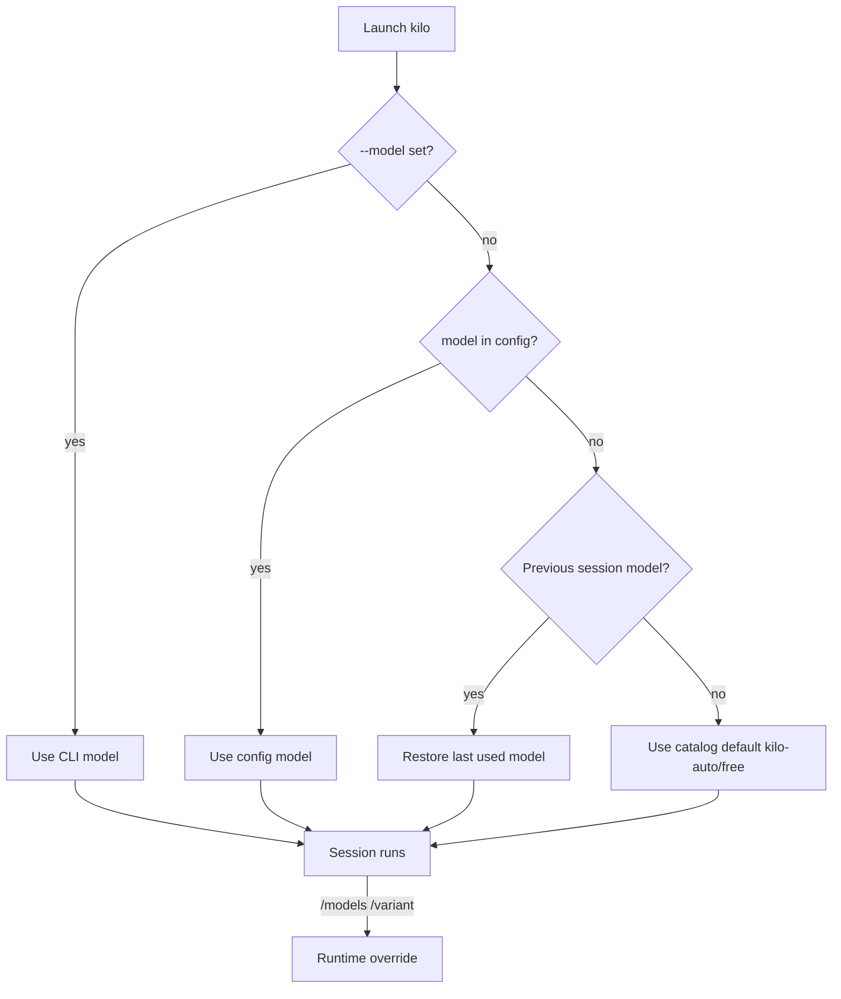

# Kilo Code Model Support

## Models Available

Kilo Code is a multi-provider agentic coding platform. Out of the box it exposes 500+ hosted models through the Kilo Gateway, plus built-in Auto Model virtual tiers that route requests to an appropriate underlying model. All model identifiers use the format `provider_id/model_id`.

### Auto Model tiers

Auto Model is the default experience. You choose a tier and Kilo routes each request to a model that fits the work.

| Model ID | Name | Behavior |
|----------|------|----------|
| `kilo-auto/free` | Auto Free | Routes to the best available free models; no payment required. This is the catalog default. |
| `kilo-auto/balanced` | Auto Balanced | Strong performance at a lower cost; picks one fixed high-quality model per API interface. |
| `kilo-auto/efficient` | Auto Efficient | Session-aware routing that classifies request difficulty and chooses the cheapest accurate model. |
| `kilo-auto/frontier` | Auto Frontier | Latest and most capable paid models, selected per mode. |
| `kilo-auto/small` | Auto Small | Small, fast model for background tasks such as title generation and commit messages. |

### Representative hosted models

The full catalog is live at [kilo.ai/models](https://kilo.ai/models). The following popular models ship in the built-in catalog:

| Model ID | Provider | Notes |
|----------|----------|-------|
| `anthropic/claude-opus-4.7` | Anthropic | Most capable Claude model for complex reasoning. |
| `anthropic/claude-sonnet-4.6` | Anthropic | Balanced performance and cost. |
| `anthropic/claude-haiku-4.5` | Anthropic | Fast and cost-effective. |
| `openai/gpt-5.4` | OpenAI | Latest GPT model. |
| `openai/gpt-5.4-mini` | OpenAI | Fast and efficient. |
| `google/gemini-3.1-pro-preview` | Google | Advanced reasoning. |
| `google/gemini-2.5-flash` | Google | Fast and efficient. |
| `x-ai/grok-4` | xAI | Most capable Grok model. |
| `x-ai/grok-code-fast-1` | xAI | Optimized for code tasks. |
| `deepseek/deepseek-v3.2` | DeepSeek | Strong coding and reasoning. |
| `moonshotai/kimi-k2.5` | Moonshot | Strong coding and multilingual. |
| `minimax/minimax-m2.7` | MiniMax | High-performance MoE model. |

### Adding bespoke models

Kilo Code supports custom models in three main ways:

1. **Local models** — register models served by Ollama or LM Studio under `provider.ollama.models` or `provider.lmstudio.models`.
2. **OpenAI-compatible endpoints** — use `provider.openai-compatible` with a custom `baseURL` for any OpenAI Chat Completions-compatible API.
3. **Provider plugins** — install npm plugins with `kilo plugin <module>` that register additional providers and models.

You can also override any built-in model by redeclaring it under `provider.<provider_id>.models` to set limits, cost, variants, or options.

## Model Configuration Details

### Schema

Kilo Code publishes a formal JSON Schema for its configuration at `https://app.kilo.ai/config.json` (draft 2020-12). The schema defines the `model`, `provider`, `agent.<name>.model`, and provider-level `models` shapes. A typical config file begins with:

```jsonc
{
  "$schema": "https://app.kilo.ai/config.json",
  "model": "anthropic/claude-sonnet-4.6",
  "provider": {
    "anthropic": {
      "options": {
        "apiKey": "{env:ANTHROPIC_API_KEY}"
      }
    }
  }
}
```

The `model` field uses the `provider_id/model_id` format and references the model schema at `https://models.dev/model-schema.json`.

### How a model is selected

Kilo resolves the active model through several layers. At launch, the order is:

1. `--model` / `-m` CLI flag.
2. `model` key in the merged config file.
3. Last used model from the previous session.
4. First available model using an internal priority, which falls back to the gateway default (`kilo-auto/free`).

In an open interactive session, `/models` and `/variant` override the launch-time selection until the session ends. Project-level config takes precedence over global config.



### Programmatic model enumeration

Kilo Code can enumerate its model catalog programmatically.

| Interface | Command / Endpoint | Example |
|-----------|--------------------|---------|
| CLI | `kilo models [provider] [--verbose] [--refresh]` | `kilo models anthropic --verbose` |
| REST | `GET https://api.kilo.ai/api/gateway/models` | `curl https://api.kilo.ai/api/gateway/models` |

The CLI command lists available models from the local cache; `--refresh` fetches the latest catalog from `models.dev`. The REST endpoint returns model metadata including pricing, context window, and supported features and requires no authentication.

## Sources

- [Kilo Code website](https://kilo.ai/)
- [Kilo Code repository](https://github.com/Kilo-Org/kilocode)
- [Kilo CLI documentation](https://kilo.ai/docs/code-with-ai/platforms/cli)
- [Kilo CLI command reference](https://kilo.ai/docs/code-with-ai/platforms/cli-reference)
- [Model Selection Guide](https://kilo.ai/docs/code-with-ai/agents/model-selection)
- [Custom Models](https://kilo.ai/docs/code-with-ai/agents/custom-models)
- [Auto Model](https://kilo.ai/docs/code-with-ai/agents/auto-model)
- [Kilo Gateway Models & Providers](https://kilo.ai/docs/gateway/models-and-providers)
- [Kilo Gateway models endpoint](https://api.kilo.ai/api/gateway/models)
- [Kilo config JSON Schema](https://app.kilo.ai/config.json)
- [models.dev model schema](https://models.dev/model-schema.json)
