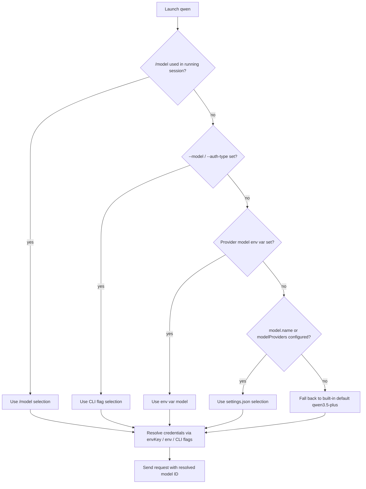

# Qwen Code (Qwen CLI) Model Support

Qwen Code is Alibaba/QwenLM's open-source agentic CLI. It is a multi-protocol agent: it can speak the OpenAI, Anthropic, Gemini, and Qwen/DashScope API shapes, and it can route to local OpenAI-compatible servers. This document focuses on how models are discovered, configured, and selected.

## Models Available

Qwen Code **does not ship with a usable default model out of the box**. The original Qwen OAuth free tier was discontinued on 2026-04-15, so on first launch the CLI prompts you to run `/auth` and connect a provider. Once a provider is configured, the model catalog becomes available.

### Built-in fallback default

When no explicit model is configured and the active auth type resolves to the OpenAI-compatible protocol, the built-in default model ID is:

| Model ID | Notes |
|----------|-------|
| `qwen3.5-plus` | Hard-coded default for the OpenAI-compatible protocol resolver. |

### Alibaba Cloud Coding Plan (auto-configured via `/auth`)

Choosing **Alibaba ModelStudio → Coding Plan** in the `/auth` flow auto-configures the following models and adds them to the `/model` picker:

| Model ID | Notes |
|----------|-------|
| `qwen3.5-plus` | Advanced model with thinking enabled. |
| `qwen3.6-plus` | Latest model with thinking enabled; Pro subscribers only. |
| `qwen3.7-plus` | Advanced model with thinking enabled. |
| `qwen3-coder-plus` | Optimized for coding tasks. |
| `qwen3-coder-next` | Experimental coding model. |
| `qwen3-max-2026-01-23` | Latest max model with thinking enabled. |
| `glm-5` | GLM model with thinking enabled. |
| `glm-4.7` | GLM model with thinking enabled. |
| `kimi-k2.5` | Kimi model with thinking and vision/video support. |
| `MiniMax-M2.5` | MiniMax model with thinking enabled. |

### Third-party providers

The `/auth` → **Third-party Providers** menu offers built-in setup for DeepSeek, MiniMax, Z.AI, Idealab, ModelScope, OpenRouter, and Requesty. These are registered as `openai`-protocol entries in `modelProviders`.

### Local / self-hosted models

Any local inference server with an OpenAI-compatible endpoint (Ollama, vLLM, LM Studio, SGLang, etc.) is registered under the `openai` auth type with a local `baseUrl`.

## Model Configuration Details

### Schema — informal

Qwen Code publishes **no formal schema artifact** (no JSON Schema, OpenAPI, or protobuf) for model configuration. The authoritative informal schema is the prose-and-examples [Model Providers](https://qwenlm.github.io/qwen-code-docs/en/users/configuration/model-providers/) page. The configuration surface consists of:

- `modelProviders` in `settings.json` — a per-auth-type catalog of model entries.
- Each entry requires `id` and accepts optional `name`, `description`, `envKey`, `baseUrl`, and `generationConfig`.
- `generationConfig` is treated as an **impermeable, atomic layer** when a provider model is selected: every field in the provider entry wins and missing fields are set to `undefined`, not inherited from top-level `model.generationConfig`.
- Runtime/ad-hoc models are created when `--model`, env vars, or `model.name` are used without a matching `modelProviders` entry.

### How a model is selected

Models can be chosen through five mechanisms:

| Mechanism | Site | Example |
|-----------|------|---------|
| Interactive command | `/model` | `/model qwen3-coder-plus` |
| Interactive command | `/auth` | `/auth` → select Coding Plan |
| CLI flag | `--model` / `-m` | `qwen --model qwen3-coder-plus` |
| CLI flag | `--auth-type` | `qwen --auth-type openai` |
| Environment variable | `OPENAI_MODEL` / `QWEN_MODEL` | `OPENAI_MODEL=qwen3-coder-plus qwen` |
| Environment variable | `ANTHROPIC_MODEL` | `ANTHROPIC_MODEL=claude-sonnet-4-20250514 qwen` |
| Environment variable | `GEMINI_MODEL` / `GOOGLE_MODEL` | `GEMINI_MODEL=gemini-2.5-pro qwen` |
| Config file | `model.name` | `"model": { "name": "qwen3-coder-plus" }` |
| Config file | `modelProviders` | `"modelProviders": { "openai": { "models": [...] } }` |
| Wire envelope | Request body `model` | `{ "model": "qwen3-coder-plus" }` |

**Precedence (highest wins):**

1. **Interactive commands** — `/model` at runtime, `/auth` at setup.
2. **CLI flags** — `--model`, `--auth-type`, plus provider-specific flags like `--openai-api-key` / `--openai-base-url`.
3. **Environment variables** — provider-specific mappings (`OPENAI_MODEL`, `ANTHROPIC_MODEL`, `GEMINI_MODEL`, `GOOGLE_MODEL`).
4. **Config files** — `model.name`, `modelProviders`, `security.auth.selectedType` in `settings.json`.
5. **Built-in default** — `qwen3.5-plus` for the OpenAI-compatible protocol.

When a model is selected from `modelProviders`, its `generationConfig` is applied as a sealed package; lower layers do not merge into it.

### Programmatic model enumeration — not available

Qwen Code **cannot** enumerate its model catalog programmatically:

- There is **no `qwen models` / `qwen list-models` subcommand**.
- There is **no `--list-models` flag** or model-catalog API.
- There is **no config dump** that emits the resolved catalog.

The `/model` picker is the sole native catalog view and is interactive. Non-interactive consumers must read the resolved model from the `--output-format json` / `stream-json` result events.

## Sources

- [Qwen Code overview](https://qwenlm.github.io/qwen-code-docs/en/users/overview/) *(installation, first-run /auth flow, multi-protocol support)*
- [Qwen Code — Model Providers](https://qwenlm.github.io/qwen-code-docs/en/users/configuration/model-providers/) *(modelProviders schema, auth types, generationConfig layering, precedence, RuntimeModelSnapshot)*
- [Qwen Code — Authentication](https://qwenlm.github.io/qwen-code-docs/en/users/configuration/auth/) *(Qwen OAuth discontinued, Coding Plan setup, API-key providers, env vars, CLI flags)*
- [Qwen Code — Settings](https://qwenlm.github.io/qwen-code-docs/en/users/configuration/settings/) *(settings.json layers, model.name, CLI arguments, env vars)*
- [Qwen Code — Commands](https://qwenlm.github.io/qwen-code-docs/en/users/features/commands/) *(slash commands including /model and /auth)*
- [Qwen Code — Headless Mode](https://qwenlm.github.io/qwen-code-docs/en/users/features/headless/) *(non-interactive execution, output formats, resolved model in result events)*
- [Qwen Code repository](https://github.com/QwenLM/qwen-code)
