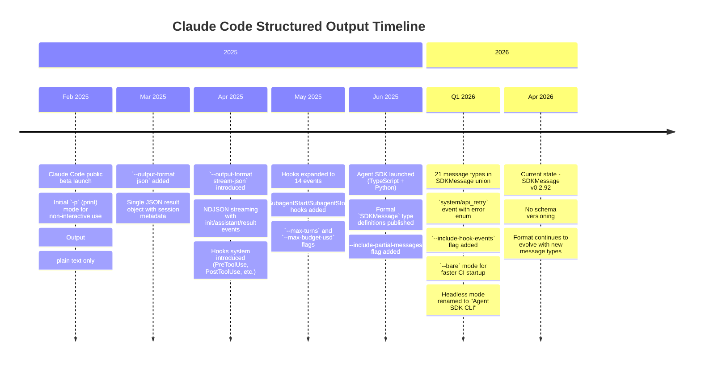

# Claude Code: Non-Interactive Structured Output

## Summary

Claude Code provides a rich structured streaming output via `--output-format stream-json` that emits newline-delimited JSON (NDJSON) to stdout. Each line is a self-contained JSON object discriminated by a `type` field. The format exposes session metadata, model responses (including tool calls), token usage, costs, rate-limit state, error classification, and hook lifecycle events — none of which are available in the default text mode.

**Schema status:** A formal TypeScript type definition exists in the official `@anthropic-ai/claude-agent-sdk` npm package (`SDKMessage` union of 21 message types). No standalone JSON Schema or OpenAPI spec has been published. The TypeScript SDK serves as the de facto specification.

**Key capabilities for Claudine:**

- **Error classification** — `system/api_retry` events expose an `error` enum (`billing_error`, `rate_limit`, `authentication_failed`, `server_error`, `invalid_request`, `max_output_tokens`, `unknown`) enabling smart retry/abort decisions
- **Cost and token visibility** — `result` events provide `total_cost_usd`, per-model token breakdowns, and cache efficiency metrics
- **Rate-limit awareness** — `rate_limit_event` provides throttle state and reset times for subscription users
- **Tool observability** — `tool_use` and `tool_result` events expose every tool call with inputs and outputs
- **Auth detection** — `init` events report `apiKeySource` distinguishing subscription from API key billing

**Limitations:**

- No formal schema versioning; the format evolves with Claude Code releases
- Subagent-internal events (permission prompts, questions) do not appear in the parent stream
- Rate-limit events are subscription-only; API key users get `billing_error` instead
- The `--verbose` flag is required for full `init` metadata (auth source, version, MCP servers)

---

## Schema

### Formal TypeScript Definition (Authoritative)

The official Claude Agent SDK TypeScript package defines the complete stream-json message taxonomy.

| Property | Value |
|----------|-------|
| **Package** | `@anthropic-ai/claude-agent-sdk` (npm) |
| **Version** | v0.2.92+ |
| **File** | `sdk.d.ts` (bundled in npm package) |
| **Docs** | <https://platform.claude.com/docs/en/agent-sdk/typescript> |
| **Language** | TypeScript type definitions |
| **Repo** | `anthropics/claude-agent-sdk-typescript` (source not public; npm package contains `.d.ts`) |

The root type is a discriminated union of 21 message types:

```typescript
type SDKMessage =
  | SDKAssistantMessage        // type: "assistant"
  | SDKUserMessage             // type: "user"
  | SDKUserMessageReplay       // type: "user_message_replay"
  | SDKResultMessage           // type: "result"
  | SDKSystemMessage           // type: "system"
  | SDKPartialAssistantMessage // type: "stream_event" (with --include-partial-messages)
  | SDKCompactBoundaryMessage  // type: "compact_boundary"
  | SDKStatusMessage           // type: "status"
  | SDKLocalCommandOutputMessage // type: "local_command_output"
  | SDKHookStartedMessage      // type: "hook_started" (with --include-hook-events)
  | SDKHookProgressMessage     // type: "hook_progress"
  | SDKHookResponseMessage     // type: "hook_response"
  | SDKToolProgressMessage     // type: "tool_progress"
  | SDKAuthStatusMessage       // type: "auth_status"
  | SDKTaskNotificationMessage // type: "task_notification"
  | SDKTaskStartedMessage      // type: "task_started"
  | SDKTaskProgressMessage     // type: "task_progress"
  | SDKFilesPersistedEvent     // type: "files_persisted"
  | SDKToolUseSummaryMessage   // type: "tool_use_summary"
  | SDKRateLimitEvent          // type: "rate_limit_event"
  | SDKPromptSuggestionMessage; // type: "prompt_suggestion"
```

### SDKResultMessage Subtypes

The `result` message uses a `subtype` discriminator for different completion states:

| Subtype | Meaning |
|---------|---------|
| `success` | Normal completion |
| `error_max_turns` | Hit `--max-turns` limit |
| `error_during_execution` | Unrecoverable error during session |
| `error_max_budget_usd` | Hit `--max-budget-usd` spending limit |
| `error_max_structured_output_retries` | Structured output validation failed repeatedly |

### SDKSystemMessage Subtypes

| Subtype | Meaning |
|---------|---------|
| `init` | Session initialization metadata |
| `api_retry` | Retryable API error with classification |
| `compact_boundary` | Context compaction occurred |
| `status` | Status update |
| `hook_started` | Hook execution began |
| `hook_progress` | Hook execution progress |
| `hook_response` | Hook execution completed |
| `task_notification` | Subagent notification |
| `task_started` | Subagent started |
| `task_progress` | Subagent progress |
| `files_persisted` | Files saved to disk |
| `local_command_output` | Local command output |

### Python SDK (Also Official)

| Property | Value |
|----------|-------|
| **Package** | `claude-agent-sdk` (PyPI) |
| **Repo** | `anthropics/claude-agent-sdk-python` (public) |
| **Key file** | `src/claude_agent_sdk/types.py` |

The Python SDK defines 6 top-level message types: `UserMessage`, `AssistantMessage`, `SystemMessage`, `ResultMessage`, `StreamEvent`, `RateLimitEvent`. It is slightly less granular than the TypeScript SDK — `SystemMessage` uses a `subtype: str` field with a `data: dict[str, Any]` catch-all.

### No Standalone JSON Schema

No JSON Schema, OpenAPI, AsyncAPI, or RAML specification has been published for the stream-json format. The TypeScript type definitions are the closest to a formal schema.

**Places searched:**

- Official docs site (`code.claude.com/docs/en`)
- Agent SDK docs (`platform.claude.com/docs/en/agent-sdk`)
- Claude Code GitHub repo (`anthropics/claude-code`)
- npm registry (no `@types/claude-code` or similar)
- Vercel AI SDK (`vercel/ai`) — no Claude Code stream-json types
- LangChain TypeScript (`langchain-ai/langchainjs`) — nothing
- Community schemas (e.g., `anth0nylawrence/blaze`) — reverse-engineered, outdated

---

## Documentation

### Official Documentation

| Resource | URL |
|----------|-----|
| **Headless / Agent SDK CLI** | <https://code.claude.com/docs/en/headless> |
| **CLI Reference** | <https://code.claude.com/docs/en/cli-reference> |
| **Agent SDK Overview** | <https://platform.claude.com/docs/en/agent-sdk/overview> |
| **Agent SDK TypeScript** | <https://platform.claude.com/docs/en/agent-sdk/typescript> |
| **Agent SDK Python** | <https://platform.claude.com/docs/en/agent-sdk/python> |
| **Agent SDK Streaming** | <https://platform.claude.com/docs/en/agent-sdk/streaming-output> |
| **Structured Outputs** | <https://platform.claude.com/docs/en/agent-sdk/structured-outputs> |
| **Hooks Reference** | <https://code.claude.com/docs/en/hooks> |
| **Settings Reference** | <https://code.claude.com/docs/en/settings> |
| **Costs & Billing** | <https://code.claude.com/docs/en/costs> |
| **Permissions** | <https://code.claude.com/docs/en/permissions> |

### Terminology Note

The official docs now refer to non-interactive mode as the "Agent SDK CLI" rather than "headless mode." The `-p` flag and all CLI options remain the same. The headless docs page includes a note:

> The CLI was previously called "headless mode." The `-p` flag and all CLI options work the same way.

### Community Resources

- Claude Code GitHub Issues — several issues document stream-json behavior, edge cases, and feature requests (e.g., `anthropics/claude-code#39700`, `#40609`, `#39050`, `#38805`)
- Anthropic Community Forum — `community.anthropic.com` has discussions about non-interactive usage patterns
- Community schema reference by `anth0nylawrence/blaze` (reverse-engineered, not authoritative)

---

## CLI

### Output Format Flag

```bash
claude -p "prompt" --output-format <format>
```

The `--output-format` flag requires `-p` (print/non-interactive mode).

### Available Output Formats

| Format | Description | Content |
|--------|-------------|---------|
| `text` | Plain text (default) | Assistant's text response only |
| `json` | Single JSON object | Result with `session_id`, `result` text, `usage`, `cost`, and metadata |
| `stream-json` | Newline-delimited JSON stream | Real-time events: `init`, `assistant`, `tool_use`, `tool_result`, `result`, `rate_limit_event`, etc. |

### Key Flags for Structured Output

| Flag | Requires | Description |
|------|----------|-------------|
| `--output-format <fmt>` | `-p` | Set output format: `text`, `json`, `stream-json` |
| `--include-partial-messages` | `-p` + `stream-json` | Include `stream_event` deltas (token-by-token text) |
| `--include-hook-events` | `stream-json` | Include `hook_started`, `hook_progress`, `hook_response` events |
| `--verbose` | — | Full turn-by-turn output; enriches `init` with auth, version, MCP data |
| `--input-format <fmt>` | `-p` | Input format: `text` (default), `stream-json` (bidirectional) |
| `--json-schema <schema>` | `-p` + `json` | Validate structured output against a JSON Schema |
| `--max-turns <n>` | `-p` | Limit agentic turns; exits with error at limit |
| `--max-budget-usd <n>` | `-p` | Maximum dollar spend before stopping |
| `--bare` | — | Skip auto-discovery of hooks, skills, plugins, MCP, CLAUDE.md |
| `--no-session-persistence` | `-p` | Don't save session to disk |
| `--replay-user-messages` | `stream-json` I/O | Re-emit user messages from stdin on stdout |

### Side Effects of Structured Output Mode

1. **Interactive prompts suppressed** — In `-p` mode, Claude Code does not prompt for user input. Permission prompts that would normally pause execution either auto-deny or auto-approve depending on `--permission-mode`.
2. **`--verbose` enriches `init`** — Without `--verbose`, the `init` event may omit `apiKeySource`, `claude_code_version`, `permissionMode`, and MCP server details.
3. **Hook events hidden by default** — Hook lifecycle events (`hook_started`, `hook_response`) are only included with `--include-hook-events`.
4. **Partial messages hidden by default** — Token-by-token streaming deltas (`stream_event`) require `--include-partial-messages`.
5. **`--bare` reduces noise** — Skips all auto-discovery, making output deterministic across environments. Recommended for CI/scripted use.

### Recommended Invocation for Maximum Observability

```bash
claude -p "prompt" \
  --verbose \
  --output-format stream-json \
  --include-hook-events \
  --dangerously-skip-permissions
```

For Claudine's wrapper, the recommended invocation is:

```bash
claude -p "prompt" --verbose --output-format stream-json
```

The `--verbose` flag is necessary for the full `init` block with `apiKeySource`, version, and plugin details. The `--include-hook-events` and `--include-partial-messages` flags are optional and should only be added when Claudine needs that level of detail.

---

## Gotchas

### 1. `--verbose` Required for Full Metadata

The `init` event's `apiKeySource`, `claude_code_version`, `permissionMode`, and detailed MCP server information are only present when `--verbose` is passed. Without it, critical diagnostic fields are missing.

### 2. Rate-Limit Events Are Subscription-Only

API key users never receive `rate_limit_event` messages. Instead, they get `billing_error` in the `system/api_retry` event or `assistant.error` field when credits are exhausted. Code that relies on `rate_limit_event` for throttle detection must also handle the API-key billing path.

### 3. Result `total_cost_usd` Is Zero on Error

When a session fails (e.g., billing error), `result.total_cost_usd` is `0` even though tokens may have been consumed for the `init` phase. The cost field is only reliable on successful sessions.

### 4. `assistant.message.model` May Be Synthetic

On error paths (e.g., billing failure), the `assistant.message.model` field may contain a synthetic placeholder value like `"<synthetic>"` rather than the actual model name. Always prefer `init.model` or `result.modelUsage` keys for model identification.

### 5. Subagent Events Are Opaque

When Claude Code spawns subagents (via the `Agent` tool), the parent stream shows `tool_use`/`tool_result` events for the Agent tool, but **subagent-internal events do not appear in the parent stream**. Specifically:

- Subagent permission prompts (`permission.asked`) are invisible
- Subagent questions (`question.asked`) are invisible
- Subagent tool calls are only visible if the subagent's own stream is captured

### 6. Hook Events Require Opt-In

By default, stream-json output does **not** include hook lifecycle events. The `--include-hook-events` flag must be passed explicitly. Without it, `hook_started` and `hook_response` events are silently omitted.

### 7. Large `init` Arrays Should Not Be Stored

The `init` event may contain large arrays for `tools`, `slash_commands`, `skills`, `agents`, and `mcp_servers`. These are useful for debugging but should not be stored in reporting databases — they can be hundreds of KB.

### 8. Exit Code Is Not Sufficient for Error Classification

A non-zero exit code indicates failure but does not distinguish billing errors from network failures from model overload. The `system/api_retry` event's `error` enum and the `result.subtype` provide much richer error classification.

### 9. `--bare` Mode Requires Explicit Auth

In `--bare` mode, OAuth and keychain reads are skipped. Authentication must come from `ANTHROPIC_API_KEY` or an `apiKeyHelper` in settings. This can cause unexpected `authentication_failed` errors when migrating from interactive to non-interactive usage.

### 10. Stream Events May Arrive Out of Logical Order

While events generally follow `init` → `assistant`/`tool_use`/`tool_result` → `result`, error events like `system/api_retry` can appear between any two events. Parsers should not assume strict ordering beyond `init` appearing first and `result` appearing last.

---

## Timeline



### Key Milestones

| Date | Event |
|------|-------|
| Feb 2025 | Claude Code public beta; `-p` flag for non-interactive text output |
| ~Apr 2025 | `--output-format stream-json` introduced alongside `json` format |
| ~Jun 2025 | Agent SDK packages published with formal TypeScript/Python type definitions |
| Q1 2026 | `system/api_retry` event, `--include-hook-events`, `--bare` mode added |
| Apr 2026 | 21 message types in `SDKMessage`; no formal schema versioning exists |

### Schema Versioning

There is **no formal schema versioning**. The `SDKMessage` type evolves with each Claude Code release. The npm package version (`0.2.92`) serves as an implicit version marker. New message types are added as union members; existing types have been extended with optional fields but not broken.

---

## Tools

Claude Code provides a set of built-in tools that are visible in the stream-json output. When a tool is invoked, two events appear in sequence:

1. **`tool_use`** (or `content_block_start` with `content_block.type == "tool_use"`) — before the tool runs
2. **`tool_result`** — after the tool completes

### Built-In Tools

| Tool | Description | Stream Visibility |
|------|-------------|-------------------|
| `Read` | Read file contents | input: `file_path`, `offset`, `limit`; result: file content |
| `Write` | Create/overwrite files | input: `file_path`, `content`; result: success/error |
| `Edit` | Exact string replacement in files | input: `file_path`, `old_string`, `new_string`; result: success/error |
| `Bash` | Execute shell commands | input: `command`, `timeout`; result: stdout/stderr |
| `Glob` | Find files by pattern | input: `pattern`, `path`; result: matching file paths |
| `Grep` | Search file contents | input: `pattern`, `path`, `type`; result: matches |
| `WebFetch` | Fetch URL content | input: `url`, `prompt`; result: processed content |
| `WebSearch` | Web search | input: `query`; result: search results |
| `Agent` | Spawn subagent | input: `prompt`, `subagent_type`; result: agent output |
| `TodoWrite` | Manage task list | input: `todos` array; result: confirmation |
| `LSP` | Language Server Protocol | input varies; result: LSP response |
| `NotebookEdit` | Edit Jupyter notebooks | input: cell operations; result: confirmation |

### Tool Event Examples

#### Example 1: File Read

```jsonl
{"type":"tool_use","id":"tu-1","name":"Read","input":{"file_path":"/src/main.rs"}}
{"type":"tool_result","tool_use_id":"tu-1","content":"1\tuse std::io;\n2\tfn main() {\n..."}
```

#### Example 2: Bash Command

```jsonl
{"type":"tool_use","id":"tu-2","name":"Bash","input":{"command":"cargo test -p mylib","timeout":120000}}
{"type":"tool_result","tool_use_id":"tu-2","content":"running 12 tests\ntest result: ok. 12 passed"}
```

#### Example 3: Subagent Spawn

```jsonl
{"type":"tool_use","id":"tu-3","name":"Agent","input":{"prompt":"Search for all uses of FooBar","subagent_type":"Explore"}}
{"type":"tool_result","tool_use_id":"tu-3","content":"Found FooBar in 3 files: src/lib.rs, src/config.rs, tests/integration.rs"}
```

### Tool Event Structure

The `tool_use` event contains:

| Field | Type | Description |
|-------|------|-------------|
| `type` | `"tool_use"` or `"content_block_start"` | Event discriminator |
| `id` | string | Unique tool use identifier (correlates with `tool_result.tool_use_id`) |
| `name` | string | Tool name (e.g., `"Read"`, `"Bash"`, `"Edit"`) |
| `input` | object | Tool-specific input parameters |

The `tool_result` event contains:

| Field | Type | Description |
|-------|------|-------------|
| `type` | `"tool_result"` | Event discriminator |
| `tool_use_id` | string | Correlates to the `tool_use.id` |
| `content` | string or array | Tool output (may be text or structured content blocks) |
| `is_error` | boolean (optional) | Whether the tool call failed |

### MCP Tool Events

MCP (Model Context Protocol) tools appear in the stream with the naming convention `mcp__<server>__<tool>`:

```jsonl
{"type":"tool_use","id":"tu-4","name":"mcp__memory__create_entities","input":{"entities":[...]}}
{"type":"tool_result","tool_use_id":"tu-4","content":"Created 3 entities"}
```

### Hook-to-Stream Relationship

Tool events in the stream correspond to Claude Code's hook system:

| Stream Event | Hook Event | Timing |
|-------------|------------|--------|
| `tool_use` | `PreToolUse` | Before tool execution |
| `tool_result` | `PostToolUse` / `PostToolUseFailure` | After tool execution |
| (no stream event) | `PermissionRequest` | Permission prompt (invisible in stream) |

The hook system provides richer metadata (e.g., `session_id`, `cwd`, `permission_mode`) that is not present in the stream's tool events.

---

## Use Cases

### Plan Cap Approaching

**Detection:** Via `rate_limit_event` messages in the stream.

```jsonl
{"type":"rate_limit_event","rate_limit_info":{"status":"allowed_warning","resetsAt":1712000000,"rateLimitType":"five_hour","overageStatus":"allowed"}}
```

| Field | Type | Description |
|-------|------|-------------|
| `rate_limit_info.status` | string | Current official SDK docs model this as `"allowed"`, `"allowed_warning"`, or `"rejected"` |
| `rate_limit_info.resetsAt` | number | Unix timestamp (seconds) when the cap window resets |
| `rate_limit_info.rateLimitType` | string | Which usage window applies (official docs list `five_hour`, `seven_day`, `seven_day_opus`, `seven_day_sonnet`, `overage`) |
| `rate_limit_info.overageStatus` | string | Pay-as-you-go overage status when present; current SDK docs use the same status enum as the primary limit |

**Distinguishing from other events:** Only `rate_limit_event` carries rate-limit data. In current Claude Code docs, `status == "allowed_warning"` means the limit is being approached.

**Remaining capacity:** The stream itself still does not document a token count. The current SDK docs do model a `utilization` fraction on the rate-limit object, and the Claude Code status-line JSON exposes `rate_limits.five_hour.used_percentage` / `rate_limits.seven_day.used_percentage` plus corresponding reset timestamps.

**Reset timeframe:** `resetsAt` is a Unix timestamp in seconds. Convert to determine when the cap resets.

**Current user-facing wording:** Anthropic's current Help Center describes the warning text as `Approaching 5-hour limit.`

**Hook equivalent:** No direct hook. Rate-limit information is only available in the stream, not via hooks.

**Subscription-only:** This event is never emitted for API key users.

**Version drift note:** Earlier Claude Code builds and earlier local research in this repo used `approaching_limit` / `limited` naming. Current official Claude Code SDK docs use `allowed_warning` / `rejected`. Consumers should be prepared to handle both while the wire format remains version-sensitive.

---

### Plan Capped

**Detection:** In current Claude Code docs, when `rate_limit_info.status == "rejected"`. In older observed payloads, some builds used `status == "limited"` and/or `overageStatus == "blocked"`.

```jsonl
{"type":"rate_limit_event","rate_limit_info":{"status":"rejected","resetsAt":1712000000,"rateLimitType":"five_hour","overageStatus":"allowed"}}
```

**Distinguishing from approaching:** Current docs describe `status: "rejected"` as the hard-stop state and `status: "allowed_warning"` as the warning state.

**Reset timeframe:** Same `resetsAt` field as approaching cap.

**Current user-facing wording:** Anthropic's current Help Center describes the blocking message as `5-hour limit reached - resets [time].`

**Extra-usage variant:** If extra usage is enabled, Anthropic documents a different post-limit message: `5-hour limit resets [time] - continuing with extra usage.`

**Behavior when capped:** Claude Code may automatically fall back to a smaller model (e.g., Opus → Sonnet) rather than failing outright. The `init.model` and `assistant.message.model` fields may show different models when this fallback occurs.

**Hook equivalent:** No direct hook for rate limiting.

---

### No Funds

**Detection:** Via `system/api_retry` events and/or `assistant` messages with error content.

The `system/api_retry` event fires when the API returns a retryable (or classified) error:

```jsonl
{"type":"system","subtype":"api_retry","attempt":1,"max_retries":3,"retry_delay_ms":5000,"error_status":402,"error":"billing_error","uuid":"evt-abc","session_id":"sess-123"}
```

If retries are exhausted, the session ends with an error result:

```jsonl
{"type":"result","subtype":"error_during_execution","is_error":true,"total_cost_usd":0,"usage":{"input_tokens":0,"output_tokens":0}}
```

The `assistant` message may also contain error content:

```jsonl
{"type":"assistant","error":"billing_error","message":{"content":[{"type":"text","text":"Credit balance is too low to complete this request."}],"model":"<synthetic>"}}
```

| Detection Point | Field | Value |
|----------------|-------|-------|
| `system/api_retry` | `error` | `"billing_error"` |
| `system/api_retry` | `error_status` | `402` (Payment Required) |
| `assistant` | `error` | `"billing_error"` |
| `result` | `is_error` | `true` |

**Distinguishing from other errors:** The `error` enum in `system/api_retry` provides classification:

| `error` Value | Meaning | Retry? |
|--------------|---------|--------|
| `billing_error` | Insufficient credits/funds | No — fail immediately |
| `rate_limit` | API rate limit hit | Yes — after `retry_delay_ms` |
| `authentication_failed` | Invalid or expired credentials | No — fail immediately |
| `server_error` | Anthropic server error | Yes — with backoff |
| `invalid_request` | Malformed request | No — fail immediately |
| `max_output_tokens` | Output token limit reached | Depends on context |
| `unknown` | Unclassified error | Yes — with backoff |

**Hook equivalent:** No direct hook for billing/API errors.

---

### Auth

**Detection:** Via the `init` event's `apiKeySource` field.

```jsonl
{"type":"system","subtype":"init","session_id":"sess-abc","model":"claude-opus-4-6[1m]","apiKeySource":"none","claude_code_version":"2.1.76","permissionMode":"default"}
```

| `apiKeySource` Value | Meaning |
|---------------------|---------|
| `"none"` | Subscription (Claude Pro/Max/Team/Enterprise) — authenticated via OAuth |
| `"ANTHROPIC_API_KEY"` | API key from environment variable |
| Other string | API key from a named source (e.g., `apiKeyHelper` command) |

**Subscription tier detection:** The stream does not expose whether the user is on Pro, Max, Team, or Enterprise. The `init.model` can provide a hint — Max/Team Premium users default to Opus, while Pro/Team Standard defaults to Sonnet.

**Alternative billing backends:** When `CLAUDE_CODE_USE_BEDROCK`, `CLAUDE_CODE_USE_VERTEX`, or `CLAUDE_CODE_USE_FOUNDRY` are set, the billing goes through those providers. The `apiKeySource` may reflect these configurations.

**Requires `--verbose`:** The `apiKeySource` field is only present when `--verbose` is passed.

**Hook equivalent:** The `SessionStart` hook input includes `model` but does not include `apiKeySource`.

---

### Permissions: Can't Read File

**Detection:** Via `tool_result` events with error content, and optionally via `result.permission_denials`.

When Claude Code attempts to read a file and is denied:

```jsonl
{"type":"tool_use","id":"tu-5","name":"Read","input":{"file_path":"/etc/shadow"}}
{"type":"tool_result","tool_use_id":"tu-5","content":"Permission denied: /etc/shadow is outside the allowed directories","is_error":true}
```

The `result` event at session end may also include a `permission_denials` array:

```jsonl
{"type":"result","subtype":"success","permission_denials":["Read: /etc/shadow - outside allowed directories"]}
```

**File path extraction:** The file path is in the `tool_use.input.file_path` field of the preceding `tool_use` event. Correlate via `tool_use.id` == `tool_result.tool_use_id`.

**Denial reason:** The `tool_result.content` text contains the reason. Common reasons include:
- "outside the allowed directories"
- "file does not exist" (not a permission denial per se)
- Hook-based denial via `PreToolUse` exit code 2

**Distinguishing from write denial:** Check `tool_use.name` — `"Read"` for read denials.

**Hook equivalent:** `PreToolUse` (before) and `PostToolUseFailure` (after) hooks fire for denied tool calls. The hook receives the full tool context including `tool_name` and `tool_input`. The stream shows the same `tool_use`/`tool_result` pair but does not explicitly flag it as a "permission denial" — that classification comes from the `is_error` field and the error message content.

---

### Permissions: Can't Write File

**Detection:** Same mechanism as read denial, but `tool_use.name` is `"Write"` or `"Edit"`.

```jsonl
{"type":"tool_use","id":"tu-6","name":"Edit","input":{"file_path":"/usr/bin/something","old_string":"foo","new_string":"bar"}}
{"type":"tool_result","tool_use_id":"tu-6","content":"Permission denied: cannot modify /usr/bin/something","is_error":true}
```

**Distinguishing from read denial:** The `tool_use.name` field:
- `"Read"` → read denial
- `"Write"` → write denial (file creation/overwrite)
- `"Edit"` → write denial (in-place modification)

**Denial reasons:** Same as read denial, plus:
- "file is read-only"
- "permission denied by hook" (when a `PreToolUse` hook exits with code 2)
- "user denied permission" (in interactive mode; should not occur in `-p` mode with `--dangerously-skip-permissions`)

**Hook equivalent:** Same as read — `PreToolUse` and `PostToolUseFailure` hooks. The hook input distinguishes tool type via `tool_name`.

---

### Tokens Consumed

**Detection:** Multiple events provide token information at different granularities.

#### Session-Level (from `result`)

```jsonl
{"type":"result","subtype":"success","usage":{"input_tokens":36398,"output_tokens":14,"cache_read_input_tokens":36395,"cache_creation_input_tokens":0},"total_cost_usd":0.23,"duration_ms":8300,"duration_api_ms":4000,"num_turns":1}
```

| Field | Description |
|-------|-------------|
| `usage.input_tokens` | Total input tokens across all turns |
| `usage.output_tokens` | Total output tokens across all turns |
| `usage.cache_read_input_tokens` | Tokens served from cache |
| `usage.cache_creation_input_tokens` | Tokens added to cache |
| `total_cost_usd` | Total session cost in USD |

#### Per-Turn (from `assistant`)

Each `assistant` message includes per-turn usage:

```jsonl
{"type":"assistant","message":{"usage":{"input_tokens":12000,"output_tokens":500},"model":"claude-opus-4-6[1m]"}}
```

#### Per-Model (from `result.modelUsage`)

For multi-model sessions (e.g., `opusplan` mode or subagent model overrides):

```jsonl
{"type":"result","modelUsage":{"claude-opus-4-6[1m]":{"inputTokens":30000,"outputTokens":10,"contextWindow":1000000,"maxOutputTokens":32000},"claude-sonnet-4-6":{"inputTokens":6000,"outputTokens":4,"contextWindow":200000,"maxOutputTokens":16000}}}
```

**Cost basis:** `total_cost_usd` provides the aggregate cost. Per-model or per-turn cost breakdowns are not available in the stream.

**Hook equivalent:** No hook provides token/cost data. This information is only available via the stream's `result` event.

---

### Model Used

**Detection:** The model appears in three locations:

| Source | Field | When |
|--------|-------|------|
| `init` | `model` | At session start — the requested/resolved model |
| `assistant` | `message.model` | Per turn — the actual model used for that response |
| `result` | `modelUsage` keys | At session end — all models used, with per-model token breakdown |

```jsonl
{"type":"system","subtype":"init","model":"claude-opus-4-6[1m]"}
{"type":"assistant","message":{"model":"claude-opus-4-6[1m]","content":[...]}}
{"type":"result","modelUsage":{"claude-opus-4-6[1m]":{"inputTokens":30000,"outputTokens":500}}}
```

**Nomenclature:** Full model names with version suffix (e.g., `claude-opus-4-6`, `claude-sonnet-4-6`). Context window variants use bracket notation: `claude-opus-4-6[1m]`. Aliases (`sonnet`, `opus`, `haiku`) are resolved before appearing in the stream.

**Provider:** The underlying provider (Anthropic, Bedrock, Vertex, Foundry) is **not** explicitly stated in the stream. It can be inferred from `apiKeySource` and environment variables.

**Always fires:** The `init.model` field is always present. The `assistant.message.model` may be `"<synthetic>"` on error paths. The `result.modelUsage` is always present on success.

**Hook equivalent:** The `SessionStart` hook input includes `model`.

---

### Human in the Loop

**Detection in non-interactive mode:** In `-p` mode, Claude Code does **not** prompt the user for input. Permission prompts are handled based on `--permission-mode`:

| Mode | Behavior |
|------|----------|
| `default` | Unapproved tools are denied (session may abort) |
| `acceptEdits` | File edits auto-approved; other tools denied unless in `--allowedTools` |
| `dontAsk` | Only pre-approved tools run; others denied |
| `bypassPermissions` | Everything auto-approved |

**Stream visibility:** Permission denials appear as `tool_result` events with `is_error: true`. There is no explicit "permission prompt" event in the stream in non-interactive mode.

**In interactive mode with stream output:** If somehow streaming interactively, the `Notification` hook fires with `notification_type: "permission_prompt"`, but this does not appear in the NDJSON stream.

**Subagent prompts:** Subagent permission prompts and questions are **not visible** in the parent stream. They only fire on the internal event bus (`permission.asked`, `question.asked`) and are not propagated to the NDJSON output.

**`--permission-prompt-tool`:** Claude Code supports `--permission-prompt-tool <mcp_tool>` to delegate permission decisions to an MCP tool in non-interactive mode. This allows programmatic permission handling without human interaction.

**Hook equivalent:** The `Notification` hook (with matcher `permission_prompt`) fires for permission prompts in interactive mode, but this is irrelevant in non-interactive `-p` mode.

---

### Injecting into Subagent Prompt

**Can we inject context into subagent prompts?** Yes, through several mechanisms:

#### 1. CLAUDE.md Files

CLAUDE.md files are loaded into every session, including subagent sessions. Adding instructions to `CLAUDE.md` or `.claude/CLAUDE.md` will propagate to all subagents running in that project directory.

```markdown
<!-- .claude/CLAUDE.md -->
IMPORTANT: You are running in a non-interactive session. Never ask the user questions.
```

#### 2. `--append-system-prompt`

The `--append-system-prompt` flag adds text to the system prompt of the main session. However, subagents receive their own system prompts and may not inherit the appended text directly — this depends on how the `Agent` tool passes context.

#### 3. Hook-Based Injection

Two hook mechanisms can inject context into subagents:

- **`SubagentStart` hook** — fires when a subagent begins. Can inject `additionalContext` via stdout JSON. However, this hook cannot modify the subagent's prompt directly.

- **`PreToolUse` hook matching `Agent`** — fires before the `Agent` tool runs. Can block or modify the tool call, but cannot easily rewrite the subagent's prompt.

#### 4. `--agents` Flag

The `--agents` flag defines custom subagent types with inline prompts:

```bash
claude -p "do the task" --agents '{"worker":{"description":"Non-interactive worker","prompt":"You are running non-interactively. Never ask questions. Complete the task silently."}}'
```

This gives direct control over subagent prompts but requires knowing which agent types will be spawned.

**Hook equivalent:** `SubagentStart` fires when a subagent begins. The stream shows the `Agent` tool's `tool_use` event with the subagent's `prompt` in the input.

**Limitation:** There is no mechanism to transparently inject text into all subagent prompts without one of the above approaches. The most reliable method is CLAUDE.md files, which are loaded by all sessions in the project.

---

## Hook-to-Stream Cross-Reference

For each use case, this table summarizes whether the event is available in the stream, via hooks, or both:

| Use Case | Stream Event | Hook Event | Identical Data? |
|----------|-------------|------------|-----------------|
| Plan Cap Approaching | `rate_limit_event` | None | N/A |
| Plan Capped | `rate_limit_event` | None | N/A |
| No Funds | `system/api_retry` + `result` | None | N/A |
| Auth | `system/init` | `SessionStart` (partial) | No — hook lacks `apiKeySource` |
| Can't Read File | `tool_result` (is_error) | `PreToolUse` / `PostToolUseFailure` | No — hook has richer context (`session_id`, `cwd`, `permission_mode`) |
| Can't Write File | `tool_result` (is_error) | `PreToolUse` / `PostToolUseFailure` | No — same as read |
| Tokens Consumed | `result.usage` | None | N/A |
| Model Used | `init.model` | `SessionStart` | Yes — both have `model` |
| Human in the Loop | `tool_result` (denied) | `Notification` (interactive only) | No — different contexts |
| Subagent Injection | `tool_use` (Agent input) | `SubagentStart` | No — stream has prompt; hook has agent metadata |
