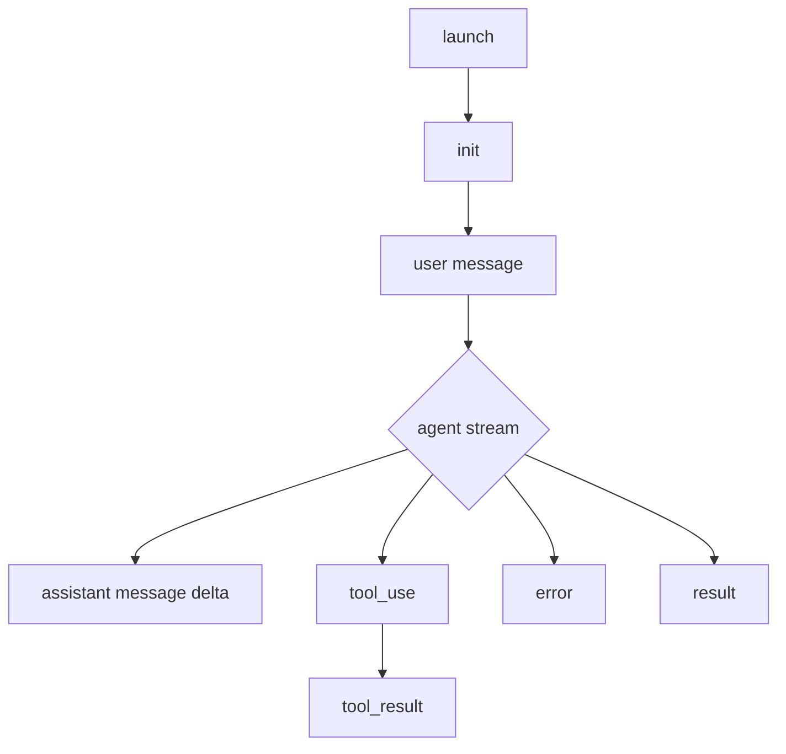

# Gemini CLI Non-Interactive Sessions

## Summary

Gemini CLI can run as a non-interactive agent and can emit structured output. Claudine should prefer `gemini --output-format stream-json --prompt "<prompt>"`, because it emits one JSON object per line on stdout while the run is still active. The stream is suitable for live progress rendering: it includes session initialization, assistant deltas, tool call starts, tool results, warnings/errors, and final usage.

The main caveat is that `stream-json` is not the full internal event bus. The TypeScript projection in `nonInteractiveCliAgentSession.ts` explicitly ignores internal `usage`, `session_update`, `tool_update`, `elicitation_request`, `elicitation_response`, `agent_start`, and `custom` events. Claudine can reliably supervise the public stream, but it cannot claim live tool progress, nested subagent lifecycle, dedicated file-change events, or per-step usage from this mode alone.

## Non-Interactive Entry Points

Gemini's official headless reference says headless mode is triggered when the CLI runs in a non-TTY environment or when a query is supplied with `-p` / `--prompt` ([Headless mode reference](https://geminicli.com/docs/cli/headless/)). The CLI reference also documents a positional `[query..]`, but the CLI defaults to interactive mode in a TTY, so wrappers should use `--prompt` rather than relying on positional detection.

Useful launch forms:

| Purpose | Command shape | Notes |
| --- | --- | --- |
| Fresh structured run | `gemini --output-format stream-json -p "prompt"` | Preferred Claudine launch form. |
| Stdin plus prompt | `cat file | gemini --output-format stream-json -p "summarize"` | Stdin is input/context, not a protocol. |
| Resume latest | `gemini --resume latest --output-format stream-json -p "continue"` | Resumes a saved project-scoped session. |
| Resume selected session | `gemini --resume <id-or-index> --output-format stream-json -p "continue"` | Session listing is human-oriented output. |
| ACP mode | `gemini --experimental-acp` | Experimental bidirectional protocol surface; not the stream Claudine should parse for normal runs. |

Prompts can include `@` file references. The non-interactive source path runs the same at-command processor before sending the query to the agent, so file references can trigger file-reading tools. The `--include-directories` flag adds workspace roots. Model selection is available with `--model`; aliases such as `auto`, `pro`, and `flash` can resolve through model configuration rather than naming the final backend model directly.

## Output Formats

Gemini CLI exposes three headless output modes through `--output-format` / `-o`, documented in the headless reference and CLI cheatsheet ([Headless mode](https://geminicli.com/docs/cli/headless/), [CLI cheatsheet](https://geminicli.com/docs/cli/cli-reference/)).

| Format | CLI value | Framing | Streams? | Claudine recommendation |
| --- | --- | --- | --- | --- |
| Text | `text` | Human text | Yes | Avoid for wrappers; stdout is prose. |
| Single JSON | `json` | One final JSON object | No | Useful for request/reply scripts, weak for lifecycle supervision. |
| Streaming JSON | `stream-json` | JSONL / NDJSON-style line events | Yes | Preferred. Parse stdout live. |

Single JSON includes fields such as `session_id`, `response`, `stats`, `error`, and `warnings` according to the TypeScript `JsonOutput` interface. It is attractive for simple scripts, but Claudine needs live progress and failure classification before process exit. `stream-json` provides that.

`stream-json` writes each event with `process.stdout.write(JSON.stringify(event) + "\n")` in `StreamJsonFormatter` ([source](https://github.com/google-gemini/gemini-cli/blob/main/packages/core/src/output/stream-json-formatter.ts)). In this mode stdout is parse-only JSONL. Stderr remains diagnostic: warnings, debug stacks when enabled, cancellation notices, and fatal error presentation can appear there. Claudine should not merge stderr into the event stream.

## Schema Sources

There is no public JSON Schema for the `stream-json` protocol. The strongest schema evidence is the TypeScript union in `packages/core/src/output/types.ts` ([source](https://github.com/google-gemini/gemini-cli/blob/main/packages/core/src/output/types.ts)). It defines:

| Event | Important fields |
| --- | --- |
| `init` | `timestamp`, `session_id`, `model` |
| `message` | `timestamp`, `role`, `content`, optional `delta` |
| `tool_use` | `timestamp`, `tool_name`, `tool_id`, `parameters` |
| `tool_result` | `timestamp`, `tool_id`, `status`, optional `output`, optional `error.type`, `error.message` |
| `error` | `timestamp`, `severity`, `message` |
| `result` | `timestamp`, `status`, optional `error`, optional `stats` |

The formatter source defines line framing and the final stats projection. `StreamStats` includes aggregate `total_tokens`, `input_tokens`, `output_tokens`, `cached`, `input`, `duration_ms`, `tool_calls`, and a per-model `models` map.

The settings file has a formal JSON Schema at `schemas/settings.schema.json`, but that schema is for configuration, not events. It is still useful for wrapper configuration drift checks.

## IO Contract

With `--output-format stream-json`, stdout is the structured event stream. Each line is independently parseable JSON with a top-level `type`. Assistant text is emitted as `message` events, not as raw prose.

Stderr is diagnostics. The non-interactive source wires user feedback to stderr and only writes JSONL through the formatter. Debug mode can add stack traces to stderr. Fatal errors may be reported through the usual error handler after the stream loop exits, so Claudine should retain stderr for failure reports and classify runs that end without a `result`.

Stdin is prompt/context input. It is not bidirectional in normal headless mode. The source installs Ctrl+C keypress handling only when `process.stdin.isTTY`; non-TTY stdin is not used for interactive protocol replies.

## Stream Contract

The discriminator is `type`. `init` is emitted before the user message and before assistant/tool events. The source then projects internal agent events as follows:



Tool calls correlate by `tool_id`: `tool_use.tool_id` equals `tool_result.tool_id`. Assistant output is a sequence of `message` events where `role` is `assistant` and `delta` is usually `true`; concatenate those chunks in stream order to reconstruct the final text.

Timestamps are ISO-8601 strings generated with `new Date().toISOString()`, so they are UTC instants. There is no schema version marker in the event stream. Unknown event types should be skipped and logged because the format has no formal compatibility contract.

The terminal event is `result` when the run ends cleanly. Fatal internal errors can throw out of the projection path and be handled by the process-level error handler, so absence of `result` plus non-zero exit is a meaningful failure state.

## Session Metadata

`init` exposes `session_id` and `model` early. The model is `config.getModel()`, so it may be a configured alias or resolved value depending on Gemini CLI model configuration. Final `result.stats.models` is a better signal for which model IDs actually consumed tokens, especially when model routing/fallback is enabled.

The stream does not expose cwd, project root, git branch, provider version, auth kind, approval mode, sandbox mode, roots, or MCP server inventory. Claudine should supply or record these from wrapper context and preflight:

| Metadata | Stream availability | Wrapper strategy |
| --- | --- | --- |
| Session ID | `init.session_id` | Store for resume/log correlation. |
| Model | `init.model`; final `stats.models` | Record requested `--model` separately. |
| Version | Not emitted | Run `gemini --version` outside the stream. |
| Cwd/project | Not emitted | Use wrapper launch cwd. |
| Auth kind | Not emitted | Infer from environment/settings and auth errors. |
| MCP servers | Not emitted | Record settings/Claudine MCP injection; infer MCP calls from `mcp_*` tool names. |
| Approval/sandbox | Not emitted | Record flags/settings supplied by wrapper. |

Hooks are a separate metadata source. The hooks reference says hook stdin includes `session_id`, `transcript_path`, `cwd`, `hook_event_name`, and `timestamp` ([Hooks reference](https://geminicli.com/docs/hooks/reference/)). That is useful for custom instrumentation, but it is not part of stdout `stream-json`.

## Event Families

The public stream has six event names. It does not have dedicated `file_change`, `plan`, `reasoning`, `subagent_start`, `subagent_stop`, `tool_progress`, or `usage_delta` events.

| Family | Event(s) | Notes |
| --- | --- | --- |
| Session | `init`, `result` | `result` is terminal when emitted. |
| Assistant text | `message` | User prompt and assistant deltas share the event name and differ by `role`. |
| Tool calls | `tool_use` | Input parameters are visible. |
| Tool results | `tool_result` | Status and display output are visible; raw stdout/stderr/exit code are not separately structured. |
| Errors/warnings | `error`, `result.error` | Non-fatal errors are streamed; fatal errors may bypass `result`. |
| Usage | `result.stats` | Final aggregate and per-model token counts only. |

Source inspection is important here because the projection explicitly ignores internal events that would otherwise be valuable to Claudine: `usage`, `tool_update`, `session_update`, `elicitation_request`, `elicitation_response`, `agent_start`, and `custom`.

## Tools

Gemini CLI's tools reference lists execution, file-system, interaction, task-tracking, MCP, memory, planning, and system tools ([Tools reference](https://geminicli.com/docs/reference/tools/)). In `stream-json`, they all collapse to the same public envelope: `tool_use` before execution and `tool_result` after execution.

For wrapper purposes:

| Tool signal | Visible? | Details |
| --- | --- | --- |
| Call start | Yes | `tool_use.tool_name`, `tool_id`, `parameters`. |
| Progress | No | Internal `tool_update` is ignored. |
| Result | Yes | `tool_result.status`, `output`, optional `error`. |
| Command stdout/stderr | Partly | Usually folded into display `output`, not separate fields. |
| Command exit code | Not guaranteed | No dedicated `exit_code` field in stream schema. |
| File changes | Indirect | Infer from write/edit tool names and parameters/results. |
| MCP identity | Partly | MCP tools use `mcp_<server>_<tool>` names. |

Approval behavior is configurable. The CLI docs list `--approval-mode` values `default`, `auto_edit`, `yolo`, and `plan`, with `--yolo` deprecated in favor of `--approval-mode=yolo` ([CLI cheatsheet](https://geminicli.com/docs/cli/cli-reference/)). Tools such as `run_shell_command`, `replace`, and `write_file` require confirmation unless policy/settings/approval mode allow them. Claudine should use `plan` for read-only automation or use `yolo` only when an external sandbox and policy envelope make that acceptable.

## Completion and Exit Status

A successful stream ends with:

```json
{"type":"result","timestamp":"...","status":"success","stats":{"total_tokens":0,"input_tokens":0,"output_tokens":0,"cached":0,"input":0,"duration_ms":0,"tool_calls":0,"models":{}}}
```

The exact values vary, but the field shape comes from the TypeScript `ResultEvent` and `StreamStats` interfaces. The official headless docs list exit code `0` for success, `1` for general/API failure, `42` for input error, and `53` for turn limit exceeded ([Headless mode reference](https://geminicli.com/docs/cli/headless/)).

Claudine should prefer the terminal `result` event when it exists. If stdout ends without `result`, fall back to process exit code and stderr. This matters because fatal internal errors are reconstructed and thrown in the non-interactive source path before the normal final result emission.

Single JSON mode puts the final assistant answer in `response`. Streaming mode does not provide a separate final text field, so Claudine must concatenate assistant `message.content` deltas in order.

## Blocking Behavior

Headless authentication must be configured before launch. The authentication docs say headless mode uses existing cached credentials if present; otherwise users must configure environment-variable authentication, such as `GEMINI_API_KEY` or Vertex AI variables ([Authentication setup](https://geminicli.com/docs/get-started/authentication/)). Starting an interactive Google sign-in flow is not safe for automation.

Tool approval can block automation if left at default. Deterministic choices are:

| Goal | Flag/config |
| --- | --- |
| Read-only inspection | `--approval-mode=plan` |
| Controlled edit/run in sandbox | `--approval-mode=yolo` plus `--sandbox` or external sandbox |
| Allow specific tools | Policy/settings such as `tools.allowed` or policy engine configuration |
| Avoid workspace trust prompt | `--skip-trust` or `GEMINI_CLI_TRUST_WORKSPACE=true` in controlled workspaces |

The exact no-TTY behavior for `ask_user`, MCP OAuth, and every approval prompt was not verified with a live authenticated run. Since `elicitation_request` is ignored by the stream projection, Claudine should run with an inactivity timeout and treat visible `ask_user` tool calls as human-in-loop signals.

## Subagents

Gemini CLI supports subagents. The docs describe them as specialists with their own prompt, tools, and independent context loop; they are exposed to the main agent as tools, and a prompt can force one with leading `@subagent_name` syntax ([Subagents](https://geminicli.com/docs/core/subagents/)).

For Claudine, the critical stream fact is that subagents are visible only as parent-level tool calls/results. The source ignores `agent_start`, and there are no public `subagent_start`, `subagent_stop`, nested tool, nested model, or nested usage events in `stream-json`. Claudine can show "called subagent tool X" if the tool name reveals it, but cannot render nested subagent progress from stdout alone.

## Use Case Detection

| Use case | Detectable from stream-json? | How |
| --- | --- | --- |
| `tokens_consumed` | Yes | Final `result.stats.*` and `result.stats.models.*`. |
| `model_used` | Yes | `init.model`; final `result.stats.models` for token-consuming models. |
| `model_fallback` | Inferred | Compare requested model to `result.stats.models` keys. |
| `session_resumable` | Yes | `init.session_id`. |
| `auth` | Yes, mostly failure-side | `result.error`, stderr, exit code; no auth kind field. |
| `plan_capped` / quota exhausted | Partly | `error.severity=error`, `RESOURCE_EXHAUSTED`-derived messages, final failure/exit. Reset windows are not structured. |
| `no_funds` | Partly | Provider error text; no billing-specific event. |
| `permission_read_denied` | Partly | Denied read tool `tool_result.error` or streamed `error.message`; no normalized path/policy fields. |
| `permission_write_denied` | Partly | Denied write/edit tool `tool_result.error`; no dedicated write-denied event. |
| `human_in_loop` | Partly | `ask_user` tool call or stalled run; internal elicitation events are ignored. |
| `subagent_prompt_injection` | Yes | Prompt can use `@subagent`; parent stream may show subagent tool call. |
| `plan_cap_approaching` | No | No near-cap quota event found. |

Hooks can provide stronger permission and tool detail because `BeforeTool` and `AfterTool` receive tool names, inputs, responses, and can deny with structured hook output. But hooks are not a secondary stdout stream; they are separately configured scripts with their own stdin/stdout/stderr contract.

## Headless Constraints

The highest-risk constraints for automation are:

| Constraint | Impact | Mitigation |
| --- | --- | --- |
| Default approvals can prompt | The process may block or fail waiting for a human. | Use `--approval-mode=plan`, explicit policies, or sandboxed `yolo`. |
| Auth can prompt | Browser login is not automation-safe. | Preconfigure API key or Vertex AI credentials. |
| Project trust gates settings | Repo `.gemini/settings.json` may be ignored. | Trust only controlled workspaces with `--skip-trust` or env. |
| Stream omits internal events | No live usage/tool progress/subagent lifecycle. | Parse public stream and optionally add hooks/telemetry. |
| Fatal errors may skip `result` | Terminal state can be ambiguous if parser waits only for `result`. | Combine terminal event, exit code, and stderr. |
| No formal stream schema | Parser may drift across releases. | Generate parser from TypeScript union and tolerate unknown events. |

## Timeline

The currently published headless reference lists `stream-json` as an official output mode and was last updated on March 10, 2026. The local CLI observed during this research was `0.46.0`; the public changelog page still referenced a recent stable release separately, so Gemini CLI should be treated as moving quickly. The document was refreshed on July 3, 2026 against official docs, source on `main`, the settings schema, and local CLI help/version output.

## Quirks and Gaps

The most surprising quirk is that persistent `output.format` in settings is documented as only `text` or `json`, while the CLI flag supports `text`, `json`, and `stream-json`. Claudine should not rely on config to select the streaming format; pass `--output-format stream-json` every time.

The stream also does not expose exact cwd, version, auth kind, approval mode, sandbox, or MCP server inventory. Those are wrapper/preflight facts, not stream facts.

Gaps that remain:

- No authenticated live run was executed, so real auth/quota/provider error payloads were not captured.
- No formal JSON Schema or protocol version marker was found for `stream-json`.
- Exact non-TTY behavior for `ask_user`, MCP OAuth, and default approval prompts needs fixture evidence.
- Tool output truncation/summarization is setting- and tool-dependent.

## Claudine Integration Notes

Recommended command:

```bash
gemini --output-format stream-json --prompt "$PROMPT"
```

For read-only work, add `--approval-mode=plan`. For editing or command execution, use an external sandbox and an explicit approval policy; `--approval-mode=yolo` should not be used as a safety mechanism by itself. Use a wrapper-controlled `GEMINI_CLI_HOME` when Claudine needs isolated config and state.

Parser rules:

- Parse stdout as JSONL and require a top-level `type`.
- Treat stderr as diagnostics and fallback failure evidence.
- Store `init.session_id` immediately.
- Concatenate `message` events where `role=assistant`.
- Join tools by `tool_id`.
- Treat `result` as terminal when present.
- If no `result` arrives, classify using exit code and stderr.
- Skip unknown events and log them for drift analysis.

Streams to avoid:

- `text` output for automation.
- `json` output when live progress matters.
- `--experimental-acp` unless Claudine is intentionally implementing ACP instead of wrapping the CLI stream.

## Changelog

- 2026-07-03: Refreshed Gemini CLI non-interactive research against official headless docs, CLI/config docs, TypeScript stream source, settings schema, and local Gemini CLI `0.46.0` version/help output.

## Sources

- [Gemini CLI headless mode reference](https://geminicli.com/docs/cli/headless/)
- [Gemini CLI cheatsheet / CLI options](https://geminicli.com/docs/cli/cli-reference/)
- [Gemini CLI configuration reference](https://geminicli.com/docs/reference/configuration/)
- [Gemini CLI authentication setup](https://geminicli.com/docs/get-started/authentication/)
- [Gemini CLI tools reference](https://geminicli.com/docs/reference/tools/)
- [Gemini CLI subagents](https://geminicli.com/docs/core/subagents/)
- [Gemini CLI hooks reference](https://geminicli.com/docs/hooks/reference/)
- [Output event TypeScript types](https://github.com/google-gemini/gemini-cli/blob/main/packages/core/src/output/types.ts)
- [Stream JSON formatter source](https://github.com/google-gemini/gemini-cli/blob/main/packages/core/src/output/stream-json-formatter.ts)
- [Non-interactive session projection source](https://github.com/google-gemini/gemini-cli/blob/main/packages/cli/src/nonInteractiveCliAgentSession.ts)
- [Gemini CLI settings JSON Schema](https://raw.githubusercontent.com/google-gemini/gemini-cli/main/schemas/settings.schema.json)
