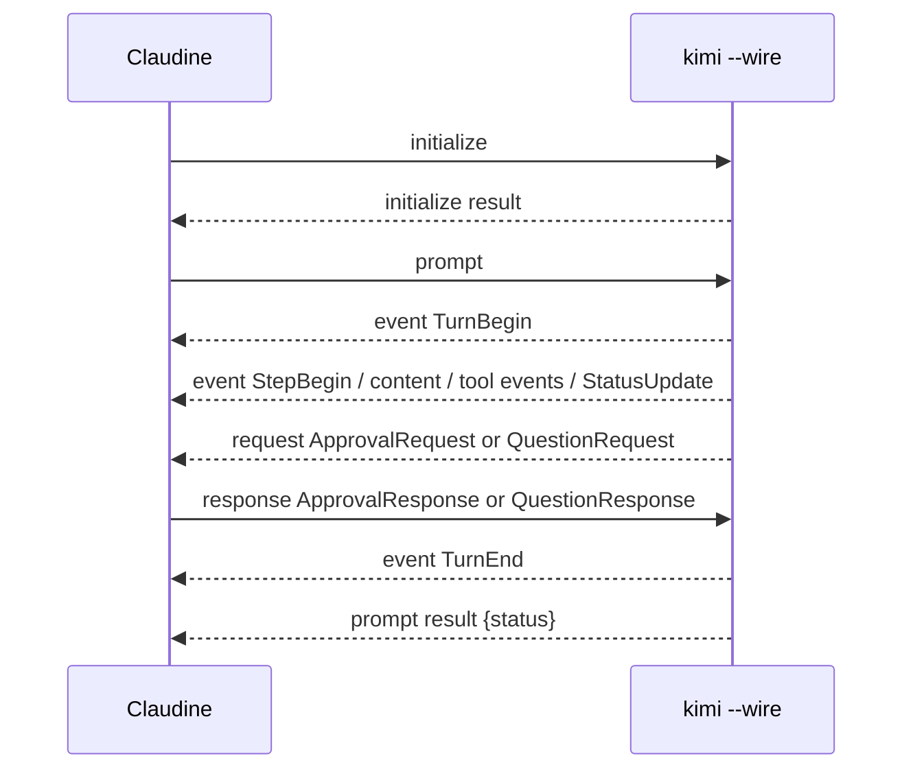

## Summary

Kimi Code CLI can be run non-interactively with structured output, but the best mode is not a conventional `--output-format` stream. Claudine should prefer `kimi --wire`, which exposes Kimi's bidirectional Wire protocol as JSON-RPC 2.0 messages framed one JSON object per line on stdin/stdout. Wire is the only mode that can show live lifecycle state, request approvals, ask structured questions, report hooks, stream token/context updates, expose MCP startup snapshots, and carry nested subagent events.

`kimi --print --output-format stream-json` remains useful as a simple automation fallback, but it is a lossy projection of Wire messages. It emits whole assistant/tool-style JSONL messages and selected display objects, not the full event/request protocol. The main parser risk is that Wire requires Claudine to be a peer: it must send JSON-RPC requests and respond to Kimi's `request` messages, not just tail stdout.

## Non-Interactive Entry Points

Kimi has two relevant non-interactive entry points. Print mode is command-shaped: pass a prompt with `--prompt`/`-p`, pipe text to stdin, or use JSONL user messages with `--input-format stream-json`. The official print docs define it as non-interactive and suitable for scripting; they also state that print mode implicitly runs in AFK mode, so tool calls are auto-approved and interactive questions/plan switches are handled automatically.

Wire mode is protocol-shaped:

```bash
kimi --wire --work-dir /path/to/repo --afk
```

After launch, the client sends an optional `initialize` request, then a `prompt` request:

```json
{"jsonrpc":"2.0","id":"init-1","method":"initialize","params":{"protocol_version":"1.10","client":{"name":"claudine"},"capabilities":{"supports_question":false,"supports_plan_mode":false}}}
```

```json
{"jsonrpc":"2.0","id":"turn-1","method":"prompt","params":{"user_input":"Fix the failing tests."}}
```

`--prompt` is not the prompt channel for Wire. The current CLI source logs that Wire ignores the prompt argument; Claudine must send a JSON-RPC `prompt` request instead. Resume and workspace controls are still normal CLI flags: `--work-dir`, `--add-dir`, `--continue`, and `--session <id>`.

## Output Formats

Kimi's output modes differ in kind, not only in detail:

| Mode | Selector | Framing | Streams live? | Claudine preference | Notes |
| --- | --- | --- | --- | --- | --- |
| Wire | `--wire` | JSON-RPC lines | Yes | Prefer | Bidirectional protocol over stdin/stdout. |
| Print JSONL | `--print --output-format stream-json` | JSONL | Partly | Fallback | Whole assistant/tool messages plus notifications/plans; many Wire events omitted. |
| Print text | `--print --output-format text` | Text | Partly | Avoid for parsing | Human/Rich output. |
| Final only | `--quiet` or `--final-message-only` | Text or JSONL final assistant message | No | Avoid for supervision | Drops intermediate state. |

Wire is the best Claudine format because it exposes the interaction surface that matters while a run is active. The response stream contains `event` notifications such as `StatusUpdate`, `StepBegin`, `ToolCall`, `ToolResult`, `PlanDisplay`, `HookTriggered`, and `SubagentEvent`. The same stdout stream can also contain server-to-client `request` messages such as `ApprovalRequest`, `QuestionRequest`, `ToolCallRequest`, and `HookRequest`, which require a JSON-RPC response before the run can continue.

Print `stream-json` is easier to consume but materially weaker. The source JSON printer merges content parts into assistant messages, flushes them at step boundaries, emits tool results as tool messages, and ignores many control events. A parser can see tool calls and tool results, but it loses most session lifecycle, approval, hook, MCP, retry, compaction, and nested subagent structure.

## Schema Sources

Kimi does not publish a standalone JSON Schema, OpenAPI document, or AsyncAPI document for Wire. The best schema evidence is provider-authored source plus the official Wire page.

The official Wire docs describe JSON-RPC envelopes, protocol version `1.10`, request methods, response shapes, event/request envelopes, display blocks, and capability negotiation. The source is still important because the actual runtime schema is Pydantic:

- [`src/kimi_cli/wire/types.py`](https://github.com/MoonshotAI/kimi-cli/blob/main/src/kimi_cli/wire/types.py) defines the event/request unions and payload models.
- [`src/kimi_cli/wire/jsonrpc.py`](https://github.com/MoonshotAI/kimi-cli/blob/main/src/kimi_cli/wire/jsonrpc.py) defines JSON-RPC inbound/outbound message types and method sets.
- [`src/kimi_cli/wire/protocol.py`](https://github.com/MoonshotAI/kimi-cli/blob/main/src/kimi_cli/wire/protocol.py) defines the current protocol constant.
- [`src/kimi_cli/ui/print/visualize.py`](https://github.com/MoonshotAI/kimi-cli/blob/main/src/kimi_cli/ui/print/visualize.py) defines the print `stream-json` projection.

The source types are authoritative enough for Claudine parser work, but not complete in one file. Some payloads come from Kimi's dependencies, especially `kosong.message` and `kosong.tooling`, so parser generation should preserve unknown nested fields.

## IO Contract

In Wire mode, stdout is parse-only JSON-RPC lines and stdin is also part of the protocol. Claudine must keep stdin open long enough to send `initialize`, `prompt`, possible responses to Kimi requests, `cancel`, and optional `steer` messages. Stderr should be treated as diagnostics; Kimi also writes runtime logs under the Kimi share directory.

In print mode, stdout is either human text or JSONL depending on `--output-format`. Stdin is prompt text for `--input-format text`, or user-message JSONL for `--input-format stream-json`. Print mode can read multiple JSONL user messages until EOF, but this is not the same as Wire because there is no JSON-RPC request/response channel for approvals, hooks, or external tools.

## Stream Contract

Wire has two discriminator layers. The transport discriminator is JSON-RPC's `method`: `event`, `request`, or a response with `id` and either `result` or `error`. For `event` and `request`, Kimi's Wire envelope uses `params.type` plus `params.payload`.

Normal turn flow is:



The prompt response is the terminal record for a turn. `TurnEnd` is useful, but the source model warns it may be omitted if the turn is interrupted. Tool calls and results are joined by tool-call ID. Request/response families use the JSON-RPC `id` plus payload fields such as `request_id` and `tool_call_id`.

Unknown `params.type` values should not crash Claudine. The protocol has changed over time and display blocks include an explicit unknown-block fallback. Claudine should preserve raw payloads, classify them as unknown, and continue unless the unknown record is a request that requires a response.

## Session Metadata

Wire's initialize result gives protocol version, server name/version, slash commands, capabilities, hook info, and external-tool registration results. It does not provide a complete wrapper metadata envelope. Session ID, working directory, selected model, provider, auth source, permission mode, and sandbox/root information must be tracked from launch arguments, config, session files, and Claudine wrapper state.

MCP is more visible. `StatusUpdate` can include `mcp_status` with `loading`, connected/total counts, total tool count, and per-server snapshots with `name`, `status`, and `tools`. This is a useful live signal during startup and tool discovery.

## Event Families

Wire event families that matter for Claudine:

| Family | Concrete records | Parser value |
| --- | --- | --- |
| Turn/step lifecycle | `TurnBegin`, `TurnEnd`, `StepBegin`, `StepInterrupted`, `StepRetry` | Progress, retry classification, step counters. |
| Assistant/reasoning | `TextPart`, `ThinkPart`, other content parts | Live transcript and reasoning when available. |
| Tools | `ToolCall`, `ToolCallPart`, `ToolResult`, `ToolCallRequest` | Tool start/input/result and external tool execution. |
| Permissions/questions | `ApprovalRequest`, `ApprovalResponse`, `QuestionRequest`, `QuestionResponse` | Human-in-loop detection and deterministic approvals. |
| Status/usage | `StatusUpdate` | Context usage, token usage, message IDs, plan mode, MCP snapshots. |
| Plans | `PlanDisplay`, `set_plan_mode`, `StatusUpdate.plan_mode` | Plan content and read-only mode state. |
| Hooks | `HookRequest`, `HookTriggered`, `HookResolved` | Policy callbacks and hook timing/allow/block outcome. |
| Subagents | `SubagentEvent`, `Agent` tool calls/results | Nested agent observability. |
| Background/notifications | `Notification`, `BtwBegin`, `BtwEnd` | Background task and side-question status. |
| Maintenance | `CompactionBegin`, `CompactionEnd`, `MCPLoadingBegin`, `MCPLoadingEnd` | Context and MCP lifecycle signals. |

Print JSONL collapses this substantially. It primarily emits assistant messages, tool messages, notifications, and plan displays.

## Tools

The default Kimi agent exposes `Agent`, `AskUserQuestion`, `SetTodoList`, `Shell`, `ReadFile`, `ReadMediaFile`, `Glob`, `Grep`, `WriteFile`, `StrReplaceFile`, `SearchWeb`, `FetchURL`, `EnterPlanMode`, `ExitPlanMode`, `TaskList`, `TaskOutput`, and `TaskStop`. The docs also describe `Think` and the experimental `okabe` agent's `SendDMail`.

Wire exposes native tool calls as `ToolCall` and results as `ToolResult`; incremental tool call fragments can arrive as `ToolCallPart`. Built-in writes and shell commands can produce `ApprovalRequest` before execution. Display blocks are important: diffs carry paths and old/new text, shell blocks carry command text, and todo blocks carry item state. Claudine should not rely only on tool result text when a structured display block is present.

External tools are a Wire-specific feature. Claudine can declare tools in `initialize.external_tools`; Kimi then sends `ToolCallRequest` messages and waits for Claudine to return a `ToolResult`.

## Completion and Exit Status

For Wire, completion is per JSON-RPC request. A `prompt` success response contains `result.status`, documented as `finished`, `cancelled`, or `max_steps_reached`; `steps` may be present for max-steps completion. Errors return JSON-RPC error objects. The server process can remain alive after one turn, so process exit is not the right success signal for a single prompt.

For print mode, the docs define exit codes: `0` for success, `1` for non-retryable failures such as configuration errors, authentication failures, quota exhaustion, and permanent errors, and `75` for retryable failures such as 429, 5xx, and timeouts. The source classifies provider connection/timeout/empty-response errors and selected HTTP status codes as retryable.

## Blocking Behavior

Print mode is designed not to block on a human. It implicitly enables AFK behavior, auto-approves tool calls, and auto-dismisses `AskUserQuestion`. This is automation-friendly but high-trust: file modifications and shell commands can execute without approval.

Wire can block unless Claudine responds. `ApprovalRequest`, `QuestionRequest`, `ToolCallRequest`, and `HookRequest` are JSON-RPC requests from Kimi to the client. Kimi's shutdown path resolves unresolved foreground approvals as reject, unresolved questions as empty answers, external tool calls as a tool error, and hooks as allow, but Claudine should not depend on shutdown cleanup for normal control flow.

Question and plan tools are capability-gated. If the client does not declare `supports_question`, Kimi hides `AskUserQuestion`; if it does not declare `supports_plan_mode`, plan-mode tools are hidden. Claudine can use this to avoid unsupported human-in-loop behavior.

## Subagents

Subagents are supported non-interactively through the `Agent` tool. The docs state that subagents run in isolated contexts, can run in foreground or background, can be resumed, and have per-instance storage under the session directory. Wire wraps nested events in `SubagentEvent` with `parent_tool_call_id`, `agent_id`, and `subagent_type`, and the nested event itself has its own `type` and `payload`.

Claudine can steer subagents by controlling the root prompt, the `Agent` tool prompt when it appears, or custom agent files. There is no separate Wire field named "subagent prompt injection"; it is ordinary agent/tool input plus custom agent configuration.

## Use Case Detection

| Use case | Detectability | Events and fields | Caveat |
| --- | --- | --- | --- |
| `tokens_consumed` | Good | `StatusUpdate.token_usage`, `context_tokens`, `max_context_tokens`, `context_usage` | Nested `TokenUsage` fields come from `kosong`. |
| `human_in_loop` | Good | `ApprovalRequest`, `QuestionRequest`, `HookRequest` | Questions only appear if negotiated. |
| `permission_write_denied` | Partial | `ApprovalResponse.response = reject`, `HookResolved.action = block`, tool result errors | Path may be in display blocks or tool args. |
| `permission_read_denied` | Partial | Read tool `ToolResult` error/result plus prior `ToolCall` args | No dedicated denial event. |
| `auth` | Partial | JSON-RPC error text or print exit `1` | Auth kind is not emitted. |
| `plan_capped` / `no_funds` | Weak | Error text or print exit `1` | No dedicated quota/funds schema found. |
| `model_used` | Weak | Launch/config metadata | Not reliably emitted in stream. |
| `session_resumable` | Good with wrapper state | `--session`, session directory, `wire.jsonl`, `replay` counts | Not emitted early by initialize. |
| `subagent_prompt_injection` | Good with tool parsing | `Agent` tool arguments and custom agent files | No special event name. |

## Headless Constraints

The biggest constraint is that Wire is a live protocol. A wrapper that only reads stdout can deadlock when Kimi sends a request that expects a response. Claudine either needs to run with `--afk` and with unsupported question/plan capabilities disabled, or it needs to implement the request handlers deliberately.

Print `stream-json` is safer to pipe but weaker for supervision. It is acceptable for a one-shot final transcript or rough tool transcript, but it should not be the primary Claudine integration because it hides or merges too many operational signals.

The current installed local `kimi` on this host reported `0.14.0` and did not support `kimi info --json`, so this document relies on current official docs and GitHub source rather than local runtime captures.

## Timeline

Kimi's structured-output surface has grown from simple print JSONL into a protocol surface:

| Date or version | Change | Wrapper significance |
| --- | --- | --- |
| Wire 1.1 | `initialize` added | Clients can negotiate protocol details and external tools. |
| Wire 1.3 | `replay` added | Saved `wire.jsonl` can be replayed for UI/recovery. |
| Wire 1.4 | `steer` and structured questions documented | Human-in-loop can become protocol-driven. |
| Wire 1.6 | Approval response feedback added | Rejections can include model guidance. |
| Wire 1.8 | Display-block changes such as diff summaries | Display schemas can drift and need tolerant parsing. |
| Wire 1.10 | Current documented/source protocol version | Claudine should target this version while tolerating older/newer payloads. |

## Quirks and Gaps

Kimi has unusually useful Wire visibility, but it is not a complete wrapper metadata feed. Claudine must carry launch/config metadata for model, provider, auth, workdir, roots, and permission mode. The stream has strong tool and lifecycle events, but no dedicated account quota, no-funds, model-fallback, or auth-kind events.

The protocol also spans packages. `types.py` is the right starting point, but content parts, token usage, tool calls, tool results, and display blocks also come from imported models. Parser code should preserve unknown fields and not assume the public docs are exhaustive.

## Claudine Integration Notes

Recommended command:

```bash
kimi --wire --work-dir "$REPO" --afk
```

Use `--session <id>` or `--continue` only when Claudine intentionally wants resume semantics. Send `initialize` with Claudine client metadata. If Claudine cannot answer human questions, set `supports_question: false`; if it cannot service plan-mode interactions, set `supports_plan_mode: false`. Then send `prompt`.

Parse stdout as JSON-RPC lines. Classify by JSON-RPC `method`, then by `params.type` for `event` and `request`. Recurse into `SubagentEvent.event`. Join `ToolCall` and `ToolResult` by `id`/`tool_call_id`; join approval, question, and hook requests by JSON-RPC `id` and payload `request_id`. Keep stderr/logs for diagnostics only.

Avoid `--quiet`, `--final-message-only`, and text output for Claudine supervision. Use `--print --output-format stream-json` only when implementing a simpler fallback that does not need approvals, questions, hooks, MCP status, retries, or full subagent visibility.

## Changelog

- 2026-07-02: Reworked Kimi research into the schema-backed non-interactive format, updated Wire to protocol `1.10`, and made Wire JSON-RPC the explicit Claudine preference.

## Sources

- [Kimi Code CLI Wire mode documentation](https://moonshotai.github.io/kimi-cli/en/customization/wire-mode.html)
- [Kimi Code CLI Print mode documentation](https://moonshotai.github.io/kimi-cli/en/customization/print-mode.html)
- [Kimi command reference](https://moonshotai.github.io/kimi-cli/en/reference/kimi-command.html)
- [Kimi config files documentation](https://moonshotai.github.io/kimi-cli/en/configuration/config-files.html)
- [Kimi data locations documentation](https://moonshotai.github.io/kimi-cli/en/configuration/data-locations.html)
- [Kimi agents and subagents documentation](https://moonshotai.github.io/kimi-cli/en/customization/agents.html)
- [Wire Pydantic types source](https://github.com/MoonshotAI/kimi-cli/blob/main/src/kimi_cli/wire/types.py)
- [Wire JSON-RPC source](https://github.com/MoonshotAI/kimi-cli/blob/main/src/kimi_cli/wire/jsonrpc.py)
- [Wire protocol version source](https://github.com/MoonshotAI/kimi-cli/blob/main/src/kimi_cli/wire/protocol.py)
- [Print JSONL projection source](https://github.com/MoonshotAI/kimi-cli/blob/main/src/kimi_cli/ui/print/visualize.py)
- [Print runtime source](https://github.com/MoonshotAI/kimi-cli/blob/main/src/kimi_cli/ui/print/__init__.py)
