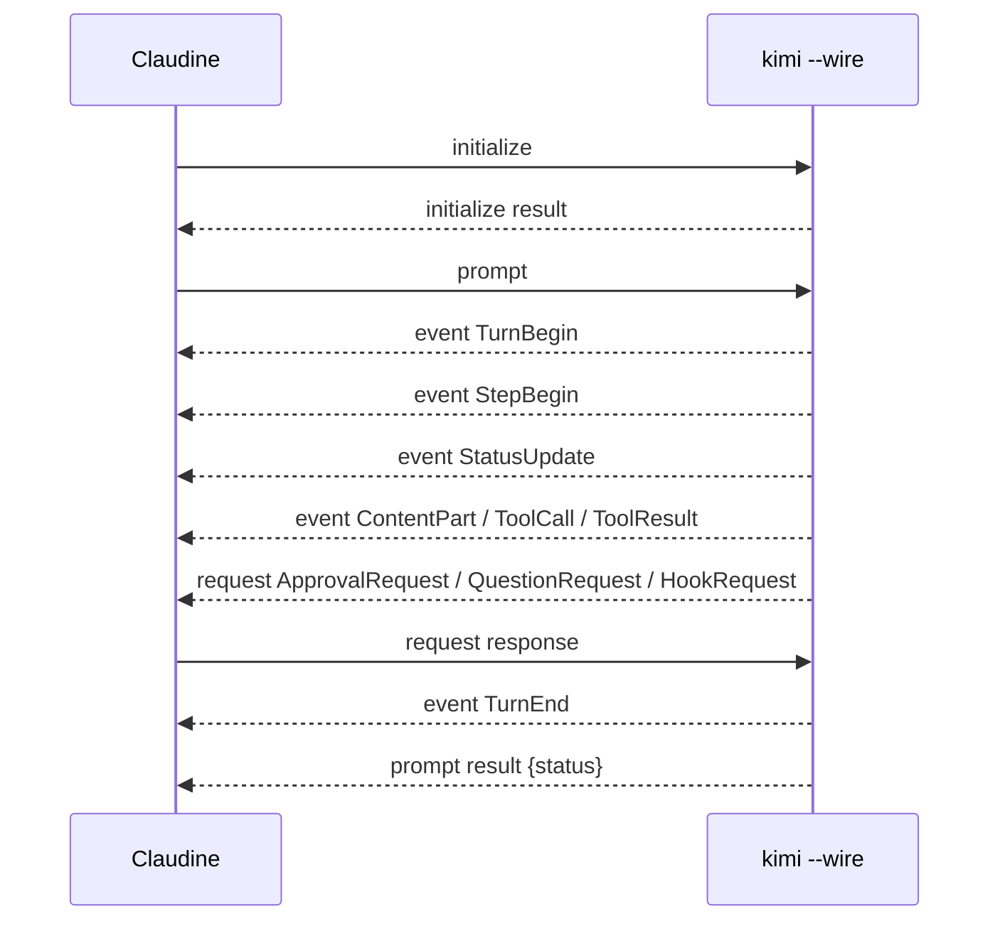

# Kimi Code CLI Non-Interactive Sessions

## Summary

Kimi Code CLI can run non-interactively in two useful ways. `kimi --print` is the simple scripting mode: it accepts a prompt from `-p`/`-c` or stdin, exits automatically, and can emit `--output-format stream-json` JSONL. That mode is useful for one-shot automation, but it is not the best Claudine integration point because it buffers assistant content into whole messages, projects tool results into message records, and drops many lifecycle/control events.

Claudine should prefer `kimi --wire --work-dir <repo> --afk`. Wire mode is a JSON-RPC 2.0 line protocol over stdin/stdout, with official TypeScript-style definitions and matching Pydantic source models. It exposes turn, step, status, tool, approval, hook, plan, notification, MCP, and subagent events while a run is active. The main wrapper risk is that Wire is bidirectional: Claudine must act as a JSON-RPC peer, not just tail stdout. It must send `initialize`/`prompt` and either answer approval, question, external-tool, and hook requests or launch with AFK semantics.

## Non-Interactive Entry Points

Kimi's documented non-interactive entry point is print mode. The print-mode page says `--print` is suitable for scripting and automation, can take `-p`/`-c` or stdin, and exits automatically after executing instructions. It also says print mode implicitly enables AFK: tool calls are auto-approved and interactive questions/plan switches are handled automatically.

Wire mode is lower level. The Wire docs describe it as a structured bidirectional protocol for external programs, custom UIs, embedding, and automated testing. The CLI invocation is `kimi --wire`, but a prompt is not an argv field in this mode; the client sends a JSON-RPC `prompt` request after optionally sending `initialize`. The command reference lists `--print`, `--quiet`, `--acp`, and `--wire` as mutually exclusive UI modes, with shell mode as the default.

The scriptable forms Claudine should care about are:

| Mode | Command shape | Prompt input | Session behavior | Automation fit |
| --- | --- | --- | --- | --- |
| Wire fresh | `kimi --wire --work-dir <repo>` | JSON-RPC `prompt` request on stdin | New session | Best for wrappers that need live events |
| Wire resume | `kimi --wire --work-dir <repo> --session <id>` | JSON-RPC `prompt` request on stdin | Resumes ID, or creates if missing | Best for resumable wrapper sessions |
| Wire continue | `kimi --wire --work-dir <repo> --continue` | JSON-RPC `prompt` request on stdin | Continues previous session for cwd | Useful when caller controls Kimi state |
| Print argv | `kimi --print -p "..." --output-format stream-json` | Argv prompt | One-shot session | Simple CI/scripting fallback |
| Print stdin JSONL | `kimi --print --input-format stream-json --output-format stream-json` | User-role JSONL until EOF | Processes messages until stdin closes | Batch request/reply fallback |

Kimi also has ACP, web, and visualizer modes, but they are not the preferred non-interactive stream for Claudine's wrapper. ACP is listed as deprecated in favor of `kimi acp`; web and visualizer are server/UI surfaces rather than the direct process stream Claudine needs.

## Output Formats

Wire is the richest stream. The official Wire page says each message is a single JSON line conforming to JSON-RPC 2.0 and that the protocol version is `1.10`. It includes ordinary JSON-RPC requests/responses plus server notifications/requests with method names such as `event` and `request`. For Claudine, this means stdout is parseable line-by-line only after Claudine understands that some lines require a response on stdin.

Print `stream-json` is easier but weaker. The print-mode docs call it JSONL and show assistant/tool messages emitted sequentially. Source inspection of `src/kimi_cli/ui/print/visualize.py` shows why it is lossy: `JsonPrinter` buffers `ContentPart` and `ToolCall` records, flushes an assistant `Message` at `StepBegin`/`StepInterrupted` boundaries or before a `ToolResult`, emits `ToolResult` as a tool message, emits `PlanDisplay`, buffers notifications until safe boundaries, and ignores other Wire messages. That makes print JSONL usable for transcripts but poor for live lifecycle detection.

| Output | Selector | Framing | Streams while active | What changes | Claudine preference |
| --- | --- | --- | --- | --- | --- |
| Wire | `--wire` | JSON-RPC lines | Yes | Process becomes a bidirectional protocol server | Prefer |
| Print JSONL | `--print --output-format stream-json` | JSONL | Partly | Emits projected messages, not full Wire events | Fallback |
| Print text | `--print --output-format text` | Text | Partly | Human-oriented output | Avoid for parsing |
| Quiet/final-only | `--quiet` or `--final-message-only` | Text | No | Drops intermediate events | Avoid for supervision |

The tradeoff is straightforward: print JSONL is simpler for request/reply scripts, but Wire is the only documented mode that exposes enough live operational state for Claudine to show progress, classify blocking behavior, correlate tool calls, and drive cancellation or request handling before process exit.

## Schema Sources

Kimi does not publish a JSON Schema, OpenAPI document, or AsyncAPI document for Wire. The best formal evidence is the official Wire documentation, which provides TypeScript-style interfaces for JSON-RPC envelopes, initialize, prompt, replay, steer, plan mode, request/response errors, events, requests, and display blocks.

The source is also strong evidence. `src/kimi_cli/wire/jsonrpc.py` defines Pydantic models for JSON-RPC message envelopes, inbound methods, outbound methods, statuses, and error codes. It defines inbound methods `initialize`, `prompt`, `steer`, `replay`, `set_plan_mode`, and `cancel`, and outbound methods `event` and `request`. It also defines statuses `finished`, `cancelled`, `max_steps_reached`, and `steered`, plus Kimi-specific error codes such as `LLM_NOT_SET`, `LLM_NOT_SUPPORTED`, `CHAT_PROVIDER_ERROR`, and `AUTH_EXPIRED`.

`src/kimi_cli/wire/types.py` defines the Wire event/request union. Important event classes include `TurnBegin`, `SteerInput`, `TurnEnd`, `StepBegin`, `StepInterrupted`, `StepRetry`, `CompactionBegin`, `CompactionEnd`, `HookTriggered`, `HookResolved`, `MCPLoadingBegin`, `MCPLoadingEnd`, `StatusUpdate`, `Notification`, `PlanDisplay`, `BtwBegin`, `BtwEnd`, `SubagentEvent`, `ApprovalResponse`, content parts, tool calls, tool-call parts, and tool results. Request classes include `ApprovalRequest`, `QuestionRequest`, `ToolCallRequest`, and `HookRequest`.

Some nested payloads come from Kimi dependencies rather than Kimi's own module, especially `kosong.message`, `kosong.tooling`, and `kosong.chat_provider.TokenUsage`. That is a schema risk: the public docs and Kimi source identify the fields Claudine needs, but a generated parser should keep unknown payload fields and tolerate additive variants.

## IO Contract

In Wire mode, stdout is the structured transport. Each stdout line is one JSON-RPC message. Stdin is also structured: Claudine must send JSON-RPC requests and responses. Stderr should be treated as diagnostics, not the authoritative event stream. The Kimi data-location docs say runtime logs are stored under `~/.kimi/logs/kimi.log` and `--debug` enables TRACE-level logging there.

In print mode, stdout is either text or JSONL depending on `--output-format`. With `--input-format stream-json`, stdin is user-message JSONL, not a bidirectional protocol. Print mode's documented exit codes are useful for CI: `0` for success, `1` for non-retryable failures such as configuration, authentication, quota exhaustion, and other permanent errors, and `75` for retryable failures such as rate limits, 5xx server errors, and timeouts.

Claudine should not mix Wire and print assumptions. `--output-format stream-json` is print-only; it does not make Wire more or less structured.

## Stream Contract

Wire has two discriminator layers. The transport discriminator is JSON-RPC `method`. Server event notifications use `method: "event"` with the Wire subtype in `params.type`; server requests use `method: "request"` with the Wire request subtype in `params.type`. Subagent records are recursive: `SubagentEvent` carries another Wire event under its nested `event` field.

The normal turn ordering is:



`TurnEnd` is useful but not terminal enough. Source and docs say it may be omitted when a turn is interrupted. Claudine should treat the JSON-RPC response to its `prompt` request as the turn terminal record and use `result.status` or `error` for classification. Tool calls join by `ToolCall.id` and `ToolResult.tool_call_id`. Approval, question, external-tool, and hook requests join by request `id` and response `request_id`.

Unknown event handling should be conservative: preserve raw JSON, classify known envelope fields, skip unknown `params.type`, and continue. The Pydantic source already models additive behavior through optional fields and dependency-owned nested payloads, so a strict closed union would be brittle.

## Session Metadata

Wire exposes some initialization metadata but not everything Claudine wants. The `initialize` response includes `protocol_version`, `server.name`, `server.version`, slash commands, capabilities, hook support, and external-tool registration results. It does not provide a stable session ID, cwd, requested/resolved model, provider, auth kind, permission mode, sandbox mode, or roots.

Those missing fields must come from launch context and Kimi storage. The data-location docs say Kimi stores sessions under `~/.kimi/sessions/<work-dir-hash>/<session-id>/`, with `context.jsonl`, `wire.jsonl`, and `state.json`. `state.json` stores approval state, plan mode, plan identifiers, subagent metadata, and additional directories. `wire.jsonl` stores Wire messages for replay and visualizer/export workflows. `KIMI_SHARE_DIR` can move the whole runtime data directory, so Claudine should not hard-code `~/.kimi` when that variable is set.

MCP metadata can appear in stream status. Source defines `StatusUpdate.mcp_status` with loading state, connected/total/tool counts, and per-server snapshots with `name`, `status`, and `tools`.

## Event Families

Kimi's Wire events are broad enough for wrapper supervision:

| Family | Events or methods | Wrapper value |
| --- | --- | --- |
| Session/turn | `initialize`, `prompt`, `replay`, `steer`, `cancel`, `TurnBegin`, `SteerInput`, `TurnEnd` | Lifecycle and cancellation |
| Step/retry | `StepBegin`, `StepInterrupted`, `StepRetry` | Progress, retry classification, transient errors |
| Status/usage | `StatusUpdate` | Context ratio, context tokens, token usage, plan mode, MCP status |
| Assistant/reasoning | `ContentPart` with nested text/think/media types | Live assistant output and reasoning where available |
| Tools | `ToolCall`, `ToolCallPart`, `ToolResult`, `ToolCallRequest` | Native and external tool execution |
| Permissions/questions | `ApprovalRequest`, `ApprovalResponse`, `QuestionRequest`, `HookRequest`, `HookResolved` | Human-in-loop and policy decisions |
| Plan | `set_plan_mode`, `PlanDisplay`, `StatusUpdate.plan_mode` | Plan-mode state and plan artifacts |
| Subagents | `SubagentEvent` | Nested agent progress and results |
| MCP | `MCPLoadingBegin`, `MCPLoadingEnd`, `StatusUpdate.mcp_status` | MCP startup and server status |
| Other | `Notification`, `CompactionBegin`, `CompactionEnd`, `BtwBegin`, `BtwEnd` | UI notifications, compaction, side questions |

The source token usage fields are `input_other`, `output`, `input_cache_read`, and `input_cache_creation`. `StatusUpdate.context_usage`, `context_tokens`, and `max_context_tokens` describe current context pressure.

## Tools

Wire exposes both call and result records for native tools. `ToolCall` includes `id`, `function.name`, and JSON-string `function.arguments`. `ToolCallPart` streams argument fragments. `ToolResult` joins by `tool_call_id` and carries `return_value.is_error`, model-facing output, message, display blocks, and extras.

Display blocks matter for file and shell observability. The Wire docs define `DiffDisplayBlock` with `path`, `old_text`, `new_text`, and optional `is_summary`; `ShellDisplayBlock` with `language` and `command`; and todo/brief/unknown blocks. For write tools, an approval request may carry a diff display before execution. For shell tools, command text may appear in tool arguments and shell display blocks. Exact stdout/stderr split for command execution is not documented as separate top-level fields; Claudine should treat shell result output as tool-return content unless fixtures prove a more specific structure.

External tools are different. During `initialize`, Claudine can register `external_tools` with JSON Schema parameters. Kimi can then send `ToolCallRequest` records to the Wire client. Claudine must execute or reject those and send a JSON-RPC response. If Claudine does not implement external tools, it should not register them.

## Completion and Exit Status

For Wire, the terminal event for a turn is the JSON-RPC response to the `prompt` request. `result.status = "finished"` is normal success. `cancelled` and `max_steps_reached` are terminal non-success statuses. JSON-RPC errors carry `error.code`, `error.message`, and optional `error.data`; source includes standard JSON-RPC codes plus Kimi-specific codes for invalid state, missing/unsupported LLM, chat provider errors, and expired auth.

For print mode, documented process exit codes are meaningful: `0` success, `1` non-retryable failure, and `75` retryable failure. Claudine can trust those in print mode, but in Wire mode process exit is not the per-turn success signal because the server can stay alive across turns. The per-request response is more precise.

Usage is available during the run through `StatusUpdate`, not only at completion. No cost fields were found. Quota and billing failures are not exposed as dedicated typed events; print documentation maps quota exhaustion to exit code `1`, and Wire should be classified from error code/message until a richer event is verified.

## Blocking Behavior

Print mode is the safest noninteractive mode from a blocking perspective because it implicitly enables AFK. The cost is control: it auto-approves tool calls and auto-handles interactive questions and plan switches. That can be acceptable for isolated CI, but it is not a permission-supervision strategy.

Wire mode is configurable. `--yolo`, `--yes`, and `--auto-approve` auto-approve tool calls, but the command reference says the user can still be reachable for `AskUserQuestion`. `--afk` is the stronger unattended flag: it auto-approves tool calls and auto-dismisses questions. Without AFK or implemented request handlers, Wire can block on `ApprovalRequest`, `QuestionRequest`, `ToolCallRequest`, or `HookRequest`.

For Claudine's first robust integration, `--afk` is the deterministic choice. A richer integration can omit AFK only after it has request handlers and a policy for approval, questions, client tools, and hooks.

## Subagents

Subagents are visible. Source defines `SubagentEvent` with `parent_tool_call_id`, `agent_id`, `subagent_type`, and a nested Wire `event`. The data-location docs say each subagent instance has its own storage directory under the session directory with `context.jsonl`, `wire.jsonl`, `meta.json`, `prompt.txt`, and output.

The parent stream can therefore show nested subagent events, but parsers must recurse. Prompt injection is not a separate protocol control; it is available through the `Agent` tool prompt/model arguments or custom agent files. If Claudine needs subagents to avoid interactive behavior, it should inject that instruction into the parent prompt and, where possible, into the Agent tool prompt or agent definition.

## Use Case Detection

| Use case | Detectable | Evidence | Notes |
| --- | --- | --- | --- |
| `plan_cap_approaching` | No | None found | No typed account-plan cap event verified. |
| `plan_capped` | Weak | print exit `1`, Wire error text | Quota exhaustion is documented only as a non-retryable print failure. |
| `no_funds` | Weak | Wire/print error text | No dedicated billing/no-funds event verified. |
| `auth` | Yes | JSON-RPC error, `AUTH_EXPIRED`, print exit `1` | Auth kind/source is not exposed. |
| `permission_read_denied` | Yes, inferred | `ToolResult.return_value.is_error` and read tool args | No dedicated read-denial event found. |
| `permission_write_denied` | Yes | `ApprovalResponse`, `HookResolved`, `ToolResult` | Path may be in diff display or tool args. |
| `tokens_consumed` | Yes | `StatusUpdate.token_usage` | Units are tokens; fields are per status update/current step. |
| `model_used` | Launch-only | argv/config | Not reliably emitted in Wire. |
| `model_fallback` | No | None found | No fallback event verified. |
| `human_in_loop` | Yes | `ApprovalRequest`, `QuestionRequest`, `HookRequest` | AFK may suppress or auto-handle some cases. |
| `session_resumable` | Yes | argv/session directory/`wire.jsonl` | Do not wait for `initialize` to emit session ID. |
| `subagent_prompt_injection` | Yes | `ToolCall.function.arguments` for Agent tool | Injection path is prompt/agent configuration, not a protocol field. |

## Headless Constraints

The major constraint is bidirectionality. A wrapper that only reads stdout can parse events for a while, but it will eventually fail or block when Kimi sends a request that requires a response. This is a design feature of Wire, not incidental noise.

The second constraint is metadata. Kimi's stream is good at operational events but weak at launch context. Claudine must preserve its own launch record: cwd, intended worktree, session ID, model flag, config file, `KIMI_SHARE_DIR`, approval mode, and MCP config sources.

The third constraint is persisted state. Resuming a session restores plan mode, approval state, additional directories, and subagent metadata from `state.json`. For reproducible automation, Claudine should prefer explicit flags and an isolated share directory.

## Timeline

The changelog records `--print` and `--output-format stream-json` support in the 0.21 release line, and later command docs show `--wire` as an experimental UI mode. Current Wire docs identify protocol version `1.10`. The source files inspected on `main` match the documented split: Wire as JSON-RPC lines and print JSON as a projection over Wire messages.

## Quirks and Gaps

Kimi's best mode is not named like a conventional output format. `--wire` changes the process contract into JSON-RPC over stdio. Treating it like NDJSON events would miss request/response obligations and cancellation semantics.

Print `stream-json` can look complete in small examples because it emits assistant and tool messages. Source shows it ignores many Wire messages and buffers deltas, so it is not enough for Claudine's live status, permission, subagent, and lifecycle needs.

Verified gaps remain:

- No official JSON Schema or OpenAPI/AsyncAPI artifact was found.
- No authenticated local fixture was captured.
- Resolved provider/model and auth kind were not found as stable Wire fields.
- Dedicated quota-near-cap, quota-exhausted, no-funds, and model-fallback events were not found.
- `Notification.created_at` is a float, but its unit/timezone are not formally specified.

## Claudine Integration Notes

Recommended command:

```sh
kimi --wire --work-dir <repo> --afk
```

Claudine should parse stdout as JSON-RPC lines and treat stderr plus `~/.kimi/logs/kimi.log` as diagnostics. It should send `initialize` with `protocol_version: "1.10"` and client info, then send `prompt`. If Claudine wants to handle human-in-loop events itself, it can declare `supports_question`, hook subscriptions, and external tools during `initialize`; otherwise it should use `--afk` and avoid registering external tools.

Parser notes:

- Discriminate first by JSON-RPC `method`.
- For `method: "event"` and `method: "request"`, discriminate by `params.type`.
- Preserve raw payloads for unknown event/request types.
- Recurse into `SubagentEvent.event`.
- Join tool calls/results by `ToolCall.id` and `ToolResult.tool_call_id`.
- Treat the `prompt` response as terminal for the turn.
- Keep launch metadata beside the stream because Kimi does not emit enough session/model/auth context.

Use print `stream-json` only when Claudine needs a simple transcript and accepts the loss of live control events. Avoid `--quiet`, `--final-message-only`, and text output for wrapper supervision.

## Changelog

- 2026-07-03: Refreshed against current Kimi docs and source. Preserved the original creation date, fixed schema-invalid all-OS config records, and clarified that Wire is the preferred bidirectional protocol while print JSONL is only a fallback.

## Sources

- [Wire mode documentation](https://moonshotai.github.io/kimi-cli/en/customization/wire-mode.html)
- [Print mode documentation](https://moonshotai.github.io/kimi-cli/en/customization/print-mode.html)
- [`kimi` command reference](https://moonshotai.github.io/kimi-cli/en/reference/kimi-command.html)
- [Config files documentation](https://moonshotai.github.io/kimi-cli/en/configuration/config-files.html)
- [Data locations documentation](https://moonshotai.github.io/kimi-cli/en/configuration/data-locations.html)
- [Hooks documentation](https://moonshotai.github.io/kimi-cli/en/customization/hooks.html)
- [`src/kimi_cli/wire/types.py`](https://github.com/MoonshotAI/kimi-cli/blob/main/src/kimi_cli/wire/types.py)
- [`src/kimi_cli/wire/jsonrpc.py`](https://github.com/MoonshotAI/kimi-cli/blob/main/src/kimi_cli/wire/jsonrpc.py)
- [`src/kimi_cli/ui/print/visualize.py`](https://github.com/MoonshotAI/kimi-cli/blob/main/src/kimi_cli/ui/print/visualize.py)
