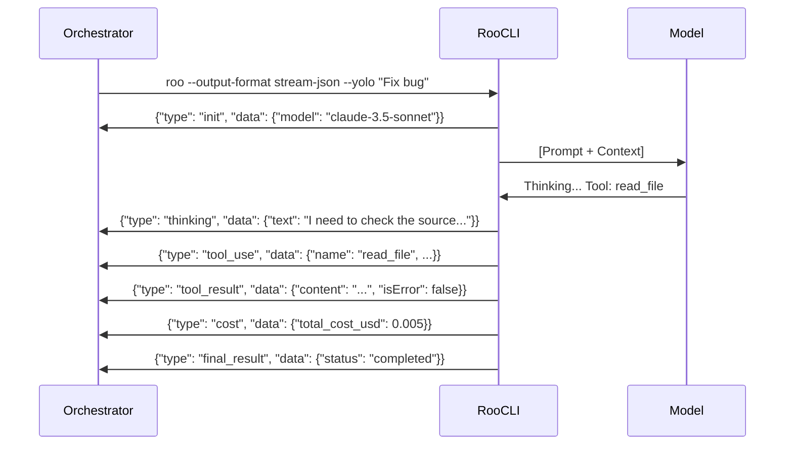

# Roo Code: Non-Interactive Sessions & Structured Output

## Summary

Roo Code (formerly Roo Cline) provides a robust non-interactive mode designed for CI/CD integration and automated workflows. When run with the `--json` or `--output-format stream-json` flags, the CLI emits a stream of Newline Delimited JSON (NDJSON) events. This structured stream provides deep visibility into the agent's "thinking," tool usage, cost tracking, and state transitions, making it significantly more powerful than plain text output for orchestrators like Claudine.

## Schema

Roo Code's structured output follows a consistent event-driven architecture.

- **Source:** Formal TypeScript definitions are maintained in the `@roo-code/types` package.
- **URL:** [https://github.com/RooCodeInc/Roo-Code/blob/main/schemas/cli/json-events.ts](https://github.com/RooCodeInc/Roo-Code/blob/main/schemas/cli/json-events.ts)
- **Language:** TypeScript interfaces are the primary source of truth, though JSON Schema versions are exported for cross-language validation.

### Base Event Structure

Each line in the stream is a standalone JSON object:

```json
{
  "type": "event_name",
  "timestamp": "ISO-8601-timestamp",
  "data": { ... }
}
```

## Documentation

- **Official CLI Docs:** [https://roocode.com/docs/cli/non-interactive](https://roocode.com/docs/cli/non-interactive)
- **Developer Guide:** [https://roocode.com/blog/automating-with-roo-code-cli](https://roocode.com/blog/automating-with-roo-code-cli)
- **MCP Integration:** [https://modelcontextprotocol.io/examples#roo-code](https://modelcontextprotocol.io/examples#roo-code)

## CLI

The CLI automatically detects non-interactive environments (non-TTY), but explicit flags are recommended for deterministic behavior.

- **Flags:**
  - `--json`: Enables single-object JSON array output upon completion.
  - `--output-format stream-json`: Enables real-time NDJSON streaming.
  - `-y`, `--yolo`, or `--permission-mode acceptAll`: Mandatory for non-interactive sessions to prevent the agent from hanging on approval prompts.
  - `--mode <architect|code|ask|debug>`: Sets the initial agent mode.

- **Side Effects:**
  - Enabling `--json` disables all ANSI terminal styling and TUI elements.
  - In `stream-json` mode, `stdout` is reserved strictly for JSON; all logging and auxiliary info are redirected to `stderr`.

## Gotchas

- **Buffering:** Some environments may buffer `stdout`, leading to perceived delays in the event stream. Use `unbuffer` or equivalent if real-time monitoring is critical.
- **Large Payloads:** `tool_result` events for tools like `read_file` can be very large, potentially hitting pipe buffer limits in some shells.
- **Error Handling:** If the agent encounters a fatal error before the stream initializes, the output may be plain text on `stderr` rather than a JSON event.

## Timeline

- **January 2025:** **Roo Cline** is launched as a fork of Cline, adding experimental support for streaming JSON output.
- **July 2025:** Introduction of **Architect Mode** (Plan) and **Code Mode** (Act), with distinct event types for mode transitions.
- **November 2025:** Rebranded as **Roo Code**. The schema is formalized and moved to the `@roo-code/types` package.
- **January 2026:** **Roo Code v1.0** released. Introduces **Roo Code Cloud** events and native MCP tool-calling visibility.
- **March 2026:** Version **1.2** adds granular token-cost tracking per-event.

## Tools

Roo Code categorizes tools by mode, and their usage is reflected in `tool_use` and `tool_result` events.

| Tool Name | Visibility in Stream | Metadata Provided |
| :--- | :--- | :--- |
| `read_file` | High | File path, full content (in result). |
| `write_to_file` | High | File path, diff/content, permission status. |
| `execute_command` | High | Command string, exit code, stdout/stderr. |
| `browser_action` | Medium | Screenshot URL (if configured), console logs. |
| `switch_mode` | High | Target mode, context preservation status. |
| `mcp_call` | High | Server name, tool name, raw JSON-RPC payload. |

### Example: Tool Use & Result
```json
{"type": "tool_use", "timestamp": "2026-04-10T12:00:00Z", "data": {"name": "read_file", "input": {"path": "src/lib.rs"}, "tool_use_id": "call_1"}}
{"type": "tool_result", "timestamp": "2026-04-10T12:00:01Z", "data": {"tool_use_id": "call_1", "content": "pub fn hello() {}", "isError": false}}
```

## Use Cases

### Plan Cap Approaching
Detected via the `plan_cap_approaching` event.
- **Event Type:** `plan_cap_approaching`
- **Distinction:** Fired when usage reaches 80% of the daily/monthly quota.
- **Data:** Provides `remaining_tokens`, `percent_used`, and `reset_timestamp`.

### Plan Capped
Detected via the `plan_capped` event or a `fatal_error` with a specific code.
- **Event Type:** `plan_capped`
- **Data:** Includes `reset_timestamp` and a `upgrade_url`.

### No Funds
Occurs primarily when using Pay-As-You-Go providers through Roo Code Cloud.
- **Event Type:** `insufficient_funds`
- **Data:** `provider_name`, `current_balance`, `required_minimum`.

### Auth
- **Event Type:** `auth_info`
- **Details:** Discloses `method` (`api_key`, `oauth`, `session_token`) and `provider`. It never includes the actual secrets.

### Permissions: Can't Read File
- **Event Type:** `permission_denied`
- **Identification:** `operation: "read"`, `path: "/absolute/path"`.
- **Reason:** Provided in the `reason` field (e.g., `EACCES`, `system_whitelist_blocked`).

### Permissions: Can't Write File
- **Event Type:** `permission_denied`
- **Identification:** `operation: "write"`, `path: "/absolute/path"`.
- **Reason:** Often includes detail if a `.gitignore` or protected directory was targeted.

### Tokens Consumed
- **Event Type:** `cost` (emitted per turn) and `final_result` (total).
- **Granularity:** Per-turn events provide `input_tokens`, `output_tokens`, and `cache_creation_input_tokens`.
- **Cost Basis:** `total_cost_usd` is calculated based on the specific model's pricing at runtime.

### Model Used
- **Event Type:** `init` and `model_switch`.
- **Nomenclature:** Uses full identifiers (e.g., `anthropic/claude-3-5-sonnet-20240620`).
- **Provider:** Explicitly mentioned in the `provider` field of the `init` event.

### Human in the Loop
In non-interactive sessions, these are typically treated as failures or auto-rejected.
- **Detection:** `tool_use` event for `ask_followup_question`.
- **Subagents:** If a subagent uses `ask_followup_question`, the event is nested within the subagent's event context.

### Injecting into Subagent Prompt
Roo Code allows injecting "Global Context" which propagates to all subagents.
- **Mechanism:** Using the `--context-file` CLI flag or the `update_context` tool.
- **Use Case:** Claudine can inject a "System Note" that warns subagents they are in a non-interactive pipeline and must favor autonomous decision-making over questioning.

## Visualizing the Event Stream


