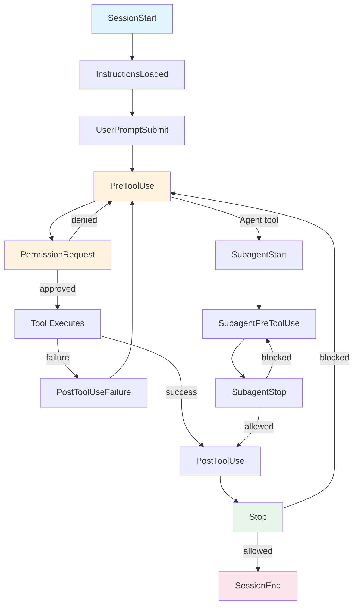
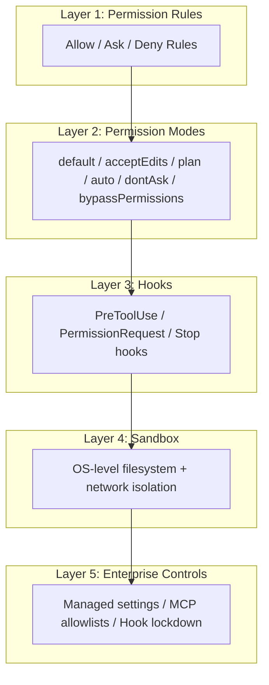

Let me start by reading the target document and then researching Claude Code permissions thoroughly.Good, I have a broad picture. Let me now read the key source documents for precise details.Let me read the protect research and permissions scratch documents for more details.Let me read the protect research body and also fetch the latest Claude Code docs for permissions.Let me read the full settings output and fetch additional details.Let me get the sandboxing info and check for any GitHub issues about permission problems.Now I have comprehensive data from all sources. Let me read the settings output for the complete schema.Now I have all the data I need. Let me compile the comprehensive research document.

# Claude Code Permissions Research

## Permission Entities

In Claude Code, **permissions are attached to tools**. Every action Claude can take is mediated through a tool, and the permission system controls which tools can execute, under what conditions, and with what constraints.

### Built-in Tools

Claude Code provides the following built-in tools:

| Tool | Category | Description | Approval Required (default mode) |
|------|----------|-------------|----------------------------------|
| `Read` | Read-only | Read file contents from the filesystem | No |
| `Grep` | Read-only | Search file contents using regex patterns (ripgrep) | No |
| `Glob` | Read-only | Find files by glob pattern | No |
| `Bash` | Execution | Execute shell commands | Yes (permanent per project+command) |
| `Edit` | File modification | Perform string replacements in existing files | Yes (until session end) |
| `Write` | File modification | Create or overwrite files | Yes (until session end) |
| `NotebookEdit` | File modification | Edit Jupyter notebook cells | Yes (until session end) |
| `WebFetch` | Network | Fetch and process web content | Yes |
| `WebSearch` | Network | Search the web | Yes |
| `Agent` | Orchestration | Spawn subagents (previously called `Task`) | Yes |
| `LSP` | Read-only | Language Server Protocol queries | No |

MCP (Model Context Protocol) tools are also treated as permission entities, with names following the pattern `mcp__<server>__<tool>` (e.g., `mcp__github__search_repositories`).

### Permission Rule Targets

Beyond individual tools, the permission system supports rules targeting:

| Target | Rule Syntax | Description |
|--------|-------------|-------------|
| All tool uses | `Bash`, `Read`, `Edit`, etc. | Match every invocation of a tool |
| Tool + specifier | `Bash(npm run *)`, `Read(./.env)` | Match specific invocations based on arguments |
| WebFetch domains | `WebFetch(domain:example.com)` | Match network requests to specific domains |
| MCP servers | `mcp__puppeteer` | Match all tools from a specific MCP server |
| MCP tools | `mcp__puppeteer__puppeteer_navigate` | Match a specific MCP server tool |
| Subagents | `Agent(Explore)`, `Agent(my-custom-agent)` | Match specific subagent types |

### "Don't Ask Again" Scope

When a user approves a tool use with "Yes, don't ask again", the persistence of that approval varies:

| Tool Type | "Don't Ask Again" Scope |
|-----------|------------------------|
| Bash commands | Permanent per project directory and command |
| File modification (Edit/Write) | Until session end |
| Read-only tools | N/A (no approval required) |

For compound Bash commands (e.g., `git status && npm test`), Claude Code saves a separate rule for each subcommand (up to 5 rules per compound command).

---

## Configuration Files

### Settings File Hierarchy

Claude Code uses a layered configuration system with strict precedence. Higher-priority settings cannot be overridden by lower-priority ones.

| Priority | Scope | Location | Shared? | Purpose |
|----------|-------|----------|---------|---------|
| 1 (highest) | Managed (server) | Server-managed settings via Claude.ai admin console | Yes (deployed by admin) | Organization-wide policies |
| 1 (highest) | Managed (MDM) | macOS: `com.anthropic.claudecode` plist; Windows: `HKLM\SOFTWARE\Policies\ClaudeCode` registry | Yes (deployed by IT) | OS-level policy delivery |
| 1 (highest) | Managed (file) | macOS: `/Library/Application Support/ClaudeCode/managed-settings.json`; Linux/WSL: `/etc/claude-code/managed-settings.json`; Windows: `C:\Program Files\ClaudeCode\managed-settings.json` | Yes (deployed by IT) | File-based policy delivery |
| 2 | CLI arguments | `--allowedTools`, `--permission-mode`, etc. | No | Temporary session overrides |
| 3 | Local project | `.claude/settings.local.json` | No (gitignored) | Personal project overrides |
| 4 | Shared project | `.claude/settings.json` | Yes (committed) | Team-shared project settings |
| 5 (lowest) | User | `~/.claude/settings.json` | No | Personal global defaults |

### Other Configuration Files

| File | Purpose |
|------|---------|
| `~/.claude.json` | Global state: OAuth, theme, user-scoped MCP servers, per-project allowed tools, caches |
| `.mcp.json` | Project-scoped MCP server definitions (committed to VCS) |
| `/Library/Application Support/ClaudeCode/managed-mcp.json` (macOS) | Managed MCP server definitions |
| `CLAUDE.md`, `.claude/CLAUDE.md` | Project instructions loaded into system prompt |
| `.claude/CLAUDE.local.md` | Personal project instructions (not committed) |
| `~/.claude/CLAUDE.md` | Global user instructions |
| `.claude/agents/*.md` | Subagent definitions with permission frontmatter |
| `.claude/skills/*/SKILL.md` | Skill definitions with allowed-tools frontmatter |

### Managed Settings Drop-in Directory

Managed settings support a `managed-settings.d/` directory alongside `managed-settings.json`. Files are sorted alphabetically and deep-merged (arrays concatenated, objects deep-merged). Use numeric prefixes to control order (e.g., `10-telemetry.json`, `20-security.json`).

---

## Configuration File Schema

### settings.json Structure

The settings file uses a JSON format with an [official JSON Schema](https://json.schemastore.org/claude-code-settings.json):

```json
{
  "$schema": "https://json.schemastore.org/claude-code-settings.json",
  "permissions": {
    "allow": ["<ToolRule>", ...],
    "ask": ["<ToolRule>", ...],
    "deny": ["<ToolRule>", ...],
    "additionalDirectories": ["../docs/"],
    "defaultMode": "default | acceptEdits | plan | auto | dontAsk | bypassPermissions",
    "disableBypassPermissionsMode": "disable"
  },
  "autoMode": {
    "environment": ["<prose description>", ...],
    "allow": ["<prose description>", ...],
    "soft_deny": ["<prose description>", ...]
  },
  "hooks": {
    "<EventName>": [
      {
        "matcher": "<regex>",
        "hooks": [
          {
            "type": "command | http | prompt | agent",
            "command": "<shell command>",
            "url": "<http endpoint>",
            "prompt": "<LLM prompt with $ARGUMENTS>",
            "timeout": 600,
            "async": false,
            "if": "<ToolRule>",
            "statusMessage": "<spinner text>",
            "once": false
          }
        ]
      }
    ]
  },
  "sandbox": {
    "enabled": false,
    "failIfUnavailable": false,
    "autoAllowBashIfSandboxed": true,
    "excludedCommands": ["docker"],
    "allowUnsandboxedCommands": true,
    "filesystem": {
      "allowWrite": ["/tmp/build"],
      "denyWrite": ["/etc"],
      "denyRead": ["~/.aws/credentials"],
      "allowRead": ["."],
      "allowManagedReadPathsOnly": false
    },
    "network": {
      "allowedDomains": ["github.com", "*.npmjs.org"],
      "allowManagedDomainsOnly": false,
      "allowUnixSockets": [],
      "allowAllUnixSockets": false,
      "allowLocalBinding": false,
      "httpProxyPort": 8080,
      "socksProxyPort": 8081
    },
    "enableWeakerNestedSandbox": false,
    "enableWeakerNetworkIsolation": false
  },
  "model": "claude-sonnet-4-6",
  "availableModels": ["sonnet", "haiku"],
  "env": { "KEY": "value" },
  "disableAllHooks": false,
  "allowManagedHooksOnly": false,
  "allowManagedPermissionRulesOnly": false,
  "allowManagedMcpServersOnly": false,
  "disableAutoMode": "disable"
}
```

### Permission Rule Syntax

Rules follow the format `Tool` or `Tool(specifier)`. Evaluation order: **deny** (checked first) -> **ask** -> **allow**. First match wins.

| Pattern Type | Syntax | Examples |
|-------------|--------|---------|
| Entire tool | `Tool` | `Bash`, `WebFetch`, `Read` |
| Wildcard | `Tool(pattern *)` | `Bash(npm run *)`, `Bash(git *)` |
| Exact command | `Tool(exact)` | `Bash(npm run build)` |
| File path (project-relative) | `Tool(/path)` | `Edit(/src/**/*.ts)` |
| File path (home-relative) | `Tool(~/path)` | `Read(~/.zshrc)` |
| File path (absolute) | `Tool(//path)` | `Read(//Users/alice/secrets/**)` |
| File path (cwd-relative) | `Tool(path)` or `Tool(./path)` | `Read(*.env)` |
| Domain | `WebFetch(domain:host)` | `WebFetch(domain:docs.rs)` |
| MCP server | `mcp__<server>` | `mcp__github` |
| MCP tool | `mcp__<server>__<tool>` | `mcp__github__search_repositories` |
| Subagent | `Agent(<name>)` | `Agent(Explore)`, `Agent(Plan)` |

Read and Edit rules follow the [gitignore specification](https://git-scm.com/docs/gitignore) with `*` matching single directory files and `**` matching recursively.

### Subagent Frontmatter Schema

Subagents defined in `.claude/agents/*.md` support permission-related frontmatter:

```yaml
---
name: safe-researcher
description: Research agent with no write access
tools: Read, Grep, Glob
disallowedTools: Write, Edit
permissionMode: plan
maxTurns: 20
mcpServers:
  - github
---
```

| Field | Type | Description |
|-------|------|-------------|
| `tools` | comma-separated string | Allowlist of available tools |
| `disallowedTools` | comma-separated string | Denylist of tools removed from context |
| `permissionMode` | string | Permission mode for the subagent |
| `maxTurns` | number | Maximum conversation turns |
| `mcpServers` | list | Which MCP servers are available |

### Hook Event Configuration

Hooks are defined under the `hooks` key in settings. There are 22 lifecycle events:



| Event | Blocking | Matcher Filters | Fires in Subagents |
|-------|----------|----------------|-------------------|
| `SessionStart` | No | Session source | N/A |
| `InstructionsLoaded` | No | Load reason | N/A |
| `UserPromptSubmit` | Yes | None | No |
| `PreToolUse` | Yes | Tool name | Yes |
| `PermissionRequest` | Yes | Tool name | Yes |
| `PostToolUse` | No | Tool name | Yes |
| `PostToolUseFailure` | No | Tool name | Yes |
| `Stop` | Yes | None | Yes |
| `StopFailure` | No | Error type | Yes |
| `SubagentStart` | No | Agent type | N/A |
| `SubagentStop` | Yes | Agent type | N/A |
| `TaskCreated` | Yes | None | Yes |
| `TaskCompleted` | Yes | None | Yes |
| `TeammateIdle` | Yes | None | Yes |
| `ConfigChange` | Yes | Config source | No |
| `Notification` | No | Notification type | No |
| `PreCompact` | No | Compaction trigger | N/A |
| `PostCompact` | No | Compaction trigger | N/A |
| `FileChanged` | No | Filename | Yes |
| `CwdChanged` | No | None | Yes |
| `WorktreeCreate` | Yes | None | Yes |
| `WorktreeRemove` | No | None | Yes |

Four hook handler types are available:

| Type | Description | Blocking Support | Key Fields |
|------|-------------|-----------------|------------|
| `command` | Executes a shell command; receives JSON on stdin | Yes (exit 2 or JSON) | `command`, `async`, `shell`, `timeout` |
| `http` | POSTs JSON to an HTTP endpoint | Yes (2xx + JSON) | `url`, `headers`, `allowedEnvVars`, `timeout` |
| `prompt` | Single-turn LLM evaluation | Yes (JSON response) | `prompt` (with `$ARGUMENTS`), `model`, `timeout` |
| `agent` | Multi-turn agent with tool access (up to 50 turns) | Yes (JSON response) | `prompt` (with `$ARGUMENTS`), `model`, `timeout` |

---

## CLI Switches for Permissions

### `--permission-mode <mode>`

Sets the active permission mode for the session. Overrides `defaultMode` from settings files.

**Accepted values:** `default`, `acceptEdits`, `plan`, `auto`, `dontAsk`, `bypassPermissions`

| Mode | Behavior |
|------|----------|
| `default` | Prompts for permission on first use of each tool category |
| `acceptEdits` | Auto-approves file edits; still prompts for Bash and network tools |
| `plan` | Read-only: Claude can analyze but not modify files or execute commands |
| `auto` | Background classifier evaluates each action; blocks risky ones (research preview, requires Team/Enterprise/API plan + Sonnet 4.6 or Opus 4.6) |
| `dontAsk` | Auto-denies all tools not pre-approved via `allow` rules; fully non-interactive |
| `bypassPermissions` | Skips all permission prompts except writes to `.git`, `.vscode`, `.idea`, and `.claude` (excluding `.claude/commands`, `.claude/agents`, `.claude/skills`) |

```sh
claude --permission-mode plan
claude -p "refactor auth" --permission-mode acceptEdits
claude --permission-mode dontAsk  # Only pre-approved tools work
```

### `--dangerously-skip-permissions`

Equivalent to `--permission-mode bypassPermissions`. Immediately bypasses all permission checks.

```sh
claude -p "fix all tests" --dangerously-skip-permissions
```

### `--allow-dangerously-skip-permissions`

Adds `bypassPermissions` to the `Shift+Tab` mode cycle without starting in it. Lets you begin in a safer mode and switch later.

```sh
# Start in plan mode but allow switching to bypass later
claude --permission-mode plan --allow-dangerously-skip-permissions
```

### `--allowedTools <tools...>`

Pre-approves specific tools without prompting. Uses [permission rule syntax](https://code.claude.com/docs/en/permissions#permission-rule-syntax). Does not restrict which tools are available — use `--tools` for that.

```sh
claude --allowedTools "Bash(git log *)" "Bash(git diff *)" "Read"
claude --allowedTools "Bash(npm run build)" "Bash(npm run test *)" "Edit"
```

### `--disallowedTools <tools...>`

Removes tools from the model's context entirely. The model cannot see or use these tools.

```sh
claude --disallowedTools "Bash(curl *)" "WebFetch" "WebSearch"
claude --disallowedTools "Agent(Explore)"  # Disable Explore subagent
```

### `--tools <tools...>`

Restricts which built-in tools are available. Unlike `--allowedTools` (which pre-approves), this controls the tool set itself.

```sh
claude --tools "Bash,Edit,Read"    # Only these three tools
claude --tools ""                  # Disable all tools
claude --tools "default"           # All tools (default)
```

### `--add-dir <dirs...>`

Adds additional working directories for Claude to access. Files in these directories follow the same permission rules as the original working directory.

```sh
claude --add-dir ../apps ../lib
```

### `--permission-prompt-tool <tool>`

Specifies an MCP tool to handle permission prompts in non-interactive mode. Useful for programmatic permission decisions when using `-p`.

```sh
claude -p --permission-prompt-tool mcp_auth_tool "deploy to staging"
```

### `--setting-sources <sources>`

Controls which settings scopes to load. Comma-separated list of `user`, `project`, `local`.

```sh
claude --setting-sources user           # Only load user settings
claude --setting-sources user,project   # Skip local settings
```

### `--settings <file-or-json>`

Loads additional settings from a JSON file or inline JSON string.

```sh
claude --settings ./ci-settings.json
claude --settings '{"permissions":{"allow":["Bash(npm test)"]}}'
```

### `--strict-mcp-config`

When combined with `--mcp-config`, ignores all other MCP configurations and only uses the specified one.

```sh
claude --strict-mcp-config --mcp-config ./mcp.json
```

### `--enable-auto-mode`

Unlocks `auto` mode in the `Shift+Tab` cycle. Requires Team, Enterprise, or API plan and Sonnet 4.6 or Opus 4.6.

```sh
claude --enable-auto-mode
```

### `--bare`

Minimal mode: skips auto-discovery of hooks, skills, plugins, MCP servers, auto memory, and CLAUDE.md. Claude has access to Bash, file read, and file edit tools only. Useful for fast scripted calls.

```sh
claude --bare -p "query"
```

---

## Problems and Workarounds

### 1. Bash Permission Patterns Are Fragile

**Problem:** Bash permission rules that try to constrain command arguments can be easily bypassed through argument reordering, variable expansion, redirects, or extra whitespace.

**Example:** `Bash(curl http://github.com/ *)` will not match:

- Options before URL: `curl -X GET http://github.com/...`
- Different protocol: `curl https://github.com/...`
- Redirects: `curl -L http://bit.ly/xyz`
- Variables: `URL=http://github.com && curl $URL`

**Workaround:** Use deny rules to block network CLI tools (`curl`, `wget`) and use `WebFetch(domain:...)` for allowed domains. For complex validation, implement a `PreToolUse` hook.

### 2. Read/Edit Deny Rules Don't Apply to Bash Subprocesses

**Problem:** A `Read(./.env)` deny rule blocks the Read tool but does **not** prevent `cat .env` via Bash. Permission rules apply to Claude's built-in tools, not to arbitrary shell commands.

**Workaround:** Enable the [sandbox](https://code.claude.com/docs/en/sandboxing) for OS-level enforcement that blocks all processes from accessing denied paths. Use `sandbox.filesystem.denyRead` for comprehensive protection.

### 3. Permission Request Events Don't Fire in Non-Interactive Mode

**Problem:** `PermissionRequest` hooks only fire in interactive mode. When using `claude -p`, permission dialogs are never shown, so `PermissionRequest` hooks never trigger.

**Workaround:** Use `PreToolUse` hooks for automated permission decisions in headless/non-interactive mode. `PreToolUse` fires in all modes.

### 4. Auto Mode Not Available on All Plans

**Problem:** Auto mode requires a Team, Enterprise, or API plan **and** Claude Sonnet 4.6 or Opus 4.6. It's not available on Pro plans, Haiku, claude-3 models, or third-party providers (Bedrock, Vertex, Foundry).

**Workaround:** Use `acceptEdits` mode combined with targeted `allow` rules for a semi-autonomous experience, or use `PreToolUse` hooks for custom automated approval logic.

### 5. Auto Mode Drops Broad Allow Rules

**Problem:** On entering auto mode, Claude Code drops any allow rule that grants arbitrary code execution: blanket shell access (`Bash(*)`), wildcarded interpreters (`Bash(python*)`), package-manager run commands, and any `Agent` allow rule. Narrow rules like `Bash(npm test)` carry over.

**Workaround:** Design allow rules to be specific rather than broad. The dropped rules are restored when leaving auto mode.

### 6. UserPromptSubmit Cannot Mutate Prompts

**Problem:** The `UserPromptSubmit` event can block prompts but cannot rewrite them before processing. There is no `updatedPrompt` field.

**Workaround:** Use `additionalContext` to inject guidance, or block the prompt entirely and instruct the user to resubmit.

### 7. SubagentStart Is Non-Blocking

**Problem:** You cannot prevent a subagent from being created via the `SubagentStart` event. It fires for observability but doesn't support deny decisions.

**Workaround:** Use `Agent(<name>)` deny rules in permissions or `--disallowedTools "Agent(Explore)"` to block specific subagent types. Alternatively, deny the `Task` tool entirely.

### 8. Matchers Are Case-Sensitive Regex

**Problem:** Hook matchers are case-sensitive. `"matcher": "bash"` will **not** match the `Bash` tool.

**Workaround:** Always use the exact casing of tool names: `Bash`, `Edit`, `Write`, `Read`, `Glob`, `Grep`, `WebFetch`, `WebSearch`, `Agent`.

### 9. Completion Hook Infinite Loops

**Problem:** `Stop` hooks that always block can cause infinite loops, repeatedly forcing Claude to continue working.

**Workaround:** Always check the `stop_hook_active` field and allow stopping on the second pass:

```bash
if [ "$(echo "$INPUT" | jq -r '.stop_hook_active')" = "true" ]; then
  exit 0  # Always allow stopping on second pass
fi
```

### 10. Sandbox Incompatibilities

**Problem:** Some tools are incompatible with sandboxing: `docker`, `watchman`, and others that need special system access.

**Workaround:** Use `excludedCommands` in sandbox settings to run specific commands outside the sandbox. For Jest, use `jest --no-watchman`. For Docker, add `"docker"` to `excludedCommands`.

---

## Additional Considerations

### Defense-in-Depth Architecture

Claude Code's security is designed as layered defenses, not a single mechanism:



### Hooks Fire in Subagents

Settings-level hooks (from `settings.json`) apply globally across the main agent **and all subagents**. This is one of Claude Code's strongest security properties — a `PreToolUse` hook blocking `rm -rf` protects the entire agent execution tree.

### Auto Mode Classifier Details

- Runs on Claude Sonnet 4.6 regardless of the main session model
- Adds token cost and latency per evaluated action
- Never sees tool results (immune to prompt injection in tool output)
- Falls back to prompting after 3 consecutive blocks or 20 total blocks per session
- Reads `CLAUDE.md` content to understand project context
- `autoMode.environment` descriptions are prose, not regex — write them as you would explain your infrastructure to a new engineer

### MCP Security Considerations

- MCP tool calls flow through the standard hook system as `mcp__<server>__<tool>`
- `PostToolUse` hooks can **replace** MCP output via `updatedMCPToolOutput` before Claude sees it
- Enterprise administrators can deploy `managed-mcp.json` for exclusive control over available MCP servers
- `allowedMcpServers` and `deniedMcpServers` in managed settings control which servers users can configure
- Denylist always takes precedence over allowlist

### Protected Directories in Bypass Mode

Even in `bypassPermissions` mode, writes to certain directories still prompt for confirmation:

- `.git/` — prevent repository state corruption
- `.vscode/` — prevent IDE configuration corruption
- `.idea/` — prevent JetBrains configuration corruption
- `.claude/` — prevent settings corruption (except `.claude/commands`, `.claude/agents`, `.claude/skills`)

### Precedence Rule: Deny Always Wins

If a tool is denied at **any** configuration level, no other level can allow it:

- A managed deny cannot be overridden by `--allowedTools`
- `--disallowedTools` can add restrictions beyond managed settings
- A project deny overrides a user allow
- Deny rules are evaluated before ask and allow rules at every level

### Environment Variables Affecting Permissions

| Variable | Purpose |
|----------|---------|
| `CLAUDE_CODE_ENABLE_TELEMETRY` | Enable OpenTelemetry export |
| `CLAUDE_CODE_EFFORT_LEVEL` | Override effort level |
| `CLAUDE_CODE_USE_POWERSHELL_TOOL` | Enable PowerShell tool |
| `CLAUDE_CODE_SIMPLE` | Minimal mode (set by `--bare`) |

### Sandboxing and Permissions Are Complementary

| Concern | Permissions Handle | Sandbox Handles |
|---------|-------------------|-----------------|
| Which tools Claude can use | Yes | No |
| Which files Claude's tools can access | Yes (Read/Edit deny) | Yes (all processes) |
| Which domains can be accessed | Yes (WebFetch deny) | Yes (all processes) |
| What Bash subprocesses can do | Partial (pattern matching) | Yes (OS-level enforcement) |
| MCP tool access | Yes | No |
| Prompt injection defense | Via hooks | Via process isolation |

---

## Sources

- [Claude Code Permissions](https://code.claude.com/docs/en/permissions)
- [Claude Code Settings](https://code.claude.com/docs/en/settings)
- [Claude Code Permission Modes](https://code.claude.com/docs/en/permission-modes)
- [Claude Code CLI Reference](https://code.claude.com/docs/en/cli-usage)
- [Claude Code Hooks Reference](https://code.claude.com/docs/en/hooks)
- [Claude Code Hooks Guide](https://code.claude.com/docs/en/hooks-guide)
- [Claude Code Sandboxing](https://code.claude.com/docs/en/sandboxing)
- [Claude Code MCP](https://code.claude.com/docs/en/mcp)
- [Claude Code Security](https://code.claude.com/docs/en/security)
- [JSON Schema for settings](https://json.schemastore.org/claude-code-settings.json)
- [Auto Mode Announcement](https://claude.com/blog/auto-mode)
