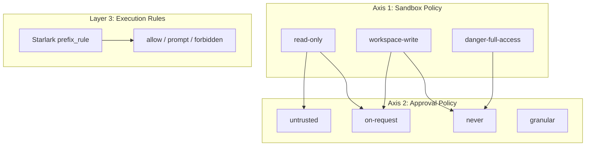

Let me first find the target document and then research Codex CLI permissions.Good, the document exists with frontmatter but no body content. Now let me research Codex CLI permissions thoroughly. Let me look at existing research and the Codex CLI source.Let me read the key existing research documents to ensure accuracy and completeness before writing the final document.Now let me also look at the existing permissions research for other agents to understand the format being used.Now I have comprehensive data. Let me fetch the latest Codex configuration reference to verify schema details.Now let me fetch one more source about developer issues and the GitHub issues page.Now I have all the data I need. Here is the complete research document body:

# Codex CLI Permissions Research

## Permission Entities

Unlike Claude Code where permissions are attached to individual **tools**, Codex CLI uses a **two-axis orthogonal model**. Permissions are not assigned per-tool; instead, they are governed by two independent dimensions that compose together:

1. **Sandbox Policy** — OS-level enforcement of what the agent's shell commands can technically access (filesystem, network)
2. **Approval Policy** — when the agent must pause for human confirmation before acting

A third layer, **Execution Rules**, adds static pattern-matching on shell commands to allow, prompt, or forbid specific command prefixes.



### Built-in Tools and Capabilities

Codex CLI does not expose a named, enumerable tool registry like Claude Code does. Instead, the agent has access to the following capabilities, each governed by the sandbox and approval policies:

| Capability | Description | Sandbox Governs | Approval Governs |
|-----------|-------------|-----------------|------------------|
| Shell execution (`local_shell`) | Run arbitrary shell commands in the host environment | Filesystem + network access | Whether to prompt before execution |
| File reading | Read files within the working directory | Read paths | Included in shell execution approval |
| File editing / patching | Apply diffs and patches to files | Write paths | Included in shell execution approval |
| Web search | First-party search tool (OpenAI-maintained index or live) | Network access | Disabled in read-only mode |
| MCP tool calls | Invoke tools from configured MCP servers | **Not governed** (operates outside sandbox) | Configurable via `mcp_elicitations` in granular mode |
| Subagent spawning | Parallel task execution via subagents | Inherits parent sandbox | Subagents run non-interactively |
| Image input | Process screenshots and design specs | N/A (input only) | N/A |
| Code review | Analyze diffs without modifying files | Read-only | N/A |

### Permission Profiles (Named Entities)

Codex supports **named permission profiles** that define filesystem and network access at a granular level. These are the closest equivalent to Claude Code's per-tool permission rules:

```toml
[permissions.ci-runner]
filesystem = { ":project_roots" = "write", "/tmp" = "write", ":minimal" = "read" }

[permissions.ci-runner.network]
enabled = true
allowed_domains = ["registry.npmjs.org", "github.com"]
denied_domains = ["*.internal.corp"]
```

The `default_permissions` key assigns a named profile to sandboxed tool calls:

```toml
default_permissions = "ci-runner"
```

---

## Configuration Files

### File Locations and Precedence

Codex uses TOML configuration files at multiple scopes. Higher-priority sources override lower-priority ones:

| Priority | Scope | Location | Notes |
|----------|-------|----------|-------|
| 1 (highest) | CLI flags | `--sandbox`, `--ask-for-approval`, `-c key=value` | Temporary session overrides |
| 2 | Profile | `[profiles.<name>]` in config (activated via `--profile`) | Named configuration sets |
| 3 | Project | `.codex/config.toml` | **Only loaded for trusted projects** |
| 4 | User | `~/.codex/config.toml` | Personal defaults for all projects |
| 5 | System | `/etc/codex/config.toml` (Unix only) | Machine-wide defaults |
| 6 (lowest) | Built-in | Framework defaults | Hardcoded fallbacks |

### Additional Configuration Locations

| Path | Purpose |
|------|---------|
| `~/.codex/rules/default.rules` | User-scoped execution rules (Starlark) |
| `.codex/rules/` | Project-scoped execution rules |
| `/etc/codex/requirements.toml` | Admin-enforced rules and MCP allowlists |
| `~/.codex/sessions/<YYYY>/<MM>/<DD>/` | Session history storage |
| `~/.codex/history.jsonl` | Conversation summary log |
| `~/.codex/log/codex-tui.log` | TUI debug log |
| `~/.codex/shell_snapshots/` | Shell environment snapshots |
| `~/.codex/hooks.json` | Lifecycle hooks (user-scoped) |
| `.codex/hooks.json` | Lifecycle hooks (project-scoped) |

### Project Trust

Project-scoped configuration (`.codex/config.toml`, `.codex/rules/`) is **only loaded when the project is explicitly trusted**. Untrusted projects fall back to user, system, and built-in defaults:

```toml
# ~/.codex/config.toml
[projects."/path/to/repo"]
trust_level = "trusted"
```

---

## Configuration File Schema

### Core Permission Keys

```toml
# Sandbox policy: what the agent can technically access
sandbox_mode = "read-only"  # "read-only" | "workspace-write" | "danger-full-access"

# Approval policy: when the agent must ask
approval_policy = "untrusted"  # "untrusted" | "on-request" | "never" | { granular = { ... } }

# Fine-tune workspace-write sandbox
[sandbox_workspace_write]
writable_roots = ["/tmp/build-output", "/Users/me/.pyenv/shims"]
network_access = false
exclude_slash_tmp = false
exclude_tmpdir_env_var = false
```

### Granular Approval Policy

When finer control is needed, the approval policy supports per-category configuration:

```toml
approval_policy = { granular = {
  sandbox_approval = true,       # Escalation prompts for sandbox restrictions
  rules = true,                  # Approvals from execution policy "prompt" rules
  mcp_elicitations = true,       # MCP protocol prompts
  request_permissions = false,   # Permission request tool prompts
  skill_approval = false         # Skill-script execution approvals
} }
```

### Named Permission Profiles

```toml
# Define a profile
[permissions.restricted]
filesystem = {
  ":project_roots" = "write",
  ":minimal" = "read",
  "/tmp" = "write"
}

[permissions.restricted.network]
enabled = true
allowed_domains = ["github.com", "registry.npmjs.org"]
denied_domains = ["*.internal.corp"]

# Apply the profile
default_permissions = "restricted"
```

Special filesystem tokens:
- `:minimal` — Essential system paths (read-only)
- `:project_roots` — Working directory and `--add-dir` paths

### Shell Environment Policy

Controls which environment variables are exposed to the agent's shell commands:

```toml
[shell_environment_policy]
inherit = "none"                   # "none" | "core" (trimmed set)
set = { PATH = "/usr/bin", MY_FLAG = "1" }
ignore_default_excludes = false    # Keep automatic KEY/SECRET/TOKEN filter
exclude = ["AWS_*", "AZURE_*"]    # Glob patterns (case-insensitive)
include_only = ["PATH", "HOME"]
allow_login_shell = false          # Disallow login shells
```

### Execution Rules (Starlark)

Rules are `.rules` files using [Starlark](https://github.com/bazelbuild/starlark) syntax:

```starlark
# ~/.codex/rules/default.rules

# Allow git read operations without prompting
prefix_rule(
    pattern = ["git", ["log", "diff", "status", "branch", "show"]],
    decision = "allow",
    justification = "Read-only git operations are safe",
)

# Block recursive deletion
prefix_rule(
    pattern = ["rm", ["-rf", "-fr", "-r"]],
    decision = "forbidden",
    justification = "Recursive deletion is too dangerous",
)

# Require approval for force push
prefix_rule(
    pattern = ["git", "push", "--force"],
    decision = "prompt",
    justification = "Force pushing can destroy remote history",
)
```

**Rule structure:**

| Field | Required | Type | Description |
|-------|----------|------|-------------|
| `pattern` | Yes | list | Command prefix to match. Elements are strings or unions (lists of alternatives) |
| `decision` | No | string | `"allow"` (default), `"prompt"`, or `"forbidden"` |
| `justification` | No | string | Human-readable reason |
| `match` | No | list | Example commands that should match (for validation) |
| `not_match` | No | list | Example commands that should not match |

**Precedence:** When multiple rules match, the most restrictive decision wins (`forbidden` > `prompt` > `allow`).

**Shell parsing:** Codex uses tree-sitter to parse shell commands. Linear chains with `&&`, `||`, `;`, `|` are split and evaluated separately. Scripts with redirection, variable substitution, or control flow are treated as a single opaque invocation.

### Admin-Enforced Configuration (`requirements.toml`)

Administrators can enforce rules and MCP server allowlists via `/etc/codex/requirements.toml`:

```toml
# Enforce restrictive prefix rules
[[rules]]
pattern = ["rm", ["-rf", "-fr"]]
decision = "forbidden"
justification = "Admin: recursive deletion blocked"

# MCP server identity allowlist
[mcp_servers.approved-server]
identity.command = "npx -y @approved/mcp-server"
identity.url = "https://approved.example.com/mcp"
```

Admin rules can only `prompt` or `forbidden` — never `allow`.

### Notify Hook

The only user-facing hook for event-driven behavior:

```toml
notify = ["python3", "/path/to/my-hook.py"]
```

Fires after `agent-turn-complete`. Fire-and-forget only — see [Problems and Workarounds](#problems-and-workarounds) for limitations.

### MCP Server Configuration

```toml
# STDIO server (local process)
[mcp_servers.my-local-server]
command = "npx"
args = ["-y", "@my/mcp-server"]
env = { API_KEY = "xxx" }
env_vars = ["HOME", "PATH"]
cwd = "/path/to/working/dir"
startup_timeout_sec = 10
tool_timeout_sec = 60
enabled = true
required = false
enabled_tools = ["read_file", "search"]
disabled_tools = ["delete_file"]

# Streamable HTTP server (remote)
[mcp_servers.my-remote-server]
url = "https://mcp.example.com/sse"
bearer_token_env_var = "MCP_TOKEN"
http_headers = { "X-Custom" = "value" }
env_http_headers = { "Authorization" = "MCP_AUTH_HEADER" }
```

### Profile System

Named profiles group permission and model settings for quick switching:

```toml
[profiles.safe]
approval_policy = "untrusted"
sandbox_mode = "read-only"

[profiles.full-auto]
approval_policy = "on-request"
sandbox_mode = "workspace-write"

[profiles.deep-review]
model = "gpt-5-pro"
approval_policy = "never"
model_reasoning_effort = "xhigh"
```

---

## CLI Switches That Override Permissions

### `--sandbox` / `-s`

Sets the sandbox policy for the session. Overrides `sandbox_mode` from config files.

**Values:** `read-only` | `workspace-write` | `danger-full-access`

```bash
codex -s read-only "analyze this codebase"
codex -s workspace-write "refactor the auth module"
codex -s danger-full-access "set up the development environment"
```

### `--ask-for-approval` / `-a`

Sets the approval policy for the session. Overrides `approval_policy` from config files.

**Values:** `untrusted` | `on-failure` | `on-request` | `never`

| Value | Behavior |
|-------|----------|
| `untrusted` | Only trusted commands (ls, cat, etc.) run automatically; others prompt |
| `on-failure` | All commands run automatically; prompts only on execution failure |
| `on-request` | The model decides when to ask |
| `never` | Never prompts; failures go directly back to the model |

```bash
codex -a untrusted "investigate the bug"
codex -a on-request "fix all lint errors"
codex -a never "run the full test suite and fix failures"
```

### `--full-auto`

Convenience alias that sets both axes at once: `-a on-request --sandbox workspace-write`. This is the most common "just get it done" mode.

```bash
codex --full-auto "add unit tests for the auth module"
```

### `--dangerously-bypass-approvals-and-sandbox` (alias: `--yolo`)

Skips all confirmation prompts and disables sandboxing entirely. Intended only for externally sandboxed environments (Docker containers, CI runners with isolated filesystems).

```bash
codex --yolo "deploy to staging"
# equivalent:
codex --dangerously-bypass-approvals-and-sandbox "deploy to staging"
```

### `--config` / `-c`

Override any config.toml value from the command line. Uses TOML syntax with dotted paths for nesting.

```bash
# Override approval policy
codex -c approval_policy='"never"' "run tests"

# Override sandbox with network access
codex -c sandbox_mode='"workspace-write"' \
      -c sandbox_workspace_write.network_access=true \
      "install dependencies and build"

# Set reasoning effort
codex -c model_reasoning_effort='"xhigh"' "solve this complex bug"
```

### `--profile` / `-p`

Activates a named configuration profile. The profile's settings override user/system config but are below CLI flags.

```bash
codex --profile safe "review the code"
codex -p full-auto "fix all failing tests"
```

### `--cd` / `-C`

Sets the working directory for the agent. This affects what the sandbox considers the "workspace" for write access.

```bash
codex -C /path/to/project "build and test"
```

### `--add-dir`

Grants additional directories write access under `workspace-write` sandbox mode. Useful when the agent needs to modify files outside the primary working directory.

```bash
codex --full-auto --add-dir ../shared-lib --add-dir ../config "update shared types"
```

### `--no-project-doc`

Skips loading `AGENTS.md` project instruction files. This prevents project-level instructions from influencing the agent's behavior, which can be a security consideration for untrusted projects.

```bash
codex --no-project-doc "analyze this untrusted codebase"
```

---

## Problems and Workarounds

### 1. MCP Tools Bypass the Sandbox Entirely

**Problem:** MCP tool calls operate outside the Codex execution sandbox. A malicious or misconfigured MCP server can read/write arbitrary files and make network requests regardless of `sandbox_mode` settings. This has been [confirmed by maintainers](https://github.com/openai/codex/issues/2109).

**Workaround:** Use `enabled_tools` / `disabled_tools` per MCP server to limit the tool surface. Use enterprise `requirements.toml` to restrict which MCP servers can be configured. In `codex exec --json` mode, parse the JSONL stream externally and kill the process if dangerous MCP output is detected.

### 2. Landlock Panics on Non-Standard Linux Kernels

**Problem:** The Linux sandbox uses Landlock + seccomp, which can panic or fail on kernels that don't support these features (older kernels, custom builds, some WSL configurations). This results in cryptic errors like `LandlockSandboxExecutableNotProvided`.

**Workaround:** Upgrade to v0.5.1+ where this was fixed ([Issue #93](https://github.com/openai/codex/issues/93), [PR #91](https://github.com/openai/codex/pull/91)). For environments where Landlock is unavailable, fall back to `danger-full-access` with approval policy `untrusted` to compensate with human review.

### 3. Execution Rules Only Apply to Shell Commands

**Problem:** Starlark `prefix_rule` entries only match shell commands executed via `local_shell`. They do **not** apply to MCP tool calls, file patches, or other non-shell actions. This creates a false sense of security if you rely solely on rules for protection.

**Workaround:** Combine execution rules with sandbox policy and approval policy. Use MCP `enabled_tools`/`disabled_tools` for MCP-level filtering. Consider using `codex exec --json` with an external monitor for comprehensive coverage.

### 4. Rules Do Not Fire Inside Subagents

**Problem:** Execution rules and approval prompts do not fire inside subagents. Subagents run with non-interactive approvals, meaning actions that would normally require approval simply fail silently rather than triggering a prompt.

**Workaround:** Use a restrictive sandbox policy (the sandbox **does** apply to subagents). Limit subagent capabilities by using approval policy `on-request` on the parent agent.

### 5. Agent Can Self-Modify Its Own Configuration

**Problem:** The Codex agent can modify `.codex/config.toml` to expand its own permissions. Since file edits are governed by the sandbox (not by a per-tool permission system), an agent in `workspace-write` mode can write to configuration files within the workspace.

**Workaround:** Protected paths (`.git/`, `.codex/`) are read-only in `workspace-write` mode. However, verify this protection applies to your version. Use `requirements.toml` for admin-enforced rules that cannot be overridden by project-level config.

### 6. No Blocking Pre-Tool Hooks

**Problem:** Codex does not expose a pre-tool hook to user configuration. The only user-facing hook (`notify`) is fire-and-forget and fires only after agent turns complete. Multiple community PRs proposing lifecycle hooks have been [declined](https://github.com/openai/codex/pull/11067) by maintainers, though [Issue #2109](https://github.com/openai/codex/issues/2109) (417+ upvotes) remains open.

**Workaround:** Use execution rules for static command filtering. For dynamic evaluation, use `codex exec --json` with an external process that monitors the JSONL stream and kills the Codex process when dangerous patterns are detected.

### 7. Config Profile Settings Can Be Silently Ignored

**Problem:** Developers have reported that certain profile settings don't take effect as expected, particularly when combining profiles with CLI overrides. The precedence rules between profiles, project config, and CLI flags can be non-obvious.

**Workaround:** Use `-c key=value` for critical permission overrides rather than relying on profiles. Test your configuration with `codex execpolicy check` for execution rules.

### 8. Windows Approval Bypass Fails Silently

**Problem:** On Windows, the `--dangerously-bypass-approvals-and-sandbox` flag may not fully disable all sandbox restrictions due to platform-specific token restrictions.

**Workaround:** Test permission behavior explicitly on Windows. Consider using WSL for a more predictable Linux-style sandbox experience.

### 9. VS Code Extension Ignores CLI Config

**Problem:** The VS Code extension for Codex may not respect all settings from `~/.codex/config.toml`, particularly permission-related settings. The extension has its own configuration mechanism that can diverge from CLI behavior.

**Workaround:** Configure permissions in both the VS Code extension settings and `config.toml`. For critical security settings, verify behavior in both environments.

---

## Other Considerations

### Sandbox Implementation by Platform

Codex provides OS-enforced sandboxing using platform-native mechanisms:

| Platform | Technology | Command |
|----------|-----------|---------|
| macOS | Seatbelt (sandbox-exec) | `codex sandbox macos` |
| Linux | Landlock + seccomp | `codex sandbox linux` |
| Windows | Restricted token | `codex sandbox windows` |

The sandbox operates at the process level — it constrains **all** processes spawned by the agent, not just specific tools. This is a stronger guarantee than tool-level permissions but has no effect on MCP server processes.

### No Elevated Privilege Detection

Codex does **not** detect or warn when running as root or with other elevated privileges. There is no built-in mechanism to downgrade privileges or refuse to operate in a dangerous context.

**Mitigation:** Run Codex under a dedicated low-privilege user account. Use `sandbox_mode = "read-only"` as the default and only escalate when needed.

### The `notify` Hook Is Not a Security Mechanism

The `notify` hook:
- Is fire-and-forget (stdout/stderr/stdin connected to `/dev/null`)
- Does not read exit codes or output
- Cannot block, modify, or steer the agent
- Only fires on `agent-turn-complete` (not on tool calls)
- Uses kebab-case JSON payload (`thread-id`, `turn-id`, `input-messages`)

It is useful for logging and external notifications but should **not** be relied upon for security.

### Execution Rule Testing

Codex provides a CLI command to test rules against commands without running them:

```bash
codex execpolicy check --pretty \
  --rules ~/.codex/rules/default.rules \
  -- rm -rf /important/directory
```

This shows the strictest matching decision and the rules that contributed to it. Multiple `--rules` flags can combine rule files.

### Shell Command Parsing Edge Cases

Codex uses tree-sitter to parse shell commands for rule matching. This has implications:

- Linear chains (`&&`, `||`, `;`, `|`) are split and each command is evaluated separately
- Scripts with redirections, substitutions, variable expansion, wildcards, or control flow are treated as a single opaque invocation (`["bash", "-lc", "<full script>"]`)
- This means complex shell scripts bypass per-command rule matching

### Non-Interactive Mode Limitations

In `codex exec` mode:
- `--ask-for-approval` / `-a` is **not available** (approval policy is effectively `never`)
- The `--search` flag (web search) is only available in interactive TUI mode
- The JSONL event stream (`--json`) is read-only with no control channel back to Codex

### Smart Approvals (Experimental)

When enabled via feature flags, Codex may propose a `prefix_rule` during escalation requests. This auto-generates rules based on the agent's actions, which can be convenient but should be reviewed carefully before acceptance — the generated rules may be broader than intended.

```toml
[features]
smart_approvals = true
```

### Comparison: Codex vs Claude Code Permission Models

| Aspect | Codex CLI | Claude Code |
|--------|-----------|-------------|
| Permission target | Two axes (sandbox + approval) | Per-tool rules |
| Configuration format | TOML | JSON |
| Hook system | Fire-and-forget `notify` only | 22 lifecycle events, 4 handler types |
| Blocking hooks | None | Yes (PreToolUse, Stop, etc.) |
| Execution rules | Starlark prefix matching | Regex-based tool+specifier rules |
| Sandbox | OS-level (Seatbelt/Landlock/restricted token) | OS-level (macOS sandbox, Linux namespaces) |
| MCP tool governance | Outside sandbox; `enabled_tools`/`disabled_tools` only | Through standard hook system |
| Subagent hook coverage | Hooks do not fire in subagents | Hooks fire in subagents |
| Enterprise controls | `requirements.toml` | Managed settings (server, MDM, file) |

---

## Sources

- [Codex CLI GitHub Repository](https://github.com/openai/codex)
- [Codex CLI Features](https://developers.openai.com/codex/cli/features/)
- [Codex CLI Command Line Options Reference](https://developers.openai.com/codex/cli/reference/)
- [Codex Config Basics](https://developers.openai.com/codex/config-basic/)
- [Codex Advanced Configuration](https://developers.openai.com/codex/config-advanced/)
- [Codex Configuration Reference](https://developers.openai.com/codex/config-reference/)
- [Codex Execution Rules](https://developers.openai.com/codex/rules/)
- [Codex MCP Integration](https://developers.openai.com/codex/mcp/)
- [Codex Authentication](https://developers.openai.com/codex/auth/)
- [Hooks Feature Request (Issue #2109)](https://github.com/openai/codex/issues/2109)
- [Hooks PR Declined (PR #11067)](https://github.com/openai/codex/pull/11067)
- [Landlock Sandbox Fix (Issue #93)](https://github.com/openai/codex/issues/93)