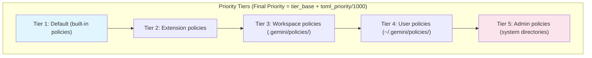
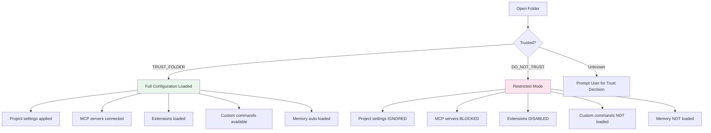

Let me start by reading the existing document and then researching the Gemini CLI codebase.Good research. Let me verify some key details directly from the Gemini CLI source.Let me check other completed permissions research files for format reference.Now I have both the research data and a reference for the expected format. Let me compose the Gemini CLI permissions research document.

Here is the replacement Markdown body content:

---

# Gemini CLI Permissions Research

## Permission Entities

In Gemini CLI, **permissions are attached to tools**. Every action the model can take is mediated through a tool, and the permission system controls which tools can execute, under what conditions, and with what constraints. Permissions are evaluated through a **policy engine** that uses TOML-based rule files with a tiered priority system.

### Built-in Tools

Gemini CLI provides the following built-in tools, each classified by a "Kind" that determines its default permission behavior:

| Tool                     | Kind        | Display Name         | Description                               |
|--------------------------|-------------|----------------------|-------------------------------------------|
| `read_file`              | Read        | ReadFile             | Read file contents from the filesystem    |
| `read_many_files`        | Read        | ReadManyFiles        | Read multiple files in a single call      |
| `write_file`             | Edit        | WriteFile            | Create or overwrite files                 |
| `edit`                   | Edit        | Edit                 | Perform targeted edits to existing files  |
| `grep`                   | Search      | Grep                 | Search file contents using regex patterns |
| `glob`                   | Search      | Glob                 | Find files by glob pattern                |
| `ls`                     | Search      | ReadFolder           | List directory contents                   |
| `web_search`             | Search      | GoogleSearch         | Search the web via Google                 |
| `web_fetch`              | Fetch       | WebFetch             | Fetch and process web content             |
| `shell`                  | Execute     | Shell                | Execute shell commands                    |
| `memory`                 | Think       | SaveMemory           | Save information to persistent memory     |
| `get_internal_docs`      | Think       | GetInternalDocs      | Access internal documentation             |
| `ask_user`               | Communicate | AskUser              | Ask the user a question                   |
| `enter_plan_mode`        | Plan        | EnterPlanMode        | Enter read-only planning mode             |
| `exit_plan_mode`         | Plan        | ExitPlanMode         | Exit planning mode                        |
| `write_todos`            | Other       | WriteTodos           | Write to-do items                         |
| `activate_skill`         | Other       | ActivateSkill        | Activate a Gemini skill                   |
| `update_topic`           | Other       | UpdateTopic          | Update the current conversation topic     |
| `tracker_create_task`    | Other       | TrackerCreateTask    | Create a task in the tracker              |
| `tracker_update_task`    | Other       | TrackerUpdateTask    | Update an existing task                   |
| `tracker_get_task`       | Other       | TrackerGetTask       | Get a specific task                       |
| `tracker_list_tasks`     | Other       | TrackerListTasks     | List all tasks                            |
| `tracker_add_dependency` | Other       | TrackerAddDependency | Add dependency between tasks              |
| `tracker_visualize`      | Other       | TrackerVisualize     | Visualize task graph                      |

### Tool Kind Categories

Tool "Kind" determines how each tool is handled by the approval mode system:

| Kind          | Default Behavior                 | Description                   |
|---------------|----------------------------------|-------------------------------|
| `Read`        | Auto-approved                    | File reading operations       |
| `Search`      | Auto-approved                    | File discovery and web search |
| `Think`       | Auto-approved                    | Internal reasoning and memory |
| `Communicate` | Auto-approved                    | User interaction              |
| `Plan`        | Auto-approved                    | Planning mode transitions     |
| `Edit`        | Requires approval (default mode) | File modification operations  |
| `Execute`     | Requires approval                | Shell command execution       |
| `Fetch`       | Requires approval                | Network fetch operations      |
| `Other`       | Varies by mode                   | Task tracking, todos, skills  |

### MCP Server Tools

MCP (Model Context Protocol) tools are also treated as permission entities. MCP servers are configured with optional tool-level filtering:

| Target                 | Configuration             | Description                                            |
|------------------------|---------------------------|--------------------------------------------------------|
| MCP server             | `mcpServers.<name>`       | Configure an entire MCP server                         |
| Include specific tools | `includeTools: ["tool1"]` | Allowlist of tools from a server                       |
| Exclude specific tools | `excludeTools: ["tool2"]` | Denylist of tools from a server                        |
| Policy rule targeting  | `mcpName = "server-name"` | Match tools from a specific MCP server in policy rules |

The `excludeTools` list always takes precedence over `includeTools`.

### Extensions

Gemini CLI supports extensions that provide additional tools. Extension-provided tools merge with core tools using a "most restrictive wins" security model — extension tool permissions cannot exceed the core tool's permission level.

---

## Configuration Files

### Settings File Hierarchy

Gemini CLI uses a layered configuration system where settings are merged with the following precedence (highest to lowest):

| Priority    | Scope                 | Location                          | Purpose                              |
|-------------|-----------------------|-----------------------------------|--------------------------------------|
| 1 (highest) | CLI arguments         | `--approval-mode`, `--yolo`, etc. | Temporary session overrides          |
| 2           | Environment variables | `GEMINI_YOLO_MODE`, `.env` files  | Environment-level settings           |
| 3           | System settings       | OS-specific paths (see below)     | Admin-enforced organization policies |
| 4           | Project settings      | `.gemini/settings.json`           | Workspace-specific configuration     |
| 5           | User settings         | `~/.gemini/settings.json`         | Personal global defaults             |
| 6           | System defaults       | OS-specific defaults path         | Base fallback values                 |
| 7 (lowest)  | Built-in defaults     | Hardcoded                         | Factory defaults                     |

### System-Level File Locations

| OS      | Settings Path                                          | Policies Path                                      |
|---------|--------------------------------------------------------|----------------------------------------------------|
| Linux   | `/etc/gemini-cli/settings.json`                        | `/etc/gemini-cli/policies/`                        |
| macOS   | `/Library/Application Support/GeminiCli/settings.json` | `/Library/Application Support/GeminiCli/policies/` |
| Windows | `C:\ProgramData\gemini-cli\settings.json`              | `C:\ProgramData\gemini-cli\policies\`              |

### All Configuration Files

| File                            | Format    | Purpose                                           |
|---------------------------------|-----------|---------------------------------------------------|
| `~/.gemini/settings.json`       | JSON      | User-level settings and preferences               |
| `.gemini/settings.json`         | JSON      | Project/workspace settings                        |
| `~/.gemini/GEMINI.md`           | Markdown  | Global persistent memory and context instructions |
| `.gemini/GEMINI.md`             | Markdown  | Project-specific context instructions             |
| `~/.gemini/trustedFolders.json` | JSON      | Folder trust decisions                            |
| `~/.gemini/policies/*.toml`     | TOML      | User-level permission policy rules                |
| `.gemini/policies/*.toml`       | TOML      | Workspace-level permission policy rules           |
| `~/.gemini/extensions/`         | Directory | User-installed extensions                         |
| `.gemini/extensions/`           | Directory | Project-specific extensions                       |
| `.gemini/commands/`             | Directory | Custom slash command definitions                  |
| `~/.gemini/storage/`            | Directory | Session data and history                          |
| `.gemini/storage/`              | Directory | Project session data                              |

---

## Configuration File Schema

### settings.json Structure

```json
{
  "general": {
    "defaultApprovalMode": "default | auto_edit | plan"
  },
  "security": {
    "folderTrust": {
      "enabled": true
    },
    "enablePermanentToolApproval": false,
    "privacySettings": {
      "usageStatisticsEnabled": true
    }
  },
  "tools": {
    "sandbox": {
      "enabled": true,
      "type": "docker | builtin"
    },
    "discoveryCommand": "command to discover custom tools"
  },
  "mcp": {
    "servers": {
      "server-name": {
        "command": "...",
        "url": "...",
        "includeTools": ["tool1", "tool2"],
        "excludeTools": ["dangerous_tool"],
        "timeout": 30000
      }
    },
    "allowed": ["server1", "server2"],
    "required": ["critical-server"]
  },
  "output": { },
  "ui": { },
  "model": { },
  "modelConfigs": { },
  "agents": { },
  "context": { },
  "skills": { },
  "hooks": { },
  "hooksConfig": { },
  "billing": {
    "overageStrategy": "ask | always | never"
  },
  "telemetry": { },
  "advanced": { },
  "experimental": { },
  "admin": {
    "strict": true,
    "mcp": {
      "enabled": true,
      "allowed": ["approved-server-1"],
      "required": ["critical-server"]
    },
    "extensions": {
      "enabled": false
    },
    "unmanagedCapabilities": {
      "enabled": false
    }
  }
}
```

The `settings.json` format supports variable substitution using `"$VAR_NAME"` or `"${VAR_NAME}"` syntax for referencing environment variables.

### Policy Engine (TOML) Schema

The policy engine uses TOML files to define fine-grained permission rules. Files are loaded from `~/.gemini/policies/*.toml` (user), `.gemini/policies/*.toml` (workspace), and system admin directories.

#### Policy Rule Structure

```toml
[[rule]]
# Target matching
toolName = "shell"                  # String or array of strings (required)
mcpName = "server-name"             # MCP server identifier (optional)
subagent = "agent-name"             # Target specific subagent (optional)
toolAnnotations = { key = true }    # Metadata matching (optional)

# Condition matching
argsPattern = "regex_pattern"       # Regex against JSON-serialized args (optional)
commandPrefix = "git"               # Shell command prefix match (optional)
commandRegex = "^git\\s+(status|log)" # Full regex for shell commands (optional)
interactive = true                  # Filter by interactive/non-interactive (optional)

# Decision
decision = "allow"                  # "allow", "deny", or "ask_user" (required)
priority = 100                      # 0-999 within tier (required)

# Optional fields
denyMessage = "Reason for denial"   # Explanation shown when denied
modes = ["default", "autoEdit"]     # Limit rule to specific approval modes
allowRedirection = true             # Permit shell redirection operators (>, >>, <)
```

#### Safety Checker Rules

```toml
[[safety_checker]]
toolName = "shell"                  # Optional: target specific tool
mcpName = "server-name"             # Optional: target MCP server
argsPattern = "regex"               # Optional: argument pattern
commandPrefix = "prefix"            # Optional: command prefix
commandRegex = "regex"              # Optional: command regex
priority = 100                      # Required: 0-999

# Built-in checker
[safety_checker.checker]
type = "in-process"
name = "ALLOWED_PATH"               # ALLOWED_PATH or CONSECA
config = { }

# OR external checker
[safety_checker.checker]
type = "external"
name = "custom_checker"
context = ["optional", "context"]
```

#### Priority Tier System



Higher tiers override lower tiers. Within a tier, the highest `priority` value wins. Admin policies (tier 5) are always authoritative.

#### Example Policy Rules

```toml
# Allow git commands without prompting
[[rule]]
toolName = "shell"
commandPrefix = "git"
decision = "allow"
priority = 100

# Block destructive rm commands
[[rule]]
toolName = "shell"
argsPattern = "^rm\\s+-.*rf"
decision = "deny"
priority = 999
denyMessage = "Recursive force deletion is not permitted"

# Auto-allow file reads
[[rule]]
toolName = ["read_file", "read_many_files"]
decision = "allow"
priority = 50

# Restrict MCP server tools
[[rule]]
mcpName = "untrusted-server"
decision = "deny"
priority = 500

# Allow specific MCP tool in default mode only
[[rule]]
mcpName = "my-jira-server"
toolName = "search"
decision = "allow"
priority = 200
modes = ["default"]
```

### trustedFolders.json Structure

```json
{
  "/path/to/project": "TRUST_FOLDER",
  "/path/to/sensitive": "DO_NOT_TRUST"
}
```

When a folder is marked `DO_NOT_TRUST`:

- Project settings (`.gemini/settings.json`) are ignored
- Automatic memory loading is disabled
- Extensions cannot be managed
- Tool auto-acceptance is disabled
- MCP servers do not connect
- Custom commands are not loaded

---

## CLI Switches for Permissions

### `--approval-mode <mode>`

Sets the approval mode for the session. Overrides `defaultApprovalMode` from settings files.

| Mode        | Behavior                                                              |
|-------------|-----------------------------------------------------------------------|
| `default`   | Prompts for approval on each tool call                                |
| `auto_edit` | Auto-approves file editing tools; prompts for shell and network tools |
| `yolo`      | Auto-approves all tool calls without prompting                        |
| `plan`      | Read-only research mode; no file modifications or shell execution     |

```sh
gemini --approval-mode=default
gemini --approval-mode=auto_edit
gemini --approval-mode=yolo
gemini --approval-mode=plan
```

### `--yolo` / `-y`

Shorthand for `--approval-mode=yolo`. Auto-approves all tool calls. Deprecated in favor of `--approval-mode=yolo`.

```sh
gemini --yolo
gemini -y
```

### `--allowed-tools <tools>`

Whitelist specific tools by name. Uses the format `ToolDisplayName(specifier)`.

```sh
gemini --allowed-tools "ShellTool(git status),ShellTool(npm test)"
```

### `--model <model>` / `-m <model>`

Specifies which Gemini model to use.

```sh
gemini --model gemini-3-pro-preview
gemini -m gemini-2.5-flash
```

### `--prompt <text>` / `-p <text>`

Provide a prompt directly, forcing non-interactive mode.

```sh
gemini -p "explain this codebase"
```

### `--sandbox` / `-s`

Run in a sandboxed environment for enhanced security.

```sh
gemini --sandbox
gemini -s
```

### `--debug` / `-d`

Enable debug mode with verbose logging, useful for diagnosing permission issues.

```sh
gemini --debug
```

### `--output-format <format>` / `-o <format>`

Set output format. Accepts `text`, `json`, or `stream-json`.

```sh
gemini --output-format json
```

### Interactive Session Shortcuts

| Shortcut             | Action                                 |
|----------------------|----------------------------------------|
| `Ctrl+Y`             | Toggle YOLO mode on/off during session |
| `Shift+Tab`          | Cycle through approval modes           |
| `/settings`          | Open settings dialog                   |
| `/permissions`       | Manage folder trust                    |
| `/permissions trust` | Trust current folder                   |
| `/tools`             | List available tools                   |

### Environment Variables

| Variable                | Purpose                                          |
|-------------------------|--------------------------------------------------|
| `GEMINI_API_KEY`        | API authentication key                           |
| `GEMINI_MODEL`          | Default model selection                          |
| `GEMINI_CLI_HOME`       | Override config directory (default: `~/.gemini`) |
| `GEMINI_YOLO_MODE=true` | Persistent YOLO mode across sessions             |
| `GEMINI_SANDBOX=true`   | Enable sandbox enforcement                       |

---

## Problems and Workarounds

### 1. "Always Approve" Does Not Persist Across Sessions

**Problem:** Selecting "always allow" for a tool approval during an interactive session does not persist to the next terminal session. Each new session starts fresh.

**Status:** Known issue ([\#4340](https://github.com/google-gemini/gemini-cli/issues/4340))

**Workaround:** Set `security.enablePermanentToolApproval` to `true` in `settings.json`, or use TOML policy files for persistent approval rules. Alternatively, pass `--yolo` or `--approval-mode=yolo` each session.

### 2. No Way to Revoke "Always Approve" Permissions

**Problem:** After granting "always allow" during a session, there is no documented UI or command to revoke that decision.

**Status:** Feature request ([\#7062](https://github.com/google-gemini/gemini-cli/issues/7062))

**Workaround:** Add an explicit `deny` rule in a policy TOML file with a higher priority than the cached approval. Alternatively, delete cached approval state manually from internal storage.

### 3. YOLO Mode Disabled After Exiting Plan Mode

**Problem:** When YOLO mode is active and the user enters then exits plan mode, YOLO mode is unintentionally deactivated.

**Status:** Known issue ([\#19592](https://github.com/google-gemini/gemini-cli/issues/19592))

**Workaround:** Re-enable YOLO mode with `Ctrl+Y` after exiting plan mode, or restart with `--yolo` flag.

### 4. Parent Folder Trust Overrides Child "Do Not Trust"

**Problem:** A parent directory marked as `TRUST_FOLDER` in `trustedFolders.json` overrides an explicit `DO_NOT_TRUST` on a child directory. This is a security concern for nested repositories.

**Status:** Security bug ([\#13125](https://github.com/google-gemini/gemini-cli/issues/13125))

**Workaround:** Manually edit `trustedFolders.json` to remove parent trust, or restructure projects so untrusted directories are not nested under trusted parents.

### 5. Workspace-Level Policies Not Loaded

**Problem:** `.gemini/policies/*.toml` files in the workspace directory are sometimes not loaded by the policy engine, causing rules to be silently ignored.

**Status:** Known issue ([\#21580](https://github.com/google-gemini/gemini-cli/issues/21580))

**Workaround:** Use user-level policies (`~/.gemini/policies/`) or system-level policies as a reliable alternative until the workspace loading is fixed.

### 6. Unclear auto_edit Mode Behavior

**Problem:** The distinction between `auto_edit` and `default` approval modes has undocumented edge cases, particularly around which tool Kinds are auto-approved vs prompted.

**Status:** Open discussion ([\#12194](https://github.com/google-gemini/gemini-cli/issues/12194))

**Workaround:** Use the policy engine with explicit TOML rules for precise control over which tools require approval. Test thoroughly in a non-production environment.

---

## Additional Considerations

### Folder Trust and Security

The folder trust system (`trustedFolders.json`) acts as a first gate for all project-level configuration. When a folder is **untrusted**, it creates a significantly restricted environment:



### Enterprise Admin Controls

System administrators can enforce immutable controls via system-level settings files:

- **Strict Mode:** Prevents users from enabling YOLO mode
- **MCP Allowlist:** Restricts which MCP servers can connect
- **Required Servers:** Auto-inject specific MCP servers into all sessions
- **Extension Control:** Globally enable or disable extension usage
- **Admin Policies:** Tier 5 priority rules that cannot be overridden by any lower tier

When admin settings are defined, they **replace** (not merge with) user settings. Tool lists from different tiers are **intersected**, enforcing the most restrictive combination.

### Hooks System (Permission-Adjacent)

The hooks system can intercept tool execution for custom validation, auditing, or dynamic permission decisions:

| Hook Event            | Timing                        | Can Block?      |
|-----------------------|-------------------------------|-----------------|
| `BeforeTool`          | Before tool execution         | Yes             |
| `AfterTool`           | After tool execution          | No (audit only) |
| `BeforeAgent`         | Before processing user input  | Yes             |
| `BeforeToolSelection` | Before tool set is determined | Yes             |

Hook communication uses JSON via stdin/stdout:

```json
{
  "decision": "allow",
  "reason": "git commands are pre-approved",
  "hookSpecificOutput": {
    "parameterOverrides": { }
  }
}
```

Hooks can rewrite tool arguments via `parameterOverrides`, providing a mechanism for input sanitization that the policy engine alone cannot offer.

### Policy Engine vs Approval Mode Interaction

The policy engine and approval modes work together but have distinct roles:

| Aspect        | Policy Engine (TOML)                  | Approval Mode                       |
|---------------|---------------------------------------|-------------------------------------|
| Granularity   | Per-tool, per-command, per-MCP server | Broad tool-Kind categories          |
| Persistence   | Files on disk                         | Session-level (CLI flag or setting) |
| Precedence    | Tiered (admin > user > workspace)     | Overridden by policy rules          |
| Customization | Regex patterns, command prefixes      | Fixed mode definitions              |
| Use case      | Fine-grained, permanent rules         | Quick session-level control         |

Policy rules take precedence over approval mode decisions. A TOML `deny` rule blocks a tool even in YOLO mode.

### Security Limitations

The Gemini CLI documentation explicitly states:

> "These measures are designed to prevent accidental misuse and enforce corporate policy in a managed environment, **not to defend against a malicious actor with local administrative rights.**"

This means:

- A user with shell access can modify configuration files directly
- Sandbox enforcement is the only OS-level protection
- Policy rules are enforced at the application level, not the OS level
- Admin controls depend on OS-level file permissions for integrity

### Sandboxing

Gemini CLI supports Docker, Podman, and LXC-based sandboxing. The sandbox provides OS-level enforcement that complements the application-level policy engine:

| Feature                       | Policy Engine         | Sandbox                    |
|-------------------------------|-----------------------|----------------------------|
| Tool-level access control     | Yes                   | No                         |
| Shell subprocess restrictions | Pattern matching only | OS-level enforcement       |
| File system isolation         | No                    | Yes (allowed paths config) |
| Network isolation             | No                    | Yes                        |
| Process isolation             | No                    | Yes                        |

---

## Sources

- [Gemini CLI GitHub Repository](https://github.com/google-gemini/gemini-cli)
- [Gemini CLI Policy Engine Documentation](https://geminicli.com/docs/reference/policy-engine/)
- [Gemini CLI Configuration Reference](https://geminicli.com/docs/reference/configuration/)
- [Gemini CLI Trusted Folders](https://geminicli.com/docs/cli/trusted-folders/)
- [Gemini CLI Enterprise Controls](https://geminicli.com/docs/cli/enterprise/)
- [Gemini CLI MCP Server Configuration](https://geminicli.com/docs/tools/mcp-server/)
- [Gemini CLI Tools Reference](https://geminicli.com/docs/reference/tools/)
- [Gemini CLI CLI Reference](https://geminicli.com/docs/reference/cli/)
