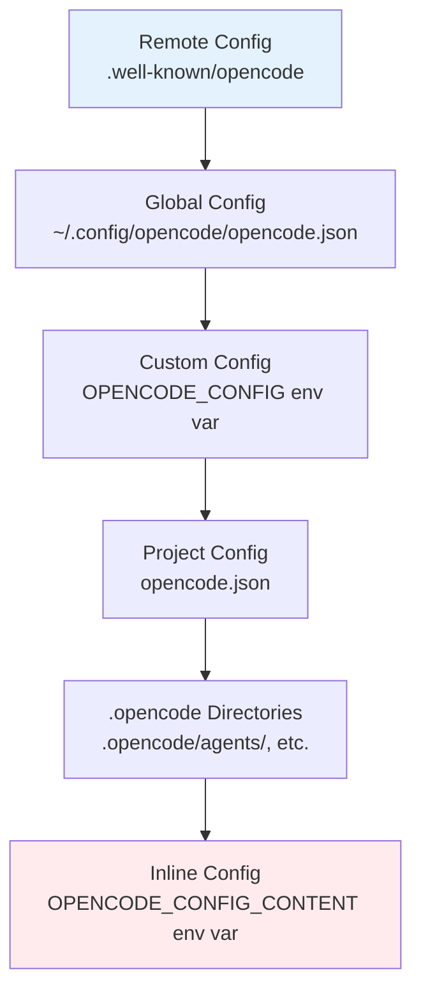
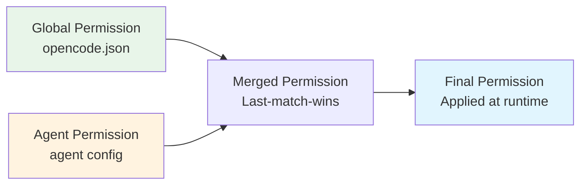

Let me start by reading the existing file and then researching OpenCode CLI's permission system.Now let me research OpenCode CLI's permission system thoroughly.Let me check what the agent produced and also do additional targeted research to fill any gaps.Let me re-read the file to see its current state.Good - the agent already wrote the complete research directly to the file. Let me verify the content is properly structured by checking key sections.The research is comprehensive and already written to the file. The user asked me to return the replacement markdown body content only, without frontmatter. Here it is:

---

# OpenCode CLI Permissions Research

> **Note:** The original `opencode-ai/opencode` repository has been archived. The project continues under `anomalyco/opencode` (previously `sst/opencode`). The documentation lives at [opencode.ai/docs](https://opencode.ai/docs/).

## Permission Entities

In OpenCode, **permissions are attached to tools**. Every action the LLM can take is mediated through a tool, and the permission system controls whether each tool invocation executes automatically, requires user confirmation, or is blocked entirely.

### Built-in Tools

OpenCode provides the following built-in tools:

| Tool          | Permission Key | Description                                                               |
|---------------|----------------|---------------------------------------------------------------------------|
| `bash`        | `bash`         | Execute shell commands in the project environment                         |
| `edit`        | `edit`         | Modify existing files via exact string replacement                        |
| `write`       | `edit`         | Create new files or overwrite existing ones                               |
| `apply_patch` | `edit`         | Apply patch files to the codebase                                         |
| `multiedit`   | `edit`         | Multi-file editing (batch string replacements)                            |
| `read`        | `read`         | Retrieve file contents with optional line-range support                   |
| `grep`        | `grep`         | Search files using regular expressions (ripgrep)                          |
| `glob`        | `glob`         | Find files matching glob patterns (sorted by modification time)           |
| `list`        | `list`         | Display directory contents with optional filtering                        |
| `lsp`         | `lsp`          | Access code intelligence (definitions, references, hover, call hierarchy) |
| `skill`       | `skill`        | Load and return SKILL.md file content                                     |
| `todowrite`   | `todowrite`    | Create/update task lists during sessions                                  |
| `webfetch`    | `webfetch`     | Retrieve and read web pages                                               |
| `websearch`   | `websearch`    | Query the web via Exa AI (requires `OPENCODE_ENABLE_EXA=1`)               |
| `codesearch`  | `codesearch`   | Web/code search (OpenCode Zen or Exa flag required)                       |
| `question`    | `question`     | Prompt the user for input, preferences, or decisions                      |
| `task`        | `task`         | Invoke subagents for delegated work                                       |

**Important:** The `edit` permission key controls **all file modification tools** (`edit`, `write`, `apply_patch`, `multiedit`). There is no separate permission key per modification tool.

### Safety Guard Permissions

In addition to tool permissions, OpenCode provides two safety guards that are also configurable as permission entities:

| Guard                     | Permission Key       | Default | Description                                                            |
|---------------------------|----------------------|---------|------------------------------------------------------------------------|
| External directory access | `external_directory` | `ask`   | Controls tool calls that touch paths outside the working directory     |
| Doom loop detection       | `doom_loop`          | `ask`   | Triggered when the same tool call repeats 3 times with identical input |

### MCP (Model Context Protocol) Tool Permissions

MCP server tools are registered as additional permission entities with names following the pattern `<servername>_<toolname>`. They can be controlled via:

- The `tools` configuration field (legacy, deprecated but still functional)
- The `permission` configuration field with glob patterns (e.g., `"my-mcp*": "deny"`)

### Permission Values

Each permission entity resolves to one of three states:

| Value     | Behavior                                                        |
|-----------|-----------------------------------------------------------------|
| `"allow"` | Action executes automatically without user confirmation         |
| `"ask"`   | User is prompted for confirmation before execution              |
| `"deny"`  | Action is blocked entirely; tool may be hidden from LLM context |

### Default Permission Values

When unconfigured, OpenCode applies **permissive defaults**:

- **Most tool permissions** default to `"allow"` (no confirmation needed)
- **`doom_loop`** defaults to `"ask"`
- **`external_directory`** defaults to `"ask"`
- **`read` for `.env` files**: `.env` and `.env.*` patterns are denied by default (except `.env.example`)

This permissive-by-default philosophy was an intentional design choice by the team, who stated: "most people initially think they want permissions and then actually prefer not having them."

---

## Configuration Files

### Configuration File Locations

OpenCode uses a layered configuration system with the following precedence (lowest to highest):

| Priority    | Source                  | Location                           | Purpose                               |
|-------------|-------------------------|------------------------------------|---------------------------------------|
| 1 (lowest)  | Remote config           | `.well-known/opencode` endpoint    | Organization-wide defaults            |
| 2           | Global config           | `~/.config/opencode/opencode.json` | User-wide preferences                 |
| 3           | Custom config           | Path in `OPENCODE_CONFIG` env var  | Custom overrides                      |
| 4           | Project config          | `opencode.json` in project root    | Project-specific settings             |
| 5           | `.opencode` directories | `.opencode/` in project root       | Project agents, modes, commands, etc. |
| 6 (highest) | Inline config           | `OPENCODE_CONFIG_CONTENT` env var  | Inline JSON overrides                 |



**Merging behavior:** Configuration files are deep-merged, not replaced. Later configs override earlier ones only for conflicting keys. Non-conflicting settings from all configs are preserved.

### Configuration File Formats

| File                                    | Format                         | Purpose                                                           |
|-----------------------------------------|--------------------------------|-------------------------------------------------------------------|
| `opencode.json` / `opencode.jsonc`      | JSON / JSONC                   | Main configuration (supports comments in JSONC)                   |
| `~/.config/opencode/opencode.json`      | JSON / JSONC                   | Global user configuration                                         |
| `~/.config/opencode/agents/*.md`        | Markdown with YAML frontmatter | Global agent definitions                                          |
| `.opencode/agents/*.md`                 | Markdown with YAML frontmatter | Project-scoped agent definitions                                  |
| `.opencode/modes/*.md`                  | Markdown with YAML frontmatter | Custom modes (Plan, Build, etc.)                                  |
| `.opencode/commands/*.md`               | Markdown                       | Custom slash commands                                             |
| `~/.local/share/opencode/auth.json`     | JSON                           | API key storage                                                   |
| `~/.local/share/opencode/mcp-auth.json` | JSON                           | OAuth token storage for MCP servers                               |
| `tui.json`                              | JSON                           | TUI-specific settings (keybinds, theme, scroll)                   |
| `AGENTS.md`                             | Markdown                       | Project rules/instructions (similar to Cursor Rules or CLAUDE.md) |

### Additional Configuration Sources

| Source                        | Purpose                                                                                        |
|-------------------------------|------------------------------------------------------------------------------------------------|
| `CLAUDE.md`                   | Fallback rules file (Claude Code compatibility; disable with `OPENCODE_DISABLE_CLAUDE_CODE=1`) |
| `.cursor/rules/*.md`          | Can be referenced via the `instructions` config field                                          |
| `OPENCODE_CONFIG_DIR` env var | Custom directory searched for agents, commands, modes, and plugins                             |

---

## Configuration File Schema

### Complete `opencode.json` Schema

```json
{
  "$schema": "https://opencode.ai/config.json",

  "logLevel": "DEBUG | INFO | WARN | ERROR",

  "model": "anthropic/claude-sonnet-4-5",
  "small_model": "anthropic/claude-haiku-4-5",

  "default_agent": "build",
  "username": "display-name",

  "autoupdate": true,
  "snapshot": true,
  "share": "manual | auto | disabled",

  "yolo": false,

  "disabled_providers": ["openai", "gemini"],
  "enabled_providers": ["anthropic", "openai"],

  "server": {
    "port": 4096,
    "hostname": "0.0.0.0",
    "mdns": true,
    "mdnsDomain": "myproject.local",
    "cors": ["http://localhost:5173"]
  },

  "provider": {
    "anthropic": {
      "options": {
        "timeout": 600000,
        "chunkTimeout": 30000,
        "setCacheKey": true,
        "apiKey": "{env:ANTHROPIC_API_KEY}"
      }
    },
    "amazon-bedrock": {
      "options": {
        "region": "us-east-1",
        "profile": "my-aws-profile",
        "endpoint": "https://bedrock-runtime.us-east-1.vpce-xxxxx.amazonaws.com"
      }
    }
  },

  "permission": {
    "*": "ask",
    "read": "allow",
    "edit": "ask",
    "bash": {
      "*": "ask",
      "git *": "allow",
      "npm *": "allow",
      "rm *": "deny"
    },
    "external_directory": {
      "~/projects/personal/**": "allow"
    },
    "doom_loop": "ask",
    "task": {
      "*": "deny",
      "code-reviewer": "ask"
    }
  },

  "tools": {
    "write": false,
    "bash": false,
    "my-mcp*": false
  },

  "agent": {
    "build": {
      "description": "Default development agent",
      "model": "anthropic/claude-sonnet-4-5",
      "temperature": 0.3,
      "top_p": 0.9,
      "prompt": "{file:./prompts/build.txt}",
      "mode": "primary",
      "steps": 50,
      "color": "#FF5733",
      "disable": false,
      "hidden": false,
      "permission": {
        "edit": "allow",
        "bash": {
          "*": "ask",
          "git commit *": "ask"
        }
      },
      "tools": {
        "my-mcp*": true
      }
    },
    "plan": {
      "description": "Analysis without modifications",
      "mode": "primary",
      "permission": {
        "edit": "deny",
        "bash": "deny"
      }
    },
    "code-reviewer": {
      "description": "Reviews code for best practices",
      "model": "anthropic/claude-sonnet-4-5",
      "mode": "subagent",
      "permission": {
        "edit": "deny",
        "bash": "deny"
      }
    }
  },

  "command": {
    "test": {
      "template": "Run the full test suite and report failures",
      "description": "Run tests with coverage",
      "agent": "build",
      "model": "anthropic/claude-haiku-4-5",
      "subtask": false
    }
  },

  "mcp": {
    "sentry": {
      "type": "remote",
      "url": "https://mcp.sentry.dev/mcp",
      "oauth": {},
      "enabled": true,
      "timeout": 5000
    },
    "local-tools": {
      "type": "local",
      "command": ["npx", "-y", "my-mcp-command"],
      "environment": {
        "MY_VAR": "value"
      },
      "enabled": true,
      "timeout": 5000
    }
  },

  "lsp": {
    "typescript": {
      "disabled": false,
      "command": ["typescript-language-server", "--stdio"],
      "extensions": [".ts", ".tsx"],
      "env": {},
      "initialization": {}
    }
  },

  "formatter": {
    "prettier": {
      "disabled": true
    },
    "custom-prettier": {
      "command": ["npx", "prettier", "--write", "$FILE"],
      "environment": { "NODE_ENV": "development" },
      "extensions": [".js", ".ts", ".jsx", ".tsx"]
    }
  },

  "watcher": {
    "ignore": ["node_modules/**", "dist/**", ".git/**"]
  },

  "compaction": {
    "auto": true,
    "prune": true,
    "reserved": 10000
  },

  "instructions": ["CONTRIBUTING.md", "docs/guidelines.md", ".cursor/rules/*.md"],

  "skills": {},

  "plugin": ["opencode-helicone-session", "@my-org/custom-plugin"]
}
```

### Variable Substitution

OpenCode supports two variable substitution patterns in configuration values:

| Pattern          | Description          | Example                                  |
|------------------|----------------------|------------------------------------------|
| `{env:VAR_NAME}` | Environment variable | `"apiKey": "{env:ANTHROPIC_API_KEY}"`    |
| `{file:path}`    | File content         | `"prompt": "{file:./prompts/build.txt}"` |

If an environment variable is not set, it resolves to an empty string.

### Agent Markdown Frontmatter Schema

Agents defined as markdown files (`.opencode/agents/*.md` or `~/.config/opencode/agents/*.md`) use YAML frontmatter. The filename becomes the agent identifier.

```markdown
---
description: Code reviewer that never modifies files
mode: subagent
model: anthropic/claude-sonnet-4-20250514
temperature: 0.1
steps: 5
hidden: false
color: accent
permission:
  edit: deny
  bash:
    "*": deny
    "git log *": allow
  webfetch: deny
---

You are a code reviewer. Analyze code for quality, security, and performance.
Never modify files directly. Only provide review comments.
```

| Field         | Type    | Description                                                |
|---------------|---------|------------------------------------------------------------|
| `description` | string  | Brief agent purpose (required)                             |
| `mode`        | enum    | `primary`, `subagent`, or `all`                            |
| `model`       | string  | Override global model (`provider/model-id`)                |
| `temperature` | number  | Response randomness (0.0-1.0)                              |
| `top_p`       | number  | Nucleus sampling (0.0-1.0)                                 |
| `steps`       | integer | Maximum agentic iterations                                 |
| `color`       | string  | Hex (`#RRGGBB`) or theme color (`primary`, `accent`, etc.) |
| `disable`     | boolean | Disable this agent                                         |
| `hidden`      | boolean | Hide from `@` autocomplete (subagents only)                |
| `permission`  | object  | Granular tool permissions (overrides global)               |
| `tools`       | object  | Legacy tool enable/disable (deprecated; use `permission`)  |

### Permission Merge Hierarchy

Agent-level permissions merge with global permissions, with agent rules taking precedence:



### Permission Rule Evaluation

Rules use **last-match-wins** evaluation. Best practice is to place catch-all `"*"` patterns first, with specific rules following to override:

```json
{
  "permission": {
    "bash": {
      "*": "ask",
      "git *": "allow",
      "npm test": "allow",
      "rm -rf *": "deny",
      "sudo *": "deny",
      "chmod 777 *": "deny"
    }
  }
}
```

### Wildcard Matching Rules

| Pattern | Meaning                         |
|---------|---------------------------------|
| `*`     | Matches zero or more characters |
| `?`     | Matches exactly one character   |
| `~`     | Expands to user home directory  |
| `$HOME` | Variable replacement            |

### Built-in Agents

| Agent      | Mode             | Default Permissions                       | Description                                     |
|------------|------------------|-------------------------------------------|-------------------------------------------------|
| Build      | Primary          | All tools allowed                         | Default development agent with full tool access |
| Plan       | Primary          | `write`, `edit`, `patch`, `bash` disabled | Read-only analysis and planning                 |
| General    | Subagent         | Full access                               | Multi-step task executor                        |
| Explore    | Subagent         | Read-only                                 | Codebase exploration                            |
| Compaction | Primary (hidden) | N/A                                       | Automatic context compaction                    |
| Title      | Primary (hidden) | N/A                                       | Session title generation                        |
| Summary    | Primary (hidden) | N/A                                       | Session summary creation                        |

---

## CLI Switches That Override Permissions

### `--yolo`

Enables YOLO mode, which auto-approves all `"ask"` permission prompts while still respecting explicit `"deny"` rules. This is the primary CLI-level permission override.

```sh
opencode --yolo
opencode --yolo "fix all failing tests"
```

**Equivalent environment variable:** `OPENCODE_YOLO=true`

**Equivalent config:** `"yolo": true` in `opencode.json`

**Runtime API:** `GET /config/yolo` (check status) and `POST /config/yolo` (toggle)

### `opencode run` (Non-Interactive Mode)

When using `opencode run`, all permissions are auto-approved for the session. This makes it suitable for headless/scripted workflows:

```sh
opencode run "refactor the auth module"
opencode run --model anthropic/claude-sonnet-4-5 "add error handling to api.ts"
```

**Important:** There is no separate `--dangerously-skip-permissions` flag documented in the current CLI reference. The `--yolo` flag and `opencode run` are the primary mechanisms.

### `--model` / `-m`

Overrides the model for the session. While not directly a permission switch, different models may have different capabilities and trust profiles:

```sh
opencode --model anthropic/claude-sonnet-4-5
opencode -m openai/gpt-4o
```

### `--agent`

Selects a specific agent, which may have different permission profiles:

```sh
opencode --agent plan          # Read-only mode
opencode --agent build         # Full access (default)
opencode --agent code-reviewer # Custom restricted agent
```

### `--print-logs` / `--log-level`

Enables logging for debugging permission issues:

```sh
opencode --print-logs --log-level DEBUG
```

### Environment Variables Affecting Permissions

| Variable                                       | Purpose                                               |
|------------------------------------------------|-------------------------------------------------------|
| `OPENCODE_YOLO=true`                           | Enable YOLO mode (auto-approve all `ask` prompts)     |
| `OPENCODE_PERMISSION='{"*":"ask"}'`            | Inline JSON permission overrides                      |
| `OPENCODE_CONFIG=/path/to/config.json`         | Custom config file path                               |
| `OPENCODE_CONFIG_CONTENT='{"permission":...}'` | Inline complete config JSON                           |
| `OPENCODE_CONFIG_DIR=/path/to/dir`             | Custom directory for agents, commands, modes          |
| `OPENCODE_EXPERIMENTAL_LSP_TOOL=true`          | Enable the experimental LSP tool                      |
| `OPENCODE_EXPERIMENTAL=true`                   | Enable all experimental features (including LSP tool) |
| `OPENCODE_ENABLE_EXA=1`                        | Enable `websearch` and `codesearch` tools             |
| `OPENCODE_DISABLE_CLAUDE_CODE=1`               | Disable `CLAUDE.md` fallback loading                  |
| `OPENCODE_DISABLE_LSP_DOWNLOAD=true`           | Disable automatic LSP server downloads                |
| `OPENCODE_SERVER_PASSWORD`                     | Enable basic auth for the server                      |
| `OPENCODE_SERVER_USERNAME`                     | Override auth username                                |

---

## "Ask" Prompt Behavior

When a permission is set to `"ask"`, the user receives a confirmation prompt with three response options:

| Response   | Behavior                                                                                   |
|------------|--------------------------------------------------------------------------------------------|
| **once**   | Approve this single request                                                                |
| **always** | Approve future requests matching the suggested pattern for the rest of the current session |
| **reject** | Deny this specific request                                                                 |

Tools suggest safe pattern prefixes when offering the "always" option. For example, a `bash` approval for `git status` might suggest whitelisting `git status*`, allowing future `git status` commands without further prompts.

---

## Developer Problems and Workarounds

### 1. Permissive Defaults Surprise New Users

**Problem:** OpenCode allows all operations by default without requiring explicit approval. New users are surprised when the LLM makes git commits, edits files, or runs arbitrary commands without asking ([Issue #2632](https://github.com/sst/opencode/issues/2632)).

**Impact:** One user reported: "I was working on an important project and noticed the model running away doing all sorts of things... The model made various GitHub commits without asking me first."

**Workaround:** Add a global config at `~/.config/opencode/opencode.json`:

```json
{
  "$schema": "https://opencode.ai/config.json",
  "permission": {
    "*": "ask",
    "read": "allow",
    "grep": "allow",
    "glob": "allow",
    "list": "allow"
  }
}
```

### 2. Boolean vs String Permission Values

**Problem:** Setting permissions as boolean `true`/`false` instead of `"allow"`/`"deny"` causes OpenCode to crash without any meaningful error message ([Issue #7810](https://github.com/anomalyco/opencode/issues/7810)). The only indication is a `ConfigInvalidError` in the logs.

**Workaround:** Always use string values (`"allow"`, `"ask"`, `"deny"`). A PR (#7856) was submitted to accept booleans, but the poor error messaging remains an issue.

### 3. `permission` vs `permissions` (Singular/Plural Confusion)

**Problem:** The correct field name is `permission` (singular). Using `permissions` (plural) silently fails -- the configuration is ignored with no error ([Issue #6892](https://github.com/anomalyco/opencode/issues/6892)).

**Workaround:** Always use `permission` (singular) in both JSON configs and markdown frontmatter.

### 4. MCP Tool Permissions Not Working After Migration

**Problem:** After the migration from `tools` to `permission`, MCP tool permissions could no longer be controlled using the new `permission` field. The legacy `tools` field continued to work ([Issue #6892](https://github.com/anomalyco/opencode/issues/6892)).

**Workaround:** Use the legacy `tools` field for MCP tool control:

```json
{
  "tools": {
    "my-mcp*": false
  },
  "agent": {
    "my-agent": {
      "tools": {
        "my-mcp*": true
      }
    }
  }
}
```

### 5. Global Permissions Ignored When No Agent Config Present

**Problem:** A code change introducing agent-level permissions broke global permissions. When only global permissions were configured (no agent-specific overrides), they were silently ignored ([Issue #1876](https://github.com/anomalyco/opencode/issues/1876)).

**Workaround:** Define permissions at both global and agent levels:

```json
{
  "permission": { "edit": "ask" },
  "agent": {
    "build": {
      "permission": { "edit": "ask" }
    }
  }
}
```

**Fix:** PR #1879 corrected the merge logic to properly fall back to global permissions.

### 6. Permissions Defaulting to "Ask" Unexpectedly

**Problem:** Users on certain versions found all permissions defaulting to `"ask"` even without any configuration, contrary to the documented permissive defaults ([Issue #1487](https://github.com/sst/opencode/issues/1487)).

**Root cause:** Sometimes caused by accidentally being in **Plan mode** instead of Build mode. Plan mode restricts edits and bash by default.

**Workaround:** Press `Tab` to switch from Plan mode to Build mode.

### 7. Permissions Ignored When MCP Servers Are Configured

**Problem:** When MCP services are enabled, permission checks for other tools (like `read` denying `appsettings.json`) are bypassed. Removing MCP configuration restores proper permission enforcement ([Issue #16331](https://github.com/anomalyco/opencode/issues/16331)).

**Status:** Bug confirmed, assigned to maintainer.

### 8. `read` Tool Bypasses `.gitignore` Patterns

**Problem:** While `glob`, `grep`, and `list` respect `.gitignore` patterns (via ripgrep), the `read` tool ignores them. This means `.env` files and other sensitive files listed in `.gitignore` can still be read via absolute path ([Issue #12196](https://github.com/anomalyco/opencode/issues/12196)).

**Workaround:** Explicitly deny sensitive file patterns in the `read` permission:

```json
{
  "permission": {
    "read": {
      "*": "allow",
      "*.env": "deny",
      "*.env.*": "deny",
      "*.env.example": "allow",
      "*.key": "deny",
      "*.pem": "deny"
    }
  }
}
```

### 9. Overly Broad `.env` Blocking

**Problem:** The original `.env` file blocking used `filepath.includes(".env")`, which blocked any file with "env" in the path, including legitimate files like `src/environment.ts`, `config/env/settings.ts`, and `.envrc` (direnv config) ([Issue #4969](https://github.com/anomalyco/opencode/issues/4969)).

**Workaround:** The blocking was refined to check only the basename, but users should verify their specific version's behavior.

### 10. External Directory Permission Triggers for Git Worktrees

**Problem:** When working in a git worktree, the `.opencode/state` directory triggers `external_directory` permission prompts because the state path resolves outside the worktree's directory ([Issue #7758](https://github.com/anomalyco/opencode/issues/7758)).

**Workaround:** Allow external access to the main repository path:

```json
{
  "permission": {
    "external_directory": {
      "/path/to/main/repo/**": "allow"
    }
  }
}
```

### 11. Edit Permission Uses Relative Paths but External Directory Uses Absolute Paths

**Problem:** The `edit` permission evaluates relative paths while `external_directory` evaluates absolute paths, making it impossible to write consistent agent-level path rules ([Issue #20045](https://github.com/anomalyco/opencode/issues/20045)).

**Workaround:** Define rules in both relative and absolute forms:

```json
{
  "permission": {
    "edit": {
      "packages/web/src/**": "allow"
    },
    "external_directory": {
      "/absolute/path/to/packages/web/src/**": "allow"
    }
  }
}
```

### 12. No Runtime Permission Toggle (Without Switching Agents)

**Problem:** There is no way to toggle between permission modes at runtime without switching agents. Switching agents loses conversation context ([Issue #7928](https://github.com/anomalyco/opencode/issues/7928)).

**Partial fix:** YOLO mode (PR #9073) delivered runtime auto-approve toggling via Desktop UI and API endpoints (`GET/POST /config/yolo`). A full Normal/Plan/Auto keybind cycle remains unimplemented.

### 13. `opencode run` Non-Interactive Permission Handling

**Problem:** When using `opencode run` in non-interactive pipelines, permission prompts cause the process to hang indefinitely instead of failing gracefully ([Issue #13851](https://github.com/anomalyco/opencode/issues/13851), [Issue #10411](https://github.com/anomalyco/opencode/issues/10411)).

**Workaround:** Use `opencode --yolo run ...` or configure all needed permissions as `"allow"` in the config for CI/CD usage.

### 14. External Directory Deny Not Enforced on Windows (Git Bash)

**Problem:** `"external_directory": "deny"` is not enforced when running OpenCode from Git Bash on Windows ([Issue #16126](https://github.com/anomalyco/opencode/issues/16126)).

**Status:** Open bug.

---

## Other Considerations

### Security Model: UX Feature, Not Sandbox

The OpenCode documentation explicitly states:

> "The permission system is a UX feature to help users stay aware of agent actions. It is not designed to provide security isolation. For true isolation, OpenCode should be run inside a Docker container or VM."

This is a critical distinction from tools like Claude Code, which offers OS-level sandboxing. OpenCode's permissions are advisory guardrails, not security boundaries.

### Snapshot System and Undo

OpenCode's snapshot system provides a safety net for permission mistakes:

- **Snapshots:** Automatically created when OpenCode modifies files (enabled by default via `"snapshot": true`)
- **`/undo` command:** Removes the most recent user message, all subsequent responses, and associated file changes
- **Requires Git:** The undo system uses Git internally, so projects must be Git repositories
- **Known issues:** The `/undo` command sometimes only rolls back the conversation message without reverting file changes ([Issues #5474](https://github.com/anomalyco/opencode/issues/5474), [\#4704](https://github.com/anomalyco/opencode/issues/4704))

### MCP Server Security

MCP servers introduce additional security considerations:

- **No sandboxing:** OpenCode does not sandbox MCP servers. Local MCP servers execute commands on your machine with your user's permissions
- **Config-based loading:** MCP servers defined in `opencode.json` are automatically loaded, which means cloning a repository with a malicious `opencode.json` could start arbitrary processes
- **OAuth token storage:** OAuth tokens for remote MCP servers are stored in `~/.local/share/opencode/mcp-auth.json`
- **Tool permission control:** MCP tools can be controlled via `tools` (legacy) or `permission` fields with glob patterns

### Recommended Security Configuration

For security-conscious deployments:

```json
{
  "$schema": "https://opencode.ai/config.json",
  "permission": {
    "*": "ask",
    "read": {
      "*": "allow",
      "*.env": "deny",
      "*.env.*": "deny",
      "*.env.example": "allow",
      "*.key": "deny",
      "*.pem": "deny",
      "*.p12": "deny",
      "id_rsa*": "deny",
      "id_ed25519": "deny",
      ".aws/credentials": "deny",
      ".gcloud/**": "deny"
    },
    "edit": "ask",
    "bash": {
      "*": "ask",
      "git status": "allow",
      "git diff *": "allow",
      "git log *": "allow",
      "ls *": "allow",
      "cat *": "ask",
      "rm -rf *": "deny",
      "chmod 777 *": "deny",
      "sudo *": "deny",
      "su *": "deny",
      "dd *": "deny",
      "DROP DATABASE *": "deny",
      "TRUNCATE *": "deny",
      "DELETE FROM *": "deny"
    },
    "external_directory": "ask",
    "doom_loop": "ask"
  }
}
```

### `tools` vs `permission` Configuration

The `tools` field is deprecated but still supported for backwards compatibility:

| Feature                | `tools` (deprecated) | `permission` (current)             |
|------------------------|----------------------|------------------------------------|
| Enable/disable tools   | `true` / `false`     | `"allow"` / `"deny"`               |
| Ask before use         | Not supported        | `"ask"`                            |
| Granular bash patterns | Not supported        | Object with glob patterns          |
| Path-based edit rules  | Not supported        | Object with glob patterns          |
| MCP tool control       | Working              | Partially broken (see Issue #6892) |

### Comparison with Other Agentic CLIs

| Feature             | OpenCode                      | Claude Code                                                       |
|---------------------|-------------------------------|-------------------------------------------------------------------|
| Default permissions | Allow all                     | Prompt for dangerous tools                                        |
| Permission values   | allow/ask/deny                | allow/ask/deny                                                    |
| Entity type         | Tools + safety guards         | Tools with specifiers                                             |
| Sandbox             | None (advisory only)          | OS-level (macOS Seatbelt, Linux Landlock)                         |
| YOLO mode           | `--yolo` flag                 | `--dangerously-skip-permissions`                                  |
| Non-interactive     | `opencode run` (auto-approve) | `claude -p` with `--permission-mode`                              |
| Permission modes    | Via agents (Plan/Build)       | 6 modes (default/acceptEdits/plan/auto/dontAsk/bypassPermissions) |
| MCP permissions     | Glob patterns on tool names   | `mcp__server__tool` specifiers                                    |
| Hooks system        | Not available                 | 22 lifecycle events                                               |
| Config precedence   | 6 layers                      | 5 layers + managed settings                                       |
| `.env` protection   | Default deny                  | Default deny                                                      |
| Runtime toggle      | YOLO toggle via API           | Shift+Tab mode cycling                                            |

---

## Sources

- [OpenCode Permissions Documentation](https://opencode.ai/docs/permissions/)
- [OpenCode Configuration Documentation](https://opencode.ai/docs/config/)
- [OpenCode Tools Documentation](https://opencode.ai/docs/tools/)
- [OpenCode CLI Documentation](https://opencode.ai/docs/cli/)
- [OpenCode Agents Documentation](https://opencode.ai/docs/agents/)
- [OpenCode Modes Documentation](https://opencode.ai/docs/modes/)
- [OpenCode MCP Servers Documentation](https://opencode.ai/docs/mcp-servers/)
- [OpenCode Rules Documentation](https://opencode.ai/docs/rules/)
- [OpenCode LSP Documentation](https://opencode.ai/docs/lsp/)
- [OpenCode Config JSON Schema](https://opencode.ai/config.json)
- [OpenCode GitHub Repository](https://github.com/opencode-ai/opencode)
- [Issue #2632: Default permissions allow editing files and executing any commands](https://github.com/sst/opencode/issues/2632)
- [Issue #1487: Permissions are defaulting to require approval](https://github.com/sst/opencode/issues/1487)
- [Issue #7810: OpenCode crashes with boolean permissions](https://github.com/anomalyco/opencode/issues/7810)
- [Issue #6892: MCP tool permissions not working after migration](https://github.com/anomalyco/opencode/issues/6892)
- [Issue #1876: Global permissions broken by agent permissions PR](https://github.com/anomalyco/opencode/issues/1876)
- [Issue #7928: Runtime permission mode toggle](https://github.com/anomalyco/opencode/issues/7928)
- [Issue #11831: YOLO Mode feature request](https://github.com/anomalyco/opencode/issues/11831)
- [Issue #8463: --dangerously-skip-permissions feature](https://github.com/anomalyco/opencode/issues/8463)
- [Issue #9070: YOLO Mode - Skip Permission Prompts](https://github.com/anomalyco/opencode/issues/9070)
- [Issue #1813: YOLO and non-YOLO mode](https://github.com/anomalyco/opencode/issues/1813)
- [Issue #16914: File and command permissions](https://github.com/anomalyco/opencode/issues/16914)
- [Issue #16331: Permissions ignored](https://github.com/anomalyco/opencode/issues/16331)
- [Issue #12196: Read tool bypasses .gitignore](https://github.com/anomalyco/opencode/issues/12196)
- [Issue #4969: Overly restrictive .env blocking](https://github.com/anomalyco/opencode/issues/4969)
- [Issue #539: Prevent secrets leaking to LLM](https://github.com/anomalyco/opencode/issues/539)
- [Issue #7758: External directory triggered for git worktrees](https://github.com/anomalyco/opencode/issues/7758)
- [Issue #20045: Edit vs external_directory path inconsistency](https://github.com/anomalyco/opencode/issues/20045)
- [Issue #16126: External directory deny not enforced on Windows](https://github.com/anomalyco/opencode/issues/16126)
- [Issue #13851: Non-interactive pipeline permission handling](https://github.com/anomalyco/opencode/issues/13851)
- [Issue #10411: Non-interactive mode for opencode run](https://github.com/anomalyco/opencode/issues/10411)
- [Issue #8225: OpenCode crashes when no permissions to read .env](https://github.com/anomalyco/opencode/issues/8225)
- [OpenCode Security Configuration Tutorial](https://opencodex.cc/en/tutorials/security-config)
