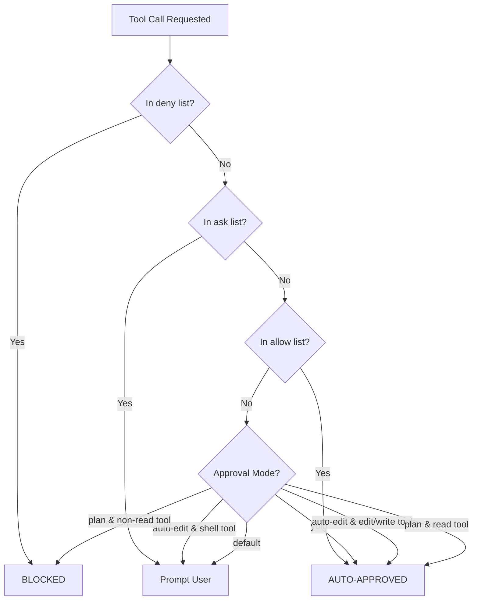

Let me read the existing permissions research file and the related Qwen research files to understand what's already documented.Now let me do web research to find the latest information about Qwen CLI permissions and verify/supplement what's in the existing research.Now I have comprehensive information. Let me compile the research into the document body.I now have all the research needed. Let me compile the comprehensive markdown body content.

Here is the replacement Markdown body content:

---

# Permissions in Qwen Code CLI

> **Agent version:** 0.13.x (March 2026)
> **CLI binary:** `qwen` (npm: `@qwen-code/qwen-code`)
> **Homepage:** [github.com/QwenLM/qwen-code](https://github.com/QwenLM/qwen-code)
> **Documentation:** [qwenlm.github.io/qwen-code-docs](https://qwenlm.github.io/qwen-code-docs/)
> **Permissions reference:** [Approval Mode docs](https://qwenlm.github.io/qwen-code-docs/en/users/features/approval-mode/)

Qwen Code is an open-source agentic CLI from Alibaba, forked from Gemini CLI and optimized for Qwen3-Coder models. Permissions in Qwen Code are attached to **tools** -- the built-in functions the agent can invoke. The permission system controls which tools can execute, whether they require user approval, and whether they are blocked entirely.

---

## Permission Entity: Tools

Permissions in Qwen Code are attached to **tools**. Every action the agent takes -- reading a file, writing code, running a shell command -- is performed through a tool invocation. The permission system gates these tool invocations through a layered decision pipeline.

### Built-in Tools

Qwen Code ships with the following built-in tools, organized by their safety classification (`Kind`):

| Tool Name | Function ID | Kind | Requires Approval | Description |
|:----------|:------------|:-----|:-------------------|:------------|
| Read File | `read_file` | Read | No | Read contents of a single file |
| Read Many Files | `read_many_files` | Read | No | Read contents from multiple files or directories |
| Grep Search | `grep_search` | Read | No | Search file contents by regex pattern |
| Glob | `glob` | Read | No | Find files matching glob patterns |
| List Directory | `list_directory` | Read | No | List contents of a directory |
| Edit | `edit` | Edit | Yes (unless auto-edit/yolo) | Targeted search-and-replace edits to existing files |
| Write File | `write_file` | Write | Yes (unless auto-edit/yolo) | Create or overwrite a file |
| Shell Command | `run_shell_command` | Execute | Yes (unless yolo) | Execute shell commands with timeout and process management |
| Web Fetch | `web_fetch` | Execute | No | Fetch content from HTTP(S) URLs or MCP resource URIs |
| Web Search | `web_search` | Other | No | Search the web via DashScope, Tavily, or Google |
| Todo Write | `todo_write` | Other | No | Manage a persistent task list |
| Save Memory | `save_memory` | Other | No | Persist user-specific facts across sessions |
| Task | `task` | Other | No | Delegate work to a specialized subagent |
| Skill | `skill` | Other | Varies | Execute reusable, user-defined automation scripts |
| Exit Plan Mode | `exit_plan_mode` | Other | No | Exit plan mode to proceed with implementation |

Beyond built-in tools, the agent can also invoke:

- **MCP tools** -- registered by Model Context Protocol servers (stdio, SSE, or HTTP transport)
- **Extension tools** -- provided by installed extensions via `qwen-extension.json`
- **User-defined tools** -- loaded from `.toml` files

All tool types go through the same permission pipeline once registered.

### Permission Decision Priority

The permission system evaluates tool calls in strict priority order:



**Priority: deny > ask > allow > approval mode default**

---

## Configuration Files

Qwen Code uses JSON settings files at multiple scopes. All are named `settings.json` and share the same schema.

### File Locations

| Priority | Path | Scope | Shareable |
|:---------|:-----|:------|:----------|
| 1 (highest) | CLI flags / env vars | Invocation | No |
| 2 | System settings (`/etc/qwen-code/settings.json`) | System/Enterprise | Admin-managed |
| 3 | Project settings (`.qwen/settings.json`) | Workspace | Yes (committed) |
| 4 | User settings (`~/.qwen/settings.json`) | User (all projects) | No (local) |
| 5 (lowest) | System defaults (`/etc/qwen-code/system-defaults.json`) | Built-in defaults | Admin-managed |

On Windows, the user settings path is `%APPDATA%\qwen\settings.json`.

### Additional Configuration Files

| File | Purpose |
|:-----|:--------|
| `~/.qwen/trustedFolders.json` | Records folder trust decisions |
| `~/.qwen/memory.txt` | Persisted agent memory |
| `~/.qwen/mcp-oauth-tokens.json` | OAuth tokens for MCP servers |
| `.qwen/QWEN.md` | Project-level context/instructions file |
| `~/.qwen/QWEN.md` | User-level context/instructions file |

---

## Settings Schema (Permission-Related Keys)

The current schema version is **3** (tracked via the `$version` key). Old formats are migrated automatically on first load.

### Current Format

```json
{
  "$version": 3,
  "permissions": {
    "defaultMode": "default",
    "allow": [
      "Bash(git *)",
      "Read",
      "mcp__my-server__safe_tool"
    ],
    "ask": [
      "Bash(docker *)"
    ],
    "deny": [
      "Bash(rm -rf *)",
      "mcp__untrusted__*"
    ],
    "additionalDirectories": ["/shared/project"]
  },
  "tools": {
    "approvalMode": "default",
    "sandbox": false
  },
  "mcpServers": {
    "example-server": {
      "command": "npx",
      "args": ["-y", "@example/mcp-server"],
      "env": { "API_KEY": "${MY_API_KEY}" },
      "cwd": "/path/to/dir",
      "timeout": 5000,
      "trust": false,
      "description": "Example MCP server",
      "includeTools": ["safe_tool"],
      "excludeTools": ["dangerous_tool"]
    }
  },
  "security": {
    "folderTrust": {
      "enabled": false
    },
    "auth": {
      "selectedType": "qwen-oauth"
    }
  }
}
```

### Key Descriptions

| Key | Type | Description |
|:----|:-----|:------------|
| `permissions.defaultMode` | `string` | Default approval mode: `plan`, `default`, `auto-edit`, `yolo` |
| `permissions.allow` | `string[]` | Tool patterns that bypass confirmation. Merges across all scopes. |
| `permissions.ask` | `string[]` | Tool patterns that force user confirmation, overriding allow. |
| `permissions.deny` | `string[]` | Tool patterns that are blocked entirely. Highest precedence. |
| `permissions.additionalDirectories` | `string[]` | Extra directories the agent may access beyond the workspace root. |
| `tools.approvalMode` | `string` | Legacy alias for `permissions.defaultMode`. |
| `tools.sandbox` | `boolean\|string` | Enable sandboxing (`true`, `"docker"`, `"podman"`, `"sandbox-exec"`). |
| `mcpServers.<name>.trust` | `boolean` | If `true`, all tools from this server bypass confirmation. |
| `mcpServers.<name>.includeTools` | `string[]` | Allowlist of tools exposed from this MCP server. |
| `mcpServers.<name>.excludeTools` | `string[]` | Blocklist of tools hidden from this MCP server. |
| `security.folderTrust.enabled` | `boolean` | Enable trusted folders feature (disabled by default). |

### Rule Pattern Syntax

Permission rules support wildcards and parameterized tool names:

| Pattern | Matches |
|:--------|:--------|
| `"Bash"` | All shell commands |
| `"Bash(git *)"` | Shell commands starting with `git` |
| `"Bash(npm test)"` | Only `npm test` |
| `"Read"` | All read operations (read_file, grep, glob, list_directory) |
| `"ReadFile(/src/**)"` | File reads only, restricted to `/src/` subtree |
| `"Edit"` | All edit operations (edit, write_file) |
| `"mcp__servername__*"` | All tools from a specific MCP server |
| `"mcp__servername__tool"` | A specific tool from a specific MCP server |

### Tool Name Aliases

Several aliases are recognized:

| Alias | Maps To |
|:------|:--------|
| `Bash`, `Shell` | `run_shell_command` |
| `Read`, `ReadFile` | `read_file` (meta-category covers grep, glob, list_directory) |
| `Edit`, `EditFile` | `edit` (meta-category covers write_file) |
| `Grep`, `SearchFiles` | `grep_search` |
| `Glob`, `FindFiles` | `glob` |

### Legacy Format (Deprecated, Auto-Migrated)

```json
{
  "tools": {
    "core": ["run_shell_command(ls -l)"],
    "allowed": ["run_shell_command(git)"],
    "exclude": ["run_shell_command(rm -rf)"]
  }
}
```

| Old Key | Migrated To |
|:--------|:------------|
| `tools.core` | `permissions.allow` + `permissions.deny` |
| `tools.allowed` | `permissions.allow` |
| `tools.exclude` | `permissions.deny` |

The old settings file is backed up before migration.

---

## CLI Switches That Override Permissions

### Approval Mode Switches

| Flag | Description | Example |
|:-----|:------------|:--------|
| `--approval-mode <mode>` | Set approval mode for this session. Values: `plan`, `default`, `auto-edit`, `yolo`. | `qwen --approval-mode auto-edit "refactor auth"` |
| `-y, --yolo` | Shortcut for `--approval-mode yolo`. Auto-approves all tool calls. | `qwen -y "fix all lint errors"` |

### Tool Filtering Switches

| Flag | Description | Example |
|:-----|:------------|:--------|
| `--allowed-tools <list>` | Comma-separated tool names to allow without confirmation. Overrides settings file `permissions.allow`. | `qwen --allowed-tools "Bash(git *),Edit" "commit changes"` |
| `--exclude-tools <list>` | Comma-separated tool names to block. Overrides settings file `permissions.deny`. | `qwen --exclude-tools "Bash(rm *),write_file" "analyze code"` |
| `--core-tools <list>` | Comma-separated list of core tool paths to enable. Restricts available tools to only those listed. | `qwen --core-tools "read_file,grep_search,glob" "review codebase"` |

### MCP Server Switches

| Flag | Description | Example |
|:-----|:------------|:--------|
| `--allowed-mcp-server-names <list>` | Restrict which MCP servers are loaded. Only named servers are started. | `qwen --allowed-mcp-server-names "filesystem,github" "check PRs"` |

### Sandbox Switches

| Flag | Description | Example |
|:-----|:------------|:--------|
| `-s, --sandbox` | Run the agent inside a sandbox. Uses Docker/Podman or macOS Seatbelt depending on platform. | `qwen -s "refactor database layer"` |
| `--sandbox-image <uri>` | Custom container image for Docker/Podman sandbox (deprecated). | `qwen -s --sandbox-image my-image:latest "run tests"` |

### Turn Limit

| Flag | Description | Example |
|:-----|:------------|:--------|
| `--max-session-turns <n>` | Cap the number of agent turns. Useful for CI budgets and limiting tool invocations. | `qwen --max-session-turns 10 "implement feature X"` |

### Combined Example: Locked-Down CI Configuration

```bash
qwen \
  --approval-mode yolo \
  --sandbox \
  --exclude-tools "Bash(rm *),Bash(git push *)" \
  --allowed-mcp-server-names "readonly-fs" \
  --max-session-turns 20 \
  -o json \
  "Run the test suite and report failures"
```

---

## Four Approval Modes

| Mode | File Edits | Shell Commands | Risk Level | Best For |
|:-----|:-----------|:---------------|:-----------|:---------|
| `plan` | Blocked (read-only) | Blocked | Lowest | Code exploration, planning, safe review |
| `default` | Manual approval | Manual approval | Low | Unfamiliar codebases, critical systems |
| `auto-edit` | Auto-approved | Manual approval | Medium | Daily development, routine refactoring |
| `yolo` | Auto-approved | Auto-approved | Highest | Trusted personal projects, CI/CD automation |

### Switching Modes at Runtime

- **Keyboard shortcut:** `Shift+Tab` (macOS/Linux) or `Tab` (Windows) cycles through: Default -> Auto-Edit -> YOLO -> Plan -> Default
- **Slash command:** `/approval-mode <mode>` sets the mode for the current session
- **Persistent change:** `/approval-mode <mode> --project` saves to `.qwen/settings.json`; `/approval-mode <mode> --user` saves to `~/.qwen/settings.json`

---

## Trusted Folders

Trusted Folders is a security feature (disabled by default) that controls whether project-level settings are loaded.

### How It Works

When enabled via `security.folderTrust.enabled: true` in `~/.qwen/settings.json`, Qwen Code prompts on first run in any new directory:

1. **Trust folder** -- grants full access to project settings
2. **Trust parent folder** -- extends trust to all subdirectories
3. **Don't trust** -- activates safe mode

Trust decisions are saved in `~/.qwen/trustedFolders.json`.

### Untrusted Folder Restrictions

When a folder is not trusted:

- `.qwen/settings.json` is ignored
- `.env` files are not loaded
- Extension management is restricted
- Tool auto-acceptance is disabled (all tools require manual approval)
- Automatic memory loading is disabled

### Managing Trust

- Run `/permissions` inside the CLI to change trust for the current folder
- Inspect `~/.qwen/trustedFolders.json` to view all trust rules

---

## Subagent Permissions

Subagents can be configured with restricted tool access via their YAML frontmatter:

```yaml
---
name: doc-reviewer
description: Reviews documentation for accuracy
tools:
  - read_file
  - read_many_files
  - grep_search
---
You are a documentation reviewer. Only read and analyze files.
```

The `tools` array acts as an allowlist -- the subagent cannot use tools not listed. However:

- This is **tool visibility** control, not **permission-level** control
- Project-level `permissions.deny` rules override agent-level tool declarations
- There is no way to set a different `permissions.defaultMode` per subagent
- All MCP servers are available to all subagents unless tool names are excluded from the subagent's `tools` array

---

## Problems and Workarounds

### 1. `tools.exclude` / `permissions.deny` Is Not a Security Mechanism

**Problem:** The official documentation explicitly warns that tool exclusion rules use "simple string matching and can be easily bypassed." An adversarial model could construct equivalent commands that don't match the pattern.

**Workaround:** Use `permissions.deny` as a convenience guardrail, not a security boundary. For real isolation, use sandbox mode (`--sandbox`) which restricts filesystem and network access at the OS level.

### 2. Agent Confuses Its Own Configuration Syntax

**Problem:** Qwen Code's agent does not have built-in knowledge of its own configuration schema. When asked to configure permissions or MCP servers, it often suggests Claude Code syntax (`permissions.allow`/`deny` in a Claude format) or Gemini CLI syntax (`defaultApprovalMode`), neither of which work in Qwen Code ([issue #1910](https://github.com/QwenLM/qwen-code/issues/1910)).

**Workaround:** Do not rely on the agent to generate its own configuration. Reference the [settings documentation](https://qwenlm.github.io/qwen-code-docs/en/users/configuration/settings/) directly, or use the `/approval-mode` command for interactive mode changes.

### 3. Legacy Settings Migration Can Cause Confusion

**Problem:** The settings format changed from `tools.core`/`tools.allowed`/`tools.exclude` to `permissions.allow`/`permissions.ask`/`permissions.deny`. Auto-migration happens silently on first load, and the old keys are then ignored. Users who don't notice the migration may edit the wrong keys.

**Workaround:** After upgrading, verify your settings file has been migrated. Look for the `$version: 3` key. Remove any remaining `tools.core`, `tools.allowed`, or `tools.exclude` entries.

### 4. Non-Existent Tools Exposed to Subagents

**Problem:** If a subagent's `tools` array references a tool that doesn't exist (e.g., from a removed MCP server), the subagent will attempt to invoke it and fail. No validation occurs at initialization time ([issue #994](https://github.com/QwenLM/qwen-code/issues/994)).

**Workaround:** Audit subagent definitions after removing MCP servers or extensions. Ensure all tools listed in subagent YAML frontmatter correspond to currently available tools.

### 5. `canUseTool` SDK Callback Bypassed in Certain Modes

**Problem:** The TypeScript SDK's `canUseTool` callback -- the only programmatic pre-tool hook available -- is never invoked when `permissionMode` is `yolo`, when a tool is in `permissions.allow`, or when a tool is in `permissions.deny`. This means SDK consumers cannot implement custom approval logic for auto-approved tools.

**Workaround:** Use `permissions.defaultMode: "default"` and handle all decisions in the `canUseTool` callback. Or use `permissions.ask` to force specific tools through the callback even in auto-edit mode.

### 6. YOLO Mode Keyboard Shortcut Reliability

**Problem:** Users reported that the keyboard shortcut to toggle YOLO mode (`Ctrl+Y` or `Shift+Tab`) sometimes stops working mid-session ([discussion #632](https://github.com/QwenLM/qwen-code/discussions/632)).

**Workaround:** Use the `--yolo` CLI flag at launch, or use the `/approval-mode yolo` slash command within the session.

### 7. No Lifecycle Hooks System (Yet)

**Problem:** Unlike Claude Code, Qwen Code does not support user-configurable lifecycle hooks (`PreToolUse`, `PostToolUse`, `Stop`, etc.) in `settings.json`. Adding a `hooks` key has no effect ([issue #1708](https://github.com/QwenLM/qwen-code/issues/1708)). Hooks are listed as "In Progress" on the roadmap (P2 priority) ([issue #268](https://github.com/QwenLM/qwen-code/issues/268)).

**Workaround:** Use the SDK `canUseTool` callback for pre-tool gating. For monitoring, consume headless stream-json output. For policy enforcement, combine approval modes with `permissions.deny` rules.

### 8. `project-level tools.core` Overrides Subagent Tool Declarations

**Problem:** If `.qwen/settings.json` defines `permissions.allow` (or legacy `tools.core`) with a restrictive set, subagents whose `tools` array includes tools not in the project-level list will get "tool not found" errors ([issue #792](https://github.com/QwenLM/qwen-code/issues/792)).

**Workaround:** Ensure project-level permission rules are compatible with all subagent tool declarations. Use `permissions.deny` (blocklist) instead of `tools.core` (allowlist) to avoid accidentally restricting subagent tools.

---

## Other Considerations

### Sandbox Modes

Qwen Code inherits comprehensive sandboxing from its Gemini CLI heritage:

| Method | Platform | Isolation Level |
|:-------|:---------|:----------------|
| macOS Seatbelt (`sandbox-exec`) | macOS only | Process-level filesystem/network restrictions |
| Docker/Podman | Cross-platform | Full container isolation |

Seatbelt profiles available: `permissive-open`, `permissive-closed`, `permissive-proxied`, `restrictive-open`, `restrictive-closed`, `restrictive-proxied`. Custom profiles can be placed at `.qwen/sandbox-macos-<profile_name>.sb`.

Sandbox can be combined with YOLO mode for automated but isolated execution:

```bash
QWEN_SANDBOX=docker SANDBOX_FLAGS="--network=none" qwen -y "refactor auth module"
```

### No Root/Elevated Privilege Detection

Qwen Code does not detect or warn about running as root or with elevated privileges. Running `qwen` as root executes with full root permissions without additional safeguards.

### MCP Server Trust

Setting `trust: true` on an MCP server configuration bypasses all confirmation for that server's tools. This is equivalent to adding all of the server's tools to `permissions.allow`. Use with extreme caution as it bypasses both the interactive approval dialog and the SDK `canUseTool` callback.

### Environment Variable Inheritance

Some environment variables retain the `GEMINI_*` prefix for backward compatibility:

| Variable | Purpose |
|:---------|:--------|
| `GEMINI_SANDBOX` | Enable sandbox (`true`, `docker`, `podman`, `sandbox-exec`) |
| `GEMINI_SANDBOX_PROXY_COMMAND` | Proxy command for seatbelt "proxied" profiles |
| `SANDBOX_FLAGS` | Custom Docker/Podman container flags |
| `SANDBOX_MOUNTS` | Volume mount configuration |
| `SANDBOX_PORTS` | Port publishing settings |
| `SEATBELT_PROFILE` | macOS sandbox profile name |

### No MCP Response Interception

MCP tool results are injected directly into the model context without any interception point. There is no event, hook, or callback to inspect, modify, or block MCP responses before the model processes them.

### Headless Mode Considerations

In non-interactive (headless) mode, tools requiring user approval are excluded unless explicitly enabled via `--allowed-tools` or `--approval-mode yolo`. This means headless mode is more restrictive by default than interactive mode.

---

## Sources

- [Qwen Code GitHub repository](https://github.com/QwenLM/qwen-code)
- [Qwen Code documentation](https://qwenlm.github.io/qwen-code-docs/)
- [Qwen Code settings reference](https://qwenlm.github.io/qwen-code-docs/en/users/configuration/settings/)
- [Qwen Code settings.md (source)](https://github.com/QwenLM/qwen-code/blob/main/docs/users/configuration/settings.md)
- [Qwen Code approval mode docs](https://qwenlm.github.io/qwen-code-docs/en/users/features/approval-mode/)
- [Qwen Code trusted folders](https://qwenlm.github.io/qwen-code-docs/en/users/configuration/trusted-folders/)
- [Qwen Code tools introduction](https://qwenlm.github.io/qwen-code-docs/en/developers/tools/introduction/)
- [Qwen Code web search tool](https://qwenlm.github.io/qwen-code-docs/en/developers/tools/web-search/)
- [Qwen Code sandbox docs](https://qwenlm.github.io/qwen-code-docs/en/users/features/sandbox/)
- [Qwen Code subagents docs](https://qwenlm.github.io/qwen-code-docs/en/users/features/sub-agents/)
- [Qwen Code headless mode docs](https://qwenlm.github.io/qwen-code-docs/en/users/features/headless/)
- [Qwen Code SDK (TypeScript)](https://qwenlm.github.io/qwen-code-docs/en/developers/sdk-typescript/)
- [Core Tools Reference (DeepWiki)](https://deepwiki.com/QwenLM/qwen-code/6.4-command-reference)
- [Settings Reference (DeepWiki)](https://deepwiki.com/QwenLM/qwen-code/3.2-settings-reference)
- [Issue #1910: Agent lacks config self-knowledge](https://github.com/QwenLM/qwen-code/issues/1910)
- [Issue #994: Non-existing tools exposed to subagents](https://github.com/QwenLM/qwen-code/issues/994)
- [Issue #268: Hook feature request](https://github.com/QwenLM/qwen-code/issues/268)
- [Issue #1708: Hooks not working](https://github.com/QwenLM/qwen-code/issues/1708)
- [Discussion #632: YOLO mode permissions](https://github.com/QwenLM/qwen-code/discussions/632)