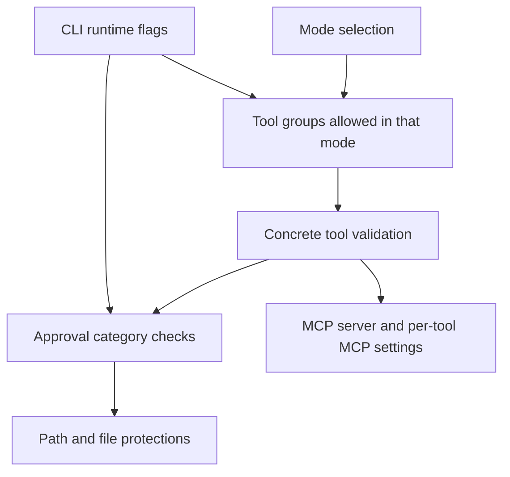

## Roo Code Permissions Research

### Executive Summary

Roo Code does **not** attach permissions to just one entity such as “tools.” In current Roo, permissions are enforced across several layers:



The practical consequence is:

- **Modes** decide which tool groups are available.
- **Concrete tools** are then validated against the current mode.
- **Approval settings** decide whether Roo asks before specific action categories run.
- **MCP** has both a global gate and per-server/per-tool allow settings.
- **Paths** can still be blocked by `.rooignore`, outside-workspace restrictions, or protected-file rules.
- **CLI flags** can override the approval behavior at runtime, but only coarsely.

Sources: [Auto-approving actions](https://docs.roocode.com/features/auto-approving-actions), [Custom modes](https://docs.roocode.com/features/custom-modes), [Tool use overview](https://docs.roocode.com/advanced-usage/available-tools/tool-use-overview), [tool schema](https://github.com/RooCodeInc/Roo-Code/blob/main/packages/types/src/tool.ts), [mode schema](https://github.com/RooCodeInc/Roo-Code/blob/main/packages/types/src/mode.ts), [auto-approval logic](https://github.com/RooCodeInc/Roo-Code/blob/main/src/core/auto-approval/index.ts).

## 1. What entity are permissions attached to?

### Bottom line

The answer is **not just “tools.”** Roo attaches permission behavior to several entity types.

| Layer | Entity permissions attach to | How it works |
|---|---|---|
| Mode layer | **Tool groups** | A mode enables groups such as `read`, `edit`, `command`, `mcp`, `modes`. |
| Tool layer | **Concrete built-in tools** and dynamic MCP/custom tools | A tool must be valid and allowed for the current mode. |
| Approval layer | **Interactive ask/action categories** | Roo decides whether to auto-approve `tool`, `command`, `use_mcp_server`, and `followup` actions. |
| MCP layer | **MCP servers** and **MCP tools/resources** | Global MCP approval is separate from per-server `alwaysAllow` lists. |
| Path layer | **Workspace boundary**, **protected files**, and **`.rooignore`** | A tool may be mode-allowed but still blocked or require approval because of path restrictions. |
| CLI layer | **Runtime session approval mode** | CLI can force approval prompts or run non-interactively. |

Source code basis: [auto-approval logic](https://github.com/RooCodeInc/Roo-Code/blob/main/src/core/auto-approval/index.ts), [tool validation](https://github.com/RooCodeInc/Roo-Code/blob/main/src/core/tools/validateToolUse.ts), [protected files](https://github.com/RooCodeInc/Roo-Code/blob/main/src/core/protect/RooProtectedController.ts), [MCP config handling](https://github.com/RooCodeInc/Roo-Code/blob/main/src/services/mcp/McpHub.ts).

### Roo’s approval/action entities

At the approval layer, Roo reasons in terms of these interactive ask types:

| Ask/action type | Meaning |
|---|---|
| `tool` | Use of a built-in tool action |
| `command` | Command execution |
| `use_mcp_server` | MCP tool/resource access |
| `followup` | A follow-up question back to the user |

Source: [message types](https://github.com/RooCodeInc/Roo-Code/blob/main/packages/types/src/message.ts), [auto-approval logic](https://github.com/RooCodeInc/Roo-Code/blob/main/src/core/auto-approval/index.ts).

### Available permission-related entities in Roo Code

#### Tool groups

Current source-defined tool groups are:

- `read`
- `edit`
- `command`
- `mcp`
- `modes`

A legacy `browser` group still appears in some docs/history, but current source marks it as **deprecated** and strips it from mode configs during validation.

Source: [tool groups](https://github.com/RooCodeInc/Roo-Code/blob/main/packages/types/src/tool.ts), [mode preprocessing](https://github.com/RooCodeInc/Roo-Code/blob/main/packages/types/src/mode.ts).

#### Built-in tool names

Current built-in tool names are:

- `execute_command`
- `read_file`
- `read_command_output`
- `write_to_file`
- `apply_diff`
- `edit`
- `search_and_replace`
- `search_replace`
- `edit_file`
- `apply_patch`
- `search_files`
- `list_files`
- `use_mcp_tool`
- `access_mcp_resource`
- `ask_followup_question`
- `attempt_completion`
- `switch_mode`
- `new_task`
- `codebase_search`
- `update_todo_list`
- `run_slash_command`
- `skill`
- `generate_image`
- `custom_tool`

In addition, Roo also recognizes:

- Dynamic native MCP tool names prefixed like `mcp_<server>_<tool>`
- Custom tools when the custom-tools experiment/registry is enabled

Source: [tool names](https://github.com/RooCodeInc/Roo-Code/blob/main/packages/types/src/tool.ts), [tool validation](https://github.com/RooCodeInc/Roo-Code/blob/main/src/core/tools/validateToolUse.ts).

#### Tool-group to tool mapping

| Group | Tools |
|---|---|
| `read` | `read_file`, `search_files`, `list_files`, `codebase_search` |
| `edit` | `apply_diff`, `write_to_file`, `generate_image` plus edit-family tools such as `edit`, `search_replace`, `edit_file`, `apply_patch` |
| `command` | `execute_command`, `read_command_output` |
| `mcp` | `use_mcp_tool`, `access_mcp_resource`, dynamic `mcp_*` tools |
| `modes` | `switch_mode`, `new_task` |

Tools Roo treats as always available across modes include:

- `ask_followup_question`
- `attempt_completion`
- `switch_mode`
- `new_task`
- `update_todo_list`
- `run_slash_command`
- `skill`

Source: [shared tool registry](https://github.com/RooCodeInc/Roo-Code/blob/main/src/shared/tools.ts).

#### Auto-approval categories exposed in settings/UI

Current approval-related settings keys are:

- `autoApprovalEnabled`
- `alwaysAllowReadOnly`
- `alwaysAllowReadOnlyOutsideWorkspace`
- `alwaysAllowWrite`
- `alwaysAllowWriteOutsideWorkspace`
- `alwaysAllowWriteProtected`
- `alwaysAllowMcp`
- `alwaysAllowModeSwitch`
- `alwaysAllowSubtasks`
- `alwaysAllowExecute`
- `alwaysAllowFollowupQuestions`
- `followupAutoApproveTimeoutMs`
- `allowedCommands`
- `deniedCommands`

These map to UI concepts such as reading files, editing files, executing commands, MCP use, mode switching, subtasks, and follow-up questions. The docs also mention browser approval, but that is part of the current docs/source drift discussed below.

Source: [global settings schema](https://github.com/RooCodeInc/Roo-Code/blob/main/packages/types/src/global-settings.ts), [auto-approving actions docs](https://docs.roocode.com/features/auto-approving-actions).

## 2. What configuration files does Roo Code use?

| Scope | File | Purpose |
|---|---|---|
| VS Code extension global storage | `settings/custom_modes.yaml` | Global custom mode definitions |
| VS Code extension global storage | `settings/mcp_settings.json` | Global MCP server config |
| Project | `.roomodes` | Project-specific custom modes |
| Project | `.roo/mcp.json` | Project-specific MCP server config |
| Project | `.rooignore` | Blocks Roo access to selected files/paths |
| CLI user config | `~/.roo/cli-settings.json` | Saved CLI defaults including `requireApproval` |
| CLI user config | `~/.roo/cli-credentials.json` | CLI auth token storage |
| Import/export bundle | commonly `roo-code-settings.json` | Export/import of provider profiles and global settings |

Two location details matter:

1. The extension’s global settings files live under the VS Code extension global storage directory, unless the user sets `roo-cline.customStoragePath`, in which case Roo uses that custom base path and appends `settings/`.
2. The CLI uses `~/.roo/`, not the VS Code extension storage path.

Sources: [global file names](https://github.com/RooCodeInc/Roo-Code/blob/main/src/shared/globalFileNames.ts), [storage path logic](https://github.com/RooCodeInc/Roo-Code/blob/main/src/utils/storage.ts), [CLI config dir](https://github.com/RooCodeInc/Roo-Code/blob/main/apps/cli/src/lib/storage/config-dir.ts), [CLI settings storage](https://github.com/RooCodeInc/Roo-Code/blob/main/apps/cli/src/lib/storage/settings.ts), [CLI credentials storage](https://github.com/RooCodeInc/Roo-Code/blob/main/apps/cli/src/lib/storage/credentials.ts), [MCP project config watcher](https://github.com/RooCodeInc/Roo-Code/blob/main/src/services/mcp/McpHub.ts).

## 3. What is the structure/schema of these configuration files?

### 3.1 `.roomodes` and `custom_modes.yaml`

Roo’s current mode schema is defined in Zod, not a separately published JSON Schema.

Top-level shape:

```yaml
customModes:
  - slug: docs-writer
    name: Docs Writer
    roleDefinition: Write and maintain documentation.
    whenToUse: Use for docs work.
    description: Documentation-focused mode.
    customInstructions: Keep output concise and standards-based.
    groups:
      - read
      - [edit, { fileRegex: "\\.(md|mdx)$", description: "Markdown only" }]
      - mcp
```

Key schema rules:

| Field | Type | Notes |
|---|---|---|
| `customModes` | array | Required |
| `slug` | string | Required; regex `^[a-zA-Z0-9-]+$` |
| `name` | string | Required |
| `roleDefinition` | string | Required |
| `whenToUse` | string | Optional |
| `description` | string | Optional |
| `customInstructions` | string | Optional |
| `groups` | array | Required |
| `source` | `global` or `project` | Optional/system-managed |

A `groups` entry can be either:

- a plain tool-group string such as `read`
- or a tuple like `["edit", { fileRegex, description }]`

Important validation behavior:

- Duplicate groups are rejected.
- Duplicate mode slugs are rejected.
- Deprecated `browser` entries are silently stripped for backward compatibility.
- JSON `.roomodes` is still supported for backward compatibility, even though YAML is preferred.

Sources: [mode schema](https://github.com/RooCodeInc/Roo-Code/blob/main/packages/types/src/mode.ts), [custom modes docs](https://docs.roocode.com/features/custom-modes), [changelog entry for `.roomodes` JSON compatibility](https://github.com/RooCodeInc/Roo-Code/blob/main/CHANGELOG.md).

### 3.2 `mcp_settings.json` and `.roo/mcp.json`

Top-level shape:

```json
{
  "mcpServers": {
    "filesystem": {
      "type": "stdio",
      "command": "npx",
      "args": ["-y", "@modelcontextprotocol/server-filesystem", "."],
      "cwd": "/path/to/project",
      "env": { "NODE_ENV": "production" },
      "timeout": 60,
      "disabled": false,
      "alwaysAllow": ["read_file", "*"],
      "disabledTools": ["delete_file"],
      "watchPaths": ["./src"]
    }
  }
}
```

Remote example:

```json
{
  "mcpServers": {
    "remote-api": {
      "type": "streamable-http",
      "url": "https://example.com/mcp",
      "headers": {
        "Authorization": "Bearer TOKEN"
      },
      "timeout": 60,
      "alwaysAllow": []
    }
  }
}
```

Key schema rules:

| Field | Type | Notes |
|---|---|---|
| `mcpServers` | object map | Required top-level key |
| `type` | `stdio`, `sse`, `streamable-http` | `stdio` may be inferred if `command` is present |
| `command` | string | Required for `stdio` |
| `args` | string[] | Optional for `stdio` |
| `cwd` | string | Optional for `stdio` |
| `env` | object | Optional for `stdio` |
| `url` | string | Required for `sse` / `streamable-http` |
| `headers` | object | Optional for `sse` / `streamable-http` |
| `timeout` | number | Optional; 1 to 3600 seconds |
| `disabled` | boolean | Optional |
| `alwaysAllow` | string[] | Per-tool allow list; supports `*` wildcard |
| `disabledTools` | string[] | Hides/disables selected MCP tools |
| `watchPaths` | string[] | Optional restart-watch paths for stdio servers |

Important behavior:

- `alwaysAllowMcp` alone is not enough for `use_mcp_tool`; Roo also checks whether the individual MCP tool is in that server’s `alwaysAllow` list.
- `access_mcp_resource` only checks the global MCP approval gate.

Source: [MCP schema and logic](https://github.com/RooCodeInc/Roo-Code/blob/main/src/services/mcp/McpHub.ts), [auto-approval MCP logic](https://github.com/RooCodeInc/Roo-Code/blob/main/src/core/auto-approval/index.ts).

### 3.3 Export/import settings bundle

The exported/imported settings bundle is JSON shaped like:

```json
{
  "providerProfiles": {
    "...": "provider profile data"
  },
  "globalSettings": {
    "...": "global Roo settings"
  }
}
```

For permission work, the important part is `globalSettings`, which includes fields such as:

- `autoApprovalEnabled`
- `alwaysAllowReadOnly`
- `alwaysAllowReadOnlyOutsideWorkspace`
- `alwaysAllowWrite`
- `alwaysAllowWriteOutsideWorkspace`
- `alwaysAllowWriteProtected`
- `alwaysAllowMcp`
- `alwaysAllowModeSwitch`
- `alwaysAllowSubtasks`
- `alwaysAllowExecute`
- `alwaysAllowFollowupQuestions`
- `followupAutoApproveTimeoutMs`
- `allowedCommands`
- `deniedCommands`
- `disabledTools`
- `customModes`

Source: [import/export implementation](https://github.com/RooCodeInc/Roo-Code/blob/main/src/core/config/importExport.ts), [global settings schema](https://github.com/RooCodeInc/Roo-Code/blob/main/packages/types/src/global-settings.ts).

### 3.4 CLI settings file

`~/.roo/cli-settings.json` stores CLI defaults. Relevant shape:

```json
{
  "mode": "code",
  "provider": "roo",
  "model": "anthropic/claude-opus-4.6",
  "reasoningEffort": "medium",
  "consecutiveMistakeLimit": 5,
  "requireApproval": true,
  "dangerouslySkipPermissions": false,
  "oneshot": false
}
```

Important notes:

- `requireApproval` is the current setting.
- `dangerouslySkipPermissions` is a legacy inverse setting still read for backward compatibility.

Source: [CLI types](https://github.com/RooCodeInc/Roo-Code/blob/main/apps/cli/src/types/types.ts), [CLI settings storage](https://github.com/RooCodeInc/Roo-Code/blob/main/apps/cli/src/lib/storage/settings.ts), [CLI run precedence](https://github.com/RooCodeInc/Roo-Code/blob/main/apps/cli/src/commands/cli/run.ts).

## 4. Which CLI switches override permissions, and how?

### Short answer

Roo CLI does **not** expose fine-grained flags like `--always-allow-write` or `--allowed-commands`. The main direct override is `--require-approval`. `--mode` also changes the available tool surface indirectly.

CLI precedence is:

`CLI flags > cli-settings.json > defaults`

Source: [CLI run logic](https://github.com/RooCodeInc/Roo-Code/blob/main/apps/cli/src/commands/cli/run.ts).

### Relevant CLI switches

| Switch | What it overrides | Effect |
|---|---|---|
| `-a`, `--require-approval` | CLI saved/default approval mode | Forces manual approval before actions execute |
| `--mode <mode>` | Default mode | Indirectly changes which tool groups/tools are available |
| `-p`, `--print` | Output/execution mode | Runs in non-interactive print mode; useful for automation, but not a fine-grained permission flag |
| `--oneshot` | Exit behavior | Exits after completion; useful in automation, not a permission flag |

### Important behavior notes

- **Direct approval override:** `--require-approval`
- **Indirect permission-surface override:** `--mode`
- Roo CLI does **not** currently expose CLI flags for:
  - per-category auto-approval
  - command allowlists/denylists
  - MCP per-tool `alwaysAllow`
  - protected-file overrides
  - outside-workspace read/write toggles

### Examples

Require approval for all actions in a local workspace:

```bash
roo "Refactor utils.ts" --require-approval -w ~/Documents/my-project
```

Force a safer read-oriented workflow by starting in `ask` mode:

```bash
roo "Explain the architecture of this repo" --mode ask --require-approval -w ~/src/repo
```

Automation-oriented run:

```bash
roo --print --oneshot "Summarize this repository"
```

Inference from source: because the CLI passes `nonInteractive: !effectiveRequireApproval`, `--require-approval` is the only direct runtime switch that flips approval prompting behavior for the session.

Sources: [CLI README](https://github.com/RooCodeInc/Roo-Code/blob/main/apps/cli/README.md), [CLI option definitions](https://github.com/RooCodeInc/Roo-Code/blob/main/apps/cli/src/index.ts), [CLI run logic](https://github.com/RooCodeInc/Roo-Code/blob/main/apps/cli/src/commands/cli/run.ts).

## 5. Problems developers have mentioned, and workarounds

| Problem developers reported | Evidence | Practical workaround |
|---|---|---|
| MCP “always allow” did not persist reliably in some versions | [Issue #2568](https://github.com/RooCodeInc/Roo-Code/issues/2568) | Upgrade Roo; verify both global MCP auto-approval and per-tool server `alwaysAllow` are set |
| Project MCP `alwaysAllow` behavior had bugs | [CHANGELOG](https://github.com/RooCodeInc/Roo-Code/blob/main/CHANGELOG.md) entry “Fix project MCP always allow issue” | Prefer newer Roo versions; re-save project/global MCP config after upgrade |
| Toggling MCP tool permissions restarted servers unexpectedly | [CHANGELOG](https://github.com/RooCodeInc/Roo-Code/blob/main/CHANGELOG.md) entry “prevent MCP server restart when toggling tool permissions” | Upgrade before relying on stable MCP permission toggling |
| `.roomodes` parsing/validation errors broke mode selection | [Issue #5180](https://github.com/RooCodeInc/Roo-Code/issues/5180) | Ensure top-level `customModes:` exists, use valid YAML indentation, or fall back to JSON-compatible format where needed |
| Custom modes under a custom storage path were not showing in some versions | [CHANGELOG](https://github.com/RooCodeInc/Roo-Code/blob/main/CHANGELOG.md) entry “custom modes under custom path not showing” | Upgrade and re-check `roo-cline.customStoragePath` |
| Mode restrictions could be bypassed in some edit scenarios | [Issue #4732](https://github.com/RooCodeInc/Roo-Code/issues/4732) | Treat fileRegex-limited edit modes as version-sensitive; test them in the version you deploy |
| Browser permission docs/config history are inconsistent with current source | Current docs still mention browser approval, while current source deprecates `browser` mode group | Do not rely on `browser` in `.roomodes`; validate against current source/version |

### Two recurring permission gotchas

#### MCP is a two-step permission model

For MCP tool execution, developers often assume one switch is enough. It is not.

For `use_mcp_tool`, Roo checks:

1. global MCP approval (`alwaysAllowMcp`)
2. per-server/per-tool `alwaysAllow`

Workaround:

- Turn on global MCP auto-approval only if appropriate.
- Then explicitly add the MCP tool to that server’s `alwaysAllow`.
- Use `["*"]` only if the whole server is trusted.

Source: [auto-approval logic](https://github.com/RooCodeInc/Roo-Code/blob/main/src/core/auto-approval/index.ts), [MCP config handling](https://github.com/RooCodeInc/Roo-Code/blob/main/src/services/mcp/McpHub.ts).

#### `.roomodes` errors are easy to trigger

Developers have hit issues caused by:

- missing top-level `customModes`
- invalid YAML indentation
- old `browser` entries
- version-specific parsing regressions

Workaround:

- Keep `.roomodes` minimal and schema-valid.
- Prefer YAML with spaces, not tabs.
- Remove `browser`.
- If you are migrating older config, validate against the current source schema.

Sources: [Issue #5180](https://github.com/RooCodeInc/Roo-Code/issues/5180), [mode schema](https://github.com/RooCodeInc/Roo-Code/blob/main/packages/types/src/mode.ts), [CHANGELOG](https://github.com/RooCodeInc/Roo-Code/blob/main/CHANGELOG.md).

## 6. Other considerations when working with permissions in Roo Code

### Protected files still matter even when write auto-approval is on

Roo explicitly protects these patterns:

- `.rooignore`
- `.roomodes`
- `.roorules*`
- `.clinerules*`
- `.roo/**`
- `.vscode/**`
- `*.code-workspace`
- `.rooprotected`
- `AGENTS.md`
- `AGENT.md`

These always require approval for modification unless explicitly handled otherwise by the current protection logic.

Source: [RooProtectedController](https://github.com/RooCodeInc/Roo-Code/blob/main/src/core/protect/RooProtectedController.ts).

### `.rooignore` is not just search hygiene

`.rooignore` can block reads, writes, and command-related access. A tool can be mode-allowed and still fail because the path is blocked by `.rooignore`.

Source: [rooignore controller](https://github.com/RooCodeInc/Roo-Code/blob/main/src/core/ignore/RooIgnoreController.ts), [response handling](https://github.com/RooCodeInc/Roo-Code/blob/main/src/core/prompts/responses.ts), [CHANGELOG](https://github.com/RooCodeInc/Roo-Code/blob/main/CHANGELOG.md).

### Outside-workspace access is separate from plain read/write approval

Roo distinguishes:

- read vs read outside workspace
- write vs write outside workspace
- write vs write to protected files

So “allow write” is not the same as “allow write anywhere.”

Source: [global settings schema](https://github.com/RooCodeInc/Roo-Code/blob/main/packages/types/src/global-settings.ts), [auto-approval logic](https://github.com/RooCodeInc/Roo-Code/blob/main/src/core/auto-approval/index.ts).

### Custom tools and dynamic MCP tools widen the real permission surface

Two source-level nuances matter:

- Dynamic MCP tools are allowed whenever the `mcp` group is allowed.
- Custom tools are currently allowed broadly when the custom-tools experiment is enabled; source comments note that more granular mode restrictions are a future improvement.

Source: [tool validation](https://github.com/RooCodeInc/Roo-Code/blob/main/src/core/tools/validateToolUse.ts).

### There is some docs/source drift

The most important drift points I found are:

- Docs and older history still mention browser permissions, but current source deprecates the `browser` tool group.
- Some docs omit the current `modes` tool group.
- The CLI README mentions `~/.config/roo/credentials.json`, while current CLI source writes credentials to `~/.roo/cli-credentials.json`.

That means for production use, the **source code is the authoritative reference**.

Sources: [custom modes docs](https://docs.roocode.com/features/custom-modes), [auto-approving actions docs](https://docs.roocode.com/features/auto-approving-actions), [tool schema](https://github.com/RooCodeInc/Roo-Code/blob/main/packages/types/src/tool.ts), [CLI README](https://github.com/RooCodeInc/Roo-Code/blob/main/apps/cli/README.md), [CLI credentials storage](https://github.com/RooCodeInc/Roo-Code/blob/main/apps/cli/src/lib/storage/credentials.ts).

## Sources

Primary sources used for this research:

- [Roo Code docs: Auto-approving actions](https://docs.roocode.com/features/auto-approving-actions)
- [Roo Code docs: Custom modes](https://docs.roocode.com/features/custom-modes)
- [Roo Code docs: Tool use overview](https://docs.roocode.com/advanced-usage/available-tools/tool-use-overview)
- [Roo Code source: `packages/types/src/tool.ts`](https://github.com/RooCodeInc/Roo-Code/blob/main/packages/types/src/tool.ts)
- [Roo Code source: `packages/types/src/mode.ts`](https://github.com/RooCodeInc/Roo-Code/blob/main/packages/types/src/mode.ts)
- [Roo Code source: `packages/types/src/global-settings.ts`](https://github.com/RooCodeInc/Roo-Code/blob/main/packages/types/src/global-settings.ts)
- [Roo Code source: `src/core/auto-approval/index.ts`](https://github.com/RooCodeInc/Roo-Code/blob/main/src/core/auto-approval/index.ts)
- [Roo Code source: `src/core/tools/validateToolUse.ts`](https://github.com/RooCodeInc/Roo-Code/blob/main/src/core/tools/validateToolUse.ts)
- [Roo Code source: `src/shared/tools.ts`](https://github.com/RooCodeInc/Roo-Code/blob/main/src/shared/tools.ts)
- [Roo Code source: `src/services/mcp/McpHub.ts`](https://github.com/RooCodeInc/Roo-Code/blob/main/src/services/mcp/McpHub.ts)
- [Roo Code source: `src/core/protect/RooProtectedController.ts`](https://github.com/RooCodeInc/Roo-Code/blob/main/src/core/protect/RooProtectedController.ts)
- [Roo Code source: `src/shared/globalFileNames.ts`](https://github.com/RooCodeInc/Roo-Code/blob/main/src/shared/globalFileNames.ts)
- [Roo Code source: `src/utils/storage.ts`](https://github.com/RooCodeInc/Roo-Code/blob/main/src/utils/storage.ts)
- [Roo Code source: `src/core/config/importExport.ts`](https://github.com/RooCodeInc/Roo-Code/blob/main/src/core/config/importExport.ts)
- [Roo CLI README](https://github.com/RooCodeInc/Roo-Code/blob/main/apps/cli/README.md)
- [Roo CLI source: `apps/cli/src/index.ts`](https://github.com/RooCodeInc/Roo-Code/blob/main/apps/cli/src/index.ts)
- [Roo CLI source: `apps/cli/src/commands/cli/run.ts`](https://github.com/RooCodeInc/Roo-Code/blob/main/apps/cli/src/commands/cli/run.ts)
- [Roo CLI source: `apps/cli/src/types/types.ts`](https://github.com/RooCodeInc/Roo-Code/blob/main/apps/cli/src/types/types.ts)
- [Roo Code CHANGELOG](https://github.com/RooCodeInc/Roo-Code/blob/main/CHANGELOG.md)
- [Issue #2568: MCP tool “always allow” checkbox does not persist](https://github.com/RooCodeInc/Roo-Code/issues/2568)
- [Issue #4732: Roo ignores mode permissions if concurrent edits are enabled](https://github.com/RooCodeInc/Roo-Code/issues/4732)
- [Issue #5180: Mode selector missing and `.roomodes` validation errors](https://github.com/RooCodeInc/Roo-Code/issues/5180)