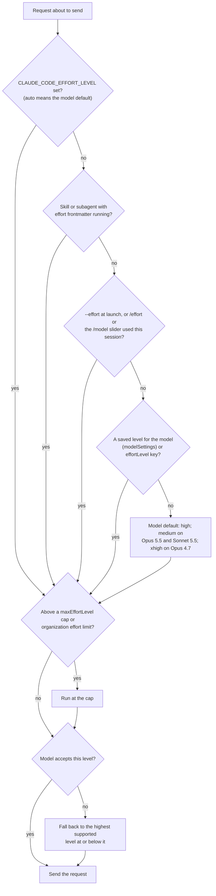

# Reasoning Level Support in Claude Code

Claude Code exposes reasoning depth as **effort levels** — named levels that control
*adaptive reasoning*, where the model decides per step whether and how much to think.
Higher effort buys deeper reasoning at higher token spend; lower effort answers sooner
and cheaper. On current models effort is the primary reasoning control: thinking is
always on and its depth follows the level.

## Levels

The scale, weakest to strongest, plus one mode that is not on the scale:

| Level | Normalized | What it does |
|-------|------------|--------------|
| `low` | low | Least reasoning; quick exchanges you review yourself (brainstorming, a first sketch, a rename) |
| `medium` | medium | Default on Opus 5.5 and Sonnet 5.5; on other models, a cost-saving step down |
| `high` | high | The balance point and the default on most models; verification-heavy work |
| `xhigh` | very_high | Deeper reasoning at higher spend; default on Opus 4.7 |
| `max` | maximum | The deepest level, for hard unsupervised problems; session-scoped unless set via the environment variable |
| `ultracode` | outside_scale | Not a level: a Claude Code setting that turns dynamic-workflow orchestration on |

Three caveats worth knowing before touching the scale:

- **The scale is calibrated per model.** The same level name does not represent the
  same underlying value across models — Opus 5.5 at `medium` matches or exceeds
  Opus 5 at `high` in Anthropic's testing.
- **`ultracode` is a mode, not a point on the scale.** As of v2.1.284 it runs at
  whichever effort level the session uses: `/effort ultracode` and the `ultracode`
  setting leave the effort level unchanged, and only `--effort ultracode` and the
  Agent SDK `effortLevel` value turn it on *together with* `xhigh`. The persisted
  `effortLevel` key and `CLAUDE_CODE_EFFORT_LEVEL` do not accept it, and it is
  unavailable when workflows are off or the model lacks `xhigh`. A generic effort
  setting should not map to it.
- **`auto` is not a level** but a reset value: `CLAUDE_CODE_EFFORT_LEVEL=auto` and
  `/effort auto` mean "use the model default" (and the latter clears your saved
  level). `--effort auto` is *rejected* — the flag accepts only the five levels
  plus `ultracode`.

Observed discrepancy: local `claude --help` and the unknown-value warning list only
`low, medium, high, xhigh, max`, omitting `ultracode` (accepted since v2.1.203) —
trust the docs and the running binary over the help string.

## Choosing a Level

Every control, with one working example each. Interactive picks confirmed with
`Enter` save the level as your per-model default (`modelSettings`); `s` in the
`/effort` slider or `/model` picker applies it to the current session only
(v2.1.257+).

**Launch flag** — `--effort <level>`, one session, never persisted:

```bash
claude --effort high
claude -p --effort xhigh "summarize this failing test"
```

**Environment variable** — `CLAUDE_CODE_EFFORT_LEVEL`, read at startup, beats the
flag, the session command, and the settings keys; accepts `auto`:

```bash
CLAUDE_CODE_EFFORT_LEVEL=high claude
```

**Session command** — `/effort <level>` sets it directly, `/effort` opens the
slider, `/effort auto` clears your saved level, `/effort ultracode [off]` toggles
ultracode. It works while Claude is mid-turn (applies to the next request, after
a cache warning when one shows) and inside `-p` runs, where it is session-only:

```text
/effort high        → "Set effort level to high (this session only): Comprehensive
                       implementation with extensive testing and documentation"
```

**Model picker slider** — in `/model`, the left/right arrows adjust the effort
slider for the selected model.

**Settings keys** — `effortLevel` (top-level default; `low`/`medium`/`high`/`xhigh`
only — no `max`, no `ultracode`) and `modelSettings` (the per-model saved level;
what `/effort` writes since v2.1.251):

```json
{
  "effortLevel": "high",
  "modelSettings": { "claude-opus-5-5": { "effortLevel": "high" } }
}
```

A user-file `effortLevel` is ignored by Opus 5.5 and later models — confirmed
locally in both directions: this host's user settings carry `effortLevel: high`,
yet a run with no other control still used Sonnet 5.5's own `medium` default;
passing `--settings '{"effortLevel": "low"}'` on the same host did apply
(`low` recorded). In project, local, and managed settings (and via `--settings`)
the key applies to every model. Both keys are read once at session start; use
`/effort` to change effort mid-session.

**Config override flag** — `--settings` with inline JSON, ranked between managed
settings and every file below them:

```bash
claude --settings '{"effortLevel": "low"}'
```

**Skill and subagent frontmatter** — an `effort:` key in a skill's or subagent's
Markdown frontmatter overrides the session level while that skill or subagent
runs, but not the environment variable, and an effort cap still limits it.

**SDK request field** — the Agent SDK accepts `effortLevel` (including
`ultracode`) in an `applyFlagSettings()` control request, which can also change
it mid-session.

**Agent-view dispatch default** — `claude agents --effort <level>` sets the
effort default for every background session dispatched from agent view, taking
the same values as the top-level flag including `ultracode`:

```bash
claude agents --model opus --effort high
```

A background session's effort persists across supervisor restarts, and a
mid-session `/effort` change is kept; a session that took its effort from
settings re-reads them on each process start.

**Cap** — `maxEffortLevel` in any settings scope (managed settings to enforce
organization-wide) caps the level: anything higher — from any source, including
the model's own default — runs at the cap. The lowest cap across scopes wins
(with a per-model `max` in `modelSettings` exempting that model from that
source's cap), and Claude Enterprise organizations can additionally cap per
role, the lower of the two applying.

Two adjacent controls gate *thinking* rather than the level: `MAX_THINKING_TOKENS`
(the fixed thinking budget, `0` to disable thinking; ignored on adaptive-reasoning
models) and `alwaysThinkingEnabled: false` (thinking off). Neither has any effect
on Opus 5.5, Sonnet 5.5, or the Fable models, which cannot have thinking turned
off. With thinking off, Claude Code itself sends `high` instead of a higher level
on models it knows reject the combination, such as Opus 5. A third, newly
documented variable — `CLAUDE_CODE_DISABLE_THINKING=1` — omits the `thinking`
parameter from requests entirely as a gateway-compatibility option.

Also observed, with no control kind of their own: a Remote Control session
can be steered from the effort control on a connected phone or browser
(session-only, v2.1.234+); and the `ultrathink` keyword, typed anywhere in a
prompt, asks for deeper reasoning on that single turn *without* changing the
effort level sent to the API — the phrases "think", "think hard", and "think
more" are not recognized at all.

One control shape this provider does not have: a suffix on the model name. The
only model-name suffix is `[1m]` (a 1M-token context window variant), and it
selects context, not a reasoning level — checked against the model-configuration
page's alias and suffix tables.

### Precedence

Strongest to weakest, with the cap applied after resolution:

1. `maxEffortLevel` cap (and an organization effort limit) — clamps whatever wins below
2. `CLAUDE_CODE_EFFORT_LEVEL`
3. Skill/subagent `effort` frontmatter, while it runs
4. `--effort` at launch, or `/effort` / the `/model` slider in the session —
   whichever acted last
5. The `--settings` JSON, then the saved `modelSettings` level, then `effortLevel`,
   with settings files layered managed > `--settings` > local > project > user
   and a model's `modelSettings` entry beating a top-level `effortLevel` in the
   same file
6. The model's default



## Models

Only the models below differ from the full five-level list; **models not listed
have no adjustable reasoning** (Haiku 4.5, Claude 3 models, Sonnet 4.0/4.5, and
Opus 4.0/4.1 reject the effort parameter at the API outright):

| Model | Levels | Default |
|-------|--------|---------|
| `claude-fable-5-1`, `claude-fable-5`, `claude-opus-5`, `claude-sonnet-5`, `claude-opus-4-8` | all five | `high` |
| `claude-opus-5-5`, `claude-sonnet-5-5` | all five | `medium` |
| `claude-opus-4-7` | all five | `xhigh` |
| `claude-opus-4-6`, `claude-sonnet-4-6` | `low`, `medium`, `high`, `max` — no `xhigh` | `high` |

The default therefore depends on the model, not the account. One account-level
exception: an organization can set a default effort for its organization default
model, and that level is the default when you run that model. When a model does
not support the level you set, Claude Code silently falls back to the highest
supported level at or below it (`xhigh` runs as `high` on Opus 4.6); above an
effort cap it runs at the cap, with a warning naming both levels in interactive
sessions and plain-text `--print` runs but silently under `json`/`stream-json`
output.

For gateway or custom model IDs that Claude Code cannot recognize (Bedrock ARNs,
deployment names), capability detection fails and effort appears unavailable;
`CLAUDE_CODE_ALWAYS_ENABLE_EFFORT=1` sends the effort parameter anyway, and the
`ANTHROPIC_DEFAULT_*_MODEL_SUPPORTED_CAPABILITIES` variables declare specific
capabilities (`effort`, `xhigh_effort`, `max_effort`, `thinking`, ...) per pinned
model.

## Confirming the Level

There is **no effort field in the `-p` result message or anywhere in `stream-json`
output** — the init message carries only an undocumented `per_turn_effort_active`
flag, and the level a run used is not on the wire. Three places state it:

- **The session transcript** (authoritative): every assistant record in
  `~/.claude/projects/<munged-cwd>/<session-id>.jsonl` carries an `effort` field
  with the level actually used for that request, plus a `perTurnEffort` field
  holding the same level. Verified by setting `low`, `max`, and `ultracode`
  (recorded as `xhigh`) explicitly and reading each level back, and by observing
  `medium` with no control set on Sonnet 5.5.
- **The interactive session header**: the level shows next to the model name (for
  example "with low effort"), and the footer shows it at startup and on change.
- **Subprocess and hook channels**: Bash tool subprocesses and hook commands
  receive the in-effect level as the `CLAUDE_EFFORT` environment variable
  (verified: the `printenv CLAUDE_EFFORT` tool result inside an `xhigh` run was
  the bare word `xhigh`), and hook payloads carry the same value as
  `effort.level`. Both are set only when the model supports effort.

For a wrapper, the practical confirmation is: resolve the transcript path for the
session ID (the `-p` result message carries `session_id`), then read `/effort` off
the assistant records. Note that transcripts are suppressed under
`--no-session-persistence` or `CLAUDE_CODE_SKIP_PROMPT_HISTORY`.

## Reasoning Output

A non-interactive caller does **not** receive the reasoning text. On the Anthropic
API the assistant message contains a `thinking` content block whose text arrives
redacted — an empty string plus a signature (1244 characters in the observed
test) — and only the token count is reported on the result message
(`usage.output_tokens_details.thinking_tokens`, 112 for the observed run). The
transcript stores the same empty block, and `showThinkingSummaries: true` changes
nothing in the stream; it only affects the interactive `Ctrl+O` expansion.
Documentation notes that third-party providers do not redact, which was not
observable from this host (see gaps).

## Sources

- Local inspection, Claude Code 2.1.284 on macOS: `claude --version`, `claude --help`, `claude agents --help`, and disposable `claude -p` runs (valid, invalid, `auto`, and `ultracode` levels; `/effort`; env-var precedence; `--settings` override; stream-json; transcripts; the `CLAUDE_EFFORT` subprocess export)
- [CLI reference](https://code.claude.com/docs/en/cli-reference) — the `--effort` flag
- [Model configuration: adjust effort level](https://code.claude.com/docs/en/model-config#adjust-effort-level) — levels, model table, defaults, resolution order, `/effort`, frontmatter, `ultrathink`, gateway capability variables
- [Model configuration: organization effort limits](https://code.claude.com/docs/en/model-config#organization-effort-limits)
- [Agent view: dispatch defaults](https://code.claude.com/docs/en/agent-view#dispatch-defaults) — `claude agents --effort`, effort persistence across restarts
- [Settings reference](https://code.claude.com/docs/en/settings-reference) — `effortLevel`, `modelSettings`, `maxEffortLevel`, `ultracode`, `alwaysThinkingEnabled`, `showThinkingSummaries`
- [Settings files and precedence](https://code.claude.com/docs/en/settings)
- [Environment variables](https://code.claude.com/docs/en/env-vars) — `CLAUDE_CODE_EFFORT_LEVEL`, `MAX_THINKING_TOKENS`, `CLAUDE_CODE_DISABLE_THINKING`, `CLAUDE_CODE_DISABLE_ADAPTIVE_THINKING`, `CLAUDE_CODE_ALWAYS_ENABLE_EFFORT`, `CLAUDE_EFFORT`
- [Error reference: effort with thinking turned off](https://code.claude.com/docs/en/errors#effort-isnt-available-with-thinking-turned-off)

## Changelog

- **2026-09-29 (revision 2)** — re-verified every local finding at 2.1.284 with
  fresh disposable runs in a clean directory, and migrated the document to
  contract revision 2 (`area`/`entry` gaps, empty `arguments` for
  environment-variable controls). New findings: the `perTurnEffort` transcript
  field; local verification that a `--settings` `effortLevel` applies to Sonnet
  5.5 while the user-file key does not; `CLAUDE_CODE_DISABLE_THINKING`.
  `ultracode` reclassified from `very_high` to `outside_scale` following the
  v2.1.284 semantics change (the setting and `/effort ultracode` now leave the
  effort level unchanged) and the provider's own "setting rather than a level"
  wording.
- **2026-09-29 (re-verification)** — every finding re-established at 2.1.284
  with fresh disposable runs. Added: local confirmation that a user-file
  `effortLevel` is ignored on Sonnet 5.5 (the host settings carry `high`, the
  default run used `medium`); the `CLAUDE_EFFORT` subprocess export and the
  matching `effort.level` hook field as confirmation channels; the thinking
  token count on the result message; and the `claude agents --effort`
  dispatch-default control. Fixed the contract shape of `invalid_level`
  (`uses_default` with `warns: yes`) and reduced `reporting.locator` to the
  transcript path pattern.
- **2026-09-29 (first version)** — researched against Claude Code 2.1.284 on
  macOS with disposable non-interactive runs. Established the level list including
  the compound `ultracode` value, the full control surface, the model-dependent
  default (`high`, with `medium` on Opus 5.5/Sonnet 5.5 and `xhigh` on Opus 4.7),
  the precedence order (environment variable over launch flag, cap applied last),
  the unknown-token fallback (warning on stderr, default effort in force), the
  transcript `effort` field as the confirmation source, and the redacted thinking
  block in non-interactive output.