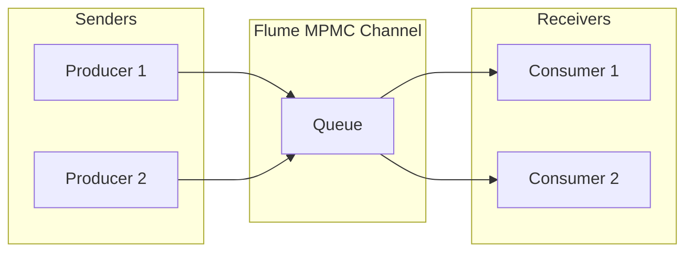

The **flume** crate is a high-performance, multi-producer, multi-consumer (MPMC) channel library for Rust. It is widely regarded as a safer, faster, and more versatile alternative to the standard library's `std::sync::mpsc`. Its primary strength lies in its ability to bridge synchronous and asynchronous code effortlessly within a single, unified API.

### Functional Footprint

Flume provides a thread-safe communication primitive (a "channel") that allows multiple senders and multiple receivers to exchange messages.

- **MPMC Support**: Unlike `std::sync::mpsc`, which only allows one receiver, Flume allows many receivers to compete for messages on the same channel.
- **Zero `unsafe`**: The crate is written in 100% safe Rust, making it a preferred choice for projects where memory safety and auditability are high priorities.
- **Unified Sync/Async**: It exposes both blocking and non-blocking (async) methods on the same `Sender` and `Receiver` types.
- **Channel Types**:

    - **Unbounded**: Grows dynamically; `send` never blocks unless memory is exhausted.
    - **Bounded**: Fixed capacity; `send` blocks (or returns an error/future) when full.
    - **Rendezvous**: Zero capacity; every `send` must be paired with an immediate `recv`.



### Features and Functionality

Flume uses Cargo features to manage its dependency tree and performance profile:

| Feature             | Functionality                                                | When to Use                                                                                           | When to Avoid                                                                    |
|:--------------------|:-------------------------------------------------------------|:------------------------------------------------------------------------------------------------------|:---------------------------------------------------------------------------------|
| `async`             | Enables `.send_async()` and `.recv_async()` methods.         | When communicating between async tasks or between sync threads and async tasks.                       | When your project is purely synchronous and you want to minimize dependencies.   |
| `select`            | Enables the `Selector` API for waiting on multiple channels. | When a thread/task needs to respond to the first available message across several different channels. | If you only ever listen to a single channel; `select` adds slight complexity.    |
| `eventual-fairness` | Uses randomness in `Selector` to prevent starvation.         | In high-load scenarios where one channel might "hog" the selector's attention.                        | In very performance-sensitive paths where the overhead of a PRNG is undesirable. |
| `spin`              | Uses spinlocks for internal synchronization.                 | When extreme low latency is required and CPU cores can be dedicated to spinning.                      | General-purpose applications where spinning wastes CPU cycles and battery.       |
| `default`           | Enables `async`, `select`, and `eventual-fairness`.          | Most standard applications.                                                                           | When building for `no_std` or highly constrained environments.                   |

### Key URLs

- **Repository**: [https://github.com/zesterer/flume](https://github.com/zesterer/flume)
- **Documentation**: [https://docs.rs/flume](https://docs.rs/flume)
- **Crates.io**: [https://crates.io/crates/flume](https://crates.io/crates/flume)

### Common Use Cases

#### 1. The "Rainbow Bridge" (Sync-to-Async Communication)

Flume is the gold standard for connecting traditional synchronous threads (e.g., a hardware driver or a legacy library) to a modern async runtime like Tokio.

```rust
use std::thread;
use flume;

#[tokio::main]
async fn main() {
    let (tx, rx) = flume::unbounded();

    // 1. Sync World: A background thread producing data
    thread::spawn(move || {
        for i in 0..10 {
            tx.send(format!("Message {}", i)).unwrap();
            std::thread::sleep(std::time::Duration::from_millis(100));
        }
    });

    // 2. Async World: Consuming the data in a task
    while let Ok(msg) = rx.recv_async().await {
        println!("Async received: {}", msg);
    }
}
```

#### 2. Parallel Worker Pool (MPMC)

Since Flume supports multiple consumers, you can easily distribute work across a pool of threads.

```rust
use flume;
use std::thread;

fn main() {
    let (tx, rx) = flume::bounded(5);

    // Spawn 3 consumers
    for id in 0..3 {
        let rx = rx.clone();
        thread::spawn(move || {
            while let Ok(job) = rx.recv() {
                println!("Worker {} processing job {}", id, job);
            }
        });
    }

    // Producer
    for j in 0..15 {
        tx.send(j).unwrap();
    }
}
```

### Developer Sentiment and Gotchas

Developers generally praise Flume for its "it just works" ergonomics and impressive performance-to-safety ratio. However, there are a few critical "gotchas":

- **The Async Blocking Footgun**: This is the most common mistake. Because `Receiver` has both `recv()` (blocking) and `recv_async()` (async), it is easy to accidentally call `recv()` inside an async function. This will **block the entire executor thread**, potentially leading to mysterious deadlocks and performance degradation.

    - *Workaround*: Always double-check that you are using the `_async` suffix in `.await` contexts.

- **Unbounded Memory Growth**: Using `flume::unbounded()` is convenient but dangerous in production. If producers outpace consumers, the internal queue will grow until the system runs out of memory.

    - *Workaround*: Prefer `flume::bounded(n)` to provide backpressure.

- **Casual Maintenance Mode**: The crate is currently in "casual maintenance." While it is stable and safe, do not expect rapid feature updates. It is considered "feature-complete."

### Version History

| Version    | Milestone                                                                                |
|:-----------|:-----------------------------------------------------------------------------------------|
| **0.12.0** | **Latest (Dec 2025)**: Maintenance release with dependency updates (`fastrand`, `spin`). |
| **0.11.0** | Improved `no_std` support and updated async dependencies.                                |
| **0.10.0** | Stabilized the `Selector` API for multiplexing.                                          |
| **0.8.0**  | **Major Pivot**: Rewritten to support MPMC (previously MPSC) and full async integration. |
| **0.1.0**  | Initial release as a faster `std::sync::mpsc` alternative.                               |
