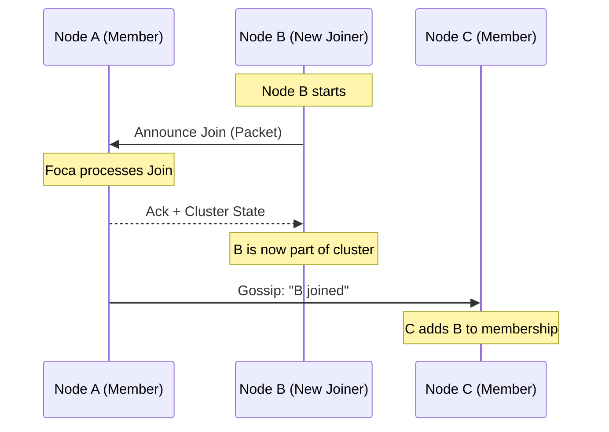

The **`foca`** crate is a high-performance, library-first implementation of the **SWIM** (Scalable Weakly-consistent Infection-style Process Group Membership) protocol. It provides the core logic for gossip-based cluster membership, failure detection, and data dissemination without prescribing a specific networking stack or identity format.

### Functional Footprint

`foca` implements the SWIM protocol along with its two most critical extensions: **Infection** (gossip) and **Suspicion** (failure detection refinement). Its functional scope includes:

* **Membership Management**: Tracking which nodes are active in a cluster.
* **Failure Detection**: Efficiently identifying crashed or unreachable nodes using a combination of direct pings and indirect probes.
* **Gossip Dissemination**: Propagating membership changes and custom user data across the cluster with $O(1)$ load per node.
* **Identity Agnosticism**: Users can define identities as simple as a `u32` or as complex as a struct containing shard IDs and version epochs.
* **Transport Independence**: It does not perform I/O. It generates buffers to be sent and processes buffers received, making it compatible with UDP, TCP, QUIC, or even shared memory.
* **Deterministic State Machine**: Designed to be easily tested and integrated into various async runtimes (Tokio, async-std, etc.) or bare-metal environments.

### Feature Mapping

| Feature              | Functionality                                                  | When to Use                                                                              | When to Avoid                                                                       |
|:---------------------|:---------------------------------------------------------------|:-----------------------------------------------------------------------------------------|:------------------------------------------------------------------------------------|
| **`std`**            | Compatibility with `std::net` types and configuration helpers. | Use for standard OS-based applications (Linux/macOS/Windows).                            | Avoid in `no_std` environments or when you need zero dependency on `std`.           |
| **`tracing`**        | Integration with the `tracing` ecosystem for logging.          | Use for debugging protocol state transitions and message flows.                          | Avoid if you have strict binary size constraints or use a different logging facade. |
| **`serde`**          | Serialization support for `foca` types.                        | Use if you want to use custom serialization formats (JSON, YAML) for config or identity. | Avoid if you don't need to persist or manually serialize `foca` internals.          |
| **`bincode-codec`**  | Pre-built `Bincode` codec for wire messages.                   | Use for rapid prototyping or high-performance networking on similar architectures.       | Avoid if you need cross-language compatibility (use a custom Protobuf/JSON codec).  |
| **`postcard-codec`** | Pre-built `Postcard` codec (no_std friendly).                  | Use for embedded systems or when minimizing packet size is critical.                     | Avoid if you prefer a self-describing or more common format.                        |

### Key URLs

* **Repository**: [https://github.com/caio/foca](https://github.com/caio/foca)
* **Documentation**: [https://docs.rs/foca](https://docs.rs/foca)
* **Crates.io**: [https://crates.io/crates/foca](https://crates.io/crates/foca)

### Common Use Cases

#### 1. Dynamic Cluster Membership

The primary use case is building a decentralized cluster where nodes can join and leave dynamically. `foca` handles the "discovery" phase once a single "seed" node is known.



**Implementation Example:**

```rust
use foca::{Foca, Config, Runtime, Timer};
use std::net::SocketAddr;

struct MyRuntime {
    socket: std::net::UdpSocket,
}

impl Runtime<SocketAddr> for MyRuntime {
    fn send_to(&mut self, to: &SocketAddr, data: &[u8]) {
        let _ = self.socket.send_to(data, to);
    }

    fn submit_after(&mut self, event: Timer<SocketAddr>, after: std::time::Duration) {
        // In a real app, you'd use a timer queue or tokio::spawn
        println!("Scheduled event {:?} after {:?}", event, after);
    }
}

// Basic initialization
let config = Config::new_lan();
let mut foca = Foca::with_custom_codec(
    "127.0.0.1:8080".parse().unwrap(),
    config,
    rand::rngs::OsRng,
    foca::BincodeCodec,
);
```

#### 2. Metadata Propagation (Custom Broadcasts)

`foca` allows "piggybacking" small pieces of data onto the standard SWIM messages. This is ideal for service discovery (e.g., "I am a 'Storage' node") or small configuration updates.

```rust
use foca::BroadcastHandler;

struct ServiceInfo {
    service_type: String,
    load_factor: u8,
}

// Implement BroadcastHandler to decide how your data is disseminated
impl BroadcastHandler for ServiceInfo {
    type Message = Vec<u8>;
    type Error = foca::Error;

    fn receive_item(&mut self, data: &[u8]) -> Result<bool, Self::Error> {
        println!("Received metadata update: {:?}", data);
        Ok(true) // Accept the update
    }
    // ... other methods to generate broadcasts
}
```

### Developer Sentiment & Gotchas

* **"Bring Your Own Networking"**: Developers appreciate the lack of "magic" networking, but it means you must write a robust event loop to handle both incoming UDP packets and `foca`'s internal timers. If you miss a timer tick, the node might be falsely suspected as dead.
* **Identity Lifecycle**: A common "gotcha" is reusing identities. If a node crashes and restarts on the same IP/Port, the cluster may ignore it because the "incarnation number" hasn't increased.

    * **Workaround**: Include a UUID or a boot timestamp in your `Identity` type to ensure every "life" of a node is unique.

* **UDP MTU**: Since SWIM uses gossip, messages can grow. Developers must be careful that their `Identity` and `Custom Broadcast` payloads don't exceed the UDP MTU (typically ~1400 bytes), otherwise packets will be dropped or fragmented.
* **No-Panic Guarantee**: The crate is highly regarded for its stability. It is designed to never panic, which is a major selling point for infrastructure software.

### Version History

| Version     | Date     | Key Changes                                                                                                              |
|:------------|:---------|:-------------------------------------------------------------------------------------------------------------------------|
| **v1.0.0**  | Dec 2025 | **Major Stable Release**. MSRV bumped to 1.81.0. Finalized `no_std` architecture and stabilized `Custom Broadcast` APIs. |
| **v0.13.0** | Mid 2024 | Introduced `apply_many` for bulk state synchronization and refined `Identity` traits.                                    |
| **v0.8.0**  | 2023     | Integrated `tracing` and improved `bincode`/`postcard` codec performance.                                                |
| **v0.1.0**  | 2020     | Initial public release of the core SWIM implementation.                                                                  |

**Latest Version**: `1.0.0`
