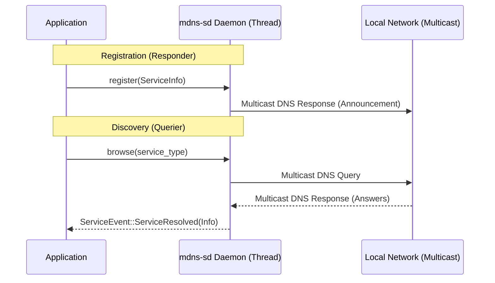

# Deep Dive: `mdns-sd` Crate

The `mdns-sd` crate is a pure-Rust implementation of **Multicast DNS (mDNS)** and **DNS-Based Service Discovery (DNS-SD)**. It allows devices on a local network to discover each other and the services they provide without a central server (Zero-Configuration Networking).

## Functional Footprint

`mdns-sd` provides a lightweight, runtime-agnostic daemon that handles both the **Responder** (announcing your own services) and **Querier** (finding other services) roles.

Key characteristics include:

- **Pure Rust:** No dependency on C libraries like `libavahi` or `Bonjour`.
- **Thread-Based Architecture:** It spawns a background thread to run the mDNS daemon. It does not require a specific async runtime (like Tokio) but provides `flume` channels for both synchronous and asynchronous communication.
- **Compliance:** Implements core parts of **RFC 6762** (mDNS) and **RFC 6763** (DNS-SD).
- **Dual Stack:** Supports both IPv4 and IPv6.



## Features and Functionality

| Feature     | Functionality                                    | When to Use                                                                              | When to Avoid                                                              |
|:------------|:-------------------------------------------------|:-----------------------------------------------------------------------------------------|:---------------------------------------------------------------------------|
| **`log`**   | Enables logging via the `log` crate.             | Use during development and in production for debugging network issues.                   | Avoid if you have strict binary size constraints and don't need mDNS logs. |
| **`serde`** | Adds `Serialize`/`Deserialize` to `ServiceInfo`. | Use if you need to store discovered service data in JSON/YAML or send it over a network. | Avoid if you don't need to persist or transmit the service metadata.       |

## Key URLs

- **Repository:** [https://github.com/keepsimple1/mdns-sd](https://github.com/keepsimple1/mdns-sd)
- **Documentation:** [https://docs.rs/mdns-sd](https://docs.rs/mdns-sd)
- **Crates.io:** [https://crates.io/crates/mdns-sd](https://crates.io/crates/mdns-sd)

## Common Use Cases

### 1. Peer-to-Peer Node Discovery

In a distributed system (like `claudine`), nodes need to find each other on the local network to form a cluster without manual IP configuration.

```rust
use mdns_sd::{ServiceDaemon, ServiceEvent};

fn discover_peers() {
    let mdns = ServiceDaemon::new().expect("Failed to create daemon");
    let receiver = mdns.browse("_claudine._tcp.local.").expect("Failed to browse");

    while let Ok(event) = receiver.recv() {
        match event {
            ServiceEvent::ServiceResolved(info) => {
                println!("Found peer: {} at {:?}", info.get_fullname(), info.get_addresses());
            }
            _ => {}
        }
    }
}
```

### 2. Zero-Config Web API Advertising

A local service (e.g., a web server) can advertise its presence so that a CLI tool or dashboard can find it automatically.

```rust
use mdns_sd::{ServiceDaemon, ServiceInfo};
use std::collections::HashMap;

fn advertise_service(port: u16) {
    let mdns = ServiceDaemon::new().unwrap();
    let mut props = HashMap::new();
    props.insert("api_version".to_string(), "v1".to_string());

    let service = ServiceInfo::new(
        "_http._tcp.local.",
        "claudine-node-1",
        "claudine.local.",
        "192.168.1.50",
        port,
        Some(props),
    ).expect("Invalid service info");

    mdns.register(service).expect("Failed to register");
}
```

### 3. Service Monitoring

Monitoring the network for when services go offline or change their properties.

```rust
use mdns_sd::{ServiceDaemon, ServiceEvent};

fn monitor_services() {
    let mdns = ServiceDaemon::new().unwrap();
    let receiver = mdns.browse("_http._tcp.local.").unwrap();

    while let Ok(event) = receiver.recv() {
        match event {
            ServiceEvent::ServiceRemoved(ty, name) => {
                println!("Service {} ({}) went offline", name, ty);
            }
            _ => {}
        }
    }
}
```

## Developer "Gotchas" and Feedback

- **Background Thread:** Because it spawns its own thread, it doesn't "yield" like a pure async task. If your application is highly sensitive to thread count, this may be a concern.
- **Unicast Support:** It lacks support for Unicast responses (RFC 6762 §5.4). It relies strictly on multicast, which can be less efficient in very busy networks.
- **TTL Issues:** Some routers drop mDNS packets if the IP TTL (Time to Live) is not set to **255**. Historically, this was a known issue in older versions, so ensuring you are on the latest release is critical.
- **Strict Parsing:** The crate is strict about DNS name compliance. Non-conformant IoT devices broadcasting "dirty" names might be ignored or cause parsing errors.
- **Windows Loopback:** On Windows, discovering a service running on the same machine (loopback) can be finicky due to how `Winsock` handles multicast loopback compared to Unix-like systems.

## Version History

- **v0.19.2 (Latest):** Maintenance release with improved IPv6 handling and bug fixes.
- **v0.19.0:** Major updates to the daemon's internal state machine and IP change detection.
- **v0.13.0:** Introduced the `flume` channel-based API, significantly improving the experience for both sync and async users.

**Latest Version:** `0.19.2`
