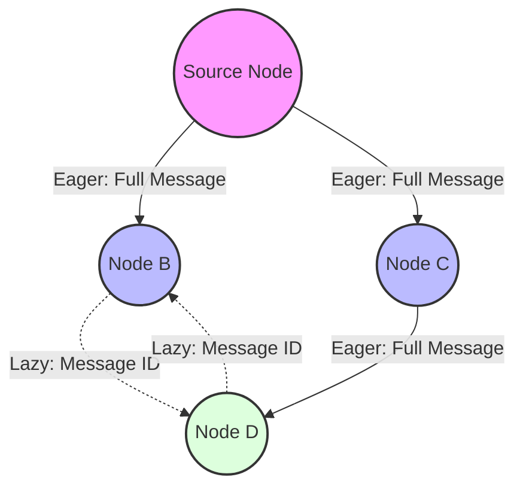

# Deep Dive: Plumtree Crate

The `plumtree` crate is a Rust implementation of the **Plumtree** algorithm (*Epidemic Broadcast Trees*). It is designed for efficient and reliable message dissemination in large-scale peer-to-peer (P2P) networks, combining the robustness of gossip protocols with the low redundancy of spanning trees.

## Functional Footprint

The `plumtree` crate provides a pure-logic state machine for managing a broadcast network. It does not include a networking layer (TCP/UDP), leaving transport and serialization to the developer.

### Core Mechanics

The algorithm operates by maintaining two types of links between peers:

1. **Eager Push Links:** These form a **deterministic spanning tree**. When a node receives a new message, it immediately pushes the full content to all its eager neighbors.
2. **Lazy Push Links:** These form a **probabilistic mesh**. Instead of the full message, nodes send only a message identifier (e.g., a hash). If a node realizes it has missed a message (after a timeout), it requests it from a lazy neighbor.

### Self-Healing

Plumtree is dynamic. If a link in the spanning tree fails or becomes congested, the protocol automatically repairs the tree:

* **PRUNE:** If a node receives a duplicate message via an eager link, it sends a `PRUNE` message to move that link from "eager" to "lazy".
* **GRAFT:** If a node receives a lazy "I-have" notification for a message it hasn't seen yet, it sends a `GRAFT` message to promote that link to "eager" to recover the missing path.



## Features

The `plumtree` crate is designed to be extremely lightweight and minimalist.

| Feature     | Functionality                                                                                          | When to Use                          | When to Avoid                                            |
|:------------|:-------------------------------------------------------------------------------------------------------|:-------------------------------------|:---------------------------------------------------------|
| **Default** | Core state machine logic only.                                                                         | Always; this is the primary purpose. | N/A                                                      |
| **No-Std**  | While not explicitly advertised as `no_std`, it has zero runtime dependencies and is easily adaptable. | Embedded or WASM environments.       | When high-level async primitives are needed immediately. |

*Note: The crate defines no optional Cargo features. It is a "bare-metal" logic library.*

## Key URLs

* **Repository:** [https://github.com/sile/plumtree](https://github.com/sile/plumtree)
* **Documentation:** [https://docs.rs/plumtree](https://docs.rs/plumtree)
* **Crates.io:** [https://crates.io/crates/plumtree](https://crates.io/crates/plumtree)

## Common Use Cases

### 1. Distributed Configuration Management

Propagating configuration changes across thousands of nodes in a cluster without flooding the network with redundant data.

```rust
use plumtree::{Node, NodeOptions, Action};

// Hypothetical implementation
fn handle_config_update(node: &mut Node<String, String>, update: String) {
    // Inject a new message into the broadcast tree
    node.broadcast(update);
    
    // Process resulting actions
    while let Some(action) = node.poll_action() {
        match action {
            Action::SendGossip { neighbor, message } => {
                // Send full config to eager neighbor
                send_to_net(neighbor, message);
            }
            Action::SendIHave { neighbor, message_id } => {
                // Send lazy notification to mesh neighbor
                send_id_to_net(neighbor, message_id);
            }
            _ => {}
        }
    }
}
```

### 2. Peer-to-Peer State Sync (Member Lists)

Keeping a decentralized list of "who is online" synchronized across a high-churn network.

```rust
// When a node joins or leaves, the event is broadcast
let event = "Node-X:Joined".to_string();
my_plumtree_node.handle_message(sender_id, plumtree::msgs::Message::Gossip(event));
```

### 3. Blockchain Block Propagation

Broadcasting new blocks to a global network of miners. The "Lazy Push" mechanism is particularly useful here as blocks are large; sending just the hash first saves massive bandwidth if the peer already received the block from another branch.

## Developer Feedback & Gotchas

* **Logic Only:** This crate does **not** handle networking. Developers frequently complain about the boilerplate required to implement the `System` trait or manage the polling loop.
* **Rust Edition:** The crate was last updated in 2018 and uses **Rust 2015**. While it still compiles, it lacks modern `async/await` support. Users often wrap it in an `Arc<Mutex<Node>>` and use a separate task for network I/O.
* **Message Redundancy:** While lower than pure gossip, there is still *some* redundancy during the "PRUNE" phase when the tree is first forming or repairing.
* **Maintenance:** The crate is considered "feature complete" but effectively stagnant. For a more modern, actively maintained alternative that includes the networking stack, developers often point to `iroh-gossip`.

## Version History

| Version   | Date         | Key Changes                                                     |
|:----------|:-------------|:----------------------------------------------------------------|
| **0.1.1** | Jul 16, 2018 | Minor bug fixes and documentation cleanup. **(Current Latest)** |
| **0.1.0** | Jul 15, 2018 | Initial stable release of the core algorithm.                   |
| **0.0.x** | Jun-Jul 2018 | Experimental releases and API prototyping.                      |

---

**latest_version:** 0.1.1
