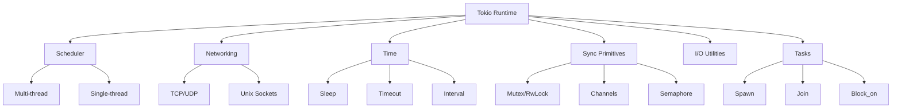

I'll start by loading the tokio skill and searching for any existing tokio-related files in the workspace.# Tokio Deep Dive

## Functional Footprint

Tokio is an asynchronous runtime for Rust that provides the core infrastructure for writing non-blocking, high-concurrency applications. Its functional footprint spans:

- **Async runtime**: Multi-threaded and single-threaded schedulers with work-stealing
- **Networking**: TCP, UDP, and Unix socket APIs with async I/O
- **Time**: Sleep, timeouts, intervals, and timers
- **Synchronization**: Async mutexes, semaphores, channels, and notification primitives
- **Task management**: Spawning, joining, and coordinating concurrent tasks
- **I/O utilities**: Async read/write extension traits and helpers
- **Process & signal handling**: Async process spawning and OS signal handling



## Feature Flags

Tokio exposes functionality through Cargo feature flags. Add features only as needed rather than using `full` in production.

| Feature           | Functionality                                 | When to Use                     | When to Avoid                                         |
|-------------------|-----------------------------------------------|---------------------------------|-------------------------------------------------------|
| `macros`          | `#[tokio::main]`, `#[tokio::test]`            | Almost always for entry points  | —                                                     |
| `rt`              | Basic runtime (`Runtime::new`)                | When building runtimes manually | —                                                     |
| `rt-multi-thread` | Multi-threaded scheduler                      | Most server/CLI apps            | Embedded or single-thread contexts                    |
| `net`             | TCP, UDP, Unix sockets                        | Any networking code             | Pure computation tools                                |
| `time`            | `sleep`, `timeout`, `interval`                | Timeouts, periodic work, delays | —                                                     |
| `sync`            | `Mutex`, `RwLock`, channels, `Semaphore`      | Shared state across tasks       | —                                                     |
| `fs`              | Async file operations                         | File I/O in async context       | When disk throughput matters more than responsiveness |
| `io-util`         | `AsyncReadExt`, `AsyncWriteExt`, `copy`, etc. | Custom protocol parsers         | —                                                     |
| `signal`          | Async OS signal handling                      | Graceful shutdown               | —                                                     |
| `process`         | Async child process management                | Running external commands       | —                                                     |
| `tracing`         | Integration with `tracing` crate              | Observability/debugging         | —                                                     |
| `full`            | Enables all features                          | Prototyping, learning           | Production builds (heavier compile times/deps)        |

### Recommended Baseline

```toml
[dependencies]
tokio = { version = "1.0", features = ["macros", "rt-multi-thread"] }
```

### Network Service Example

```toml
[dependencies]
tokio = { version = "1.0", features = ["macros", "rt-multi-thread", "net", "io-util", "time", "sync"] }
```

## Key URLs

- **Website**: https://tokio.rs
- **Documentation**: https://docs.rs/tokio
- **Repository**: https://github.com/tokio-rs/tokio
- **Book / Guides**: https://tokio.rs/tokio/tutorial

## Common Use Cases

### Use Case 1: TCP Echo Server

A classic network service pattern: accept incoming connections and spawn a task per connection to handle concurrent clients without blocking.

```rust
use tokio::io::{AsyncReadExt, AsyncWriteExt};
use tokio::net::TcpListener;

#[tokio::main]
async fn main() -> Result<(), Box<dyn std::error::Error>> {
    let listener = TcpListener::bind("127.0.0.1:8080").await?;

    loop {
        let (mut socket, addr) = listener.accept().await?;
        eprintln!("connection from: {addr}");

        tokio::spawn(async move {
            let mut buf = [0u8; 1024];
            loop {
                let n = match socket.read(&mut buf).await {
                    Ok(0) => return,
                    Ok(n) => n,
                    Err(e) => {
                        eprintln!("read error: {e}");
                        return;
                    }
                };

                if let Err(e) = socket.write_all(&buf[..n]).await {
                    eprintln!("write error: {e}");
                    return;
                }
            }
        });
    }
}
```

### Use Case 2: Concurrent API Client with Timeouts

Coordinate multiple outbound requests with bounded concurrency and automatic timeout handling.

```rust
use std::time::Duration;
use tokio::time::timeout;

async fn fetch_with_timeout(url: &str) -> Result<String, &'static str> {
    // Simulated fetch
    let fetch = async {
        tokio::time::sleep(Duration::from_millis(100)).await;
        Ok(format!("data from {url}"))
    };

    match timeout(Duration::from_secs(2), fetch).await {
        Ok(Ok(data)) => Ok(data),
        Ok(Err(_)) => Err("request failed"),
        Err(_) => Err("request timed out"),
    }
}

#[tokio::main]
async fn main() {
    let urls = vec!["https://a.example", "https://b.example", "https://c.example"];

    let fetches = urls.into_iter().map(|url| fetch_with_timeout(url));
    let results: Vec<_> = futures::future::join_all(fetches).await;

    for (url, result) in results.iter().enumerate() {
        match result {
            Ok(data) => println!("{url}: {data}"),
            Err(e) => eprintln!("{url}: {e}"),
        }
    }
}
```

### Use Case 3: Producer-Consumer Pipeline with Bounded Channels

Use an async channel to decouple work producers from consumers and apply backpressure.

```rust
use tokio::sync::mpsc;

#[tokio::main]
async fn main() {
    let (tx, mut rx) = mpsc::channel::<u32>(100);

    // Producer
    let producer = tokio::spawn(async move {
        for i in 0..10 {
            if tx.send(i).await.is_err() {
                println!("receiver dropped");
                return;
            }
        }
    });

    // Consumer
    let consumer = tokio::spawn(async move {
        while let Some(value) = rx.recv().await {
            println!("processing: {value}");
        }
    });

    let _ = tokio::join!(producer, consumer);
}
```

## Developer Feedback and Gotchas

### What Developers Say

- Tokio is the de facto standard async runtime in Rust; most of the ecosystem (axum, reqwest, tonic) assumes it.
- It is mature, well-documented, and actively maintained with a stable 1.x API promise.
- The feature-flag model is powerful but a common source of beginner confusion.

### Common Gotchas and Workarounds

**1. Blocking the Runtime**

- **Symptom**: Latency spikes, stuck tasks, unresponsive server.
- **Fix**: Never call blocking operations (e.g., `std::thread::sleep`, heavy CPU work) on async threads. Use `tokio::task::spawn_blocking` instead.

**2. Holding `std::sync::Mutex` Across `.await`**

- **Symptom**: Deadlocks or long stalls.
- **Fix**: Use `tokio::sync::Mutex` in async code, and keep critical sections short. Drop the guard before awaiting.

**3. Runtime Shutdown Before Tasks Complete**

- **Symptom**: Spawned task logs never appear; work is silently dropped.
- **Fix**: Keep `JoinHandle`s and await them, or coordinate completion via channels.

**4. Cooperative Scheduling Starvation**

- **Symptom**: One busy loop makes other tasks unresponsive.
- **Fix**: Ensure loops contain `.await` points. For CPU-heavy loops, insert `tokio::task::yield_now().await`.

**5. File I/O Expectations**

- **Symptom**: Async file I/O does not improve bulk disk throughput on all OSes.
- **Fix**: Use Tokio file I/O for responsiveness, not raw throughput. For large sequential reads, `spawn_blocking` may be faster.

**6. Feature Flag Confusion**

- **Symptom**: "Cannot find macro `tokio::main`" or missing types like `TcpListener`.
- **Fix**: Add the required feature flags (`macros`, `net`, etc.) instead of assuming `full`.

## Version History

| Version | Era                  | Notes                                     |
|---------|----------------------|-------------------------------------------|
| 0.1     | Early async/await    | Pre-stable futures; largely superseded    |
| 0.2     | Maturity phase       | Widely adopted; breaking changes from 0.1 |
| 0.3     | Transition           | Bridge toward 1.0 stability               |
| 1.0     | December 2020        | Stable API promise; current major line    |
| 1.52.3  | Latest (as of today) | Current stable release                    |

**Latest Version**: 1.52.3
