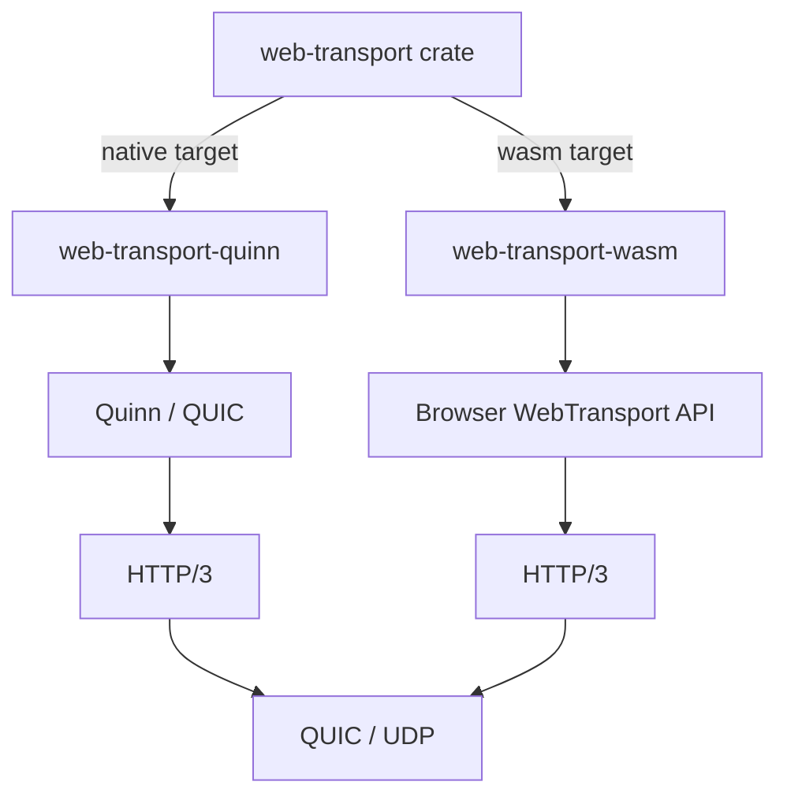

The `web-transport` crate is a thin, generic abstraction over the WebTransport protocol. It delegates to platform-specific backends — `web-transport-quinn` for native (desktop/server) targets and `web-transport-wasm` for WebAssembly (browser) targets — allowing the same high-level code to compile for both environments.

## Functional Footprint

The crate exposes a minimal, QUIC-like surface area:

| Type                        | Purpose                                                                      |
|-----------------------------|------------------------------------------------------------------------------|
| `Client` / `ClientBuilder`  | Dial one or more WebTransport sessions.                                      |
| `Server` *(native only)*    | Accept incoming sessions.                                                    |
| `Session`                   | An established connection; create/accept streams and send/receive datagrams. |
| `SendStream` / `RecvStream` | Ordered, reliable, flow-controlled byte streams.                             |
| `CongestionControl`         | Tuning for low-latency vs. throughput.                                       |

Because WebTransport sits on HTTP/3, which sits on QUIC, the crate intentionally hides the HTTP/3 handshake and exposes only QUIC semantics: **streams** (reliable, ordered, bidirectional or unidirectional) and **datagrams** (unreliable, unordered, MTU-capped).



## Features

The `web-transport` crate itself **does not declare any Cargo feature flags**. Feature selection happens in the underlying backend, most notably `web-transport-quinn`:

| Feature     | Default? | What it does                                                                                                                                                    |
|-------------|----------|-----------------------------------------------------------------------------------------------------------------------------------------------------------------|
| `aws-lc-rs` | **Yes**  | Uses `aws-lc-rs` as the TLS/crypto provider via rustls. This is the modern, performant default.                                                                 |
| `ring`      | No       | Switches the TLS/crypto provider to `ring`. Use this if you already depend on `ring` throughout your workspace or need to avoid `aws-lc-rs` build requirements. |

**When to use each:**

- Stick with the default `aws-lc-rs` unless you have a specific reason to prefer `ring` (e.g., existing `ring`-only dependencies, platform constraints, or FIPS considerations).
- On WASM, `web-transport-wasm` wraps the browser’s built-in WebTransport API and has no features to toggle.

## Key URLs

| Resource                | URL                                                                                                                                    |
|-------------------------|----------------------------------------------------------------------------------------------------------------------------------------|
| **Crates.io**           | <https://crates.io/crates/web-transport>                                                       |
| **Docs.rs**             | <https://docs.rs/web-transport>                                                                         |
| **Repository**          | <https://github.com/moq-dev/web-transport>                                                   |
| **Discord / Community** | Linked from repo README                                                                                                                |
| **WebTransport Spec**   | <https://developer.mozilla.org/en-US/docs/Web/API/WebTransport_API> |

## Common Use Cases

### 1. Low-Latency Game or Live State Streaming

Use **unreliable datagrams** for frequent, small updates (player position, game state) where dropped packets are preferable to head-of-line blocking. Use **bidirectional streams** for reliable control messages.

```rust
use web_transport::{Client, ClientBuilder};

#[tokio::main]
async fn main() -> Result<(), Box<dyn std::error::Error>> {
    // Connect using system root CAs
    let client = ClientBuilder::new().with_system_roots()?;
    let session = client.connect("https://game.example.com:4433".parse()?).await?;

    // Send unreliable datagrams (best-effort, unordered)
    let payload = b"\x01\x02\x03";
    if payload.len() <= session.max_datagram_size() {
        session.send_datagram(payload.into()).ok();
    }

    // Open a reliable bidirectional stream for chat / commands
    let (mut send, mut recv) = session.open_bi().await?;
    send.write_all(b"join_room:lobby_42").await?;

    Ok(())
}
```

### 2. Cross-Platform Native + Browser Client

Because `web-transport` delegates to `web-transport-quinn` on native and `web-transport-wasm` in the browser, you can share session logic across targets:

```rust
#[cfg(target_arch = "wasm32")]
use wasm_bindgen_futures::spawn_local;

#[cfg(not(target_arch = "wasm32"))]
use tokio::spawn as spawn_local;

async fn run_client(url: &str) -> Result<(), web_transport::Error> {
    let client = web_transport::ClientBuilder::new().with_system_roots()?;
    let session = client.connect(url.parse().unwrap()).await?;

    // Same code works on desktop and in the browser
    let (mut send, mut recv) = session.open_bi().await?;
    send.write_all(b"hello from rust").await?;
    Ok(())
}
```

### 3. WebTransport Server Echo (Native Only)

```rust
use web_transport::{Server, Session};

#[tokio::main]
async fn main() -> Result<(), Box<dyn std::error::Error>> {
    // Build a Quinn-based server and convert into the generic web-transport Server
    let quinn_server = web_transport::quinn::ServerBuilder::new()
        .with_bind_default(4433)
        .with_identity(&load_identity().await?)
        .build()?;

    let mut server: Server = quinn_server.into();

    while let Some(Ok(session)) = server.accept().await? {
        tokio::spawn(handle_session(session));
    }
    Ok(())
}

async fn handle_session(session: Session) -> Result<(), web_transport::Error> {
    let (mut send, mut recv) = session.accept_bi().await?;
    let mut buf = [0u8; 1024];
    let n = recv.read(&mut buf).await?.unwrap_or(0);
    send.write_all(&buf[..n]).await?;
    Ok(())
}
```

## Developer Feedback & Gotchas

| Gotcha                               | Workaround / Notes                                                                                                                                                                  |
|--------------------------------------|-------------------------------------------------------------------------------------------------------------------------------------------------------------------------------------|
| **TLS / certificates are mandatory** | Browsers require valid TLS. For local development, use self-signed certs and launch the browser with certificate-spki flags, or use `with_server_certificate_hashes` to pin a hash. |
| **No HTTP/3 pooling**                | `web-transport-quinn` owns the entire QUIC connection. If you need HTTP/3 and WebTransport on the same port, look at `h3-webtransport` instead.                                     |
| **Datagrams can silently drop**      | QUIC datagrams are best-effort. Always check `max_datagram_size()` and never assume delivery.                                                                                       |
| **WASM cannot run a Server**         | Browsers are clients only. The `Server` type is absent or non-functional on `wasm32-unknown-unknown`.                                                                               |
| **0-RTT is not exposed**             | The crate does not currently expose 0-RTT session resumption; expect a full handshake.                                                                                              |
| **API still evolving**               | The ecosystem is young. Lock your version and expect minor breaking changes between 0.x releases.                                                                                   |

## Version History

The crate follows SemVer in the 0.x range. Notable milestones:

| Version | Date           | Notes                                                            |
|---------|----------------|------------------------------------------------------------------|
| 0.0.1   | 2024-03-30     | Initial placeholder release.                                     |
| 0.1.0   | 2024-04-06     | First functional release.                                        |
| 0.5.0   | 2024-08-12     | Early stabilization of client/server split.                      |
| 0.6.0   | 2024-08-19     | Description updated to “Generic WebTransport client and server.” |
| 0.7.0   | 2024-12-03     | Native-only Server note added to docs.                           |
| 0.8.0   | 2025-01-28     | Notable refactor; line count grew to ~290.                       |
| 0.9.0   | 2025-05-21     | New 0.9 series with expanded API surface.                        |
| 0.10.0  | 2024-04-06     | **Yanked** shortly after release.                                |
| 0.10.1  | 2026-02-18     | Corrected 0.10.x line.                                           |
| 0.10.5  | **2026-04-07** | **Latest stable** as of today.                                   |

**Latest version:** `0.10.5`
