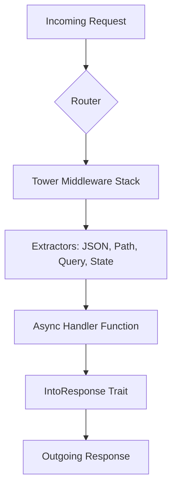

## Axum
Axum is a web application framework that focuses on ergonomics and modularity. Built by the **Tokio** team, it is designed to be a thin wrapper around `hyper` and `tower`, making it part of the most robust and high-performance ecosystem in Rust.

### Functional Footprint

Axum's footprint is defined by its "macro-free" philosophy and its heavy reliance on traits and the `tower` middleware ecosystem. Its core functionality includes:

* **Routing**: A builder-style routing system that avoids complex macros in favor of standard Rust method calls.
* **Extractors**: A declarative way to parse request parts (JSON, paths, queries, state) by adding them as arguments to handler functions.
* **Middleware**: Native compatibility with `tower::Service`, allowing it to use any middleware from the `tower-http` ecosystem.
* **Type-Safe State**: A robust system for sharing application state (like database pools) that is verified at compile-time.
* **Concurrency**: Built on `tokio` and `hyper`, supporting high-concurrency and asynchronous processing out of the box.



### Features and Mapping

Axum uses feature flags to keep its dependency tree lean. Below is the mapping for version `0.8.x`:

| Feature               | Functionality                                        | When to Use                                                        | When to Avoid                                                   |
|:----------------------|:-----------------------------------------------------|:-------------------------------------------------------------------|:----------------------------------------------------------------|
| **`json`** (Default)  | `serde_json` integration for request/response.       | Building any standard JSON REST API.                               | If building a purely HTML-based server or using Protobuf.       |
| **`form`** (Default)  | `application/x-www-form-urlencoded` support.         | Handling traditional HTML form submissions.                        | If only supporting JSON or file uploads.                        |
| **`query`** (Default) | Parsing URL query strings.                           | Filtering, pagination, or search functionality.                    | Rarely avoided; standard for most APIs.                         |
| **`tokio`** (Default) | Integration with the `tokio` runtime and networking. | Always, unless you are using a custom `hyper` setup.               | Never, unless you have advanced custom runtime needs.           |
| **`ws`**              | WebSocket support via `tokio-tungstenite`.           | Real-time features (chat, live updates, gaming).                   | If your app is strictly request-response (REST/GraphQL).        |
| **`multipart`**       | `multipart/form-data` parsing.                       | Handling file uploads or complex multi-part forms.                 | To avoid the overhead of the `multer` dependency if not needed. |
| **`macros`**          | Enables the `#[debug_handler]` attribute.            | **Highly recommended** during development for better errors.       | Can be disabled in production to speed up compile times.        |
| **`http2`**           | HTTP/2 protocol support.                             | When serving directly to clients (no proxy) or gRPC compatibility. | If running behind an Nginx/Caddy proxy that handles HTTP/2.     |

### Key URLs

* **Repository**: [github.com/tokio-rs/axum](https://github.com/tokio-rs/axum)
* **Documentation**: [docs.rs/axum](https://docs.rs/axum)
* **Website**: [tokio.rs](https://tokio.rs/axum)
* **Examples**: [Axum GitHub Examples](https://github.com/tokio-rs/axum/tree/main/examples)

### Common Use Cases

#### 1. High-Performance REST API

The most common use case, leveraging Axum's speed and type safety for JSON processing.

```rust
use axum::{routing::{get, post}, Json, Router};
use serde::{Deserialize, Serialize};

#[derive(Deserialize)]
struct CreateUser { username: String }

#[derive(Serialize)]
struct User { id: u64, username: String }

async fn create_user(Json(payload): Json<CreateUser>) -> Json<User> {
    let user = User { id: 1337, username: payload.username };
    Json(user)
}

#[tokio::main]
async fn main() {
    let app = Router::new()
        .route("/users", post(create_user));
    
    let listener = tokio::net::TcpListener::bind("127.0.0.1:3000").await.unwrap();
    axum::serve(listener, app).await.unwrap();
}
```

#### 2. Real-time WebSocket Server

Axum provides a high-level `WebSocketUpgrade` extractor that simplifies the handshake and connection process.

```rust
use axum::{extract::ws::{WebSocket, WebSocketUpgrade}, routing::get, Router};

async fn handler(ws: WebSocketUpgrade) -> impl axum::response::IntoResponse {
    ws.on_upgrade(handle_socket)
}

async fn handle_socket(mut socket: WebSocket) {
    while let Some(Ok(msg)) = socket.recv().await {
        if socket.send(msg).await.is_err() { break; }
    }
}

let app = Router::new().route("/ws", get(handler));
```

#### 3. Microservice with Shared Application State

Axum ensures that the required state is provided to handlers at compile-time.

```rust
use axum::{extract::State, routing::get, Router};
use std::sync::Arc;

struct AppState { db_connection: String }

async fn get_db_status(State(state): State<Arc<AppState>>) -> String {
    format!("Connected to: {}", state.db_connection)
}

let shared_state = Arc::new(AppState { db_connection: "postgres://...".into() });
let app = Router::new()
    .route("/status", get(get_db_status))
    .with_state(shared_state);
```

### Developer Sentiment & Gotchas

Developers generally praise Axum for its "magic-free" approach compared to Rocket, and its excellent integration with the Tokio ecosystem. However, there are several "gotchas" to watch for:

* **The "Handler Not Implemented" Error**: This is the most infamous issue. If a handler doesn't meet the `Handler` trait requirements (e.g., wrong return type or extractor order), the compiler emits a massive, cryptic error.

    * *Workaround*: Use the `#[axum::debug_handler]` macro to pinpoint the exact issue.

* **Extractor Order**: Extractors that consume the request body (like `Json`, `Form`, or `Bytes`) **must be the last argument** in the handler. Axum can only read the body once.
* **Path Parameter Syntax Change (0.8)**: In versions 0.7 and earlier, parameters were defined as `:id`. In 0.8, this changed to `{id}`. Using the old syntax will cause a runtime panic.
* **Sync Requirement**: As of 0.8, all handlers and state must be `Sync`. If you are using types like `RefCell` or `Rc`, you must migrate to `Mutex` or `Arc`.

### Version History

* **v0.1 (2021)**: Initial release; proved the concept of a `tower`-based framework.
* **v0.4 (2022)**: Stabilized the `Handler` trait and improved routing performance.
* **v0.6 (2023)**: Introduced `State<S>`, moving away from the more error-prone `Extension<T>` for application state.
* **v0.7 (2024)**: Major migration to `hyper` 1.0 and `http` 1.0.
* **v0.8 (2025/2026)**: Current major version. Migrated to native Rust **async traits**, removing the dependency on the `async-trait` crate and changing the path syntax to `{param}` for better alignment with industry standards.

**Latest Version:** `0.8.9` (as of May 2026)
