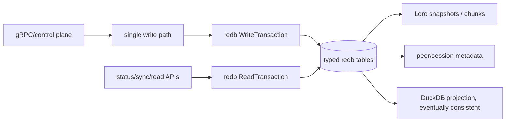

# `redb` crate

`latest_version` should be set to `"4.1.0"`.

## Functional Footprint

`redb` is a pure-Rust embedded key-value database. It is closer to LMDB/RocksDB than SQLite: it stores typed key-value tables in a single local database file, not relational rows queried with SQL. The public docs describe it as a portable, ACID embedded store using copy-on-write B-trees, with zero-copy reads, MVCC, crash safety, savepoints, and rollback support.

Core footprint:

- Embedded, in-process database; no server process.
- Single database file with copy-on-write B-tree storage.
- Strongly typed table definitions via `TableDefinition<K, V>` and `MultimapTableDefinition<K, V>`.
- `BTreeMap`-like APIs: `insert`, `get`, `remove`, `range`, `iter`, `len`, `retain`, extraction APIs, and multimap lookup.
- ACID transactions with one writer and many concurrent readers. `begin_write()` blocks while another writer is active.
- MVCC readers that can run concurrently with a writer.
- Configurable transaction durability: `Immediate` by default, or `None` for faster non-durable commits.
- Savepoints: ephemeral savepoints plus persistent savepoint APIs in modern releases.
- Online compaction and integrity checking/repair.
- Read-only multi-process support through `ReadOnlyDatabase`; normal writable `Database` is exclusive.
- Custom storage backends via `StorageBackend`.
- Synchronous API only; no native async API.

A useful mental model for `rendezvous`:



For `rendezvous`, `redb` is a good fit as the daemon-owned OLTP source of truth: durable session-log chunks, snapshots, peer metadata, and queue/checkpoint state can live in one local file while DuckDB remains a derived analytical projection.

## Features

As of `redb` 4.1.0, docs.rs lists four Cargo features, none enabled by default.

| Feature         | Maps To                                                                                                                        | Use When                                                                                                                  | Avoid When                                                                                                                                              |
|-----------------|--------------------------------------------------------------------------------------------------------------------------------|---------------------------------------------------------------------------------------------------------------------------|---------------------------------------------------------------------------------------------------------------------------------------------------------|
| `logging`       | Enables internal logging through the optional `log` dependency.                                                                | Debugging database open/repair/commit/compaction behavior, or when production diagnostics justify redb internals in logs. | Default daemon builds where extra log volume is not useful.                                                                                             |
| `cache_metrics` | Enables collection of cache hit/miss/eviction stats surfaced through `cache_stats()`.                                          | Tuning `Builder::set_cache_size`, investigating read latency, or validating daemon memory/cache behavior.                 | Hot-path production builds where metrics are not read; leave it off unless you need the data.                                                           |
| `chrono_v0_4`   | Implements redb serialization support for selected `chrono` types, including naive date/time and fixed-offset date/time types. | You want to store these time types directly as keys or values.                                                            | If timestamps can be normalized to primitive integers, RFC3339 strings, or domain structs; fewer optional deps usually keeps schema migrations clearer. |
| `uuid`          | Implements redb serialization support for `uuid::Uuid`.                                                                        | UUIDs are first-class keys or values, such as peer IDs, node IDs, or message IDs.                                         | If the domain already stores IDs as canonical bytes/strings, or if avoiding optional deps matters.                                                      |

For `rendezvous`, start with no features. Add `cache_metrics` only if storage tuning needs it. Add `uuid` only if UUID values become the canonical storage type. Prefer stable domain key encodings for persisted protocol data.

## Key URLs

| Resource         | URL                                                                                                                      |
|------------------|--------------------------------------------------------------------------------------------------------------------------|
| Crate            | <https://crates.io/crates/redb>                                                           |
| Documentation    | <https://docs.rs/redb/latest/redb/>                                                   |
| Repository       | <https://github.com/cberner/redb>                                                       |
| Website          | <https://www.redb.org>                                                                             |
| Design document  | <https://github.com/cberner/redb/blob/master/docs/design.md> |
| Changelog        | <https://github.com/cberner/redb/blob/master/CHANGELOG.md>     |
| 1.0 announcement | <https://www.redb.org/post/2023/06/16/1-0-stable-release/>     |

## Common Use Cases

### 1. Durable daemon metadata and checkpoints

Use `redb` when a daemon owns a local state file and needs fast transactional updates without running a separate database server. For `rendezvous`, this covers peer trust state, advertised chunk sets, sync cursors, and projection checkpoints.

```rust
use redb::{Database, Error, ReadableDatabase, ReadableTable, TableDefinition};
use std::path::Path;

const META: TableDefinition<&str, &str> = TableDefinition::new("meta");

fn set_projection_checkpoint(path: &Path, checkpoint: &str) -> Result<(), Error> {
    let db = Database::create(path)?;
    let txn = db.begin_write()?;

    {
        let mut table = txn.open_table(META)?;
        table.insert("duckdb_projection_checkpoint", checkpoint)?;
    }

    txn.commit()
}

fn projection_checkpoint(path: &Path) -> Result<Option<String>, Error> {
    let db = Database::open(path)?;
    let txn = db.begin_read()?;
    let table = txn.open_table(META)?;

    Ok(table
        .get("duckdb_projection_checkpoint")?
        .map(|value| value.value().to_owned()))
}
```

### 2. Append-only event or session-log storage

Use `redb` as the authoritative local write-ahead/session log when each append must atomically update both the event payload and an index or snapshot pointer. Keep the write section small, and let one daemon-owned writer path serialize writes.

```rust
use redb::{Database, Error, ReadableDatabase, ReadableTable, TableDefinition};
use std::path::Path;

const EVENTS: TableDefinition<u64, &[u8]> = TableDefinition::new("events");
const META: TableDefinition<&str, u64> = TableDefinition::new("meta");

fn append_event(path: &Path, bytes: &[u8]) -> Result<u64, Error> {
    let db = Database::create(path)?;
    let txn = db.begin_write()?;

    let next_id = {
        let mut meta = txn.open_table(META)?;
        let next = meta.get("next_event_id")?.map_or(0, |id| id.value());
        meta.insert("next_event_id", &(next + 1))?;
        next
    };

    {
        let mut events = txn.open_table(EVENTS)?;
        events.insert(&next_id, bytes)?;
    }

    txn.commit()?;
    Ok(next_id)
}

fn read_events_from(path: &Path, start: u64) -> Result<Vec<(u64, Vec<u8>)>, Error> {
    let db = Database::open(path)?;
    let txn = db.begin_read()?;
    let events = txn.open_table(EVENTS)?;

    let mut out = Vec::new();
    for item in events.range(start..)? {
        let (key, value) = item?;
        out.push((key.value(), value.value().to_vec()));
    }

    Ok(out)
}
```

### 3. Secondary indexes with multimap tables

Use multimap tables when one key maps to many values: session ID to chunk IDs, peer ID to advertised chunks, tag to documents, or workflow ID to event IDs. This avoids packing and rewriting manual `Vec<T>` values for each index key.

```rust
use redb::{
    Database, Error, MultimapTableDefinition, ReadableDatabase, ReadableMultimapTable,
};
use std::path::Path;

const SESSION_CHUNKS: MultimapTableDefinition<&str, u64> =
    MultimapTableDefinition::new("session_chunks");

fn index_chunk(path: &Path, session_id: &str, chunk_index: u64) -> Result<(), Error> {
    let db = Database::create(path)?;
    let txn = db.begin_write()?;

    {
        let mut table = txn.open_multimap_table(SESSION_CHUNKS)?;
        table.insert(session_id, &chunk_index)?;
    }

    txn.commit()
}

fn chunks_for_session(path: &Path, session_id: &str) -> Result<Vec<u64>, Error> {
    let db = Database::open(path)?;
    let txn = db.begin_read()?;
    let table = txn.open_multimap_table(SESSION_CHUNKS)?;

    let mut chunks = Vec::new();
    for value in table.get(session_id)? {
        chunks.push(value?.value());
    }

    Ok(chunks)
}
```

## Developer Feedback and Gotchas

Developers generally value `redb` for being an LMDB-like embedded store in safe Rust, with a typed API and strong transactional semantics. The 1.0 announcement positioned it as a memory-safe embedded KV store with MVCC, zero-copy reads, ACID semantics, and savepoints. Community discussion also highlights the important boundary: it is not SQLite and does not provide SQL, relational modeling, or built-in auto-increment semantics.

Important gotchas:

| Gotcha                                             | Why It Matters                                                                                                                                                                                 | Workaround                                                                                                                                                                                  |
|----------------------------------------------------|------------------------------------------------------------------------------------------------------------------------------------------------------------------------------------------------|---------------------------------------------------------------------------------------------------------------------------------------------------------------------------------------------|
| Single writer                                      | `begin_write()` blocks while another write transaction exists. In an async daemon, holding a write transaction across `.await` can stall unrelated work.                                       | Use one writer task or a bounded write queue. Build all data before opening the transaction. Commit before any `.await`. Use `spawn_blocking` or a dedicated storage thread if needed.      |
| Writable database is not multi-process             | Normal `Database` is exclusive. Current redb has `ReadOnlyDatabase` for multiple read-only processes, but not multi-process writers.                                                           | Make `rendezvous-daemon` the sole writer. Expose inspection through daemon APIs, read-only snapshots, or controlled shutdown/reopen tooling.                                                |
| `Durability::None` is not SQLite `synchronous=OFF` | Current durability choices are effectively durable-on-return (`Immediate`) or non-durable until a later durable commit (`None`). There is no “write to OS cache but do not fsync” middle mode. | Use `Immediate` for authoritative session-log state. Use `None` only for rebuildable caches or explicitly batched data where crash loss is acceptable.                                      |
| File size can grow                                 | Copy-on-write storage, long-lived readers, and savepoints can delay page reuse. The changelog calls out multiple compaction and savepoint fixes over time.                                     | Keep read transactions and savepoints short-lived. Run `compact()` during maintenance windows. Avoid persistent savepoints unless the use case needs them.                                  |
| Version/file-format migrations matter              | Major versions have changed file formats: 2.0 introduced a v2 format; 3.0 moved to v3 and removed v2 support; 4.0 removed the `Legacy` type.                                                   | Pin a major version for released daemons. Test upgrade paths with real fixture databases before bumping major versions.                                                                     |
| Complex borrowed value lifetimes                   | Zero-copy reads are fast, but returned guards borrow from the transaction/table.                                                                                                               | Convert to owned values at API boundaries. Keep transactions scoped tightly. Avoid returning redb guards from daemon service layers.                                                        |
| No built-in encryption/compression                 | Core redb does not provide at-rest encryption or transparent compression.                                                                                                                      | Encrypt/compress values at the serialization layer if required, or treat filesystem permissions/full-disk encryption as the deployment control.                                             |
| Recent correctness fixes are significant           | 4.0 fixed a critical accessor lifetime/data-loss class, and 4.1.0 is largely bug fixes around savepoints, table mutation, integrity checks, and performance.                                   | For new work, use latest 4.x rather than older 2.x/3.x unless compatibility requires otherwise. Avoid APIs warned about by the changelog, such as old `insert_reserve()` patterns from 3.x. |

## Major Version History

Latest published version as of July 3, 2026: `4.1.0`, published April 19, 2026. crates.io reports `newest_version` and `max_version` as `4.1.0`. The repository changelog has an unreleased `4.2.0 - 2026-XX-XX` section on `master`; that is not the latest published crate.

| Line    | Date       | Notes                                                                                                                                                                                                                                                                           |
|---------|-----------:|---------------------------------------------------------------------------------------------------------------------------------------------------------------------------------------------------------------------------------------------------------------------------------|
| `1.0.0` | 2023-06-16 | First stable release. API and file format declared stable; core features included MVCC, single writer plus multiple readers, zero-copy reads, ACID semantics, non-durable transactions, and savepoints.                                                                         |
| `2.0.0` | 2024-03-22 | Major file-format change optimizing `len()` to constant time. Not backward compatible with 1.x. Added/changed table APIs including retain/extract APIs and multimap length helpers.                                                                                             |
| `3.0.0` | 2025-08-09 | Removed support for file-format v2; required migration through redb 2.6. Optimized v3 storage, reduced minimum database size, improved tuple storage, added `redb-derive` support, added `ReadOnlyDatabase`, and added `chrono_v0_4`/`uuid` feature flags.                      |
| `4.0.0` | 2026-04-02 | Fixed a critical mutable-accessor lifetime/data-loss issue by changing `AccessGuardMut` drop behavior. Removed `Legacy`; migration required copying data to plain tuple tables before upgrading from 3.x.                                                                       |
| `4.1.0` | 2026-04-19 | Latest published release. Bug-fix-heavy release covering multimap stale counts, savepoint restore behavior, table rename/delete corruption and panics, integrity-check panics, database growth after aborted persistent savepoints, plus read/write/cache/memory optimizations. |

## Recommendation for `rendezvous`

Use `redb` as the daemon-owned transactional source of truth, with `Durability::Immediate` for session-log entries, snapshots, peer authorization state, and sync cursors. Keep DuckDB as a projection fed after redb commits. Put all redb writes behind one storage writer path, keep transaction scopes short, and convert read guards into owned domain values before returning from service methods.

Start with:

```toml
redb = "4.1"
```

Only add features when the daemon has a concrete need:

```toml
redb = { version = "4.1", features = ["cache_metrics"] }
```

Sources: [docs.rs redb 4.1.0](https://docs.rs/redb/latest/redb/), [feature flags](https://docs.rs/crate/redb/latest/features), [repository README](https://github.com/cberner/redb), [design document](https://github.com/cberner/redb/blob/master/docs/design.md), [changelog](https://github.com/cberner/redb/blob/master/CHANGELOG.md), [1.0 release post](https://www.redb.org/post/2023/06/16/1-0-stable-release/), and [crates.io](https://crates.io/crates/redb).
