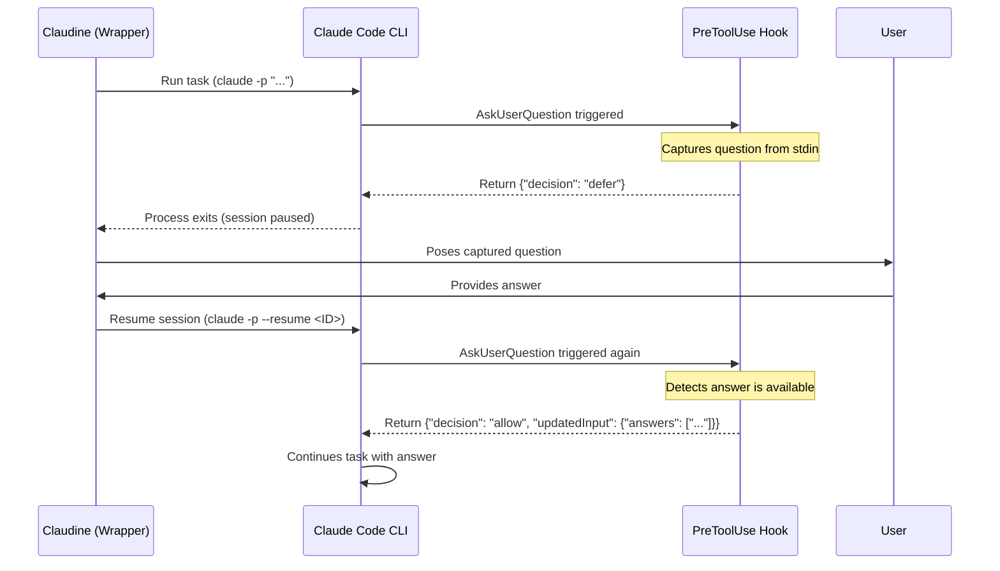

Claude Code (Anthropic's agentic CLI) provides robust session management and resumption capabilities designed for both interactive developer workflows and automated pipelines. This research details how session identity is maintained, how to leverage CLI and hook systems for resumption, and how to implement "human-in-the-loop" patterns in non-interactive environments.

## Session Identity and Capture

Claude Code identifies every conversation with a unique `session_id`. This ID is the primary key for referencing session state and transcript files.

### Capture in Interactive Sessions

In interactive mode, the `session_id` is automatically generated at startup and persists until the session is closed or cleared.

- **Hooks:** Every hook event (e.g., `SessionStart`, `PreToolUse`) receives a JSON payload on `stdin` containing the `session_id`.
- **User Interface:** The session ID is often visible in the debug logs (accessible via `claude --debug`) and can be retrieved programmatically by a hook during the `SessionStart` event.

### Capture in Non-Interactive Sessions

When running Claude Code in non-interactive mode (using the `-p` or `--prompt` flag), the session ID is still generated and can be captured for later resumption.

- **Structured Output:** Using `claude -p "task" --print stream-json` outputs a line-delimited JSON stream. The very first event, `type: "init"`, contains the `session_id`.
- **Hook Input:** Just like interactive sessions, any configured hooks will receive the `session_id` in their input JSON.

## Resuming Sessions

Resumption allows a user or process to pick up a conversation exactly where it left off, preserving the full context and tool execution history.

### CLI Resumption Flags

The Claude CLI provides several flags to resume sessions:

| Flag                  | Description                                                      |
|-----------------------|------------------------------------------------------------------|
| `-c`, `--continue`    | Resumes the most recent session in the current directory.        |
| `-r`, `--resume <ID>` | Resumes a specific session by its ID or display name.            |
| `--resume`            | (Without arguments) Opens an interactive **Session Picker** TUI. |

### Interactive Resumption

Inside an active session, users can switch to or resume other sessions using slash commands:

- **`/resume [id|name]`**: Switches the current environment to the specified session. If no ID is provided, it opens the session picker. (Alias: `/continue`).
- **`/history`**: Lists past conversations across projects to find IDs for resumption.

## Human-in-the-Loop and Deferral Hooks

Claude Code supports a sophisticated "defer and resume" pattern that allows non-interactive sessions to pause when they encounter a prompt or tool call requiring human intervention.

### Capturing Questions via Hooks

The primary mechanism for "stopping" to capture a question is the `PreToolUse` hook combined with the `AskUserQuestion` tool.

- **`PreToolUse` Hook:** Can be matched specifically to the `AskUserQuestion` tool.
- **`Notification` Hook:** Triggers on `elicitation_dialog` or `permission_prompt`, providing the message and title of the prompt.

### The "Defer and Resume" Workflow

In version 2.1.89+, Claude Code introduced the `defer` decision for hooks. This is specifically designed for Claudine-like wrappers to handle interactive prompts in headless environments.



### Hook Response for Deferral

To defer a tool call, the hook must exit with code `0` and provide the following JSON:

```json
{
  "decision": "defer"
}
```

This causes the CLI to exit immediately. Upon resumption, the hook should detect the presence of an answer (e.g., from a local cache or environment variable) and provide it via `updatedInput`:

```json
{
  "hookSpecificOutput": {
    "hookEventName": "PreToolUse",
    "permissionDecision": "allow",
    "updatedInput": {
      "answers": ["The user's response"]
    }
  }
}
```

## Storage and Persistence

Claude Code stores session state locally. It does not rely on a centralized server for the "resumable" content; the session ID is a reference to local files.

- **Location:** `~/.claude/projects/<encoded-cwd>/<session-id>.jsonl`
- **Transcript Format:** The `.jsonl` (JSON Lines) files contain the full transcript, including tool calls, system messages, and assistant responses.
- **Encoded CWD:** The directory name is a hash or encoded version of the project's absolute path, ensuring sessions are grouped by project.

## Quirks and Complications

Developers working with Claude Code resumption should be aware of the following:

1. **Infinite Loops in Stop Hooks:** `Stop` and `SubagentStop` hooks fire every time an agent finishes. If these hooks trigger a "continue" action without checking the `stop_hook_active` field, Claude will enter an infinite loop of task execution.
2. **Permission Bypass in Non-Interactive Mode:** Running with `-p` normally bypasses standard permission prompts. `PermissionRequest` hooks **do not fire** in non-interactive mode. To control tool execution in these modes, you must use `PreToolUse` hooks.
3. **Shell Profile Corruption:** If a user's `~/.zshrc` or `~/.bashrc` prints text (e.g., "Hello!"), it can corrupt the JSON output of a hook, leading to "JSON validation failed" errors.
4. **Static Snapshots:** Claude Code captures a snapshot of configured hooks at the start of a session. Changes to `settings.json` made mid-session will not take effect until the session is restarted or the `/hooks` menu is used to refresh them.
5. **Context Window Noise:** Resuming a session adds to the history. If a hook modifies files (like a formatter) after every tool call, it can generate "File modified" system messages that consume context tokens.

### Summary

Claude Code supports session resumption via the CLI (`--resume <id>`) and slash commands (`/resume`). Session IDs are available in all hook payloads and the `init` event of the `stream-json` output format. The `defer` decision in `PreToolUse` hooks provides a native way to pause non-interactive sessions for human-in-the-loop input, which can then be resumed by providing the answer through the `updatedInput` field. Session state is stored locally as `.jsonl` files in `~/.claude/projects/`.

- **Capture:** `session_id` is present in all hook JSON inputs and `stream-json` init events.
- **Resumption:** Use `claude -r <id>` or `claude -c` to pick up past sessions.
- **Human-in-the-Loop:** Use `PreToolUse` with `decision: "defer"` to pause non-interactive tasks for external answers.
- **Storage:** Fully local persistence in `~/.claude/projects/` using JSONL transcripts.
