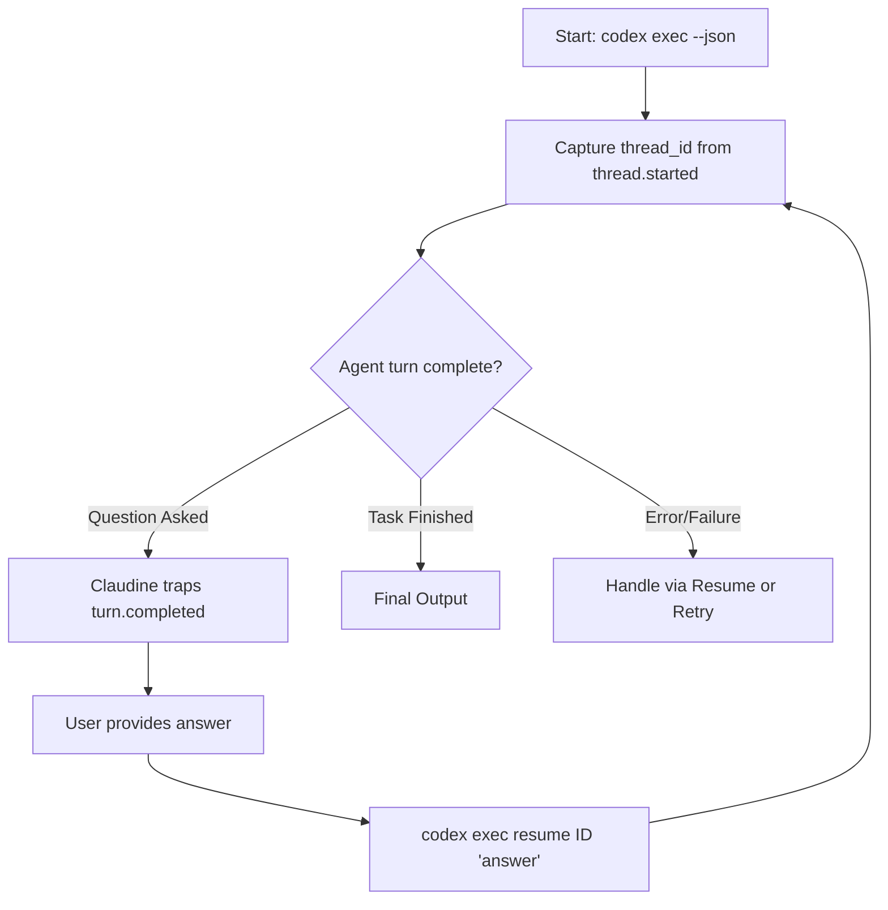

### Session ID Capture

#### Interactive Sessions

In interactive TUI mode, the session ID is primarily captured through the **`notify` hook**. When configured in `~/.codex/config.toml`, Codex executes an external command after each turn, passing a JSON payload as an argument.

* **Payload Field:** `thread-id` (kebab-case UUID).
* **Alternative:** Session transcripts are written to `~/.codex/sessions/<YYYY>/<MM>/<DD>/<session-id>/` and indexed in `~/.codex/history.jsonl`.

#### Non-interactive Sessions

When running in automation mode via `codex exec --json`, the session ID is emitted early in the stream.

* **Event Type:** `thread.started`
* **Payload Field:** `thread_id` (snake_case UUID).

### Resuming Sessions

Codex allows resuming sessions through both CLI subcommands and internal slash commands.

| Mode                | Command                             | Description                                                           |
|:--------------------|:------------------------------------|:----------------------------------------------------------------------|
| **Interactive**     | `codex resume [ID]`                 | Opens the TUI. If ID is omitted, it shows a session picker.           |
| **Interactive**     | `codex resume --last`               | Resumes the most recent session directly.                             |
| **Non-interactive** | `codex exec resume <ID> [prompt]`   | Resumes session ID in `exec` mode, optionally providing a new prompt. |
| **Non-interactive** | `codex exec resume --last [prompt]` | Resumes the most recent session non-interactively.                    |
| **Slash Command**   | `/resume`                           | Within the TUI, reloads a previously saved conversation.              |

### Human-in-the-Loop Orchestration

The Codex CLI does **not** provide native "blocking" hooks (e.g., hooks that can pause for approval or modify tool calls). The `notify` hook is fire-and-forget. However, Claudine can leverage the `resume` functionality to achieve human-in-the-loop control:

1. **Initial Run:** Claudine launches `codex exec --json "task"`.
2. **Detection:** Claudine parses the JSONL stream. If the model emits an `agent_message` that is a question (or if a tool fails requiring clarification), the turn completes.
3. **Capture:** Claudine extracts the `thread_id` and the question.
4. **Interaction:** Claudine presents the question to the user and collects an answer.
5. **Resume:** Claudine calls `codex exec resume <thread_id> "<user_answer>"` to continue the work.

### Storage and Persistence

Resumable content is stored **locally on the host machine**. The session ID serves as a reference to a specific directory in the user's home folder.

* **Location:** `~/.codex/sessions/<YYYY>/<MM>/<DD>/<session-uuid>/`
* **Metadata:** `~/.codex/history.jsonl` (contains summaries and correlation IDs).
* **Persistence Policy:** Configurable via `[history] persistence = "save-all"`.

### Quirks and Complications

* **Experimental JSON:** The `--json` stream (and its alias `--experimental-json`) is subject to schema changes.
* **Notify Hook Delivery:** The `notify` payload is passed as a command-line argument, not via `stdin`, which can cause shell escaping issues or character limit truncations for very large messages.
* **Exec Approval Policy:** In `exec` mode, the approval policy is effectively locked to `never`. Direct approval prompting is only available in the interactive TUI.
* **Kebab vs. Snake:** The `notify` hook uses kebab-case (`thread-id`), while the `--json` stream uses snake_case (`thread_id`).

### Session Lifecycle and Resume Flow

