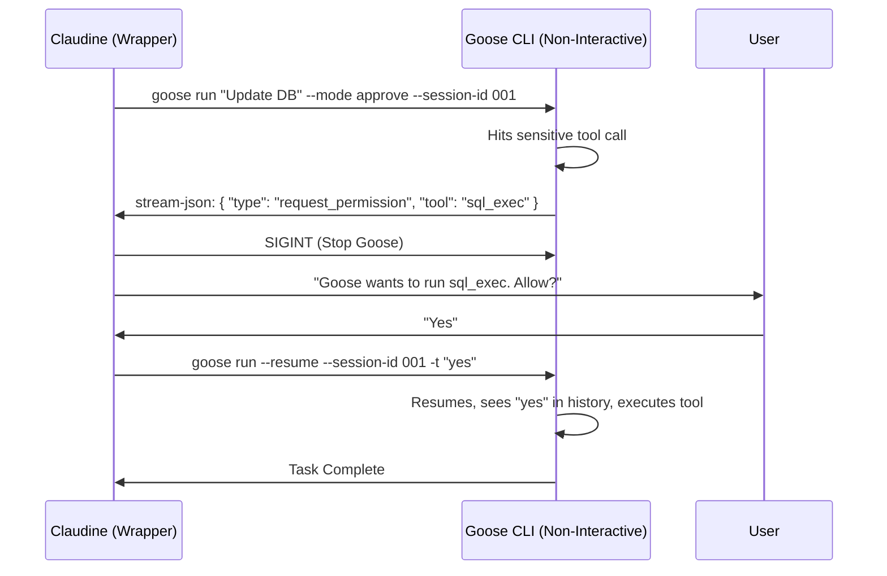

I will start by searching the codebase for any existing research or documentation related to the Goose CLI to see if there is any local context I can leverage.

I will start by searching for information about Goose CLI's session management and "resume" functionality online.

I will now search for more details about Goose CLI's session storage, its JSON stream output, and any available human-in-the-loop hooks.

I will now search for details about the `stream-json` output format, slash commands in Goose CLI, and how to capture the session ID from a run.

I will now search for "Goose CLI resume session with message" and "Goose CLI stream-json approval event".

I will now search for "Goose CLI session ID output stream-json".

I will now read the file `claudine/lib/src/events/provider.rs` to see how it handles Goose events.

I will now search for "Goose CLI session ID output stream-json" and "Goose CLI ACP request_permission structure".

I will now search for "Goose CLI session created message".

I will now search for "Goose CLI resume session with input".

I will now search for "Goose CLI resume session tool approval".

I will now search for "Goose CLI request_permission JSON structure".

I will now check `claudine/lib/src/lib.rs` to see what modules it has.

I will now check the `claudine/lib/src/adapters/` directory.

I will now read the file `claudine/lib/src/adapters/goose.rs`.

I will now search for "request_permission" in the `claudine` directory.

I will now search for "Goose CLI session database lock" and "Goose CLI resume issues".

Goose CLI provides robust session management and resumption capabilities, leveraging a local SQLite-based persistence layer. This research explores how session IDs are managed, captured, and utilized for interactive and non-interactive workflows, particularly focusing on human-in-the-loop (HITL) scenarios and the Agent Client Protocol (ACP) integration.

### Session Management & Capture

Goose identifies sessions using a unique identifier based on the date and an incrementing counter.

* **Session ID Format:** `YYYYMMDD_<COUNT>` (e.g., `20260402_1`).
* **Interactive Capture:** When starting a session via `goose session`, the CLI prints `Started session: <SESSION_ID>` to `stdout`.
* **Non-Interactive Capture:** The `goose run` command similarly initializes a session and prints the ID. If `--output-format stream-json` is used, the `session_id` is included as a top-level field in the NDJSON (Newline Delimited JSON) event stream.

| Session Type        | Command            | ID Capture Method                                |
|:--------------------|:-------------------|:-------------------------------------------------|
| **Interactive**     | `goose session`    | `stdout` regex matching on start                 |
| **Non-Interactive** | `goose run`        | `stdout` start message or `stream-json` metadata |
| **Resumed**         | `goose session -r` | Inherited from the latest or specified ID        |

### Resuming Sessions

The CLI provides two primary entry points for resuming sessions:

1. **Interactive Resume:** `goose session --resume` (or `-r`) resumes the most recent session. To target a specific session, use `--session-id <ID>`.
2. **Task-Based Resume:** `goose run --resume -t "new instruction"` allows appending a new instruction or response to an existing session without staying interactive.

### Human-in-the-Loop (HITL) & Hooks

Goose supports several "modes" that dictate how it handles tool execution and human intervention:

* **Mode `approve`:** Requires manual confirmation for every tool.
* **Mode `smart`:** Only prompts for high-impact or sensitive tools.
* **Slash Command:** `/mode approve` can be toggled within an interactive session.

#### Capture and Resume Workflow via Claudine

Goose CLI exposes hooks via the **Agent Client Protocol (ACP)** and its `--output-format stream-json` mode. Specifically, the `session/request_permission` method (or `request_permission` event in the stream) serves as the HITL hook.

### Quirks and Complications

1. **SQLite Locking:** Goose uses a local SQLite database (`sessions.db`). Developers may encounter `SQLITE_BUSY` errors if multiple processes (e.g., a background `goosed` agent and a CLI instance) attempt to write simultaneously.
2. **Connection Leaks:** The background agent process can occasionally leak file descriptors to the database, eventually causing failures that require a process restart.
3. **Session Naming Regression:** The `--name` flag occasionally defaults to searching session descriptions rather than IDs, making explicit `--session-id` usage more reliable for automation.
4. **Database Growth:** Indefinitely resuming long sessions can lead to "doom spiraling" where the SQLite database grows too large, slowing down the retrieval of context for the model.

### Storage Architecture

Goose is strictly **on-machine**. Resumable content is stored locally and is NOT synchronized with a central server unless an external MCP (Model Context Protocol) sync is configured.

* **Unix/macOS:** `~/.local/share/goose/sessions/sessions.db`
* **Windows:** `%APPDATA%\Block\goose\data\sessions\sessions.db`

The `sessions.db` contains the full conversation history, tool results, and session metadata. The Session ID acts as the primary key for retrieving this state.

### Summary

Goose CLI manages sessions via a local SQLite database (`sessions.db`), identifying them with a `YYYYMMDD_N` format. IDs are captured from initial `stdout` messages or `stream-json` metadata.

* **Resumption:** Leverages `--resume` with `--session-id` for both interactive and non-interactive (task-based) workflows.
* **HITL Hooks:** Uses the `session/request_permission` ACP event to pause execution. Claudine can intercept this, terminate the process, and resume with the user's answer via `goose run -r -t "answer"`.
* **Storage:** Entirely local; no cloud state is used for the CLI session persistence.
* **Quirks:** Prone to SQLite locking and connection leaks in high-concurrency or long-lived scenarios.
