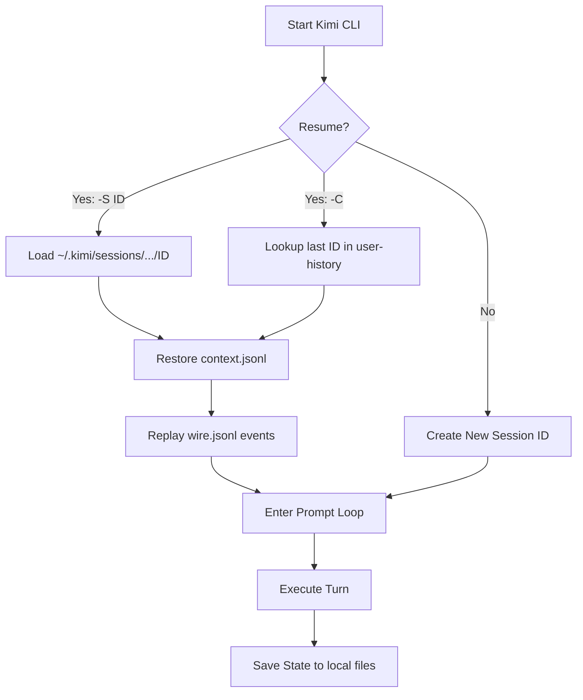

### Summary

Kimi Code CLI provides advanced session management through the **Agent Client Protocol (ACP)** and its native CLI interface, allowing for seamless session resumption across interactive and automated environments.

* **Session Identification**: Session IDs are automatically generated and included in every event of the `stream-json` output, making them easily capturable by external wrappers like Claudine.
* **Resumption Methods**: Users can resume specific sessions using the `-S` or `--session` flag, continue the most recent session with `--continue`, or utilize the `session/load` JSON-RPC method when operating as an ACP server.
* **Local Persistence**: Unlike some cloud-only agents, Kimi stores session history, context, and "wire" logs locally in `~/.kimi/sessions/`, categorized by project-specific hashes.
* **Interactive Hooks**: The CLI supports blocking `ApprovalRequest` events, enabling automated wrappers to pause execution, solicit human feedback for tool permissions or clarifying questions, and resume with a structured response.

---

### Kimi Code CLI Session Management and Resumption

Kimi Code CLI (v1.7+) implements a sophisticated session management system designed for both human-centric TUI usage and machine-centric Agent Client Protocol (ACP) integration. This document details the technical mechanisms for capturing, storing, and resuming these sessions.

#### Session ID Capture Mechanisms

Kimi Code CLI generates a unique UUID for every session. The method of capture depends on the execution mode:

| Mode                            | Capture Method                                                                                | Primary Location          |
|:--------------------------------|:----------------------------------------------------------------------------------------------|:--------------------------|
| **Interactive (TUI)**           | Displayed at session start and accessible via slash commands.                                 | `~/.kimi/user-history/`   |
| **Non-Interactive (`--print`)** | Included as a `session_id` field in each JSON event when using `--output-format stream-json`. | `STDOUT` (as JSON stream) |
| **ACP Server (`kimi acp`)**     | Returned in the `session/new` or `session/load` response payloads.                            | JSON-RPC result           |

In a non-interactive session, a typical event stream payload looks like this:

```json
{
  "event_name": "TurnBegin",
  "session_id": "fc4617e0-29eb-44f4-8777-b26f74028ddd",
  "cwd": "/path/to/project",
  "payload": { "user_input": "hello" }
}
```

#### Resuming Sessions

Kimi provides three primary ways to resume a previous conversation:

1. **Direct CLI Flag**: `kimi --session <session_id>` (or `-S`) resumes a specific session.
2. **Continue Last Session**: `kimi --continue` (or `-C`) automatically resumes the most recent session associated with the current working directory.
3. **ACP `session/load`**: For programmatic clients, the ACP server mode supports a dedicated `session/load` method which restores both conversation history and agent state.

#### Interactive Environment and Slash Commands

The Kimi TUI environment provides several built-in slash commands for session management:

* **`/sessions`**: Lists all available sessions for the current project and allows the user to switch between them.
* **`/clear`**: Starts a new session while preserving the current environment context.
* **`/history`**: Displays the conversation history of the current session.

#### Hooks and Human-in-the-Loop Integration

Kimi Code CLI is designed to be "wrapped" by tools like Claudine. It provides specific event types that act as hooks for intercepting execution:

* **`ApprovalRequest`**: Triggered when the agent needs permission to run a "dangerous" tool (e.g., `shell`, `write_file`).
* **`ToolCallRequest`**: Triggered before a tool is executed.
* **`HumanInTheLoop`**: Triggered when the agent explicitly asks the user for information.

##### Non-Interactive Prompt Flow

During a non-interactive session (`--print --output-format stream-json`), Kimi can still receive interactive prompts through its hook mechanism.

1. **Intercept**: Claudine (acting as a hook) intercepts an `ApprovalRequest` or `HumanInTheLoop` event.
2. **Pause**: The Kimi process pauses its execution while waiting for the hook's `STDOUT`.
3. **Prompt**: Claudine poses the question or permission request to the user via its own UI.
4. **Resume**: Once the user responds, Claudine sends a JSON response back to Kimi:

   ```json
   {
     "decision": "approve",
     "reason": "User confirmed the change."
   }
   ```

#### Quirks and Complications

* **Project Hashes**: Sessions are stored under a project-specific hash (e.g., `~/.kimi/sessions/<project_hash>/<session_id>`). Calculating this hash involves normalizing the absolute path of the working directory.
* **Buffer Limits**: When piping large file contents through ACP or `stream-json` hooks, the internal `asyncio` StreamReader may hit its default limit. Recent Kimi versions have increased this to 100MB, but legacy environments may still encounter `LimitOverrunError`.
* **Deprecated Flags**: The older `--acp` flag has been deprecated in favor of the `kimi acp` subcommand.

#### Session Data Storage

Session content is stored **locally** on the host machine. While Kimi may sync some metadata to the cloud for account-level history, the full "resumable" state resides in:
`~/.kimi/sessions/<project_hash>/<session_id>/`

Inside this directory:

* **`context.jsonl`**: Stores the high-level conversation context and model parameters.
* **`wire.jsonl`**: Stores the complete "wire-level" log of all events and JSON-RPC messages exchanged during the session.

#### Session Resume Lifecycle (Mermaid)



### 1. Programmatic Interaction via ACP

```rust
use serde_json::json;
// ... (Tokio setup) ...

// Resuming a session in ACP mode
let resume_req = json!({
    "jsonrpc": "2.0",
    "id": 1,
    "method": "session/load",
    "params": {
        "sessionId": "fc4617e0-29eb-44f4-8777-b26f74028ddd",
        "cwd": "/Users/ken/my-project"
    }
});
```

### 2. Handling Reverse Requests

When Kimi asks to read a file:

```rust
"fs/readTextFile" => {
    let path = parsed["params"]["path"].as_str().unwrap();
    let content = std::fs::read_to_string(path)?;
    send_response(id, json!({ "content": content })).await;
}
```

### 3. Command Execution

When Kimi asks to run a command:

```rust
"terminal/executeCommand" => {
    let output = Command::new(cmd).args(args).output().await?;
    send_response(id, json!({
        "stdout": String::from_utf8(output.stdout)?,
        "exitCode": output.status.code()
    })).await;
}
```

### 4. Streaming to UI (Tauri/MPSC)

```rust
// In a background task
while let Some(line) = reader.next_line().await? {
    if let Ok(parsed) = serde_json::from_str::<Value>(&line) {
        if let Some(text) = extract_text(&parsed) {
            app_handle.emit_all("kimi-stream", text)?;
        }
    }
}
```

---

Kimi Code CLI provides advanced session management through the **Agent Client Protocol (ACP)** and its native CLI interface, allowing for seamless session resumption across interactive and automated environments.

* **Session Identification**: Session IDs are automatically generated and included in every event of the `stream-json` output, making them easily capturable by external wrappers like Claudine.
* **Resumption Methods**: Users can resume specific sessions using the `-S` or `--session` flag, continue the most recent session with `--continue`, or utilize the `session/load` JSON-RPC method when operating as an ACP server.
* **Local Persistence**: Unlike some cloud-only agents, Kimi stores session history, context, and "wire" logs locally in `~/.kimi/sessions/`, categorized by project-specific hashes.
* **Interactive Hooks**: The CLI supports blocking `ApprovalRequest` events, enabling automated wrappers to pause execution, solicit human feedback for tool permissions or clarifying questions, and resume with a structured response.
