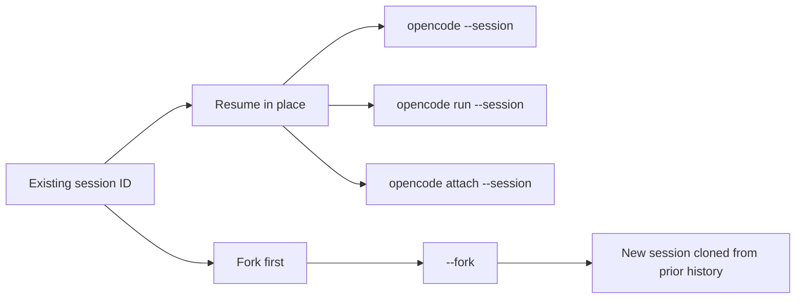

# OpenCode CLI Session Resume Research

## Summary

OpenCode does support resuming prior sessions, but the capabilities are split across three layers: CLI flags, TUI commands, and the SDK/server API. The important practical distinction is that `opencode run` is resumable but not truly human-in-the-loop: it can continue or fork sessions, and it can expose the `sessionID` in JSON event output, but it intentionally disables question-style prompts and auto-rejects runtime permission prompts. For a Claudine-style wrapper that wants to intercept questions or approval requests and then resume, the correct integration point is the OpenCode server or SDK event stream, not the stock `opencode run` command.

- Interactive resume is available through `--continue`, `--session`, `--fork`, and the TUI slash command `/sessions` with aliases `/resume` and `/continue`.
- Non-interactive resume is available through `opencode run --continue` or `opencode run --session <id>`, and `--format json` exposes `sessionID` in emitted JSON events.
- The server and SDK support both pending permission requests and pending question requests, but the plugin docs only document permission hooks, not question hooks.
- Session state is stored locally, not just remotely: the main session database lives in the OpenCode data directory, with additional storage files alongside it.

## Scope and Source Baseline

This research is based on the current OpenCode docs and the current `anomalyco/opencode` source tree at commit [`5e1b5135276294e3740d4d0ca560b53b5563f582`](https://github.com/anomalyco/opencode/tree/5e1b5135276294e3740d4d0ca560b53b5563f582), inspected on April 2, 2026.

## Direct Answers

| Question                                                                                                                     | Answer                                                                                                                                                                                                                                                                                                                                         |
|------------------------------------------------------------------------------------------------------------------------------|------------------------------------------------------------------------------------------------------------------------------------------------------------------------------------------------------------------------------------------------------------------------------------------------------------------------------------------------|
| How is the session ID captured in an interactive session?                                                                    | Usually by listing or exporting sessions rather than from a dedicated “copy session id” UI. The TUI can navigate existing sessions via `/sessions`, but the most reliable raw-ID capture methods are `opencode session list --format json`, `opencode export [sessionID]`, or the TUI transcript export, which includes `**Session ID:** ...`. |
| How is the session ID captured in a non-interactive session?                                                                 | `opencode run --format json` includes `sessionID` on every emitted JSON event. Without JSON mode, the CLI does not print a dedicated session-id banner, so callers need to capture it through session listing, export, or by driving the SDK directly.                                                                                         |
| How can the CLI resume with a session id?                                                                                    | `opencode --session <id>`, `opencode run --session <id> "..."`, and `opencode attach <url> --session <id>` all resume a specific session. `--continue` resumes the latest root session, and `--fork` clones the chosen session into a new session before continuing.                                                                           |
| Does the interactive environment provide a slash command or another means of resuming?                                       | Yes. The TUI exposes `/sessions` with aliases `/resume` and `/continue`, plus keybind `Ctrl+X L`.                                                                                                                                                                                                                                              |
| Does OpenCode provide hooks that can stop session execution on an interactive prompt and capture the question?               | At the server/API level, yes: both permission and question requests block until replied to. At the plugin-hook level, permission events are documented, but question events are not documented in the plugin docs.                                                                                                                             |
| Can Claudine receive interactive prompts during a non-interactive session, ask the human itself, and resume with the answer? | Not with stock `opencode run`. That command denies the `question` tool and auto-rejects runtime permission requests. Yes with the server/SDK layer: subscribe to events, detect `question.asked` or `permission.asked`, answer through the API, then let the session continue.                                                                 |
| Is resumable content stored locally?                                                                                         | Yes. Session records are stored locally in OpenCode’s data directory, including the SQLite database and auxiliary storage files. A session ID is not the only local artifact.                                                                                                                                                                  |

## How Session IDs Are Created and Stored

OpenCode creates session IDs locally when a session is created. In the session service, `createNext()` assigns `id: SessionID.descending(...)` and immediately publishes `session.created` for that new record ([source](https://github.com/anomalyco/opencode/blob/5e1b5135276294e3740d4d0ca560b53b5563f582/packages/opencode/src/session/index.ts#L379-L405)).

The resumable state is also stored locally:

| Artifact                        | Location                                                      | Evidence                                                                                                                                                                                                                                                                                                   |
|---------------------------------|---------------------------------------------------------------|------------------------------------------------------------------------------------------------------------------------------------------------------------------------------------------------------------------------------------------------------------------------------------------------------------|
| Main session DB                 | XDG data dir, typically `~/.local/share/opencode/opencode.db` | [`Global.Path.data`](https://github.com/anomalyco/opencode/blob/5e1b5135276294e3740d4d0ca560b53b5563f582/packages/opencode/src/global/index.ts#L7-L35), [`Database.Path`](https://github.com/anomalyco/opencode/blob/5e1b5135276294e3740d4d0ca560b53b5563f582/packages/opencode/src/storage/db.ts#L30-L44) |
| Auxiliary storage JSON          | XDG data dir, typically `~/.local/share/opencode/storage/...` | [`Storage` layer](https://github.com/anomalyco/opencode/blob/5e1b5135276294e3740d4d0ca560b53b5563f582/packages/opencode/src/storage/storage.ts#L219-L247)                                                                                                                                                  |
| Exportable full session payload | stdout from `opencode export [sessionID]`                     | [`export.ts`](https://github.com/anomalyco/opencode/blob/5e1b5135276294e3740d4d0ca560b53b5563f582/packages/opencode/src/cli/cmd/export.ts#L10-L88)                                                                                                                                                         |

The practical implication is that a bare `sessionID` only works if you are talking to the same OpenCode data store. In local CLI usage that means the same machine/profile; in `attach` mode it means the remote server that owns the session data.

## Interactive Session ID Capture

The TUI supports resume-oriented flags directly: `--continue`, `--session`, and `--fork` are documented for the main TUI and for `attach` mode ([CLI docs](https://opencode.ai/docs/cli/), [tui thread source](https://github.com/anomalyco/opencode/blob/5e1b5135276294e3740d4d0ca560b53b5563f582/packages/opencode/src/cli/cmd/tui/thread.ts#L81-L114), [attach source](https://github.com/anomalyco/opencode/blob/5e1b5135276294e3740d4d0ca560b53b5563f582/packages/opencode/src/cli/cmd/tui/attach.ts#L23-L49)).

Inside the TUI, resume is primarily session-picker driven rather than raw-ID driven:

- `/sessions` is the TUI slash command for switching sessions.
- `/resume` and `/continue` are aliases for that same command.
- `Ctrl+X L` opens the same session list.
- The home tips explicitly advertise `/sessions` and `Ctrl+X L` for continuing prior conversations ([tips source](https://github.com/anomalyco/opencode/blob/5e1b5135276294e3740d4d0ca560b53b5563f582/packages/opencode/src/cli/cmd/tui/feature-plugins/home/tips-view.tsx#L64-L67), [command registration](https://github.com/anomalyco/opencode/blob/5e1b5135276294e3740d4d0ca560b53b5563f582/packages/opencode/src/cli/cmd/tui/app.tsx#L447-L461)).

For raw ID capture during an interactive session, the reliable paths I found are:

- `opencode session list --format json`, which emits `id`, `title`, `updated`, `created`, `projectId`, and `directory` ([source](https://github.com/anomalyco/opencode/blob/5e1b5135276294e3740d4d0ca560b53b5563f582/packages/opencode/src/cli/cmd/session.ts#L74-L159)).
- `opencode export [sessionID]`, which can also prompt you to select a session and uses `session.id` as the selected value ([source](https://github.com/anomalyco/opencode/blob/5e1b5135276294e3740d4d0ca560b53b5563f582/packages/opencode/src/cli/cmd/export.ts#L21-L82)).
- TUI transcript export, because the generated Markdown transcript includes a `**Session ID:** ...` line ([transcript source](https://github.com/anomalyco/opencode/blob/5e1b5135276294e3740d4d0ca560b53b5563f582/packages/opencode/src/cli/cmd/tui/util/transcript.ts#L32-L35), [session export action](https://github.com/anomalyco/opencode/blob/5e1b5135276294e3740d4d0ca560b53b5563f582/packages/opencode/src/cli/cmd/tui/routes/session/index.tsx#L845-L855)).

I did **not** find a dedicated TUI slash command whose purpose is “copy current session id”.

## Non-Interactive Session ID Capture

`opencode run` supports `--continue`, `--session`, `--fork`, and `--format json` ([source](https://github.com/anomalyco/opencode/blob/5e1b5135276294e3740d4d0ca560b53b5563f582/packages/opencode/src/cli/cmd/run.ts#L381-L393)).

Its non-interactive session selection logic is:

1. If `--continue` is set, call `sdk.session.list()` and pick the first root session.
2. Else if `--session <id>` is set, use that `id`.
3. Else create a new session and use the returned `result.data?.id`.

That is implemented directly in `run.ts` ([source](https://github.com/anomalyco/opencode/blob/5e1b5135276294e3740d4d0ca560b53b5563f582/packages/opencode/src/cli/cmd/run.ts#L381-L393)).

For capture:

- In `--format json`, every emitted event line includes `sessionID` in the JSON object ([source](https://github.com/anomalyco/opencode/blob/5e1b5135276294e3740d4d0ca560b53b5563f582/packages/opencode/src/cli/cmd/run.ts#L433-L439)).
- In default format, there is no dedicated “created session `<id>`” line.
- That gap is visible enough that there is an open feature request for exactly this: [Issue #17221: output session_id after a cli run](https://github.com/anomalyco/opencode/issues/17221).

So the cleanest machine-readable capture path today is `opencode run --format json ...`.

## How Resume Works

The CLI surface is straightforward:

| Mode                                          | Command                                |
|-----------------------------------------------|----------------------------------------|
| Resume last interactive session               | `opencode --continue`                  |
| Resume specific interactive session           | `opencode --session <id>`              |
| Resume specific remote session                | `opencode attach <url> --session <id>` |
| Resume last non-interactive/root session      | `opencode run --continue "..."`        |
| Resume specific non-interactive session       | `opencode run --session <id> "..."`    |
| Branch from a prior session before continuing | add `--fork`                           |

Forking is a real clone operation, not just a pointer switch. The session service creates a new session, then copies messages and parts into it, and gives the new session a `(fork #n)` title suffix ([fork implementation](https://github.com/anomalyco/opencode/blob/5e1b5135276294e3740d4d0ca560b53b5563f582/packages/opencode/src/session/index.ts#L511-L546)).

## Slash Commands and Other Interactive Resume UX

The interactive environment does provide a slash-command-based resume path:

- `/sessions`
- alias `/resume`
- alias `/continue`

That opens the session selector rather than asking for a raw session ID ([source](https://github.com/anomalyco/opencode/blob/5e1b5135276294e3740d4d0ca560b53b5563f582/packages/opencode/src/cli/cmd/tui/app.tsx#L447-L461)).

So the TUI does support resume, but mostly as “pick a previous conversation” instead of “paste an ID”.

## Human-in-the-Loop Prompts: What Exists

OpenCode has **two** separate pause-and-wait mechanisms.

### Permission prompts

Permission requests are modeled as pending requests with events:

- `permission.asked`
- `permission.replied`

The permission service blocks until a reply is received ([service source](https://github.com/anomalyco/opencode/blob/5e1b5135276294e3740d4d0ca560b53b5563f582/packages/opencode/src/permission/index.ts#L166-L264)).

The server exposes:

- `GET /permission`
- `POST /permission/{requestID}/reply`

([route source](https://github.com/anomalyco/opencode/blob/5e1b5135276294e3740d4d0ca560b53b5563f582/packages/opencode/src/server/routes/permission.ts#L9-L68))

### Question prompts

Questions are modeled separately:

- `question.asked`
- `question.replied`
- `question.rejected`

The question service also blocks until a reply or rejection arrives ([service source](https://github.com/anomalyco/opencode/blob/5e1b5135276294e3740d4d0ca560b53b5563f582/packages/opencode/src/question/index.ts#L131-L194)).

The server exposes:

- `GET /question`
- `POST /question/{requestID}/reply`
- `POST /question/{requestID}/reject`

([route source](https://github.com/anomalyco/opencode/blob/5e1b5135276294e3740d4d0ca560b53b5563f582/packages/opencode/src/server/routes/question.ts#L10-L99))

The question tool itself calls `Question.ask(...)` and waits for answers before returning control to the model ([tool source](https://github.com/anomalyco/opencode/blob/5e1b5135276294e3740d4d0ca560b53b5563f582/packages/opencode/src/tool/question.ts#L6-L32)). It is enabled for CLI/app/desktop clients by default in the tool registry ([registry source](https://github.com/anomalyco/opencode/blob/5e1b5135276294e3740d4d0ca560b53b5563f582/packages/opencode/src/tool/registry.ts#L115-L139)).

## Can Claudine Broker the Prompt and Then Resume?

### Stock `opencode run`: no

The stock `run` command is explicitly designed to avoid interactive pauses:

- It creates a session permission ruleset that denies `question`, `plan_enter`, and `plan_exit` ([source](https://github.com/anomalyco/opencode/blob/5e1b5135276294e3740d4d0ca560b53b5563f582/packages/opencode/src/cli/cmd/run.ts#L357-L373)).
- If a runtime `permission.asked` event still occurs, it auto-rejects it rather than surfacing it for external handling ([source](https://github.com/anomalyco/opencode/blob/5e1b5135276294e3740d4d0ca560b53b5563f582/packages/opencode/src/cli/cmd/run.ts#L544-L556)).

So if Claudine shells out to `opencode run`, OpenCode will **not** naturally stop and hand over question prompts for Claudine to broker.

### Server/SDK driven orchestration: yes

The SDK and server do provide everything needed for a Claudine broker loop:

1. Start or attach to an OpenCode server.
2. Create or load a session with `client.session.create()` or `client.session.list()/get()`.
3. Subscribe to real-time events with `client.event.subscribe()` ([SDK docs](https://opencode.ai/docs/sdk/), [SDK session/event docs](https://github.com/anomalyco/opencode/blob/5e1b5135276294e3740d4d0ca560b53b5563f582/packages/web/src/content/docs/sdk.mdx#L299-L321), [event docs](https://github.com/anomalyco/opencode/blob/5e1b5135276294e3740d4d0ca560b53b5563f582/packages/web/src/content/docs/sdk.mdx#L447-L462)).
4. When `question.asked` arrives, present the question through Claudine, then call `client.question.reply(...)` or `client.question.reject(...)` ([generated SDK](https://github.com/anomalyco/opencode/blob/5e1b5135276294e3740d4d0ca560b53b5563f582/packages/sdk/js/src/v2/gen/sdk.gen.ts#L2539-L2639)).
5. When `permission.asked` arrives, present the permission request, then call `client.permission.reply(...)` ([generated SDK](https://github.com/anomalyco/opencode/blob/5e1b5135276294e3740d4d0ca560b53b5563f582/packages/sdk/js/src/v2/gen/sdk.gen.ts#L2423-L2536)).
6. Let the blocked OpenCode session continue from the same `sessionID`.

That architecture is a better fit than wrapping `opencode run`.

## Hooks vs Events: Important Distinction

If “hooks” means plugin hooks, the answer is only partially yes.

The plugin docs explicitly list:

- `permission.asked`
- `permission.replied`

but do **not** list `question.asked` or other question events ([plugin docs](https://opencode.ai/docs/plugins/), [source](https://github.com/anomalyco/opencode/blob/5e1b5135276294e3740d4d0ca560b53b5563f582/packages/web/src/content/docs/plugins.mdx#L142-L189)).

However, the generated SDK event types clearly include both `EventPermissionAsked` and `EventQuestionAsked` ([types source](https://github.com/anomalyco/opencode/blob/5e1b5135276294e3740d4d0ca560b53b5563f582/packages/sdk/js/src/v2/gen/types.gen.ts#L112-L124), [question event types](https://github.com/anomalyco/opencode/blob/5e1b5135276294e3740d4d0ca560b53b5563f582/packages/sdk/js/src/v2/gen/types.gen.ts#L189-L224)).

That creates a practical integration rule:

- For permission prompts, plugin hooks may be enough.
- For question prompts, use the SSE/API/SDK surface, not the plugin docs alone.

## Quirks and Complications for Developers

| Quirk                                                                    | Why it matters                                                                                                                                                                                                                                                                                                |
|--------------------------------------------------------------------------|---------------------------------------------------------------------------------------------------------------------------------------------------------------------------------------------------------------------------------------------------------------------------------------------------------------|
| `opencode run` does not print a dedicated new session ID in default mode | Scripts need `--format json`, `session list`, or SDK orchestration. See [Issue #17221](https://github.com/anomalyco/opencode/issues/17221).                                                                                                                                                                   |
| `opencode run` is resumable, but intentionally non-interactive           | It denies `question` and auto-rejects permissions, so it is a poor fit for human-in-the-loop brokering.                                                                                                                                                                                                       |
| Resume scoping can be surprising                                         | `--continue` resolves by listing sessions and taking a root session. Users have reported scope/path surprises, including [Issue #18890](https://github.com/anomalyco/opencode/issues/18890) and [Issue #20238](https://github.com/anomalyco/opencode/issues/20238).                                           |
| Forking is a full history clone                                          | The implementation copies all messages and parts, so long sessions can make `/fork` or `--fork` slower. That matches [Issue #16311](https://github.com/anomalyco/opencode/issues/16311).                                                                                                                      |
| Plugin docs under-document question interception                         | Permission events are documented; question events exist in the SDK/event model but are not documented as plugin events.                                                                                                                                                                                       |
| ACP integrations were version-sensitive around questions                 | There have been ACP question-hang fixes such as [Issue #17920](https://github.com/anomalyco/opencode/issues/17920), [PR #17921](https://github.com/anomalyco/opencode/pull/17921), and [PR #20017](https://github.com/anomalyco/opencode/pull/20017). If Claudine talks through ACP, version testing matters. |

## Practical Recommendation for Claudine

For Claudine, the safest design is:

- Do **not** rely on `opencode run` if you need mid-session human answers.
- Run or attach to an OpenCode server.
- Use the JS SDK or raw HTTP API.
- Treat `sessionID` as a stable handle into a locally persisted session store.
- Subscribe to SSE events.
- Intercept `question.asked` and `permission.asked`.
- Reply through `question.reply/reject` or `permission.reply`.
- Resume on the same `sessionID`.

That keeps OpenCode’s actual session state intact while letting Claudine own the human conversation.

## Sources

- [OpenCode CLI docs](https://opencode.ai/docs/cli/)
- [OpenCode SDK docs](https://opencode.ai/docs/sdk/)
- [OpenCode Plugins docs](https://opencode.ai/docs/plugins/)
- [TUI flags in source](https://github.com/anomalyco/opencode/blob/5e1b5135276294e3740d4d0ca560b53b5563f582/packages/opencode/src/cli/cmd/tui/thread.ts#L81-L114)
- [TUI slash resume command in source](https://github.com/anomalyco/opencode/blob/5e1b5135276294e3740d4d0ca560b53b5563f582/packages/opencode/src/cli/cmd/tui/app.tsx#L447-L461)
- [Non-interactive `run` resume logic in source](https://github.com/anomalyco/opencode/blob/5e1b5135276294e3740d4d0ca560b53b5563f582/packages/opencode/src/cli/cmd/run.ts#L357-L556)
- [Session list CLI source](https://github.com/anomalyco/opencode/blob/5e1b5135276294e3740d4d0ca560b53b5563f582/packages/opencode/src/cli/cmd/session.ts#L74-L159)
- [Export CLI source](https://github.com/anomalyco/opencode/blob/5e1b5135276294e3740d4d0ca560b53b5563f582/packages/opencode/src/cli/cmd/export.ts#L10-L88)
- [Question service source](https://github.com/anomalyco/opencode/blob/5e1b5135276294e3740d4d0ca560b53b5563f582/packages/opencode/src/question/index.ts#L35-L220)
- [Permission service source](https://github.com/anomalyco/opencode/blob/5e1b5135276294e3740d4d0ca560b53b5563f582/packages/opencode/src/permission/index.ts#L43-L264)
- [Question routes](https://github.com/anomalyco/opencode/blob/5e1b5135276294e3740d4d0ca560b53b5563f582/packages/opencode/src/server/routes/question.ts#L10-L99)
- [Permission routes](https://github.com/anomalyco/opencode/blob/5e1b5135276294e3740d4d0ca560b53b5563f582/packages/opencode/src/server/routes/permission.ts#L9-L68)
- [Generated SDK question and permission clients](https://github.com/anomalyco/opencode/blob/5e1b5135276294e3740d4d0ca560b53b5563f582/packages/sdk/js/src/v2/gen/sdk.gen.ts#L2423-L2639)
- [Generated event types for `permission.asked` and `question.asked`](https://github.com/anomalyco/opencode/blob/5e1b5135276294e3740d4d0ca560b53b5563f582/packages/sdk/js/src/v2/gen/types.gen.ts#L112-L224)
- [Local storage paths](https://github.com/anomalyco/opencode/blob/5e1b5135276294e3740d4d0ca560b53b5563f582/packages/opencode/src/global/index.ts#L7-L35), [database path](https://github.com/anomalyco/opencode/blob/5e1b5135276294e3740d4d0ca560b53b5563f582/packages/opencode/src/storage/db.ts#L30-L44), [storage dir](https://github.com/anomalyco/opencode/blob/5e1b5135276294e3740d4d0ca560b53b5563f582/packages/opencode/src/storage/storage.ts#L219-L247)
- [Issue #17221: output session_id after a cli run](https://github.com/anomalyco/opencode/issues/17221)
- [Issue #18890: Sessions from different non-git directories are mixed when using --continue](https://github.com/anomalyco/opencode/issues/18890)
- [Issue #20238: Session list missing in TUI mode](https://github.com/anomalyco/opencode/issues/20238)
- [Issue #16311: `/fork` is incredibly slow for long sessions](https://github.com/anomalyco/opencode/issues/16311)
- [Issue #17920: Question tool hangs in ACP mode](https://github.com/anomalyco/opencode/issues/17920)
