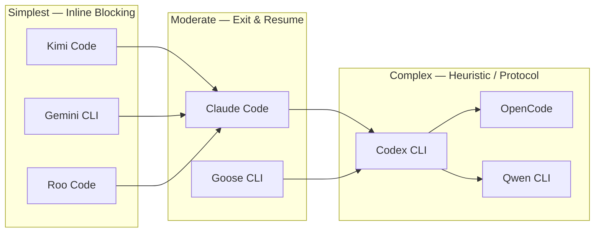

# Agentic CLI Resume Capabilities: Comparative Overview

This document synthesizes the session resume research across all agentic CLIs evaluated for Claudine integration. It compares how each agent captures session identity, resumes conversations, supports human-in-the-loop workflows, and persists state locally.

## Research Coverage

| Agent        | Research Status    |
|:-------------|:-------------------|
| Claude Code  | Complete           |
| Codex CLI    | Complete           |
| Gemini CLI   | Complete           |
| Goose CLI    | Complete           |
| Kimi Code    | Complete           |
| OpenCode     | Complete           |
| Qwen CLI     | Complete           |
| Roo Code     | Complete           |

## Capability Groups

All eight agents cluster into three architectural groups based on how they handle human-in-the-loop (HITL) workflows:

### Group A: Inline Blocking Hooks (Kimi Code, Gemini CLI, Roo Code)

These agents provide **blocking hooks** where the process stays alive while waiting for the wrapper's response. Claudine intercepts the event, presents it to the user, and writes a structured response back. No process restart required.

- **Kimi Code:** `ApprovalRequest` and `HumanInTheLoop` events block on stdout.
- **Gemini CLI:** `before_tool` hook blocks on stdout; intercepts the `ask_user` tool.
- **Roo Code:** `waitingForInput` event via `ExtensionClient` API blocks until `respond()` or `reject()` is called. Requires `--require-approval` flag (CLI auto-approves by default).

### Group B: Exit-and-Resume (Claude Code, Codex CLI, Goose CLI)

These agents either natively exit on deferral or must be externally terminated, then resumed with the user's answer injected as new input.

- **Claude Code:** `PreToolUse` hook returns `{"decision": "defer"}`, process exits cleanly, resumed with `--resume`.
- **Codex CLI:** No blocking hooks; fire-and-forget `notify`. Must parse output stream for questions, then resume with `exec resume <id> "answer"`.
- **Goose CLI:** `request_permission` event in stream-json, but the process must be SIGINTed and resumed with `--resume -t "answer"`.

### Group C: Protocol-Driven (OpenCode, Qwen CLI)

These agents require operating through a separate protocol layer (server/SDK or ACP) for HITL support. Their stock CLI `run` commands are deliberately non-interactive.

- **OpenCode:** Stock `run` denies questions and auto-rejects permissions. Must connect to server/SDK, subscribe to SSE events, and reply via REST API.
- **Qwen CLI:** No unified hook system in CLI mode. Must use `--acp` mode where Claudine acts as the ACP client, receiving `session/request_permission` JSON-RPC messages.

## Session Identity Capture

All eight agents generate unique session IDs. The capture mechanism varies by execution mode:

| Agent       | Interactive Capture                              | Non-Interactive Capture                                      | ID Format            |
|:------------|:-------------------------------------------------|:-------------------------------------------------------------|:---------------------|
| Claude Code | Hook `stdin` JSON (`session_id`)                 | `stream-json` init event (`session_id`)                      | Opaque string        |
| Codex CLI   | `notify` hook arg (`thread-id`)                  | `--json` stream `thread.started` (`thread_id`)               | UUID                 |
| Gemini CLI  | `/resume list` slash command                     | `init` JSONL event (`session_id`)                            | UUID                 |
| Goose CLI   | `stdout` message at session start                | `stream-json` metadata (`session_id`)                        | `YYYYMMDD_<COUNT>`   |
| Kimi Code   | Displayed at session start; slash cmds           | `stream-json` events (`session_id`)                          | UUID                 |
| OpenCode    | `/sessions` picker; `session list --format json` | `run --format json` events (`sessionID`)                     | Descending ID        |
| Qwen CLI    | File system (`~/.qwen/projects/` JSONL names)    | `stream-json` system event with `subtype: "session_start"`   | UUID                 |
| Roo Code    | `taskCreated` event via `RooCodeAPI`             | `roo history` or `--output-format json`                      | UUID (`taskId`)      |

**Notable quirks:**
- Codex uses kebab-case (`thread-id`) in notify hooks but snake_case (`thread_id`) in JSON streams.
- OpenCode does not print session IDs in default (non-JSON) output mode for `run` ([Issue #17221](https://github.com/anomalyco/opencode/issues/17221)).
- Qwen does not display the session ID in the TUI by default; capture requires the file system or `stream-json`.
- Goose uses a human-readable date-counter format rather than UUIDs.
- Roo Code's primary interface is VS Code, not a standalone TUI; the CLI (`roo`) shares the same local storage.

## CLI Resume Commands

| Agent       | Resume Specific Session             | Resume Latest                  | Interactive Picker                 |
|:------------|:------------------------------------|:-------------------------------|:-----------------------------------|
| Claude Code | `claude -r <id>`                    | `claude -c` / `--continue`    | `claude --resume` (no args)        |
| Codex CLI   | `codex resume <id>`                 | `codex resume --last`          | `codex resume` (no args)           |
| Gemini CLI  | `gemini --resume <UUID>`            | `gemini -r 1` (nth most recent)| `/resume` in TUI                  |
| Goose CLI   | `goose session --session-id <id>`   | `goose session -r`             | (none)                             |
| Kimi Code   | `kimi -S <id>` / `--session <id>`   | `kimi -C` / `--continue`      | `/sessions` in TUI                 |
| OpenCode    | `opencode --session <id>`           | `opencode --continue`          | `/sessions` (alias `/resume`)      |
| Qwen CLI    | `qwen --resume <id>` / `-r <id>`    | `qwen -c` / `--continue`      | `qwen -r` (no args, opens picker)  |
| Roo Code    | `roo resume <task-id>`               | (none)                         | Checkpoint browser in VS Code      |

### Non-Interactive Resume

| Agent       | Command                                           | Notes                                                     |
|:------------|:--------------------------------------------------|:----------------------------------------------------------|
| Claude Code | `claude -p --resume <id> "prompt"`                | Full context restoration; hooks re-fire                   |
| Codex CLI   | `codex exec resume <id> "prompt"`                 | Also supports `--last`                                    |
| Gemini CLI  | `gemini --resume <id> --prompt "prompt"`          | Restores history + shadow-git checkpoints                 |
| Goose CLI   | `goose run --resume -t "prompt"`                  | Also supports `--session-id <id>`                         |
| Kimi Code   | `kimi -S <id> --print "prompt"`                   | Also supports ACP `session/load` JSON-RPC                 |
| OpenCode    | `opencode run --session <id> "prompt"`            | Also supports `--fork` for branching                      |
| Qwen CLI    | `qwen --resume <id> --prompt "prompt"`            | Requires `--chat-recording` enabled (default: true)       |
| Roo Code    | `roo resume <task-id>` (with prompt on stdin)     | Restores conversation + file system via shadow git        |

**Unique capabilities:**
- **OpenCode:** `--fork` clones a session's full history into a new session before continuing, enabling non-destructive branching.
- **Gemini:** `-r <index>` resumes the Nth most recent session by numeric index, not just by UUID.
- **Roo Code:** Checkpoint restore reverts both conversation state and the file system to an exact prior snapshot via shadow git.

## Slash Commands (Interactive TUI)

| Agent       | Resume Command(s)                      | History / Session List            |
|:------------|:---------------------------------------|:----------------------------------|
| Claude Code | `/resume [id]`, `/continue`            | `/history`                        |
| Codex CLI   | `/resume`                              | (via session picker)              |
| Gemini CLI  | `/resume`, `/resume <UUID>`, `/resume list` | `/resume list`               |
| Goose CLI   | (none)                                 | (none)                            |
| Kimi Code   | `/sessions`                            | `/history`                        |
| OpenCode    | `/sessions`, `/resume`, `/continue`    | `Ctrl+X L`                       |
| Qwen CLI    | (none; resumption at startup only)     | `/memory show` (context, not sessions) |
| Roo Code    | (none; visual checkpoint browser)      | Task History panel in VS Code          |

**Notable:** Goose, Qwen, and Roo lack in-session resume slash commands. Resume is handled at CLI startup or via IDE UI.

## Human-in-the-Loop Architecture

This is the most significant differentiator across agents and the most important capability for Claudine's orchestration model.

### Comparison Matrix

| Capability                          | Claude Code         | Codex CLI              | Gemini CLI               | Goose CLI                   | Kimi Code              | OpenCode                  | Qwen CLI                    | Roo Code                      |
|:------------------------------------|:--------------------|:-----------------------|:-------------------------|:----------------------------|:-----------------------|:--------------------------|:----------------------------|:------------------------------|
| **Blocking hooks**                  | Yes (`PreToolUse`)  | No (fire-and-forget)   | Yes (`before_tool`)      | No (stream event)           | Yes (`ApprovalRequest`)| No (CLI); Yes (server)    | No (CLI); Yes (ACP)         | Yes (`waitingForInput`)       |
| **Native deferral decision**        | Yes (`"defer"`)     | No                     | No (blocks inline)       | No                          | No (blocks inline)     | No                        | No                          | No (blocks inline)            |
| **Question interception**           | Yes (`AskUserQuestion`) | No (parse stream)  | Yes (`ask_user` tool)    | No                          | Yes (`HumanInTheLoop`) | Yes (server `question.asked`) | Yes (ACP `request_permission`) | Yes (`ClineAsk` event)     |
| **Permission interception**         | Yes (`PreToolUse`)  | No                     | Yes (`permission_request`)| Yes (`request_permission`)  | Yes (`ApprovalRequest`)| Yes (server `permission.asked`) | Yes (ACP `request_permission`) | Yes (`waitingForInput` + `tool_use`) |
| **Answer injection on resume**      | Yes (`updatedInput`)| Yes (new prompt)       | Yes (`updated_input`)    | Yes (new prompt via `-t`)   | Yes (JSON response)    | Yes (`question.reply` API) | Yes (JSON-RPC response)    | Yes (`respond()` / `reject()`) |
| **Process stays alive during HITL** | No (exits on defer) | No (turn completes)    | Yes (blocks on hook)     | No (must SIGINT)            | Yes (blocks on hook)   | Yes (server blocks)       | Yes (ACP blocks)            | Yes (blocks on event)         |

### Detailed HITL Workflows

#### Kimi Code: Inline Blocking (Group A)

Kimi's hooks (`ApprovalRequest`, `HumanInTheLoop`) block the process while waiting for a response on `stdout`. Claudine intercepts the event, presents it to the user, and writes a JSON response back. The Kimi process stays alive throughout, making this the simplest integration model.

#### Gemini CLI: Inline Blocking (Group A)

Gemini's `before_tool` hook intercepts the `ask_user` tool call and blocks until the hook process writes a `HookResponse` to stdout. Claudine receives the question payload, collects the user's answer, and returns it via the `updated_input` or `additional_context` field. The process stays alive.

#### Roo Code: Event-Driven Blocking (Group A)

Roo's `ExtensionClient` emits a `waitingForInput` event whenever the agent needs human intervention (tool approval, follow-up questions, command confirmation). Claudine captures the `ClineAsk` payload, presents it to the user, and calls `respond()` or `reject()`. The process stays alive. **Caveat:** The CLI auto-approves by default; `--require-approval` is required to enable interception. Additionally, `waitingForInput` only fires on state transitions -- if Claudine connects to an already-waiting session, it must poll `isWaitingForInput`.

#### Claude Code: Defer and Resume (Group B)

Claude Code's `PreToolUse` hook can return `{"decision": "defer"}`, causing the CLI process to exit immediately. Claudine captures the question, obtains a user answer, then resumes with `claude -p --resume <id>`, where the hook detects the cached answer and returns it via `updatedInput`. The process does **not** stay alive during the interaction.

#### Codex CLI: Stream Parse and Resume (Group B)

Codex has no blocking hooks. The `notify` hook is fire-and-forget. Claudine must parse the JSONL stream for `agent_message` events that look like questions, capture the `thread_id`, then call `codex exec resume <id> "<answer>"`. This is heuristic-based (no structured "question asked" event type).

#### Goose CLI: Kill and Resume (Group B)

Goose emits `request_permission` events in its `stream-json` output, but the process does not block on them in non-interactive mode. Claudine must detect the event, send SIGINT to the Goose process, present the question to the user, then resume with `goose run --resume --session-id <id> -t "answer"`.

#### OpenCode: Server-Driven Events (Group C)

Stock `opencode run` deliberately disables questions and auto-rejects permissions, making it unsuitable for HITL. Instead, Claudine must connect to the OpenCode server/SDK, subscribe to SSE events (`question.asked`, `permission.asked`), and reply via REST API (`/question/{id}/reply`, `/permission/{id}/reply`). The session stays alive on the server.

#### Qwen CLI: ACP-Driven Events (Group C)

Qwen's stock CLI has no unified hook system. For HITL, Claudine must run `qwen --acp`, acting as the ACP client. Qwen sends `session/request_permission` JSON-RPC messages for tool approvals. Claudine intercepts, prompts the user, and returns an approve/deny response. The `canUseTool` SDK callback is the only blocking event, but it has a hard-coded **60-second timeout**.

## Session Storage

All eight agents store session state locally. None require a remote server for core resumability.

| Agent       | Storage Location                                      | Format               | Organization                 |
|:------------|:------------------------------------------------------|:---------------------|:-----------------------------|
| Claude Code | `~/.claude/projects/<encoded-cwd>/<session-id>.jsonl` | JSONL                | By project path hash         |
| Codex CLI   | `~/.codex/sessions/<YYYY>/<MM>/<DD>/<session-uuid>/`  | Directory            | By date + UUID               |
| Gemini CLI  | `~/.gemini/tmp/<project_hash>/chats/`                 | JSON + shadow git    | By project hash              |
| Goose CLI   | `~/.local/share/goose/sessions/sessions.db`           | SQLite               | Single DB file               |
| Kimi Code   | `~/.kimi/sessions/<project_hash>/<session_id>/`       | JSONL (context + wire) | By project hash            |
| OpenCode    | `~/.local/share/opencode/opencode.db` + storage/      | SQLite + JSON        | Single DB + auxiliary files   |
| Qwen CLI    | `~/.qwen/projects/<cwd-hash>/chats/`                  | JSONL                | By project hash              |
| Roo Code    | VS Code global storage + shadow git repo              | JSON + shadow git    | By task ID                   |

**Storage quirks:**
- **Claude Code:** Encoded CWD means moving a project breaks session references.
- **Codex CLI:** Date-based hierarchy means sessions for the same project scatter across directories.
- **Gemini CLI:** Shadow git repositories provide code checkpoints alongside chat history. 30-day auto-purge by default.
- **Goose CLI:** SQLite-backed; prone to `SQLITE_BUSY` errors under concurrent access. DB growth can cause performance degradation on long sessions.
- **Kimi Code:** Project hash requires path normalization; large `wire.jsonl` files can hit asyncio buffer limits.
- **OpenCode:** SQLite-backed, so session IDs only work against the same data store. Fork operations clone full history and can be slow.
- **Qwen CLI:** Requires `--chat-recording` enabled (default: true). Unencrypted. Deleting local files makes a session ID unresumable.
- **Roo Code:** Storage location depends on VS Code global storage path (e.g., `~/Library/Application Support/Code/...`). Shadow git checkpoints snapshot files before every modification, which can consume significant disk on large projects.

## Known Quirks and Complications

### Shared Concerns

- **Context window growth:** All agents accumulate history on resume. Long sessions degrade performance.
- **Project scoping:** Most agents (Claude, Gemini, Kimi, OpenCode, Qwen, Roo) scope sessions by project directory. Moving or renaming the project can orphan sessions.
- **Hook/config reload:** Claude Code and Codex snapshot hook configurations at session start; mid-session changes require restart.

### Agent-Specific Issues

| Agent       | Quirk                                                            | Impact                                                     |
|:------------|:-----------------------------------------------------------------|:-----------------------------------------------------------|
| Claude Code | Shell profile output corrupts hook JSON                          | `~/.zshrc` must not print to stdout                        |
| Claude Code | Stop hooks can cause infinite loops without `stop_hook_active` guard | Critical for automation wrappers                       |
| Claude Code | `PermissionRequest` hooks don't fire in non-interactive mode     | Must use `PreToolUse` hooks instead                        |
| Codex CLI   | `notify` payload passed as CLI arg, not stdin                    | Shell escaping issues; truncation for large payloads       |
| Codex CLI   | `--json` stream schema is experimental                           | Subject to breaking changes                                |
| Codex CLI   | `exec` mode locks approval policy to `never`                     | No interactive approval possible in automation             |
| Gemini CLI  | 30-day session auto-purge                                        | Long-lived automation must account for retention policy     |
| Gemini CLI  | `maxSessionTurns` limit causes immediate exit on resume          | Resumed sessions near the limit may fail unexpectedly      |
| Gemini CLI  | No cloud sync                                                    | Session IDs not portable across machines                   |
| Goose CLI   | SQLite locking under concurrent access                           | `SQLITE_BUSY` errors with multiple processes               |
| Goose CLI   | Connection leaks from background `goosed` agent                  | Requires periodic process restarts                         |
| Goose CLI   | `--name` flag searches descriptions, not IDs                     | Use `--session-id` for reliable automation                 |
| Kimi Code   | Deprecated `--acp` flag replaced by `kimi acp` subcommand       | Version-sensitive integration code                         |
| Kimi Code   | asyncio buffer limits on large payloads                          | Legacy environments may hit `LimitOverrunError`            |
| OpenCode    | `run` denies `question` tool and auto-rejects permissions        | Cannot use `run` for HITL; must use server/SDK             |
| OpenCode    | `--continue` scoping surprises across directories                | Users report wrong session resumed                         |
| OpenCode    | Plugin docs don't document question events                       | Must use SDK/API surface for question interception          |
| Qwen CLI    | `canUseTool` has a hard-coded 60-second timeout                  | Slow human responses cause auto-denial                     |
| Qwen CLI    | Fragmented interception surfaces (SDK vs ACP vs stream)          | No single unified hook system                              |
| Qwen CLI    | ACP v1 only; v2 clients need a bridge                            | JetBrains 2025.3+ integration requires compatibility layer |
| Qwen CLI    | OAuth cannot run in headless/CI environments                     | Non-interactive sessions require API keys                  |
| Roo Code    | CLI auto-approves all actions by default                         | Must use `--require-approval` to enable HITL interception  |
| Roo Code    | `waitingForInput` only fires on state transitions                | Late-connecting clients must poll `isWaitingForInput`      |
| Roo Code    | `taskCompleted` is technically an `ask` type                     | Completion is ambiguous; agent may still expect feedback    |
| Roo Code    | Shadow git overhead on large projects                            | Significant disk usage from per-modification snapshots     |

## Claudine Integration Complexity

Ranking from simplest to most complex integration for full HITL support:

| Rank | Agent       | Complexity | Reason                                                                            |
|:-----|:------------|:-----------|:----------------------------------------------------------------------------------|
| 1    | Kimi Code   | Low        | Blocking hooks; process stays alive; structured event types                       |
| 2    | Gemini CLI  | Low        | Blocking `before_tool` hook; process stays alive; structured response format      |
| 3    | Roo Code    | Low        | Blocking `waitingForInput` event; process stays alive; but requires `ExtensionClient` API and `--require-approval` flag |
| 4    | Claude Code | Moderate   | Native `defer` decision but requires process exit/restart cycle per interaction   |
| 5    | Goose CLI   | Moderate   | Permission events in stream, but requires SIGINT + resume; SQLite concurrency risks |
| 6    | Codex CLI   | High       | No blocking hooks; heuristic question detection; fire-and-forget notify           |
| 7    | OpenCode    | High       | Stock CLI unusable for HITL; requires separate server process                     |
| 8    | Qwen CLI    | High       | No CLI hooks; must use ACP mode; 60-second timeout on approvals                  |

## Summary

All eight agents support session resumption via CLI flags and local persistence, but diverge significantly in their human-in-the-loop capabilities:

- **Kimi Code**, **Gemini CLI**, and **Roo Code** offer the most wrapper-friendly model with inline blocking hooks that keep the process alive while awaiting external input. These are the easiest agents for Claudine to orchestrate. Roo requires the `ExtensionClient` API and `--require-approval` flag, adding slight friction compared to Kimi and Gemini's shell-based hooks.
- **Claude Code** provides a purpose-built `defer` mechanism for wrappers like Claudine, though it requires a process exit/restart cycle per interaction. **Goose CLI** follows a similar kill-and-resume pattern but without a native deferral signal.
- **Codex CLI** requires parsing unstructured output streams and lacks any blocking hook mechanism, making HITL integration fragile and heuristic-dependent.
- **OpenCode** has the richest server-side event model (`question.asked`, `permission.asked` with REST reply APIs) but deliberately disables these features in its stock CLI `run` command, forcing wrappers to operate at the server/SDK level.
- **Qwen CLI** lacks a unified hook system and requires ACP mode for any HITL capability, with a hard 60-second timeout on approval requests that constrains interactive workflows.
