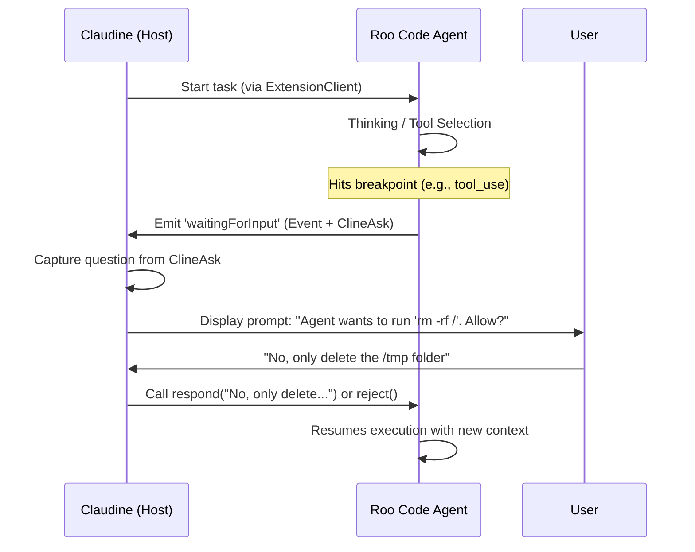

Roo Code (formerly Roo Cline) provides a robust local-first session management and resumption system. While primarily known as a VS Code extension, its standalone CLI (`roo`) and programmatic Node.js API (`ExtensionClient`) offer deep integration points for session persistence and interactive automation.

### Session Management and Resumption

Roo Code uses a **shadow Git repository** and local JSON storage to manage task history. Every task is assigned a unique `taskId` (UUID) which serves as the session identifier.

#### Capture and Resumption Mechanisms

| Feature           | Interactive Session (VS Code)                                   | Non-Interactive / CLI Session                                  |
|:------------------|:----------------------------------------------------------------|:---------------------------------------------------------------|
| **Capture ID**    | Emitted via `taskCreated` event in `RooCodeAPI`.                | Available via `roo history` or parsing `--output-format json`. |
| **Resume Method** | Restore from Task History or Checkpoint UI.                     | Command: `roo resume <task-id>`                                |
| **State Storage** | Global storage (e.g., `~/Library/Application Support/Code/...`) | Same as extension (shared history).                            |
| **Checkpoints**   | Automatic "Shadow Git" snapshots.                               | Snapshots created before file modifications.                   |

### Interactive Environment Resuming

The VS Code interactive environment does not use a slash command for resuming by default (though it uses many for other tasks like `/code`, `/ask`). Instead, it provides a **visual history browser**.

* **Checkpoints:** Users can scroll back in the chat to any "Checkpoint" and select **"Restore Files & Task"**. This reverts the workspace to the exact state (files + AI memory) at that timestamp.
* **CLI Resumption:** The CLI command `roo resume <task-id>` picks up the conversation exactly where it left off, loading the full context window and history associated with that ID.

### Interactive Prompts and Hooks

Roo Code provides a specialized event-driven architecture rather than traditional shell hooks (like Claude Code's JSON-on-stdin hooks).

#### The `waitingForInput` Hook

The most critical "hook" for Claudine is the `waitingForInput` event emitted by the `ExtensionClient`. This event fires whenever the agent reaches a state requiring human intervention (e.g., tool approval, follow-up questions, or command confirmation).

**Capture and Resume Workflow for Claudine:**

### Quirks and Complications

Developers working with Roo Code's resume functionality should note several architectural idiosyncrasies:

* **Completion Ambiguity:** The `taskCompleted` event fires for `completion_result`, but this is technically an `ask` type. The agent is "idle" but still waiting for the user to acknowledge or provide feedback before the session truly closes.
* **Transition-Only Events:** The `waitingForInput` event only fires on **state transitions**. If a caller connects to a session that is *already* waiting, they will miss the event. Callers must check `isWaitingForInput` immediately upon connection.
* **Auto-Approve Bias:** By default, the CLI auto-approves all actions. To intercept "asks" and capture questions, the CLI must be run with `--require-approval` or via the programmatic API.
* **Shadow Git Overhead:** The checkpoint system creates a separate `.git` directory in a hidden storage path. Large projects or frequent edits can lead to significant local disk usage for session state.

### Storage of Resumable Content

Roo Code is **local-primary**. Resumable content is not stored on a central server; it resides entirely on the host machine.

* **Local History:** JSON files containing the message history.
* **Shadow Repository:** A hidden Git repository used to track file diffs for every tool execution.
* **Session ID:** The `taskId` is merely a pointer to these local resources. If the local storage is cleared, the session cannot be resumed even if the ID is known.

---

**Summary of Roo Code CLI Session Resumption**

Roo Code CLI provides a local-first session management system centered around unique `taskId` identifiers and a "shadow Git" checkpoint architecture. Sessions can be listed via `roo history` and resumed using `roo resume <task-id>`.

* **Key Capabilities:**

    * **Resumption:** Full state recovery (conversation + file system) via local snapshots.
    * **Interception:** Programmatic `waitingForInput` hooks allow external orchestrators like Claudine to capture agent questions and tool requests.
    * **Persistence:** All state is stored locally in VS Code global storage or custom configured paths, ensuring privacy and offline availability.
    * **Automation:** Supports non-interactive modes (`--print`, `--oneshot`) while maintaining the ability to resume into an interactive state if needed.
