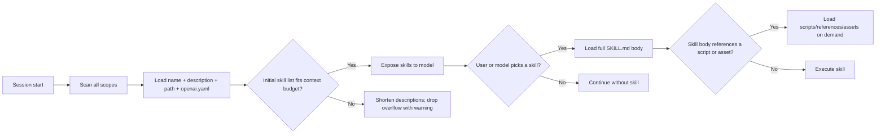

# OpenAI Codex CLI Skills

## Overview

OpenAI Codex CLI ships **first-class, file-system-based Agent Skills** that follow the [Agent Skills open standard](https://agentskills.io/specification). A skill is a directory containing a required `SKILL.md` entry point with YAML frontmatter and Markdown instructions, plus optional `scripts/`, `references/`, and `assets/` subdirectories. Codex activates skills explicitly (with `$skill-name` or `/skills`) or implicitly when a task matches the skill's `description`. The CLI is open source ([github.com/openai/codex](https://github.com/openai/codex)) and persists state under `CODEX_HOME` (default `~/.codex`). Codex 0.142.5 is installed on this host with bundled skills at `~/.codex/skills/.system/`.

Codex does **not** read Claude Code's `.claude/skills/` directories. To reuse a Claude-authored skill, symlink its directory into one of Codex's scan paths.

## Locations

Skill resources are organized by scope. The official Codex Skills page enumerates `system`, `admin`, `user`, and `repo` scopes; plugins add a fifth, `extension`.

| Scope | macOS | Linux | Windows | Notes |
|---|---|---|---|---|
| System / bundled | `$CODEX_HOME/skills/.system/` | `$CODEX_HOME/skills/.system/` | `%CODEX_HOME%\skills\.system\` | Shipped by OpenAI. Local host contains `imagegen`, `openai-docs`, `plugin-creator`, `skill-creator`, `skill-installer`. The official Skills page lists this only as "Bundled with Codex". |
| Admin | n/a | `/etc/codex/skills/<skill-name>/SKILL.md` | n/a | Machine-wide admin location. Linux-only per current docs. |
| User (modern) | `~/.agents/skills/<skill-name>/SKILL.md` | `~/.agents/skills/<skill-name>/SKILL.md` | `%USERPROFILE%\.agents\skills\<skill-name>\SKILL.md` | Official Skills page. |
| User (legacy / default-install) | `~/.codex/skills/<skill-name>/SKILL.md` | `~/.codex/skills/<skill-name>/SKILL.md` | `%USERPROFILE%\.codex\skills\<skill-name>\SKILL.md` | `$CODEX_HOME/skills/<skill-name>/`. Codex's bundled `skill-creator` defaults here when CODEX_HOME is unset, and the on-disk install on this host lives here. Still actively scanned. |
| Repo (CWD) | `$CWD/.agents/skills/<skill-name>/SKILL.md` | `$CWD/.agents/skills/<skill-name>/SKILL.md` | `$CWD\.agents\skills\<skill-name>\SKILL.md` | Folder-specific, team-shareable. |
| Repo (parent) | `$CWD/../.agents/skills/<skill-name>/SKILL.md` | `$CWD/../.agents/skills/<skill-name>/SKILL.md` | `$CWD\..\.agents\skills\<skill-name>\SKILL.md` | Shared parent scope when CWD is inside a Git repository. |
| Repo (root) | `$REPO_ROOT/.agents/skills/<skill-name>/SKILL.md` | `$REPO_ROOT/.agents/skills/<skill-name>/SKILL.md` | `$REPO_ROOT\.agents\skills\<skill-name>\SKILL.md` | Top-of-repo skills available to any subfolder. |
| Extension / plugin | `<plugin>/skills/<skill-name>/SKILL.md` | `<plugin>/skills/<skill-name>/SKILL.md` | `<plugin>\skills\<skill-name>\SKILL.md` | Bundled inside a Codex plugin. Loads only when the plugin is enabled. |

Observed on this host: `/Users/ken/.codex/skills/.system/` contains the bundled `imagegen`, `openai-docs`, `plugin-creator`, `skill-creator`, and `skill-installer` skills; `/Users/ken/.codex/skills/` is heavily populated (≈80 entries, mostly symlinks to external `/Users/ken/.research/library/<topic>/skill` directories plus a few real directories). No `~/.agents/skills/` directory exists on this host — every user-installed skill lives under `~/.codex/skills/`.

Codex supports symlinked skill directories: when scanning, Codex follows the symlink and reads `SKILL.md` from the target. Individual files inside a skill folder are not separately symlinked.

## File Format

A skill is a directory whose `SKILL.md` is the required entry point:

```text
my-skill/
├── SKILL.md            # Required: metadata + instructions
├── scripts/            # Optional: executable code (Python/Bash/etc.)
├── references/         # Optional: documentation loaded on demand
├── assets/             # Optional: templates, images, data files
└── agents/
    └── openai.yaml     # Optional: Codex-specific UI/policy/dependencies
```

`SKILL.md` is YAML frontmatter between `---` markers followed by Markdown content.

### Standard frontmatter

Required fields follow the [Agent Skills spec](https://agentskills.io/specification):

| Field | Required | Constraints |
|---|---|---|
| `name` | Yes | 1-64 characters; lowercase letters, numbers, hyphens; no leading/trailing hyphen; no consecutive hyphens; must match the parent directory name. |
| `description` | Yes | 1-1024 characters; describes what the skill does and when to use it. The routing signal for implicit invocation. |

Optional fields:

| Field | Purpose |
|---|---|
| `license` | License name or reference to a bundled license file. |
| `compatibility` | Environment requirements (max 500 characters). |
| `metadata` | Arbitrary string-key/string-value map for additional metadata. Codex's bundled skills use `metadata.short-description`. |
| `allowed-tools` | Space-separated pre-approved tool names (experimental in the standard). |

A minimal `SKILL.md`:

```markdown
---
name: pdf-processing
description: Extract PDF text, fill forms, merge files. Use when handling PDFs.
license: Apache-2.0
metadata:
  author: example-org
  version: "1.0"
---

# PDF processing

Steps Codex should follow when handling PDFs …
```

### `agents/openai.yaml` sidecar

Codex-specific metadata for UI presentation, invocation policy, and MCP dependencies:

```yaml
interface:
  display_name: "User-facing name"
  short_description: "User-facing description"
  icon_small: "./assets/small-logo.svg"
  icon_large: "./assets/large-logo.png"
  brand_color: "#3B82F6"
  default_prompt: "Optional surrounding prompt"

policy:
  allow_implicit_invocation: false   # default true; false blocks model auto-selection while keeping $skill-name usable

dependencies:
  tools:
    - type: "mcp"
      value: "openaiDeveloperDocs"
      description: "OpenAI Docs MCP server"
      transport: "streamable_http"
      url: "https://developers.openai.com/mcp"
```

Observed on this host: `~/.codex/skills/.system/skill-creator/agents/openai.yaml` and `~/.codex/skills/.system/skill-installer/agents/openai.yaml` contain only `interface:` blocks with `display_name`, `short_description`, `icon_small`, and `icon_large`. No `policy:` or `dependencies:` block in the shipped sidecars.

## Discovery and Precedence

Codex uses progressive disclosure to keep skill metadata cheap:



### Discovery order (lowest → highest priority)

1. **System** — `$CODEX_HOME/skills/.system/` (OpenAI-bundled).
2. **Admin** — `/etc/codex/skills/` (Linux only).
3. **User** — `~/.agents/skills/` (official) and `~/.codex/skills/` (legacy / default-install under `CODEX_HOME`).
4. **Repo** — `.agents/skills/` walked from the launch CWD up to the Git repository root, plus `$CWD/../.agents/skills/` for a shared parent scope.
5. **Extension** — `<plugin>/skills/<skill-name>/SKILL.md` for plugins that ship skills.

Same-name conflicts are **not merged**: both skills remain available in the selector. The context budget for the initial skill list is roughly 2% of the model context, capped at 8,000 characters when the context is unknown; descriptions are shortened first, then individual skills are dropped with a warning.

### Enable / disable

| Mechanism | Effect |
|---|---|
| `[[skills.config]] path = "/abs/path/SKILL.md" enabled = false` in `~/.codex/config.toml` | Disables that specific skill (path matches `SKILL.md`, not the directory). Restart Codex after editing. |
| `policy.allow_implicit_invocation: false` in `agents/openai.yaml` | Blocks the model from auto-selecting the skill; explicit `$skill-name` still works. |
| `--disable skills` / `--enable skills` (feature flag values) | Globally toggles skill discovery for the session. Skills are enabled by default. |
| Plugin enabled state | Skills bundled in a disabled plugin do not load, even if their directories exist. |
| `--strict-config` | Surfaces unknown config keys, useful when validating `[[skills.config]]` entries. |

## Portability

Skills are portable across tools that implement the Agent Skills standard.

**Portable as-is:**

- `SKILL.md` Markdown body.
- Standard frontmatter (`name`, `description`, `license`, `compatibility`, `metadata`, `allowed-tools`).

**Non-portable — must be rewritten or removed:**

- `scripts/` contents (language interpreter, executable bit, host availability).
- `agents/openai.yaml` sidecar (`interface`, `policy`, `dependencies` are Codex-specific).
- `dependencies.tools[]` MCP declarations in the Codex shape (`type`, `value`, optional `transport`, `url`).
- `policy.allow_implicit_invocation` — no equivalent outside Codex.
- `allowed-tools` values referencing Codex-specific tool names.
- `[[skills.config]]` disable entries in `~/.codex/config.toml` — provider-specific.
- Bundled system skills (`skill-creator`, `skill-installer`, `plan`, etc.) — Codex-shipped and not portable to other providers.
- File references that assume a particular repository layout.

## Claudine Linking Notes

For Claudine's cross-provider resource linking:

- Treat **both** `~/.agents/skills/` (official) and `~/.codex/skills/` (legacy / default-install) as canonical user-scope Codex skill roots, since Codex still installs into `~/.codex/skills/` by default and the bundled `skill-creator` defaults there when `CODEX_HOME` is unset.
- Recognize `$CODEX_HOME/skills/.system/` as the bundled system scope; link these only when a user/repo override exists.
- Index `/etc/codex/skills/` for Linux admin skills and the `.agents/skills/` walk-from-CWD pattern for repo skills.
- Treat `SKILL.md` as the canonical entry point and `agents/openai.yaml` as Codex-specific metadata. When linking into another provider, either drop the sidecar or convert the `dependencies.tools` and `policy.allow_implicit_invocation` fields to that provider's equivalent.
- Honor `[[skills.config]] path = "..." enabled = false` blocks when deciding whether a Codex-linked skill is active; treat them as provider-specific and do not propagate to other providers.
- Built-in system skills (`plan`, `skill-creator`, `skill-installer`, `plugin-creator`, `imagegen`, `openai-docs`) are Codex-shipped and should not be linked into other providers unless a user-space override exists.
- Plugin-bundled skills are namespaced inside their plugin; do not link plugin skills without also linking the surrounding plugin manifest.

## Changelog

- **2026-07-03** — Split location records from `os: all` into per-OS records (macOS, Linux, Windows) to satisfy the schema's `os` enum. Documented two user-scope paths (`~/.agents/skills/` per the official Skills page, `~/.codex/skills/` as the legacy / default-install location under `CODEX_HOME`) and confirmed both are scanned; the bundled `skill-creator` defaults new skills to `~/.codex/skills/` when `CODEX_HOME` is unset, and the on-disk install on this host uses `~/.codex/skills/` as the primary location. Added `system` scope records based on local inspection of `~/.codex/skills/.system/` (contains `imagegen`, `openai-docs`, `plugin-creator`, `skill-creator`, `skill-installer` on `codex-cli 0.142.5`). Refreshed `cli_params` against `codex --help` on v0.142.5 (`-c`, `--enable`, `--disable`, `--strict-config`, `-C`, `--add-dir`, `-p`, `--dangerously-bypass-approvals-and-sandbox`). Expanded `portability.non_portable_assets` to call out the Codex-flavored `dependencies.tools` shape and `policy.allow_implicit_invocation`. Updated `agent` / `model` frontmatter to current run metadata.

## Sources

- [Codex — Agent Skills](https://developers.openai.com/codex/skills)
- [Codex — CLI overview](https://developers.openai.com/codex/cli/)
- [Codex — CLI command reference](https://developers.openai.com/codex/cli/reference)
- [Codex — CLI slash commands](https://developers.openai.com/codex/cli/slash-commands)
- [Codex — Plugins](https://developers.openai.com/codex/plugins/build)
- [Codex — Environment variables](https://developers.openai.com/codex/environment-variables)
- [Codex — Config reference](https://developers.openai.com/codex/config-reference)
- [Codex — Config basics](https://developers.openai.com/codex/config-basic)
- [Agent Skills specification](https://agentskills.io/specification)
- [Agent Skills reference validator](https://github.com/agentskills/agentskills/tree/main/skills-ref)
- [OpenAI Codex GitHub repository](https://github.com/openai/codex)
- [OpenAI curated skills catalog](https://github.com/openai/skills)
- [Local host evidence — `~/.codex/skills/.system/{skill-creator,skill-installer,plugin-creator,openai-docs,imagegen}` and `~/.codex/config.toml` (codex-cli 0.142.5)]