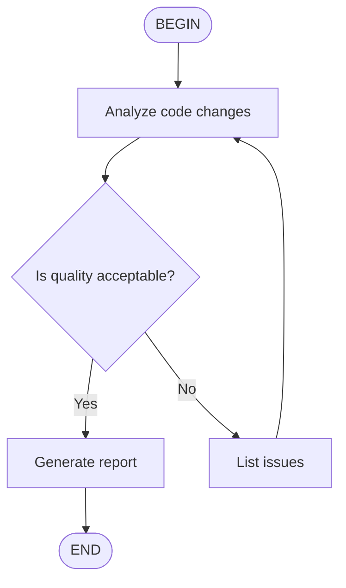

# Kimi Code CLI Skills

## Overview

Kimi Code CLI (Moonshot AI's agentic coding CLI) supports [Agent Skills](https://agentskills.io/), an open format for adding specialized knowledge and workflows to AI agents. A skill is a directory containing a `SKILL.md` entry point with optional YAML frontmatter and Markdown instructions, or — in the flat form — a single `<name>.md` file placed directly in a skills directory. At session startup, Kimi discovers skills across multiple roots, deduplicates them by normalized name (first match wins), and injects their name, path, and description into the system prompt under `### Project` / `### User` / `### Extra` / `### Built-in` scope headings so the model can decide when to read a given `SKILL.md`. Users can also invoke a skill explicitly with `/skill:<name>`; flow skills additionally expose `/flow:<name>`.

Kimi distinguishes **skills** (knowledge guidance the AI reads) from **plugins** (executable tools declared via `plugin.json`). Skills are not plugins, and the same skill can be used independently of any plugin install. This document covers skills only.

## Locations

Skill roots are grouped into four scope buckets: `user`, `project`, `extra`, and `builtin`. The brand group and the generic group are searched independently; the brand group is always inserted before the generic group, so a same-name skill in a brand directory shadows the generic version. Within the brand group, the directory priority is `kimi > claude > codex`.

| Scope | macOS / Linux | Windows | Notes |
|---|---|---|---|
| User — Kimi brand | `~/.kimi/skills/<skill-name>/SKILL.md` | `%USERPROFILE%\.kimi\skills\<skill-name>\SKILL.md` | Highest-priority brand directory. |
| User — Claude brand | `~/.claude/skills/<skill-name>/SKILL.md` | `%USERPROFILE%\.claude\skills\<skill-name>\SKILL.md` | Loaded as brand-group fallback or alongside `~/.kimi/skills/` depending on `merge_all_available_skills`. |
| User — Codex brand | `~/.codex/skills/<skill-name>/SKILL.md` | `%USERPROFILE%\.codex\skills\<skill-name>\SKILL.md` | Lowest-priority brand directory. |
| User — generic (recommended) | `~/.config/agents/skills/<skill-name>/SKILL.md` | `%USERPROFILE%\.config\agents\skills\<skill-name>\SKILL.md` | Canonical cross-tool location. |
| User — generic fallback | `~/.agents/skills/<skill-name>/SKILL.md` | `%USERPROFILE%\.agents\skills\<skill-name>\SKILL.md` | Searched when `~/.config/agents/skills/` is absent. |
| Project — Kimi brand | `.kimi/skills/<skill-name>/SKILL.md` | `.kimi\skills\<skill-name>\SKILL.md` | Resolved against the `.git`-anchored project root. |
| Project — Claude brand | `.claude/skills/<skill-name>/SKILL.md` | `.claude\skills\<skill-name>\SKILL.md` | Same root resolution. |
| Project — Codex brand | `.codex/skills/<skill-name>/SKILL.md` | `.codex\skills\<skill-name>\SKILL.md` | Same root resolution. |
| Project — generic | `.agents/skills/<skill-name>/SKILL.md` | `.agents\skills\<skill-name>\SKILL.md` | Same root resolution. |
| Extra (config) | Paths from `extra_skill_dirs` | Paths from `extra_skill_dirs` | Additive; `~` expands to `$HOME`; relative entries resolve against the project root. |
| Extra (CLI) | Paths from `--skills-dir` | Paths from `--skills-dir` | Replaces user and project auto-discovery. Built-ins still load. |
| Extra (plugins) | `~/.kimi/plugins/<plugin>/SKILL.md` | `%USERPROFILE%\.kimi\plugins\<plugin>\SKILL.md` | Always added as a single extra-scoped root (follows `KIMI_SHARE_DIR`). |
| Built-in | `<python-site-packages>/kimi_cli/skills/<name>/SKILL.md` | `<python-site-packages>\kimi_cli\skills\<name>\SKILL.md` | Shipped with the CLI: `kimi-cli-help`, `skill-creator`. Loaded only when the active KAOS backend is `local` or `acp`. |

Project skill roots are anchored to the project root, defined as the nearest directory containing `.git` above the working directory; the working directory itself is used as the project root when no `.git` marker is found. Launching from a monorepo subdirectory therefore still surfaces skills defined at the repository root.

The user's home directory on Windows is `%USERPROFILE%`; the `~` token used in the docs and the `extra_skill_dirs` config is expanded against `$HOME` (`%USERPROFILE%` on Windows) at discovery time.

## File Format

A skill is either:

- A subdirectory with a `SKILL.md` entry point (canonical layout):

  ```text
  my-skill/
  ├── SKILL.md          # Required metadata + instructions
  ├── scripts/          # Optional executable scripts
  ├── references/       # Optional reference documents
  └── assets/           # Optional other resources
  ```

- A flat `.md` file placed directly in a skills directory; its `name` defaults to the filename without the `.md` extension, and `description` follows the same three-step fallback as subdirectory skills.

  ```text
  ~/my-skills-collection/
  ├── demo-ui-components.md    # flat: name = "demo-ui-components"
  └── deploy/                   # subdirectory: name = "deploy"
      └── SKILL.md
  ```

  A bare `SKILL.md` placed directly at the top of a skills directory is treated as a stray marker and is not loaded as a skill. If a flat `<name>.md` and a subdirectory `<name>/SKILL.md` share the same name in the same directory, the subdirectory wins and a warning is logged.

`SKILL.md` uses YAML frontmatter between `---` markers followed by Markdown content:

```markdown
---
name: code-style
description: My project's code style guidelines
---

## Code Style

- Use 4-space indentation
- Variable names use camelCase
- Function names use snake_case
- Every function needs a docstring
- Lines should not exceed 100 characters
```

Frontmatter fields recognized by Kimi:

| Field | Required | Description |
|---|---|---|
| `name` | No | 1–64 lowercase letters, numbers, hyphens. Defaults to the directory name (or the `.md` filename stem for flat skills). Matched case-insensitively during discovery. |
| `description` | No | 1–1024 characters. Falls back to the first non-empty body line (truncated to 240 characters) and finally to the literal string `"No description provided."`. |
| `license` | No | License name or file reference. |
| `compatibility` | No | Environment requirements, up to 500 characters. |
| `metadata` | No | Additional key-value attributes. |
| `type` | No | `standard` (default) or `flow` for flow skills. |

The body is Markdown. Kimi does not currently recognize Claude-Code-specific frontmatter extensions such as `allowed-tools`, `disallowed-tools`, `disable-model-invocation`, `user-invocable`, `context`, `agent`, `hooks`, `paths`, or shell-injection blocks.

### Flow skills

Flow skills embed an Agent Flow diagram and are invoked via `/flow:<name>`:

```markdown
---
name: code-review
description: Code review workflow
type: flow
---


```

Flow diagrams must contain one `BEGIN` and one `END` node and may use Mermaid (preferred) or D2 syntax. Decision nodes require the agent to output `<choice>branch name</choice>` to select the next step. If a flow skill's diagram fails to parse, the loader falls back to `type: "standard"` and emits an error log; the skill remains usable as a regular skill.

## Discovery and Precedence

Kimi loads skills in a single layered scan at session startup via `resolve_skills_roots` in `src/kimi_cli/skill/__init__.py`. The first occurrence of any normalized skill name across the resolved root list wins, so the priority order is the reverse of insertion order.

```text
1. --skills-dir entries (CLI override, repeatable; replaces user/project discovery)
2. Project brand group   — .kimi/skills > .claude/skills > .codex/skills
3. Project generic group — .agents/skills
4. User brand group      — ~/.kimi/skills > ~/.claude/skills > ~/.codex/skills
5. User generic group    — ~/.config/agents/skills > ~/.agents/skills
6. extra_skill_dirs entries (additive, config-driven)
7. ~/.kimi/plugins       (always-on extra root, follows KIMI_SHARE_DIR)
8. Built-in skills       (only when KAOS backend is local or acp)
```

Within the brand group, two behaviors are supported:

- `merge_all_available_skills = true` (default since 1.39.0): every existing brand directory is included in `kimi > claude > codex` priority order.
- `merge_all_available_skills = false`: only the first existing brand directory is used; later brand directories are skipped.

The generic group is always searched independently of the brand group, even when its directory is empty (a regression fix in 1.30.0 prevents an empty `~/.config/agents/skills/` from hiding brand-group skills). When a skill name exists in both groups, the brand-group version wins because brand roots are inserted into the resolved list before generic roots.

For each resolved root, the loader runs two passes:

1. **Subdirectory pass** — entries of the form `<name>/SKILL.md` are loaded as subdirectory skills, with `<name>` as the default skill name.
2. **Flat pass** — entries of the form `<name>.md` (case-insensitive) are loaded as flat skills with `<name>` as the default skill name. A flat skill whose name collides with a subdirectory skill in the same directory is shadowed with a warning.

Discovered skill metadata is rendered into the system prompt under four scope headings, in priority order: `### Project`, `### User`, `### Extra`, `### Built-in`. Each entry lists the skill name, its path, and its description. Empty scope groups are omitted. This grouping lets the model distinguish a project-scope skill from a user-scope one when responding to prompts like "the skill in this project".

Skills are considered automatically by the model during conversation. Users can also load a skill explicitly with `/skill:<name> [<extra prompt>]`; flow skills accept `/flow:<name>` to execute the flow from `BEGIN` to `END`.

There is no per-skill enable/disable flag. Session-level control is via:

- `--skills-dir` to replace user and project auto-discovery with explicit directories.
- `extra_skill_dirs` in config to add directories.
- `merge_all_available_skills = false` to restrict the brand group to the highest-priority existing directory.
- The active KAOS backend (built-ins load only on `local`/`acp`).

There is no equivalent of Claude Code's `disable-model-invocation` or `user-invocable` frontmatter, and no `skillOverrides` mechanism. Errors during discovery (failed `is_dir`, permission denials, missing `SKILL.md`) are logged and skipped rather than aborting the whole scan.

## Portability

The portable parts of a Kimi skill are the Agent Skills standard frontmatter (`name`, `description`, `license`, `compatibility`, `metadata`) and the Markdown body. Because Kimi explicitly reads `.claude/skills/` and `.codex/skills/` at both user and project scope with the same `SKILL.md` and flat-`.md` contracts, skills placed in those directories are expected to be cross-tool compatible. The canonical cross-tool directory is `~/.config/agents/skills/` (user) and `.agents/skills/` (project); the `kimi`-brand directories are owned primarily by Kimi but their content is structurally portable.

Assets that need rewriting or host gating when moving to another provider:

- **Flow skills** (`type: flow`) — the Mermaid/D2 execution engine and `/flow:<name>` command are Kimi-specific.
- **`scripts/` files** — depend on installed interpreters, OS, and shell.
- **Tool-name references** — Kimi tools such as `Shell`, `StrReplaceFile`, `Agent`, `ReadFile`, `WriteFile`, `Glob`, `Grep`, `WebFetch`, etc. have different schemas or may not exist in other providers.
- **Project-root-relative paths** — tied to Kimi's `.git`-root discovery.
- **`extra_skill_dirs` config entries** — Kimi-specific config key; Claude Code and Codex have no equivalent.
- **`merge_all_available_skills` config** — Kimi-specific toggle; other providers do not scan multiple brand directories.
- **Kimi-specific frontmatter keys or `metadata` values** — Kimi ignores Claude-Code extensions, so linking a Kimi skill that uses `allowed-tools`, `disable-model-invocation`, or `user-invocable` will not be portable.

Kimi has no direct equivalent of Claude Code's `skillOverrides`, `disable-model-invocation`, `user-invocable`, managed skills, or plugin namespacing. Kimi plugins are a distinct feature from Claude Code plugins; a Kimi plugin's `SKILL.md` (if any) is loaded through the same `extra`-scoped path that user-config and `--skills-dir` entries use, not through a separate plugin manifest. The built-in `kimi-cli-help` and `skill-creator` skills are Kimi-specific and should not be linked as user-level resources elsewhere.

## Claudine Linking Notes

For Claudine's cross-provider resource linking:

- Treat Kimi-brand, Claude-brand, Codex-brand, and generic skill directories at both user and project scopes as linkable locations. Because Kimi merges `.kimi/skills/`, `.claude/skills/`, and `.codex/skills/`, a skill placed in `.claude/skills/` is usable by both Claude Code and Kimi. The canonical cross-tool location is `~/.config/agents/skills/` (user) and `.agents/skills/` (project).
- Classify standard Agent Skills frontmatter (`name`, `description`, `license`, `compatibility`, `metadata`) and the Markdown body as portable.
- Flag flow skills (`type: flow`) and any `scripts/` dependencies, Kimi-specific tool-name references, and `extra_skill_dirs` or `merge_all_available_skills` config knobs as non-portable / requiring rewrite.
- Account for `merge_all_available_skills` when deciding which brand directories are effective. When `false`, only the highest-priority existing brand directory contributes; when `true`, all existing brand directories are merged in priority order.
- Account for the `.git`-anchored project root: a Kimi `.kimi/skills/` defined at the repository root is picked up from any subdirectory, so a project-scope link should target the repo-root path rather than a per-package copy.
- Recognize flat `.md` skills as first-class skill entries whose `name` derives from the filename stem; treat the absence of `name` in the frontmatter as a filename-based default.
- Recognize that the always-on `~/.kimi/plugins` extra root is a Kimi-specific extension; do not link Kimi plugin directories as portable user-scope resources elsewhere.
- Recognize that `KIMI_SHARE_DIR` does not relocate skill search paths; the brand and generic user directories are always derived from `$HOME` regardless of the share dir.
- Recognize that Kimi has no per-skill enable/disable frontmatter, so link-time gating is the only way to suppress a Kimi skill in a target provider.

## Changelog

- **2026-07-03** — Split location records from `os: all` into per-OS records (macOS, Linux, Windows) to satisfy the schema contract. Documented the two-group discovery model (brand + generic) and the always-on `~/.kimi/plugins` extra root. Added the KAOS backend gate for built-in skills (loaded only on `local`/`acp`). Added the two-pass discovery model (subdirectory then flat `.md`) and the subdirectory-shadows-flat tie-break. Verified the description fallback chain (frontmatter → first body line capped at 240 chars → `"No description provided."`) and the `.git`-anchored project-root resolution. Verified locally: `~/.kimi/config.toml` has `merge_all_available_skills = false` and `extra_skill_dirs = []`; `~/.kimi/skills/` does not exist; `~/.claude/skills/` contains 85+ skill entries (real directories plus symlinks to external skill libraries); kimi CLI v0.14.0 installed.

## Sources

- [Kimi Code CLI — Agent Skills](https://moonshotai.github.io/kimi-cli/en/customization/skills.html)
- [Kimi Code CLI — `kimi` Command Reference](https://moonshotai.github.io/kimi-cli/en/reference/kimi-command.html)
- [Kimi Code CLI — Config Files](https://moonshotai.github.io/kimi-cli/en/configuration/config-files.html)
- [Kimi Code CLI — Environment Variables](https://moonshotai.github.io/kimi-cli/en/configuration/env-vars.html)
- [Kimi Code CLI — Data Locations](https://moonshotai.github.io/kimi-cli/en/configuration/data-locations.html)
- [Kimi Code CLI — Slash Commands](https://moonshotai.github.io/kimi-cli/en/reference/slash-commands.html)
- [Kimi Code CLI — Plugins (Beta)](https://moonshotai.github.io/kimi-cli/en/customization/plugins.html)
- [Kimi Code CLI — Changelog](https://moonshotai.github.io/kimi-cli/en/release-notes/changelog.html)
- [Kimi Code CLI GitHub — `src/kimi_cli/skill/__init__.py`](https://github.com/MoonshotAI/kimi-cli/blob/main/src/kimi_cli/skill/__init__.py)
- [Kimi Code CLI GitHub — `src/kimi_cli/skill/flow/__init__.py`](https://github.com/MoonshotAI/kimi-cli/blob/main/src/kimi_cli/skill/flow/__init__.py)
- [Kimi Code CLI GitHub — `src/kimi_cli/plugin/manager.py`](https://github.com/MoonshotAI/kimi-cli/blob/main/src/kimi_cli/plugin/manager.py)
- [Kimi Code CLI GitHub — `src/kimi_cli/utils/path.py`](https://github.com/MoonshotAI/kimi-cli/blob/main/src/kimi_cli/utils/path.py)
- [Kimi Code CLI GitHub — `tests/core/test_skill.py`](https://github.com/MoonshotAI/kimi-cli/blob/main/tests/core/test_skill.py)
- [Kimi Code CLI GitHub — `klips/klip-8-config-and-skills-layout.md`](https://github.com/MoonshotAI/kimi-cli/blob/main/klips/klip-8-config-and-skills-layout.md)
- [Kimi Code CLI GitHub — built-in `kimi-cli-help/SKILL.md`](https://github.com/MoonshotAI/kimi-cli/blob/main/src/kimi_cli/skills/kimi-cli-help/SKILL.md)
- [Kimi Code CLI GitHub — built-in `skill-creator/SKILL.md`](https://github.com/MoonshotAI/kimi-cli/blob/main/src/kimi_cli/skills/skill-creator/SKILL.md)
- [Agent Skills open specification](https://agentskills.io/specification)
- [Kimi Code homepage](https://www.kimi.com/code)
- [Kimi Code CLI GitHub repository](https://github.com/MoonshotAI/kimi-cli)
