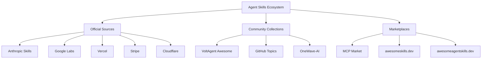
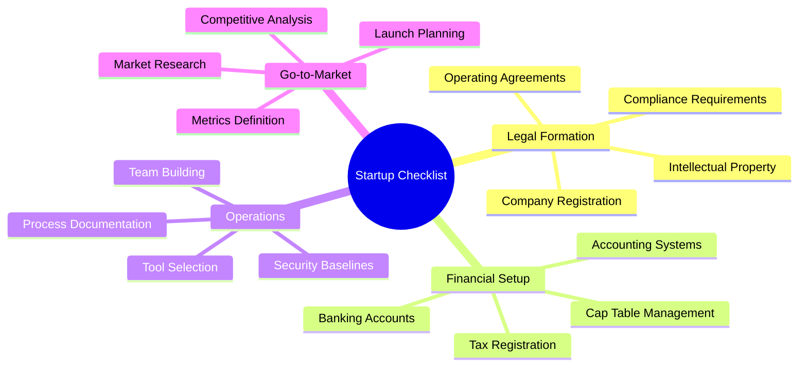
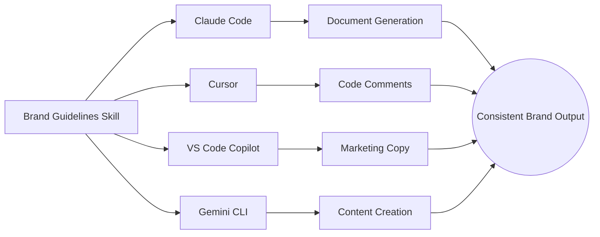
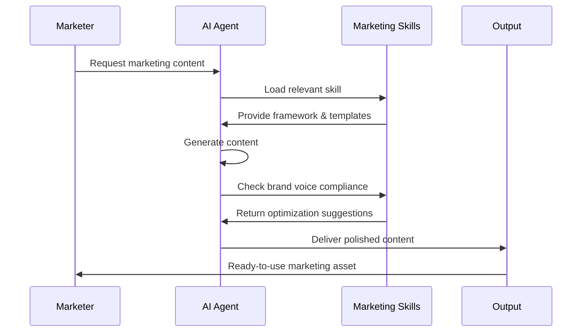
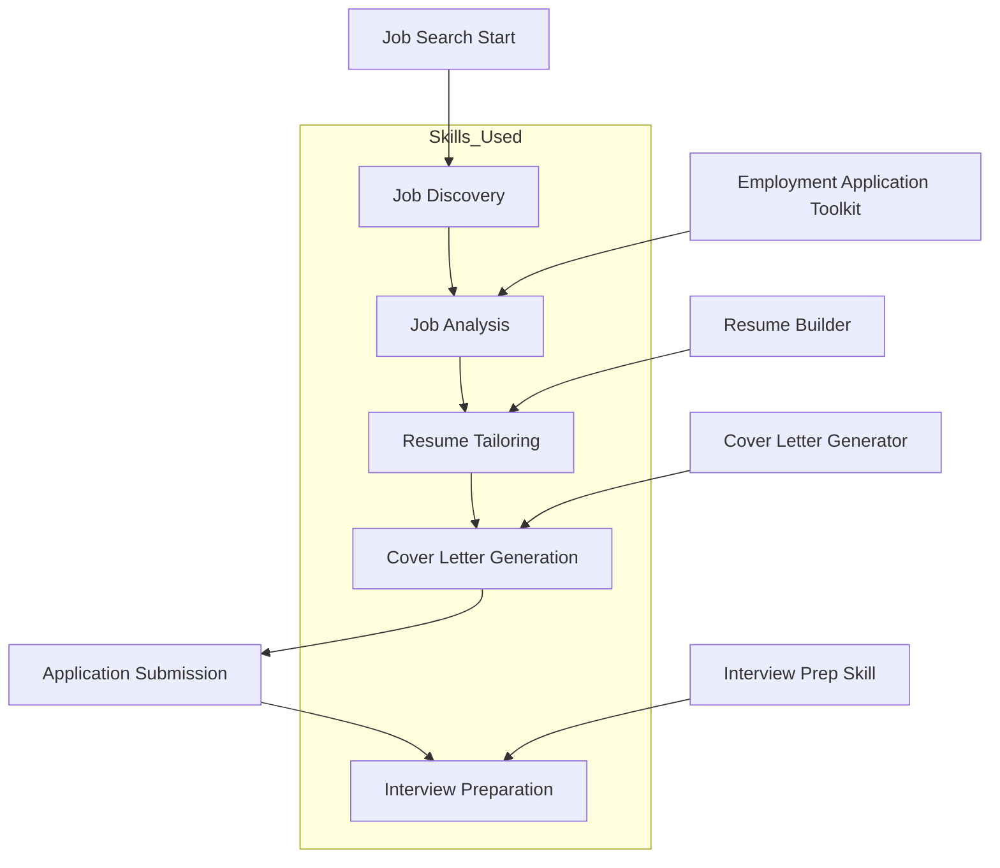
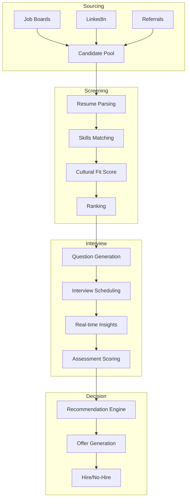

# Agent Skills Resource Guide

> A comprehensive directory of high-quality Agent Skills for business, marketing, and career development workflows.

## Overview

Agent Skills are modular, reusable instruction sets that teach AI coding assistants how to perform specialized tasks reliably. Introduced by Anthropic in 2025, the Agent Skills ecosystem has rapidly expanded to include thousands of open-source and community-contributed skills compatible with Claude Code, OpenAI Codex, GitHub Copilot, Gemini CLI, Cursor, and other agentic CLI solutions.

The skills format is simple: a folder containing a `SKILL.md` file with structured instructions, optional scripts, and resources. This standardized approach enables sharing skills across teams and the broader community.



---

## 1. Company Startup Checklist Skills

Building a new company involves numerous legal, operational, and strategic steps. These skills help founders navigate the startup formation process systematically.

### Recommended Skills

| Skill Name             | Source      | Description                                                  | Link                                                        |
| ---------------------- | ----------- | ------------------------------------------------------------ | ----------------------------------------------------------- |
| **startup-info**       | mnfst       | Research any startup in seconds with investor-style briefings including product overview, founders, funding rounds, and traction signals | [GitHub](https://github.com/mnfst/startup-info)             |
| **startup-checklist**  | leonar15    | A comprehensive incorporation checklist to help founders get back to building products and fundraising | [GitHub](https://github.com/leonar15/startup-checklist)     |
| **the-startup**        | rsmdt       | Multi-agent AI framework making Claude Code work like a startup team for comprehensive specifications | [GitHub](https://github.com/rsmdt/the-startup)              |
| **block/agent-skills** | Block       | Marketplace for agent skills including checklists for code review, incident response, and security audits | [GitHub](https://github.com/block/agent-skills)             |
| **agent-skills-guide** | kaydenplayZ | Guide for creating agent skill files with examples, templates, and best practices | [GitHub](https://github.com/kaydenplayZ/agent-skills-guide) |

### Skill Categories for Startup Formation



### Key Resources

- **[Anthropic's Official Skills Repository](https://github.com/anthropics/skills)** - Contains document creation and editing skills that power Claude's document capabilities
- **[VoltAgent Awesome Agent Skills](https://github.com/VoltAgent/awesome-agent-skills)** - 500+ curated skills from official dev teams and community
- **[Introduction to Agent Skills Course](https://anthropic.skilljar.com/introduction-to-agent-skills)** - Free Anthropic training on building, configuring, and sharing skills

---

## 2. Company Branding Skills

Establishing a cohesive brand identity requires consistent application of visual and messaging guidelines. These skills help teams maintain brand consistency across all touchpoints.

### Recommended Skills

| Skill Name                     | Source            | Description                                                  | Link                                                         |
| ------------------------------ | ----------------- | ------------------------------------------------------------ | ------------------------------------------------------------ |
| **brand-guidelines**           | Anthropic         | Official skill for implementing Anthropic's brand identity and style resources | [GitHub](https://github.com/anthropics/skills/blob/main/skills/brand-guidelines/SKILL.md) |
| **netresearch-branding-skill** | Netresearch       | Complete brand guidelines, reference documentation, and ready-to-use templates for visual identity implementation | [GitHub](https://github.com/netresearch/netresearch-branding-skill) |
| **corporate-brand-styling**    | MCP Market        | Apply consistent corporate branding, styles, and messaging to all generated documents | [MCP Market](https://mcpmarket.com/tools/skills/corporate-brand-styling) |
| **scorecard-marketing**        | wondelai          | Create scorecard concepts for B2B companies with assessment questions | [GitHub](https://github.com/wondelai/skills)                 |
| **humanizer**                  | biostartechnology | Detects and fixes AI writing patterns for more authentic brand communications | [GitHub](https://github.com/moltbot/skills/blob/main/skills/biostartechnology/humanizer/SKILL.md) |

### Brand Identity Skill Components

A comprehensive branding skill typically includes:

| Component           | Purpose                                                      |
| ------------------- | ------------------------------------------------------------ |
| **Color Palette**   | Primary, secondary, and accent color definitions with hex/RGB values |
| **Typography**      | Font families, sizes, weights, and line-height specifications |
| **Logo Guidelines** | Usage rules, clear space, size minimums, and incorrect usage examples |
| **Voice & Tone**    | Brand personality traits and communication style guidelines  |
| **Visual Elements** | Iconography, illustration style, photography guidelines      |
| **Templates**       | Pre-approved layouts for common document types               |

### Integration Platforms



---

## 3. Marketing Skills

Marketing encompasses a broad range of activities from content creation to conversion optimization. These skills help technical marketers and founders leverage AI for marketing workflows.

### Recommended Skills

| Skill Name                    | Source         | Description                                                  | Link                                                         |
| ----------------------------- | -------------- | ------------------------------------------------------------ | ------------------------------------------------------------ |
| **marketingskills**           | coreyhaines31  | Comprehensive collection focused on CRO, copywriting, SEO, analytics, and growth engineering | [GitHub](https://github.com/coreyhaines31/marketingskills)   |
| **marketingskills**           | mysticaltech   | Marketing skills for AI agents focused on technical marketers and founders | [GitHub](https://github.com/mysticaltech/marketingskills)    |
| **seomachine**                | TheCraigHewitt | Specialized workspace for creating long-form, SEO-optimized blog content | [GitHub](https://github.com/TheCraigHewitt/seomachine)       |
| **content-creator**           | alirezarezvani | SEO-optimized marketing content with brand voice analyzer and content frameworks | [GitHub](https://github.com/alirezarezvani/claude-skills/blob/main/marketing-skill/content-creator/SKILL.md) |
| **skillbank**                 | defi-naly      | Book and framework skills with 35 marketing skills including copywriting, email sequences | [GitHub](https://github.com/defi-naly/skillbank)             |
| **Maestrix Marketing Skills** | LinkedIn       | 43 templates ready for startup founders building marketing strategies | [LinkedIn](https://www.linkedin.com/pulse/maestrix-marketing-skills-claude-43-templates-ready-dumortier-1lmqc) |

### Marketing Skill Categories

The marketing skills ecosystem covers the following specializations:

| Category               | Skills Available | Common Use Cases                                          |
| ---------------------- | ---------------- | --------------------------------------------------------- |
| **Copywriting**        | 15+              | Landing pages, ads, emails, product descriptions          |
| **SEO**                | 10+              | Keyword research, content optimization, technical SEO     |
| **CRO**                | 8+               | A/B testing, landing page optimization, funnel analysis   |
| **Email Marketing**    | 12+              | Sequences, drip campaigns, newsletter creation            |
| **Analytics**          | 6+               | Dashboard creation, metric interpretation, reporting      |
| **Social Media**       | 9+               | Content calendars, post generation, engagement strategies |
| **Growth Engineering** | 5+               | Viral loops, referral programs, onboarding optimization   |

### Marketing Workflow Integration



### Featured Marketing Skills from Skillbank

| Skill            | Description                                               |
| ---------------- | --------------------------------------------------------- |
| `copywriting`    | Writing or rewriting marketing copy for any page type     |
| `email-sequence` | Creating or optimizing email sequences and drip campaigns |
| `landing-page`   | Designing and optimizing landing pages for conversions    |
| `ad-copy`        | Generating ad copy for various platforms                  |
| `social-content` | Creating social media content calendars and posts         |

---

## 4. Finding AI Jobs Skills

The AI job market is rapidly expanding, and specialized skills help candidates navigate job searches, optimize applications, and prepare for interviews.

### Recommended Skills

| Skill Name                          | Source     | Description                                                  | Link                                                         |
| ----------------------------------- | ---------- | ------------------------------------------------------------ | ------------------------------------------------------------ |
| **Employment Application Toolkit**  | MCP Market | Analyze job ads, map selection criteria, generate professionally styled CVs and cover letters | [MCP Market](https://mcpmarket.com/tools/skills/professional-employment-application-toolkit) |
| **Job Application Assistant**       | MCP Market | Streamlines job search by analyzing postings, evaluating fit, generating tailored ATS-optimized materials | [MCP Market](https://mcpmarket.com/tools/skills/job-application-assistant) |
| **CV & Resume Builder**             | MCP Market | Optimizes professional resumes for impact, ATS compatibility, and role-specific targeting | [MCP Market](https://mcpmarket.com/tools/skills/cv-resume-builder-3) |
| **Tailored Resume Generator**       | MCP Market | Generates ATS-optimized, role-specific resumes by mapping experience to requirements | [MCP Market](https://mcpmarket.com/tools/skills/tailored-resume-generator-6) |
| **LinkedIn Resume Optimizer**       | MCP Market | Automate job search with ATS-friendly resumes, skill gap analysis, and interview prep | [MCP Market](https://mcpmarket.com/tools/skills/linkedin-resume-job-optimizer) |
| **Resume Writing ATS Optimization** | MCP Market | Parse, match, and tailor ATS-friendly resumes while preserving formatting | [MCP Market](https://mcpmarket.com/tools/skills/resume-writing-ats-optimization) |

### AI-Powered Job Search Workflow



### Real-World Application

A notable example documented in a [Medium article](https://medium.com/@cheemabyren/i-built-a-team-of-ai-agents-to-find-me-a-job-heres-what-happened-ad19566fc193) describes building four specialized agents:

1. **The Job Searcher** - Finds relevant job postings
2. **The Analyzer** - Evaluates job fit and requirements
3. **The Writer** - Creates tailored application materials
4. **The Tracker** - Manages application pipeline

This approach demonstrates how multiple skills can work together as an AI-powered job search team.

### Key Features of Job Search Skills

| Feature                 | Benefit                                          |
| ----------------------- | ------------------------------------------------ |
| **ATS Optimization**    | Ensures resumes pass automated screening systems |
| **Keyword Matching**    | Aligns resume language with job requirements     |
| **STAR Method**         | Structures achievements for maximum impact       |
| **Multi-format Output** | Generates DOCX, PDF, and plain text versions     |
| **Skill Gap Analysis**  | Identifies areas for professional development    |

---

## 5. Finding AI Employees Skills

Recruiting AI talent requires specialized workflows for sourcing, screening, and evaluating candidates with machine learning, data science, and AI engineering expertise.

### Recommended Skills & Projects

| Resource Name                 | Source          | Description                                                  | Link                                                         |
| ----------------------------- | --------------- | ------------------------------------------------------------ | ------------------------------------------------------------ |
| **Talent-Acquisition-Agent**  | ahmedeltaher    | Autonomous, multi-agent platform for end-to-end hiring workflows with minimal human intervention | [GitHub](https://github.com/ahmedeltaher/Talent-Acquisition-Agent) |
| **ConvexHire**                | devrahulbanjara | Multi-agent recruitment automation replacing entire hiring pipeline with AI that evaluates and decides | [GitHub](https://github.com/devrahulbanjara/ConvexHire)      |
| **AI-Recruitment-Agent**      | Ancastal        | Multi-agent recruitment assistant leveraging Microsoft AutoGen framework | [GitHub](https://github.com/Ancastal/AI-Recruitment-Agent)   |
| **AI-Based Resume Screening** | BorHan-U        | Resume screening technique to identify proper talent acquisition through content matching | [GitHub](https://github.com/BorHan-U/An-AI-Based-Resume-Screening-For-Job-Recruitment) |
| **HeadHunter MCP Server**     | MCP Market      | Integrate HeadHunter API for advanced job search and resume management | [MCP Market](https://mcpmarket.com/server/headhunter)        |

### AI Recruitment Pipeline Architecture



### Multi-Agent Recruitment System Components

| Agent Role            | Responsibilities                                             |
| --------------------- | ------------------------------------------------------------ |
| **Sourcer Agent**     | Scans job boards, social platforms, and databases for candidates |
| **Screener Agent**    | Parses resumes, extracts skills, matches against job requirements |
| **Interviewer Agent** | Generates role-specific questions, conducts initial screening |
| **Evaluator Agent**   | Scores responses, calculates cultural fit, ranks candidates  |
| **Coordinator Agent** | Manages scheduling, communications, and pipeline tracking    |

### Skills for AI Talent Evaluation

When hiring AI employees, specialized evaluation skills help assess:

| Assessment Area           | Skills Required                                             |
| ------------------------- | ----------------------------------------------------------- |
| **Technical Proficiency** | ML frameworks, programming languages, model deployment      |
| **Research Capability**   | Paper reading, experiment design, hypothesis testing        |
| **System Design**         | Architecture, scalability, MLOps                            |
| **Business Acumen**       | ROI analysis, stakeholder communication, project management |
| **Ethics & Safety**       | Bias detection, responsible AI practices, compliance        |

---

## Skill Installation & Usage

### Quick Installation

Most agent skills can be installed using npm/npx:

```bash
# Install skills interactively
npx skills add <repository/skill-name>

# Example: Install marketing skills
npx skills add coreyhaines31/marketingskills

# Example: Install from Anthropic's official collection
npx skills add anthropics/skills
```

### Manual Installation

```bash
# Clone the skills repository
git clone https://github.com/VoltAgent/awesome-agent-skills

# Copy desired skill to your project's .claude/skills/ directory
cp -r awesome-agent-skills/skills/<skill-name> .claude/skills/
```

### Platform Compatibility

| Platform       | Skill Format Support    | Installation Method             |
| -------------- | ----------------------- | ------------------------------- |
| Claude Code    | Full support (SKILL.md) | `npx skills add` or manual copy |
| OpenAI Codex   | Full support            | Skills API endpoints            |
| GitHub Copilot | Full support            | VS Code settings sync           |
| Cursor         | Full support            | Settings import                 |
| Gemini CLI     | Full support            | `npx skills add`                |

---

## Key Resources

### Official Documentation

| Resource                        | Link                                                         |
| ------------------------------- | ------------------------------------------------------------ |
| Anthropic Agent Skills Overview | [platform.claude.com/docs/agents-and-tools/agent-skills/overview](https://platform.claude.com/docs/en/agents-and-tools/agent-skills/overview) |
| Claude Code Quickstart          | [platform.claude.com/docs/agents-and-tools/agent-skills/quickstart](https://platform.claude.com/docs/en/agents-and-tools/agent-skills/quickstart) |
| Building Skills Guide (PDF)     | [resources.anthropic.com/hubfs/The-Complete-Guide-to-Building-Skill-for-Claude.pdf](https://resources.anthropic.com/hubfs/The-Complete-Guide-to-Building-Skill-for-Claude.pdf) |
| Anthropic Skills Course         | [anthropic.skilljar.com/introduction-to-agent-skills](https://anthropic.skilljar.com/introduction-to-agent-skills) |
| DeepLearning.AI Course          | [deeplearning.ai/short-courses/agent-skills-with-anthropic](https://www.deeplearning.ai/short-courses/agent-skills-with-anthropic) |

### Community Collections

| Collection                                                   | Skills Count | Focus Areas                         |
| ------------------------------------------------------------ | ------------ | ----------------------------------- |
| [VoltAgent Awesome](https://github.com/VoltAgent/awesome-agent-skills) | 500+         | Comprehensive, all categories       |
| [OneWave-AI claude-skills](https://github.com/onewave-ai/claude-skills) | 100+         | Sales, business automation, content |
| [awesomeskills.dev](https://www.awesomeskills.dev)           | 1000+        | Curated atlas of all skills         |
| [awesomeagentskills.dev](https://www.awesomeagentskills.dev) | 8000+        | Auto-updating unified directory     |

### Marketplaces

| Marketplace                | URL                                                          |
| -------------------------- | ------------------------------------------------------------ |
| MCP Market                 | [mcpmarket.com](https://mcpmarket.com)                       |
| Awesome Skills Directory   | [awesomeskills.dev](https://www.awesomeskills.dev)           |
| GitHub Actions Marketplace | [github.com/marketplace/actions/publish-agent-skills](https://github.com/marketplace/actions/publish-agent-skills) |

---

## Best Practices

### Creating Effective Skills

1. **Be Specific**: Skills should focus on a single, well-defined workflow
2. **Include Examples**: Provide concrete examples of expected inputs and outputs
3. **Define Boundaries**: Clearly state what the skill does and does not do
4. **Use Templates**: Include reusable templates for common outputs
5. **Version Control**: Track changes and maintain backward compatibility

### Skill Structure Template

```
skill-name/
├── SKILL.md           # Main instruction file (required)
├── templates/         # Reusable templates
│   ├── template1.md
│   └── template2.md
├── examples/          # Example inputs/outputs
│   └── example1.json
└── resources/         # Additional resources
    └── reference.md
```

### Security Considerations

When using community skills:

- Review source code before installation
- Check for hidden prompts or malicious patterns
- Validate skill outputs before use in production
- Keep skills updated from trusted sources only
- Use skills from verified publishers when possible

---

## References

1. Anthropic. (2025). *Agent Skills - Claude API Docs*. Retrieved from https://platform.claude.com/docs/en/agents-and-tools/agent-skills/overview

2. VoltAgent. (2026). *Awesome Agent Skills*. GitHub Repository. https://github.com/VoltAgent/awesome-agent-skills

3. Haines, C. (2026). *Marketing Skills for AI Agents*. GitHub Repository. https://github.com/coreyhaines31/marketingskills

4. Anthropic. (2025). *The Complete Guide to Building Skills for Claude*. PDF Guide. https://resources.anthropic.com/hubfs/The-Complete-Guide-to-Building-Skill-for-Claude.pdf

5. Cheema, B. (2025). *How I built an AI Agent with Claude Code to find me a job*. Medium. https://medium.com/@cheemabyren/i-built-a-team-of-ai-agents-to-find-me-a-job-heres-what-happened-ad19566fc193

6. DeepLearning.AI. (2025). *Agent Skills with Anthropic*. Short Course. https://www.deeplearning.ai/short-courses/agent-skills-with-anthropic

7. MCP Market. (2026). *Employment Application Skills Collection*. https://mcpmarket.com/tools/skills/professional-employment-application-toolkit

8. OpenAI. (2025). *Agent Skills Documentation*. https://developers.openai.com/codex/skills

9. GitHub. (2025). *About Agent Skills*. GitHub Docs. https://docs.github.com/en/copilot/concepts/agents/about-agent-skills

10. VS Code. (2026). *Use Agent Skills in VS Code*. https://code.visualstudio.com/docs/copilot/customization/agent-skills
