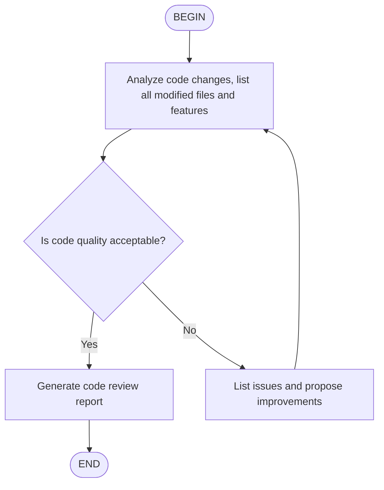

# Kimi Code CLI Slash Commands and Agent Skills

## Overview

Kimi Code CLI's user-defined reusable command surface is **Agent Skills**. Skills are Markdown files with YAML frontmatter that can be invoked in an interactive session with the `/skill:<name>` slash command. A special skill variant, **flow skills**, can be executed as a multi-turn workflow with `/flow:<name>`. The CLI also ships with a separate catalog of built-in slash commands (such as `/help`, `/model`, `/plan`) that are documented in the [slash commands reference](https://moonshotai.github.io/kimi-cli/en/reference/slash-commands.html); those built-ins are not user-definable.

Kimi Code CLI is being wound down in favor of **Kimi Code** ([GitHub](https://github.com/MoonshotAI/kimi-code), [docs](https://moonshotai.github.io/kimi-code/)). The installed `kimi` binary on this machine is already the Kimi Code successor and has migrated the `~/.kimi` configuration. The facts below are derived from the current Kimi Code CLI documentation at `moonshotai.github.io/kimi-cli`.

Support is **first class**: users can define skills at user, project, and extra scopes; invoke them by name; and rely on automatic discovery and precedence rules. There is no separate "custom slash command" file format comparable to Claude Code's `.claude/commands/<name>.md`.

## Locations

Skills are discovered from brand directories (`.kimi/`, `.claude/`, `.codex/`) and generic directories (`.agents/` or `.config/agents/`). Discovery walks up to the nearest `.git` ancestor for project-level skills, falling back to the work directory when no `.git` marker exists.

| OS | Scope | Path | Notes |
| :- | :---- | :--- | :---- |
| macOS / Linux | User | `~/.kimi/skills/<name>/` | Canonical Kimi user skills. |
| macOS / Linux | User | `~/.claude/skills/<name>/` | Claude-format skills are also loaded. |
| macOS / Linux | User | `~/.codex/skills/<name>/` | Codex-format skills are also loaded. |
| macOS / Linux | User | `~/.config/agents/skills/<name>/` | Recommended cross-tool generic location. |
| macOS / Linux | User | `~/.agents/skills/<name>/` | Generic fallback. |
| Windows | User | `%USERPROFILE%\.kimi\skills\<name>\` | Inferred from published ~-paths; not explicitly documented for Windows. |
| Windows | User | `%USERPROFILE%\.config\agents\skills\<name>\` | Inferred generic-group Windows path. |
| macOS / Linux | Repo | `.kimi/skills/<name>/` | Project-level brand skills; resolved from the project root. |
| macOS / Linux | Repo | `.claude/skills/<name>/` | Project-level Claude skills. |
| macOS / Linux | Repo | `.codex/skills/<name>/` | Project-level Codex skills. |
| macOS / Linux | Repo | `.agents/skills/<name>/` | Project-level generic skills. |
| Windows | Repo | `.kimi\skills\<name>\` | Inferred project-level path. |
| All | Extra | Configured by `extra_skill_dirs` | Absolute, `~`-prefixed, or project-root-relative paths in `config.toml`. |

### Local observations

On this machine, `~/.kimi/` exists and contains a migrated configuration (`config.toml`, `kimi.json`, sessions, etc.), but `~/.kimi/skills/` does not exist. `~/.claude/skills/` exists with multiple skill directories, and `~/.agents/skills/` exists with a single `find-skills` directory. `~/.kimi/.migrated-to-kimi-code` indicates the local installation has moved to Kimi Code.

## File Format

### Directory layout

A skill is a directory whose name becomes the command name:

```text
my-skill/
├── SKILL.md          # Required: metadata + instructions
├── scripts/          # Optional: executable code
├── references/       # Optional: documentation
└── assets/           # Optional: templates, resources
```

A single Markdown file placed directly in a skills directory is also accepted:

```text
~/my-skills-collection/
├── demo-ui-components.md    # flat skill: name = "demo-ui-components"
└── deploy/                   # directory skill: name = "deploy"
    └── SKILL.md
```

If a flat `.md` and a subdirectory share the same name in the same directory, the subdirectory wins and a warning is logged.

### Frontmatter

`SKILL.md` uses YAML frontmatter between `---` markers. Per the [Agent Skills specification](https://agentskills.io/specification), `name` and `description` are required.

| Field | Required | Purpose |
| :---- | :------- | :------ |
| `name` | Yes | Skill identifier: 1-64 lowercase alphanumerics and hyphens; must match the directory name unless overridden in a flat `.md` file. |
| `description` | Yes | 1-1024 characters; shown in `/help` and used by the model to decide auto-activation. |
| `license` | No | License name or file reference. |
| `compatibility` | No | Environment requirements, up to 500 characters. |
| `metadata` | No | Arbitrary key-value map for tooling. |
| `allowed-tools` | No | Space-separated pre-approved tools (experimental). |
| `type` | No | Set to `flow` for flow skills. |

### Flow skills

A flow skill sets `type: flow` and embeds a Mermaid or D2 diagram in the body:

```markdown
---
name: code-review
description: Code review workflow
type: flow
---


```

### Argument handling

There is no documented placeholder or argument-splitting grammar. Text after `/skill:<name>` or `/flow:<name>` is appended raw to the skill prompt. For example:

```text
/skill:git-commits fix user login issue
```

The body of `git-commits/SKILL.md` is sent to the Agent, followed by the raw string `fix user login issue`.

### Example skill file

```markdown
---
name: git-commits
description: Git commit message conventions using Conventional Commits format
---

## Git Commit Conventions

Use Conventional Commits format:

type(scope): description

Allowed types: feat, fix, docs, style, refactor, test, chore

Examples:
- feat(auth): add OAuth login support
- fix(api): fix user query returning null
- docs(readme): update installation instructions
```

## Invocation Model

### How commands are invoked

In an interactive session, type `/skill:` followed by the skill name:

- `/skill:code-style`
- `/skill:pptx`
- `/skill:git-commits fix user login issue`

Flow skills execute their embedded diagram:

- `/flow:code-review`

Both standard and flow skills can also be loaded as standard prompts with `/skill:<name>`; `/flow:<name>` is the only invocation that runs the flow engine.

### Namespacing and precedence

Built-in slash commands and skill invocations share a single `/` namespace. Skill discovery groups entries under `### Project`, `### User`, `### Extra`, and `### Built-in` headings in the system prompt. Resolution rules:

1. Scope precedence is **Project > User > Extra > Built-in**.
2. Within a scope, the brand directories (`.kimi/skills/`, `.claude/skills/`, `.codex/skills/`) are merged when `merge_all_available_skills = true` (default). Same-name skills in brand directories resolve **kimi > claude > codex**.
3. The generic group (`~/.config/agents/skills/`, `~/.agents/skills/`) is merged independently; it loses to the brand group on conflicts.
4. Flat `.md` skills and subdirectory skills in the same directory resolve in favor of the subdirectory.

### Arguments

Everything after the command name is passed as one raw string and appended to the skill prompt. There is no documented quoting, positional splitting, named argument, or default-argument behavior.

### Output handling

For `/skill:<name>`, the rendered `SKILL.md` content is sent to the Agent as a user prompt. For `/flow:<name>`, the Agent starts at the `BEGIN` node and follows the flow diagram; decision nodes require the Agent to output `<choice>branch name</choice>` to select the next step. Standard output from lifecycle hooks may also be added to context, but hooks are not slash commands.

### Disable mechanisms

- Delete, rename, or remove the skill directory or flat `.md` file.
- Set `merge_all_available_skills = false` in `~/.kimi/config.toml` to stop merging all brand directories and restore first-match-only behavior.
- Pass `--skills-dir PATH` to override auto-discovery entirely.
- No per-skill disable flag (such as `user-invocable: false`) is documented.

### Trust and permissions

Project-level skills are discovered from the nearest `.git` ancestor and loaded automatically. No explicit workspace-trust dialog or approval gate for repo skills is documented in the Kimi Code CLI docs. The `allowed-tools` frontmatter is marked experimental.

## Portability

Kimi Code CLI skills are **not portable** to another provider without rewriting the command surface.

What can be reused with rewrites:

- The Markdown prose body of a standard skill.
- The directory/name structure if copied to a target provider's skills directory.

What is provider-specific and must be rewritten or removed:

- The `/skill:<name>` and `/flow:<name>` invocation prefixes.
- `type: flow` frontmatter and Mermaid/D2 flow execution semantics.
- The `allowed-tools` frontmatter.
- Scope grouping and precedence rules.
- The absence of argument placeholders; target providers that require `$ARGUMENTS` or `{{args}}` need manual substitution logic.

Because Kimi Code CLI searches `.claude/skills/` and `.codex/skills/`, skills already stored in those directories are visible to Kimi without duplication. For portability in the other direction, place the skill under `.agents/skills/` or `.kimi/skills/` and rewrite the invocation prefix.

## Claudine Linking Notes

- Classify Kimi Code CLI as **first-class slash/skill support** with **non-portable** commands.
- Do not symlink a Kimi skill definition directly as a runnable slash command for another provider; map the Markdown body and rewrite the invocation grammar.
- When syncing from Kimi to Claude/Codex, the body can often be reused because Kimi already reads `.claude/skills/` and `.codex/skills/`; the main work is removing or translating Kimi-specific frontmatter and invocation prefixes.
- When syncing from Claude/Codex to Kimi, copy `SKILL.md` bodies into `.kimi/skills/` or `.agents/skills/` and replace `/name` or `/name:sub` invocation with `/skill:name`. Strip Claude-specific placeholders (`$ARGUMENTS`, `$N`, `!` shell injection, `allowed-tools` syntax) because Kimi appends arguments raw and does not support shell-injection markers.
- Preserve scope precedence when building a unified command index: Project > User > Extra > Built-in, with brand-group wins over generic-group.

## Sources

- [Kimi Code CLI documentation](https://moonshotai.github.io/kimi-cli/en/)
- [Slash commands reference](https://moonshotai.github.io/kimi-cli/en/reference/slash-commands.html)
- [Agent Skills customization](https://moonshotai.github.io/kimi-cli/en/customization/skills.html)
- [Agent Skills specification](https://agentskills.io/specification)
- [Configuration files](https://moonshotai.github.io/kimi-cli/en/configuration/config-files.html)
- [Environment variables](https://moonshotai.github.io/kimi-cli/en/configuration/env-vars.html)
- [Data locations](https://moonshotai.github.io/kimi-cli/en/configuration/data-locations.html)
- [Kimi Code CLI GitHub repository](https://github.com/MoonshotAI/kimi-cli)
- Local inspection of `~/.kimi/`, `~/.kimi-code/`, `~/.claude/skills/`, and `~/.agents/skills/`
