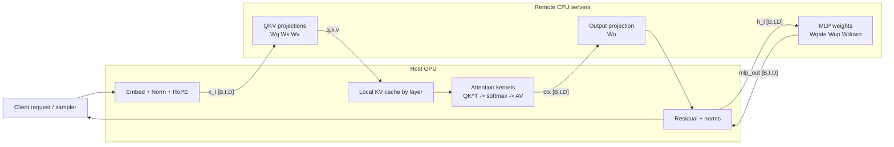
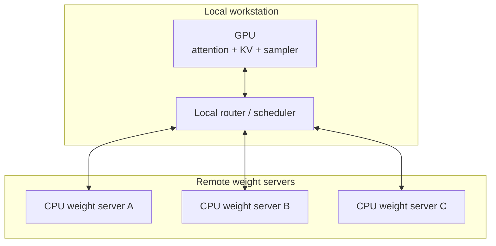

# Split Attention and Remote Weight Execution for LLM Inference

## Executive summary

Because the referenced video was not included in the prompt, this report analyzes the architecture implied by your description: a local host keeps the interactive, stateful parts of inference on a GPU, while one or more remote machines hold the model weights and execute weight-heavy operators on CPUs. In practical terms, that means the local host would own tokenization, the residual stream, positional encoding, KV-cache management, attention score/value computation, and sampling; remote servers would own dense linear projections and possibly the MLPs. That decomposition is technically coherent, and it is closely related to several active research directions in heterogeneous inference, offloading, and disaggregated serving. citeturn32view0turn35view0turn37search0turn36search1

The main upside is memory economics. The local GPU no longer needs to store the full model weights, only enough memory for activations, workspace, and the KV cache. The main downside is that the dominant bottleneck moves from local HBM/PCIe to remote DRAM bandwidth plus network round trips. For dense decoder-only models, decode-time throughput is heavily constrained by repeatedly touching large weight matrices every token, so a design that ships activations to remote CPUs can be workable only if it minimizes RPC count, batches aggressively, and runs over a low-latency, high-bandwidth fabric. The best current evidence comes from heterogeneous CPU/GPU work such as HeteGen, FlexInfer, NEO, and OmniServe, and from disaggregated serving systems such as Splitwise, DistServe, vLLM PD-disaggregation, and TensorRT-LLM disaggregation; however, most of those systems split **phases** or **layers/experts**, not “attention-local / weights-remote” at operator granularity. citeturn35view0turn32view0turn37search2turn36search1turn24view0turn24view1turn18view0turn17view1turn31view1

The strongest practical conclusion is that none of the mainstream local-serving stacks you listed offers this exact pattern as a first-class, documented feature today. The closest foundations are `llama.cpp`/ggml RPC, entity["company","NVIDIA","gpu vendor"] TensorRT-LLM plus Triton, vLLM with custom worker/connector logic, and entity["company","Apple","consumer electronics company"] MLX distributed communication. `llama.cpp` is the closest open-source substrate because it already exposes remote devices, including a remote CPU device when no accelerator exists on the server, and it can use RDMA as well as TCP. But even there, the default behavior is to distribute model weights **and the KV cache** across available devices in proportion to memory, not to keep attention local while sending only linear algebra to remote CPUs. citeturn7view1turn17view1turn18view0turn20view1

For most users, the architecture is attractive as a research prototype, a homelab experiment, or a specialized deployment on a LAN or co-located cluster. It is much less attractive as a general-purpose serving pattern over ordinary cloud networking or the public Internet. If the goal is near-term production viability, the most mature disaggregations in 2025–2026 are prefill/decode splitting and KV-cache transfer, not operator-level attention/weight separation. If the goal is to explore the exact pattern from the video, the best implementation routes today are: custom Triton pipelines, a modified `llama.cpp` graph partitioner, or a customized vLLM worker/attention backend stack. citeturn17view1turn18view0turn15search2turn15search3turn7view1turn18view1

## Technical description of the technique

A standard decoder block takes a hidden-state tensor \(x_\ell \in \mathbb{R}^{B \times t \times D}\), where \(B\) is the active batch, \(t\) is the token count for the current forward step, and \(D\) is the model width. In prefill, \(t\) is the prompt chunk length. In decode, \(t=1\) for each sequence. For a Llama-style attention block with grouped query attention, the projections produce
\[
Q_\ell \in \mathbb{R}^{B \times h_q \times t \times d_h},\;
K_\ell \in \mathbb{R}^{B \times h_{kv} \times t \times d_h},\;
V_\ell \in \mathbb{R}^{B \times h_{kv} \times t \times d_h},
\]
with \(D = h_q d_h\). The KV cache held across time has shape
\[
K^\text{cache}_\ell,\; V^\text{cache}_\ell \in \mathbb{R}^{B \times h_{kv} \times T \times d_h},
\]
where \(T\) is the accumulated context length. The local attention step computes \(QK^\top\), applies masking and softmax, multiplies by \(V\), then reshapes back to \(\mathbb{R}^{B \times t \times D}\) before the output projection and MLP. Heterogeneous CPU/GPU work such as HeteGen and FlexInfer is directly relevant here because both explicitly analyze how to split attention-stage and feed-forward-stage work between CPU and GPU, while NEO and OmniServe go further by moving selected attention/KV work toward the CPU. citeturn35view0turn32view0turn37search2turn36search1

A literal implementation of “host GPU runs attention; remote servers run model weights on CPU” therefore usually means the following decomposition:

- **Local GPU**: embedding lookup or embedding cache, residual adds, RMSNorm/LayerNorm, RoPE or position handling, KV-cache ownership, attention score/value computation, logits head, sampling, and session state.
- **Remote CPU servers**: `W_Q`, `W_K`, `W_V`, `W_O`, and the MLP weights (`W_gate`, `W_up`, `W_down`), ideally stored in quantized form with CPU-friendly kernels.
- **Network boundary**: hidden-state tensors and projected tensors cross the wire; the goal is to avoid sending full weights or full KV blocks during decode unless absolutely necessary. This matches the broader observation from offload/disaggregation literature that weights and KV caches are the dominant memory consumers, while decode behavior is strongly shaped by communication overhead and phase characteristics. citeturn8view0turn32view0turn24view0turn24view1

The minimum viable RPC interface for this design is more demanding than it first appears. At a minimum, the system needs a long-lived **session** abstraction keyed by `session_id` or `request_id`, explicit **layer identifiers**, and agreement on `dtype`, quantization metadata, tensor layout, and position encoding semantics. If the host applies RoPE locally, the remote projection service only needs the normalized hidden state; if the remote side applies RoPE or fused QKV kernels, it also needs `position_ids` or equivalent metadata. To reduce round trips, a practical implementation would not expose one tiny RPC per matmul. It would instead expose one or two coarse RPCs per layer, or one RPC per **group of layers**, with temporary state retained server-side. vLLM’s disaggregated prefill connectors, Pipes, and LookupBuffers, and TensorRT-LLM’s `cache_transceiver_config` and context-parameter handoff, are good examples of the kind of explicit session metadata and transport abstractions that become necessary once execution is split across processes or machines. citeturn18view0turn17view1turn17view2

The memory arithmetic is favorable for the host, but only if the host keeps the KV cache local and does not also replicate large weight shards. KV memory scales roughly as
\[
2 \cdot n_\text{layers} \cdot B \cdot T \cdot h_{kv} \cdot d_h \cdot s
\]
bytes, where \(s\) is bytes per element. Weight memory scales with parameter count and precision instead. This asymmetry is why many offload systems can make a large model “fit” on a modest GPU by moving weights elsewhere, but it is also why decode becomes communication-sensitive. DeepSpeed ZeRO-Inference explicitly exploits this by keeping the model in CPU or NVMe memory and streaming weights layer-by-layer into GPU memory, while Hugging Face Accelerate and vLLM expose CPU offload and device mapping for similar reasons. citeturn8view0turn19view2turn19view3turn18view3

The compute trade-off is subtler. Attention is stateful and benefits tremendously from local KV access and optimized GPU kernels. By contrast, the linear layers and MLPs account for most of the model’s parameters and a large share of the bytes read each decode step. That makes “local attention / remote linear layers” a conceptually sensible split, and it also explains why recent work repeatedly tries to overlap weight movement with attention or other compute. FlexInfer compares CPU-only, GPU-offload, and static CPU/GPU partitioning; HeteGen uses heterogeneous CPU/GPU parallelism with asynchronous overlap; and TensorRT-LLM’s new DWDP work overlaps asynchronous remote expert-weight prefetch with the MoE block of one layer and the attention block of the next. The conceptual pattern is the same even though DWDP is GPU-to-GPU and MoE-specific rather than CPU-to-GPU and dense-model-wide. citeturn33view1turn35view0turn31view1turn31view2

## Performance, latency, batching, and deployment economics

The latency model for this architecture is dominated by a small set of terms:
\[
L_\text{token}
\approx \sum_{\ell = 1}^{L}
\left(
T_{\text{cpu-gemm},\ell}
+
T_{\text{gpu-attn},\ell}
+
\sum_{r=1}^{R_\ell}\left(\tau_r + \frac{\text{bytes}_r}{\beta_r}\right)
\right),
\]
where \(L\) is layer count, \(R_\ell\) is the number of remote exchanges for layer \(\ell\), \(\tau_r\) is per-exchange latency, and \(\beta_r\) is effective transport bandwidth. The architecture wins only when the local GPU attention kernels and remote CPU GEMMs can overlap enough work to hide some or most communication. That is exactly the condition highlighted in DWDP, which states that remote-weight prefetch is only beneficial when it can be hidden behind sufficiently large compute windows and high-bandwidth peer communication. Splitwise and DistServe reach a related conclusion at the phase level: phase disaggregation helps when communication overhead is kept small relative to the saved interference and queuing costs. citeturn31view1turn24view0turn24view1turn17view1

Bandwidth matters, but fine-grained **round-trip count** often matters more. Activation traffic is not automatically enormous: hidden states are much smaller than full model weights. The problem is that decode can involve many repeated per-layer interactions. `llama.cpp` community reports illustrate this sharply. The upstream RPC backend can distribute inference over networked machines and even use RDMA, but users have also reported poor realized network utilization and only a few tokens per second on small multi-PC clusters when the runtime is not able to turn the network into a streaming, well-overlapped pipeline. That is a warning sign for any design that would introduce multiple remote calls per layer during decode. citeturn7view1turn29view1turn29view3turn29view4

Batching changes the economics. Prefill is naturally batch-friendly because prompt tokens are processed in parallel, while decode is much more sequential within each request. That distinction is central in Splitwise, DistServe, vLLM PD-disaggregation, TensorRT-LLM disaggregation, and SGLang’s PD mode. In the architecture you asked about, batching can still help because remote CPU GEMMs become more efficient on thicker activation batches, and because the wire cost of metadata and scheduler overhead is amortized across more tokens. But interactive latency will usually rise as the batch thickens, and local KV-cache memory grows linearly with both sequence length and concurrency. TGI’s continuous batching, Ollama’s parallel request settings, and the goodput framing in DistServe all point to the same throughput-vs-latency trade-off. citeturn19view0turn21view2turn24view1turn17view0turn25search1

The deployment regime matters enough that it is useful to think of the technique as three different systems rather than one:

| Deployment regime | Practical interpretation | Likely outcome |
|---|---|---|
| Same host, CPU RAM + local GPU | This is essentially local offload or hybrid execution, not true remote execution. It is the environment targeted by ZeRO-Inference, Accelerate, FlexGen, HeteGen, FlexInfer, NEO, and PowerInfer-style systems. | Most plausible near-term path if you want functionality rather than novelty. Lowest latency, least engineering risk. citeturn8view0turn19view3turn9academia11turn35view0turn32view0turn37search2turn28search1 |
| Local LAN or desk-side fabric | Remote CPU machines or mixed-device hosts connected by TCP, 10/25/100GbE, Thunderbolt, UCX, or RDMA. `llama.cpp` RPC, MLX distributed, and some community clusters live here. | Viable only if the runtime coarsens RPCs, batches requests, and keeps KV local. Good homelab/research territory; weak for naïve per-layer decode RPC. citeturn7view1turn20view1turn12search4 |
| Co-located cluster / RDMA / NVLink domain | This is where modern disaggregated serving systems actually operate. TensorRT-LLM supports MPI, UCX, and NIXL with RDMA/NVLink, and llm-d’s validated examples are specifically on H200 clusters with InfiniBand or RoCE. | Best environment for serious disaggregation. Still, the mature shipped split is prefill/decode or GPU expert-weight prefetch, not remote CPU weight execution. citeturn17view1turn17view2turn25search0turn31view1 |

This also explains why the best-established mainstream disaggregation today is **prefill/decode** rather than **attention/weights**. Splitwise and DistServe show that phase splitting removes interference between compute-heavy prefill and memory-heavy decode; vLLM and TensorRT-LLM then operationalize that with explicit KV-transfer subsystems. By contrast, an attention/weights split asks the network to sit inside the inner loop of every block. It can work, but only if the implementation is unusually careful about session persistence, operator fusion, and overlap. citeturn24view0turn24view1turn18view0turn17view0turn17view1

Synchronization and consistency become first-class design constraints. If the host owns the KV cache, consistency is relatively clean: each layer’s KV append is local, and the remote side is stateless apart from temporary scheduling context. If remote servers keep any temporary projected tensors or per-session state to reduce RPC count, then the protocol must explicitly carry layer progress, token position, dtype, and cancellation semantics. TensorRT-LLM documents request cancellation and KV transfer timeouts; vLLM documents blocking vs non-blocking lookup semantics in its LookupBuffer; and Petals shows a more distributed failure model where clients keep intermediate activations and can reroute around failed servers. Those examples strongly suggest that a practical remote-CPU-weight design should prefer **host-owned attention state and host-owned retry metadata**. citeturn17view2turn18view0turn23view2

Security and privacy are not optional concerns here. The `llama.cpp` RPC README explicitly warns that the RPC backend is fragile and insecure, and says it should never be run on an open network or in a sensitive environment. Petals’ own public explanation emphasizes that each block input and output traverses the network, which is also why inserting adapters is possible; that same transparency implies privacy risk. In a production-quality implementation, the minimum sensible baseline would be mTLS, authenticated workers, per-session isolation, strict allowlists, and an assumption that activations and KV state may be sensitive. citeturn7view1turn23view2

## Known implementations, related projects, and similar split-execution approaches

The exact operator split from the video is not a common off-the-shelf product feature. What exists today is a spectrum of related ideas: remote layer/block execution, CPU/GPU hybrid operator placement, phase disaggregation, and remote-weight prefetch for MoE experts.

### Closest technical relatives

| System / project | What it actually splits | Relation to the target pattern | Primary source |
|---|---|---|---|
| Petals | Transformer blocks across many remote servers; client keeps embeddings/logits and routes through a chain of servers | Strong analog for **remote block execution**; not attention-local, but it proves that activation shipping through remote blocks can be practical with latency-aware routing and host-side orchestration | Petals paper and repo citeturn23view1turn23view0 |
| DeepSpeed ZeRO-Inference | Weights in CPU/NVMe, streamed layer-by-layer into GPU | Strong analog for **weight offload**, but same-node rather than network-remote; explicitly designed for throughput-oriented scenarios | DeepSpeed blog / paper citeturn8view0turn8view1 |
| FlexGen | GPU/CPU/disk placement of weights, KV, activations; CPU involvement in attention score work in decode | Relevant precursor showing that CPU-side attention work can exist, but the overall design remains offload-oriented and throughput-centric | Paper + FlexInfer’s comparison table citeturn9academia11turn33view2 |
| HeteGen | Heterogeneous CPU/GPU parallelism for offloaded LLM inference | Very close conceptually to the video’s idea because it explicitly redistributes module computation between CPU and GPU to reduce I/O bottlenecks | MLSys/arXiv paper citeturn35view0 |
| FlexInfer | Chooses among CPU-only, GPU-offload, and CPU/GPU static partitioning per phase | Very relevant because it formalizes phase-sensitive policy choice and shows decode can prefer CPU-side execution under some conditions | MLSys paper citeturn32view0turn33view1turn38view2 |
| NEO | Offloads part of attention compute and KV-cache states from GPU to host CPU for online serving | One of the closest **attention-specific** relatives; still local host CPU, not remote servers | MLSys/arXiv paper and slides citeturn37search2turn37search5 |
| OmniServe | “Attention Piggybacking” offloads BE-service attention work to CPU asynchronously while GPU continues inference | Close conceptual relative for **CPU attention offload with async overlap**; again targeted at hybrid CPU/GPU serving rather than remote CPU weight servers | arXiv abstract and HTML summary citeturn36search1turn36search4turn36search7 |
| Splitwise / DistServe | Prefill on one machine/GPU pool, decode on another, with state transfer between them | Mature mainstream form of **disaggregated serving**, but it splits phases rather than operator types | Papers citeturn24view0turn24view1 |
| vLLM PD-disaggregation | Two vLLM instances with KV transfer connector between prefill and decode | Productized open-source phase split, not attention-local / weight-remote | vLLM docs citeturn18view0turn18view4 |
| TensorRT-LLM disaggregation | Context and generation servers split with KV-cache exchange over MPI/UCX/NIXL | Mature GPU-cluster phase split with explicit transport subsystem | TensorRT-LLM docs/blog citeturn17view0turn17view1turn17view2 |
| TensorRT-LLM DWDP | Attention weights replicated locally; MoE expert weights pulled remotely and prefetched asynchronously | The closest mainstream **remote-weight execution analog** found in current serving literature, but it is GPU-to-GPU and MoE-only | DWDP paper/blog citeturn31view1turn31view2 |

Two findings are especially important. First, the mainstream open-source and production ecosystem is converging on **phase disaggregation** because it offers large gains without putting the network inside every decode-time block. Second, the most interesting operator-level analogs are in **heterogeneous CPU/GPU research systems** and in **MoE remote-weight prefetch**, not in general-purpose consumer-facing local model launchers. citeturn24view0turn24view1turn17view1turn31view1

### Community demos and concrete examples

| Example | Short summary | Why it matters | Source |
|---|---|---|---|
| `llama.cpp` RPC official README | The official docs show `rpc-server` exposing remote ggml devices, including a CPU device when no accelerator exists, and distributing model weights and KV cache across local and remote devices; RDMA is supported when available | This is the clearest open-source proof that networked remote-device execution already exists in a local-model stack | Upstream docs citeturn7view1 |
| LocalLLaMA tutorial using `llama-server --rpc` | A community guide shows how to compile RPC support and launch multiple remote nodes behind `llama-server` | Demonstrates real user interest and a practical cluster recipe | Reddit tutorial citeturn29view3 |
| LocalLLaMA RPC performance report | One user reports a 3-PC, 56 GB VRAM cluster running a model fully in VRAM at roughly 4–5 tok/s | Useful anecdotal evidence that networked inference works, but also that performance can be modest | Reddit benchmark citeturn29view4 |
| `llama.cpp` discussion on slow Ethernet RPC | A user reports surprisingly poor realized network utilization and slow token generation over 2.5GbE | Important cautionary evidence that naïve network assumptions can be wrong | GitHub discussion citeturn29view1 |
| Petals public swarm / chat app | Petals provides an actual distributed public network where clients route through remote block servers; the repo reports up to 6 tok/s for Llama 2 70B and the paper shows BLOOM-176B around 1 step/s | Best public demonstration that activation shipping through remote layers can be interactive | Repo and paper citeturn23view0turn23view1 |
| MLX community 5-node Mac cluster notes | A community issue describes `mlx_lm share` on a 5-node Mac Studio cluster and reports 5–6 GB/s broadcast over Thunderbolt 5 / JACCL | Anecdotal but useful evidence that Apple-silicon clusters can support serious inter-node model movement | Community issue snippet citeturn12search4 |

## Support matrix for the serving stacks you named

The status labels below mean **native** = explicit documented support for the exact pattern; **partial** = has building blocks that could support it with nontrivial engineering; **no** = the stack does not currently expose the necessary runtime model without a major rewrite.

### Engines and frameworks with meaningful building blocks

| Tool / stack | Support status | Required modifications or plugins | Network / IPC options | CPU vs GPU roles today | Typical performance characteristics | Primary source |
|---|---|---|---|---|---|---|
| `llama.cpp` / ggml RPC | **Partial** | Needs graph-partitioning/runtime changes to keep attention + KV local while routing only weight-heavy ops to remote CPUs; default behavior distributes weights **and KV** by memory | TCP; optional RDMA; local tensor cache on RPC server | Local + remote ggml devices; remote server can expose a CPU device if no accelerator exists | Best open-source substrate for experimentation; good enough for demos, but community reports show modest tok/s and sensitivity to network/runtime overlap | Upstream RPC docs + community reports citeturn7view1turn29view3turn29view4turn29view1 |
| vLLM | **Partial** | Custom worker class/worker extension, custom attention backend or external operator split, and probably a new transport/connector for operator-level calls | `mp` or Ray for distributed workers; KV-transfer connectors for disaggregated prefill; NIXL-backed flows are used in vLLM ecosystem deployments | Native feature is prefill/decode split and KV transfer, not remote CPU weight execution | Excellent serving core, but exact pattern is custom-engineering territory, not a built-in mode | vLLM docs + llm-d deployment guide citeturn18view0turn18view1turn18view2turn18view4turn25search0 |
| TensorRT-LLM | **Partial** | Exact pattern would require custom CPU weight services or backend work; native features already cover disaggregated prefill/decode and GPU remote-weight prefetch for MoE experts | MPI, UCX, NIXL; RDMA / NVLink; OpenAI REST orchestration or Dynamo; Triton integration | GPU-centric today: context/decode server split, GPU KV exchange, GPU expert prefetch in DWDP | Most mature high-performance disaggregation stack, but aimed at GPU clusters, not CPU remote weights | TensorRT-LLM docs/blog/DWDP citeturn17view0turn17view1turn17view2turn31view1turn31view2 |
| Triton Inference Server | **Partial** | Use Python backend or custom backend plus BLS/ensemble orchestration to build local-attention and remote-linear services | HTTP/gRPC; shared memory; model ensembles; BLS; model repos on FS/S3/GCS/Azure | Highly flexible orchestrator; actual CPU/GPU role split depends on your backends | Probably the best generic orchestration substrate for a custom prototype; overhead becomes painful if the split is too fine-grained | Triton docs citeturn15search2turn15search3turn15search6turn15search14turn15search19 |
| DeepSpeed / ZeRO-Inference | **Partial** | To make it remote-across-machines, you would need an RPC layer instead of local CPU/NVMe fetch; native design is same-host heterogenous memory | Local PCIe/NVMe paths; multi-GPU/multi-node inference framework generally available | CPU/NVMe store weights; GPU executes layers after streaming | Strong for local or cluster offload; excellent conceptual reference, but not a remote CPU service by default | DeepSpeed docs/paper citeturn8view0turn8view1 |
| Hugging Face Accelerate / Transformers | **Partial** | Custom RPC or device backend required for true remote execution; current tools support CPU and disk offload plus `device_map` dispatch | Local process/device mapping; no native operator RPC | CPU/disk offload, layer dispatch, GPUs as main execution devices | Useful for prototyping local heterogeneous execution, not for remote-weight serving on its own | Accelerate docs citeturn19view2turn19view3 |
| MLX / mlx-lm | **Partial** | Needs a custom model/runtime partition to keep attention local and remote only weight-heavy ops | `mlx.launch` over remote hosts; `ring` over TCP; JACCL over Thunderbolt/RDMA; MPI; NCCL | Distributed inference exists, but exact split pattern is not documented | Promising on tightly coupled Apple clusters; still a research/prototype path for this exact design | MLX/mlx-lm docs citeturn20view0turn20view1 |
| FasterTransformer | **Partial** | Major work needed for remote CPU weights; its documented scale-out is multi-GPU and multi-node GPT inference | Multi-node multi-GPU; Triton backend support | GPU-focused tensor/pipeline-style inference | Good GPU baseline, poor fit for CPU remote-weight experiments without deep changes | README / release notes citeturn16view0 |

### Stacks where the exact pattern is mostly absent

| Tool / stack | Support status | Why it is not a good fit today | Network / IPC options | CPU vs GPU roles today | Typical performance characteristics | Primary source |
|---|---|---|---|---|---|---|
| Ollama | **No** | Documented modes are local CPU/GPU inference plus separate cloud-model execution; no operator-level remote execution surface | Local API; cloud models via Ollama cloud | Either local GPU/CPU inference or a remote cloud model; not split-attention | Great UX, not a research runtime for this pattern | Ollama docs citeturn21view0turn21view1turn21view2 |
| ExLlamaV2 | **No** | Designed for local consumer GPUs; has multi-GPU split and remote API serving via TabbyAPI, but not CPU remote-weight execution | Local process; remote via external API server; multi-GPU split flags | GPU-centric quantized inference with paged attention | Very fast locally, but wrong abstraction for remote CPU operator split | ExLlamaV2 README citeturn22view0 |
| TGI | **No** | Supports tensor parallelism, continuous batching, optimized kernels, but not operator-level CPU remote execution | Standard server networking; multi-GPU sharding | GPU-focused serving engine | Strong production server, but not the right substrate for this exact architecture unless rebuilt underneath | TGI docs citeturn19view0 |
| Hugging Face Inference Endpoints | **Partial / hosted wrapper only** | Can run custom container images, so the platform can host your custom runtime, but the exact pattern is not a documented built-in serving mode | Standard cloud endpoint + custom images | Depends on chosen engine/container | Operationally possible only through a custom container that implements the pattern itself | Endpoints docs citeturn19view1 |
| ggml-based forks / `llama.cpp` forks | **Partial, inherited** | Only as capable as the fork’s exposure of upstream GGML RPC and device partitioning | Same as upstream if preserved | Same as upstream if preserved | Feasible if the fork stays close to upstream; otherwise uncertain | Upstream RPC docs citeturn7view1 |

The most useful practical ranking is therefore:

1. **Best experimental substrate:** `llama.cpp` / ggml RPC.  
2. **Best custom orchestration substrate:** Triton.  
3. **Best high-performance GPU-cluster substrate if you are willing to do serious engineering:** TensorRT-LLM.  
4. **Best modern serving core for a custom research fork:** vLLM.  
5. **Best same-host heterogeneous baseline to compare against:** DeepSpeed / Accelerate / MLX hybrid execution. citeturn7view1turn15search2turn17view1turn18view1turn8view0turn19view3turn20view1

## Practical guidance, failure modes, and bottom-line judgment

If you want to build the exact pattern rather than merely study it, the cleanest protocol is to keep **all KV cache ownership on the host GPU**, to treat remote CPU servers as mostly stateless weight executors, and to expose only **coarse fused RPCs**. A bad design is “one RPC per matmul.” A better design is “one RPC per whole block’s linear pieces,” or “one RPC per several consecutive layers,” with temporary server-side state keyed to a session so the server can return only the tensors the host truly needs for local attention and residual composition. This follows directly from the connector/state patterns in vLLM and TensorRT-LLM, and from the failure-handling lessons in Petals. citeturn18view0turn17view2turn23view2

Quantization is not optional. Remote CPU servers are fundamentally constrained by CPU compute and memory bandwidth. The architecture becomes much more plausible if the remote side stores weights in 4-bit or 8-bit formats with strong CPU kernels, while the wire format for activations stays relatively compact, typically BF16 or FP16. `llama.cpp`, ExLlama, Accelerate/Transformers, TGI, and MLX all underscore how central quantization now is to local or heterogeneous inference viability. citeturn6view1turn22view0turn19view2turn19view0turn20view0

For deployment, there are three sane patterns. The first is a **local-only baseline**, where “remote CPU” is replaced by host DRAM and NUMA-aware CPU threads; that is the easiest place to validate the split itself. The second is a **homelab / lab LAN** with one GPU workstation acting as host and several CPU-rich boxes acting as weight servers, preferably on low-latency Ethernet or better. The third is a **co-located cluster** with UCX/NIXL/RDMA-class networking and a router/scheduler layer. What does **not** look attractive is a geo-distributed or commodity-WAN version of the exact operator split. Petals can tolerate Internet-scale distribution because it routes across coarse remote blocks and accepts that the network is the system; your target design is much tighter and therefore far more latency-sensitive. citeturn23view1turn23view2turn17view1turn25search0

The strongest near-term recommendation is to benchmark the target pattern against two baselines before investing in major engineering. The first baseline should be a well-tuned same-host hybrid system such as ZeRO-Inference, Accelerate offload, FlexInfer-style split execution, or MLX distributed on a single box. The second baseline should be mainstream **prefill/decode disaggregation** using vLLM or TensorRT-LLM. If the operator-level remote CPU split does not beat both baselines on the metric you care about, the added protocol complexity, failure handling, and security burden are unlikely to justify it. Existing evidence suggests that the exact architecture is most compelling when local VRAM is scarce, remote CPU memory is abundant, request concurrency is moderate-to-high, and the network is good enough that the design can behave like a pipeline rather than a ping-pong protocol. citeturn8view0turn19view3turn32view0turn20view1turn18view0turn17view1

The bottom-line judgment is therefore narrow but clear. The technique is **architecturally sound and intellectually well aligned with current research**, but **not yet mainstream runtime practice**. The market has standardized first on prefill/decode disaggregation and GPU-cluster KV transfer, because those splits are easier to operationalize. The exact “local GPU attention; remote CPU model weights” design remains a custom-engineering pattern best implemented today by modifying `llama.cpp`, by composing custom Triton backends, or by writing a custom extension layer inside vLLM or TensorRT-LLM. For a rigorous experiment, that is enough. For an off-the-shelf product deployment, it is not. citeturn24view0turn24view1turn18view0turn17view1turn7view1

## Open questions and limitations

The most important limitation is that the original video was not provided, so this report analyzes the general architecture implied by your description, not an exact implementation trace from the video itself.

Three open questions determine whether the technique is merely interesting or actually attractive in deployment:

- **Granularity:** Is the intended split per-operator, per-layer, or per-group-of-layers?
- **Transport:** Is the environment ordinary Ethernet, RDMA, Thunderbolt, or same-host shared memory?
- **Remote compute model:** Are remote CPUs only storing weights, or also executing quantized GEMMs fast enough to keep up with the local GPU?

Without those details, the correct conclusion is conditional rather than absolute: the architecture is plausible, but only in the part of the design space where communication is coarse-grained and the interconnect is strong enough to keep decode from collapsing into round-trip latency.