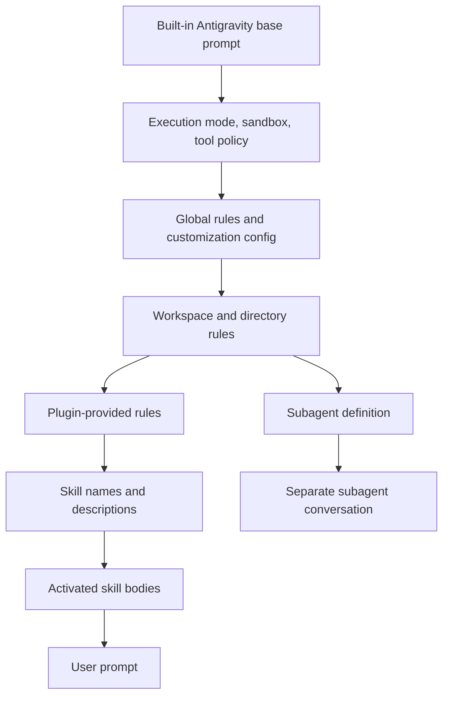

# Antigravity System Prompt Research

## Overview

Antigravity CLI (`agy`) does not currently expose a verified top-level `--append-system-prompt`, `--replace-system-prompt`, or prompt export flag. Installed `agy 1.1.0 --help` lists session, model, project, prompt, permission, sandbox, logging, update, model, and plugin controls, but no direct system prompt controls.

The supported prompt-adjacent customization model is file-based. Antigravity discovers Markdown rules from `GEMINI.md`, `AGENTS.md`, and `.agents/rules/*.md`; discovers skills, plugins, hooks, and MCP configuration from customization roots; and supports Markdown subagent definitions whose body acts as the subagent's distinct instruction prompt.

For Claudine, this means append can be approximated through a temporary Markdown rule file in a wrapper-controlled workspace. Replacement of the top-level built-in prompt should be treated as unsupported until Antigravity provides a native flag, config key, environment variable, or documented agent-file launch mode. Subagent prompt replacement is real, but it does not replace the orchestrator's built-in prompt.

## CLI Parameters

| Parameter | Mode | Prompt effect | Wrapper notes |
| --- | --- | --- | --- |
| `--add-dir <DIR>` | modify | Adds a workspace directory, which may expand discovered rules/customizations. | Potential append helper, but not proven enough to rely on for prompt-only temp dirs. |
| `--mode <accept-edits\|plan>` | modify | Changes execution mode and likely prompt/tool policy. | Not a user instruction append/replace mechanism. |
| `--sandbox` | modify | Enables terminal restrictions and likely sandbox-aware tool instructions. | Prompt-adjacent only. |
| `--dangerously-skip-permissions` | modify | Changes approval behavior. | Not prompt delivery. |
| `--model <MODEL>` | other | Selects the model. | May change backend template selection, but no documented prompt text semantics. |
| `--project <PROJECT_ID>` / `--new-project` | other | Selects or creates project context. | Can affect project-scoped config discovery. |
| `--print`, `--prompt`, `-p <TEXT>` | other | Sends the user prompt non-interactively. | Best execution mode for wrappers, but has no system-prompt companion flag. |
| `--prompt-interactive`, `-i <TEXT>` | other | Starts interactive mode with an initial user prompt. | User prompt only. |
| `--continue`, `-c`, `--conversation <ID>` | other | Resumes previous session state. | Re-apply any wrapper-managed temporary rules on resumed runs. |
| `--log-file <PATH>` | inspect | Writes logs to a known path. | Useful for debugging config discovery; not prompt export. |
| `agy changelog` | inspect | Shows release notes. | Confirms Markdown subagent changes in `1.0.16` and `agent.md` path fixes in `1.1.0`. |
| `agy plugin ...` | modify | Plugins may contribute rules. | Persistent user config mutation; avoid for transient wrapper prompts. |
| `/agents` | modify | Interactive subagent creation/management. | Not a non-interactive wrapper surface. |

No installed help output or official source found a native `--append-system-prompt`, `--replace-system-prompt`, `--system-prompt`, `--system-prompt-file`, or export flag for Antigravity CLI.

## Configuration and Discovery

Antigravity's customization system is the main way users affect the effective instruction stack.

| Source | Scope | Format | Behavior |
| --- | --- | --- | --- |
| `GEMINI.md` | user/repo/directory | Markdown | Directory rule loaded from the file's directory up to the repository root. |
| `AGENTS.md` | repo/directory | Markdown | Same role as `GEMINI.md`; added in Antigravity before the CLI transition and retained by `agy`. |
| `.agents/rules/*.md` | repo | Markdown | Project customization rules. |
| `.agents/skills/<name>/SKILL.md` | repo | Markdown with frontmatter | Skill names/descriptions are injected; full skill content is loaded on demand. |
| `.agents/plugins/<name>/plugin.json` plus `rules/` | repo/extension | JSON plus Markdown | Plugin rules merge into the active rule set when enabled. |
| `~/.gemini/config/` | user | mixed | Global customization root for shared config, including current global subagent location. |
| `~/.gemini/config/agents/*.md` | agent/subagent | Markdown with frontmatter | Distinct subagent prompt definitions. |
| `~/.gemini/antigravity-cli/settings.json` | user | JSON | CLI-specific settings; no prompt override key was verified. |

Local inspection found `/Users/ken/.antigravity`, but the CLI-relevant local state and customizations were under `/Users/ken/.gemini` and the session HOME shadow `/Users/ken/.claudine/.gemini`. The real home had `GEMINI.md`, `agents/`, `skills/`, `config/`, `antigravity/`, `antigravity-ide/`, and `antigravity-cli/`. The active session HOME had `~/.gemini/config/config.json`, project JSON files, and `~/.gemini/antigravity-cli` logs/cache/state.

## Prompt Layers and Precedence

Antigravity documents customization priority, but not exact final system prompt concatenation order. The best supported model is:

The built-in customization guide gives priority from highest to lowest as workspace project, declared configurations, global discovery, built-in customizations, and global declared configurations. It also says rule files are deduplicated by resolved path and injected at most once per conversation turn.

For wrappers, the practical issue is not only order but mutability. Rules and subagents are discoverable files. Writing them into the real repository or real user config permanently mutates user state. A wrapper must use a temporary workspace, shadow HOME, or another reversible overlay if it wants append behavior.

## Agents and Subagents

Antigravity supports subagents with distinct prompts. Local Markdown examples in `/Users/ken/.gemini/agents/*.md` used frontmatter such as `name`, `description`, and optional `model`, followed by a Markdown body containing the subagent instructions. Installed binary strings also describe creating a subagent with a name, description, system prompt, and tool groups.

Recent changelog entries matter:

| Version | Change | Prompt impact |
| --- | --- | --- |
| `1.0.16` | Dynamically defined subagents moved from JSON to Markdown. | Do not target `agent.json` for new subagent prompt definitions. |
| `1.1.0` | `/agents` now displays `agent.md` and the active global config directory `~/.gemini/config/`. | Global subagents should be considered config-root Markdown assets. |

Subagents are not a clean top-level replacement strategy for Claudine today. No non-interactive `agy --agent-file` or equivalent launch flag was found. Using a subagent definition would require writing persistent config or running an interactive flow unless Claudine can isolate Antigravity under a shadow HOME and automate a supported launch path.

## Format Recommendations

Use Markdown for both append and any future replacement candidate.

| Mode | Recommended format | Rationale |
| --- | --- | --- |
| Append | Markdown | Native rule surfaces are Markdown: `GEMINI.md`, `AGENTS.md`, and rules files. |
| Replace | Markdown | Subagent prompt definitions are Markdown; any future prompt file support is likely to follow the same convention. |

XML-wrapped Markdown is not provider-documented. It can still be useful inside Claudine-authored rule bodies to delimit wrapper instructions, but it adds tokens and should not be required. YAML and JSON are for manifests/config, not prompt prose.

## Recent Changes

| Date | Version | Change | Impact |
| --- | --- | --- | --- |
| 2026-05-19 | `1.0.0` | Antigravity CLI launched during the Gemini CLI transition. | Critical Gemini CLI features such as skills, hooks, subagents, and extensions/plugins were retained, but direct system prompt override/export parity was not documented. |
| 2026-05-20 | unknown | Public issue #50 requested system prompt export and modification. | Supports the conclusion that this is not a documented feature today. |
| 2026-06-09 | `1.0.16` | Dynamic subagents changed from JSON to Markdown. | Agent prompt research should target Markdown definitions. |
| 2026-07-08 | `1.1.0` | `/agents` path display fixed to `~/.gemini/config/` and `agent.md`. | Confirms the current global agent definition surface. |

## Quirks and Workarounds

Antigravity's public docs site is a JavaScript application. Direct `curl` of docs pages returns the SPA shell, so local `agy --help`, `agy changelog`, installed built-in skills, and the public GitHub issue tracker were more useful for exact behavior than rendered docs fetches.

The installed binary includes system prompt template strings and confidentiality text, but this is not a supported export interface. Do not build Claudine behavior around reverse-engineered prompt dumps.

`~/.antigravity` existed locally, but the CLI used `.gemini` state/config roots. The provider roster currently mentioning `~/.antigravity` is not enough for prompt delivery decisions.

There is historical path churn. Local legacy agents existed in `/Users/ken/.gemini/agents/*.md`, while the current changelog points creation to `~/.gemini/config/`. Claudine should avoid writing to either real path for transient delivery.

## Claudine Delivery Notes

Recommended append strategy: write a temporary Markdown rule file in a wrapper-controlled workspace and launch `agy` from that workspace. If the real repository must also be visible, test `--add-dir <real-repo>` carefully; the reverse approach, launching from the real repo and adding a prompt-only temp dir, is not yet proven to trigger rule discovery.

Recommended replace strategy: unsupported for the top-level orchestrator. Subagent Markdown files can define distinct prompts, but no supported non-interactive entry point was found to run an arbitrary subagent as the main session.

Avoid mutating:

- `/Users/ken/.gemini/config/`
- `/Users/ken/.gemini/agents/`
- `/Users/ken/.gemini/antigravity-cli/settings.json`
- repository `GEMINI.md` or `AGENTS.md`

If Antigravity later supports a configurable HOME or config root, Claudine can use a shadow HOME with `~/.gemini/config/agents/` and temporary rule files. Until then, wrapper-level replacement should be reported as unsupported rather than approximated with persistent user config.

## Sources

- [Antigravity CLI reference docs](https://antigravity.google/docs/cli/reference)
- [Antigravity CLI best practices docs](https://antigravity.google/docs/cli/best-practices)
- [Antigravity CLI product page](https://antigravity.google/product/antigravity-cli)
- [Antigravity CLI README](https://raw.githubusercontent.com/google-antigravity/antigravity-cli/main/README.md)
- [Google Developers Blog: Transitioning Gemini CLI to Antigravity CLI](https://developers.googleblog.com/an-important-update-transitioning-gemini-cli-to-antigravity-cli/)
- [GitHub issue #50: Ability to export and modify system prompt](https://github.com/google-antigravity/antigravity-cli/issues/50)
- Local command output: `agy --help`, `agy --version`, `agy changelog`, and `agy help plugin` from installed `agy 1.1.0`
- Local file inspected: `/Users/ken/.claudine/.gemini/antigravity-cli/builtin/skills/agy-customizations/SKILL.md`
- Local file inspected: `/Users/ken/.claudine/.gemini/antigravity-cli/builtin/skills/agy-customizations/docs/rules.md`
- Local file inspected: `/Users/ken/.claudine/.gemini/antigravity-cli/builtin/skills/agy-customizations/docs/json_configs.md`
- Local file inspected: `/Users/ken/.claudine/.gemini/antigravity-cli/builtin/skills/agy-customizations/docs/plugins.md`
- Local file inspected: `/Users/ken/.claudine/.gemini/antigravity-cli/builtin/skills/antigravity_guide/references/cli.md`
