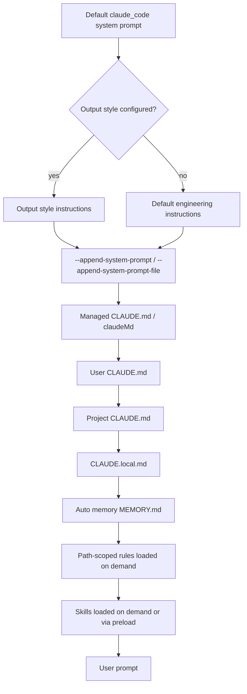

## Overview

Claude Code builds the effective prompt for every session from several ordered layers. The base is the unpublished default system prompt (the `claude_code` preset), which contains tool-use guidance, safety instructions, coding conventions, and dynamic environment context. On top of that, optional output styles, per-invocation append/replace flags, and project-context files such as `CLAUDE.md` and auto memory shape what Claude knows and how it behaves. Subagents run with their own isolated system prompts and return only a summary to the parent session.

Claudine’s wrapper strategy mirrors Claude Code’s first-class delivery: write the resolved prompt to a temporary file and pass `--append-system-prompt-file` or `--system-prompt-file`. Both file flags are accepted by the binary in v2.1.200 even though `claude --help` does not list them, so the wrapper does not need to fall back to inline text for large prompts.

## CLI Parameters

Claude Code exposes two pairs of flags that directly manipulate the system prompt for a single invocation. They work in both interactive and non-interactive (`-p`) modes.

| Flag | Mode | Effect |
| :--- | :--- | :--- |
| `--append-system-prompt "<text>"` | Append | Adds text to the end of the default system prompt. |
| `--append-system-prompt-file <path>` | Append | Adds the contents of a file to the end of the default system prompt. |
| `--system-prompt "<text>"` | Replace | Replaces the entire default system prompt with the supplied text. |
| `--system-prompt-file <path>` | Replace | Replaces the entire default system prompt with the contents of a file. |

`--system-prompt` and `--system-prompt-file` are mutually exclusive. The append flags can be combined with either replacement flag (or with each other). Replacement drops the built-in tool guidance and safety instructions, so it is only appropriate when the new prompt supplies everything the task needs. Append is the safer default because it preserves the `claude_code` preset.

Adjacent flags that affect the system prompt or its surrounding surface:

| Flag | Effect |
| :--- | :--- |
| `--exclude-dynamic-system-prompt-sections` | Moves per-machine sections (working directory, environment info, memory paths, git-repo flag) out of the system prompt and into the first user message to improve cross-machine prompt-cache reuse. Ignored when replacing the system prompt. |
| `--bare` | Uses a minimal system prompt with only Bash, file read, and file edit tools; skips hooks, LSP, plugin sync, attribution, auto-memory, background prefetches, keychain reads, and CLAUDE.md auto-discovery. Sets `CLAUDE_CODE_SIMPLE=1`. |
| `--safe-mode` | Disables CLAUDE.md, output styles, skills, plugins, hooks, MCP servers, custom commands and agents, workflows, themes, keybindings, status line, file-suggestion commands, LSP servers, and auto-memory. Managed policy still applies. Sets `CLAUDE_CODE_SAFE_MODE=1`. |
| `--agent <name>` | Runs the main thread as a named subagent, applying that agent's system prompt, tool restrictions, permission mode, MCP servers, hooks, skills, and model. Replaces the default system prompt the same way `--system-prompt` does. |
| `--agents <json>` | Defines custom subagents inline via JSON for the current session (frontmatter field names plus `prompt`). Multiple subagents per call. |
| `--setting-sources <list>` | Restricts which settings scopes load (`user`, `project`, `local`). Empty list disables all non-managed scopes. |
| `--settings <file-or-json>` | Loads additional settings from a file or JSON string. |
| `--add-dir <path…>` | Grants file access to additional working directories. Use with `CLAUDE_CODE_ADDITIONAL_DIRECTORIES_CLAUDE_MD=1` to also load memory files from them. |
| `--print / -p` | Non-interactive mode; works with every flag in this table. |

## Configuration and Discovery

Beyond CLI flags, Claude Code discovers persistent instruction sources automatically.

### CLAUDE.md hierarchy

`CLAUDE.md` files are plain Markdown files that load at session start. They are injected into the conversation as project context rather than into the system prompt itself. Discovery walks up the directory tree from the working directory, loading files in this order:

1. Managed policy `CLAUDE.md` (macOS `/Library/Application Support/ClaudeCode/CLAUDE.md`, Linux/WSL `/etc/claude-code/CLAUDE.md`, Windows `C:\Program Files\ClaudeCode\CLAUDE.md`).
2. User `~/.claude/CLAUDE.md` (or `%USERPROFILE%\.claude\CLAUDE.md` on Windows).
3. Project `./CLAUDE.md` or `./.claude/CLAUDE.md`.
4. Project-local `./CLAUDE.local.md` alongside each loaded `CLAUDE.md`.

Within each directory, `CLAUDE.local.md` is appended after `CLAUDE.md`. Files closer to the working directory are loaded later, so more specific instructions take precedence. Subdirectory `CLAUDE.md` files under the working directory load on demand when Claude reads files in those subdirectories. As of v2.1.198 path-scoped rules under `.claude/rules/*.md` also match when the target file is reached via a symlinked path to the project directory.

CLAUDE.md files support `@path` imports (relative or absolute, recursive up to four hops, code-fence-aware parsing). Imported files load at launch and contribute to context size. Block-level HTML comments are stripped before injection; comments inside code blocks are preserved. The `--init` flow can generate a starter `CLAUDE.md`; `CLAUDE_CODE_NEW_INIT=1` enables an interactive multi-phase flow.

### Output styles

Output styles are Markdown files stored in `~/.claude/output-styles/`, `./.claude/output-styles/`, or the managed `.claude/output-styles/` directory. They directly modify the system prompt and can replace the default engineering instructions unless their frontmatter sets `keep-coding-instructions: true`. They are activated via the `outputStyle` setting in `settings.json` or through `/config`. Because output styles are part of the system prompt, changes only take effect after `/clear` or a new session. Plugin `output-styles/` directories are scanned as well, and a plugin can set `force-for-plugin: true` to apply its style automatically. As of v2.1.178, when nested `.claude/output-styles/` directories define styles with the same name, the one closest to the working directory wins.

### Settings files

`settings.json` at user, project, or local scope can set:

- "`outputStyle`: selects an output style."
- "`agent`: runs the main thread as a named subagent, applying that agent's system prompt and restrictions."
- "`includeGitInstructions`: includes or excludes built-in commit/PR workflow instructions and the git status snapshot."
- "`claudeMdExcludes`: glob patterns that skip specific `CLAUDE.md` files (managed policy files cannot be excluded)."
- "`claudeMd`: managed-only inline CLAUDE.md-style instructions (honored only in managed/policy settings)."
- `autoMemoryEnabled`, `autoMemoryDirectory`, `autoCompactEnabled`, `permissionMode`, and other runtime keys described in the settings reference.

`managed-settings.json`, MDM plist (`com.anthropic.claudecode`), and the Windows registry key `HKLM\SOFTWARE\Policies\ClaudeCode` (or `HKCU\…` for user-level) deliver organization-wide managed settings. Managed settings parse tolerantly since v2.1.169: invalid entries are stripped with a warning and the valid subset is enforced, with stricter per-field overrides for security-enforcement keys (`allowedMcpServers`, `availableModels`, etc.).

### Subagent definitions

Custom subagents are Markdown files with YAML frontmatter in `~/.claude/agents/`, `./.claude/agents/`, managed `.claude/agents/`, or plugin `agents/` directories. The file body becomes the subagent's system prompt. Definitions can also be passed inline for a single session via the `--agents` CLI flag or configured through managed settings. Subagent definitions are also available to agent teams when spawning teammates: the teammate uses the definition's `tools` and `model`, with the definition's body appended to the teammate's system prompt as additional instructions. Plugin subagents cannot use `hooks`, `mcpServers`, or `permissionMode` frontmatter fields.

## Prompt Layers and Precedence

The final context for a session is assembled from the following layers, from most foundational to most specific.

Notes on precedence:

- `--system-prompt` or `--system-prompt-file` replaces layers A, B, C, D, and E entirely; `CLAUDE.md` and memory still load as project context.
- `--append-system-prompt` and `--append-system-prompt-file` add to layer E after any output style.
- `CLAUDE.md`, auto memory, and skills are user/project-context messages, not part of the system prompt, so they are softer than `--append-system-prompt`.
- Managed policy `CLAUDE.md` cannot be skipped with `claudeMdExcludes`.

## Agents and Subagents

Claude Code supports custom agents defined as Markdown files with YAML frontmatter in `~/.claude/agents/`, `./.claude/agents/`, the managed `.claude/agents/`, or plugin `agents/` directories. Each subagent has its own system prompt (the file body), its own tool allowlist or denylist, an optional model, permission mode, MCP servers, hooks, skills, memory scope, effort level, background flag, isolation mode, and display color. Definitions can also be passed inline via the `--agents` JSON flag.

Key behaviors:

- Subagents run in isolated context windows. Only the final summary returns to the parent. Subagents do not inherit the full Claude Code system prompt — they receive their own system prompt plus basic environment details (working directory). CLAUDE.md and auto memory load for every built-in and custom subagent except Explore and Plan, which skip CLAUDE.md and the parent git status.
- The main session can run as a subagent via `claude --agent <name>` or the `agent` setting; this replaces the default system prompt with the agent's system prompt, the same way `--system-prompt` does. CLAUDE.md and project memory still load.
- Built-in subagents include Explore, Plan, and general-purpose. As of v2.1.198 Explore inherits the main session's model (capped at Opus) and subagents run in the background by default; both foreground and background subagents respect a five-level depth limit (since v2.1.181/2.1.172).
- The `Agent` tool replaced the older `Task` tool in v2.1.63; `Task(...)` references still work as aliases. Agent teams (`CLAUDE_CODE_EXPERIMENTAL_AGENT_TEAMS=1`) remove `TeamCreate`/`TeamDelete` and give every session an implicit team; teammates can be spawned directly via the Agent tool's `name` parameter.
- Background subagents surface every permission prompt in the main session with the agent name (since v2.1.186); Esc denies just that tool. To disable built-in Explore and Plan only, set `CLAUDE_CODE_DISABLE_EXPLORE_PLAN_AGENTS=1` (v2.1.198+). To disable every built-in subagent type in `-p` or the Agent SDK, set `CLAUDE_AGENT_SDK_DISABLE_BUILTIN_AGENTS=1`.

## Format Recommendations

| Goal | Recommended format | Rationale |
| :--- | :--- | :--- |
| Append | Pure Markdown | Headers, bullet lists, and short paragraphs blend cleanly with the existing structured system prompt. |
| Replace | XML-wrapped Markdown | When the built-in structure is removed, XML tags such as `<rules>`, `<constraints>`, `<context>`, and `<examples>` help the model distinguish instruction categories. |

For replacements, the prompt must explicitly supply any tool-calling guidance, safety instructions, and environment context the task requires because the default `claude_code` preset is removed entirely. The Agent SDK's documented preset form (`{ type: "preset", preset: "claude_code", append: "..." }`) accepts the same Markdown payload.

## Recent Changes

- "**v2.1.200 (2026-07-03)**: Local binary in use; current docs still label this `2.1.199`. The `--bare` doc text expanded to enumerate the surfaces skipped and to recommend explicit context sources for bare scripts."
- "**v2.1.199 (2026-07-02)**: Subagent transient-error reporting improved; `CLAUDE_CODE_MAX_RETRIES` cap raised to 15 and `CLAUDE_CODE_RETRY_WATCHDOG` raises the default retry count for non-capacity transient errors to 300."
- "**v2.1.198 (2026-07-01)**: Subagents now run in the background by default; built-in Explore inherits the main session's model (capped at Opus); subagents and context compaction inherit the session's extended thinking configuration; `/agents` wizard removed; path-scoped rules now match symlinked target paths."
- **v2.1.196 (2026-06-29)**: `CLAUDE_CODE_SUBAGENT_MODEL=inherit` now behaves like unset; the `claude agents` side panel was overhauled.
- "**v2.1.191 (2026-06-24)**: Foreground subagents now respect the same five-level depth limit as background subagents."
- "**v2.1.187 (2026-06-23)**: Org-configured model restrictions now apply to `/model`, `--model`, `ANTHROPIC_MODEL`, and `/advisor` with a \"restricted by your organization's settings\" message."
- "**v2.1.186 (2026-06-22)**: Background subagents surface permission prompts in the main session with the agent name; `Agent(agent_type)` deny/allowlist syntax enforced for named subagent spawns; sandbox credentials setting added; `CLAUDE_CODE_MAX_RETRIES` capped at 15 and `CLAUDE_CODE_RETRY_WATCHDOG` introduced."
- **v2.1.183 (2026-06-19)**: `/config key=value` syntax supports any setting; auto mode blocks destructive git and Terraform/Pulumi/CDK `destroy` commands unless explicitly asked; agent frontmatter model warnings now mirror the deprecated-model warning surface.
- **v2.1.181 (2026-06-17)**: `/config key=value` syntax added for any setting, including `outputStyle`, from the prompt. Foreground subagents now respect the 5-level depth limit.
- "**v2.1.178 (2026-06-15)**: Nested `.claude/` directories closest to the working directory now win on output-style, agent, workflow, and skill name collisions; `TeamCreate`/`TeamDelete` removed; `CLAUDE_CODE_EXPERIMENTAL_AGENT_TEAMS=1` gives every session an implicit team."
- "**v2.1.169 (2026-06-08)**: Added `--safe-mode` flag and `CLAUDE_CODE_SAFE_MODE` to disable CLAUDE.md, output styles, skills, plugins, hooks, MCP, and auto-memory for troubleshooting. `/cd` preserves prompt cache. Managed settings with invalid entries apply their remaining valid policies and surface the validation error. CLAUDE.md \"too long\" warning threshold now scales with model context."

## Quirks and Workarounds

- `CLAUDE.md` is context, not enforcement. For behavior that must run at a specific lifecycle point, use a hook such as `PreToolUse` or `PostToolUse` rather than relying on `CLAUDE.md` alone.
- If an output style is configured, its instructions are placed before `--append-system-prompt` content, so style rules can shadow appended rules. When `--system-prompt` is used, the append flags still work but apply to the replaced prompt.
- "The default prompt includes dynamic per-machine sections that break prompt-cache reuse across machines. Use `--exclude-dynamic-system-prompt-sections` (CLI) or `excludeDynamicSections: true` (SDK) for scripted, multi-user workloads."
- Project-root `CLAUDE.md` survives `/compact`, but nested subdirectory `CLAUDE.md` files do not reload automatically; they come back when Claude next reads a file in that subdirectory.
- `--safe-mode` is the cleanest way to verify whether a misbehavior is caused by local customizations; `--bare` swaps in a minimal system prompt and tool set, which is useful for scripted runs.
- Replacing the system prompt is powerful but removes the built-in tool and safety guidance; most use cases are better served by `--append-system-prompt` or an output style.
- `--append-system-prompt-file` and `--system-prompt-file` are absent from `claude --help` but accepted by the binary in v2.1.200; do not rely on `--help` to detect them in scripts (verified locally).
- Subagents run in the background by default since v2.1.198; background subagents surface every permission prompt in the main session. Use `CLAUDE_CODE_DISABLE_BACKGROUND_TASKS=1` to disable backgrounding entirely.
- "Managed settings parse tolerantly: invalid entries are stripped with a warning and the valid subset is enforced (per-field strict overrides exist for security-enforcement keys). `claudeMd` is honored only in managed or policy settings."
- The `/output-style` command was removed in v2.1.91; use `/config` or edit the `outputStyle` setting directly.
- Block-level HTML comments in CLAUDE.md files are stripped before injection, so they are useful for maintainer notes without spending context tokens; comments inside code blocks are preserved.

## Claudine Delivery Notes

Claudine should continue using its file-based delivery path:

- Discover a `system-prompt.md` file from the launch working-directory hierarchy.
- For append mode, write the resolved content to a temporary file and invoke Claude Code with `--append-system-prompt-file <tmp>`.
- For replace mode, write the resolved content to a temporary file and invoke Claude Code with `--system-prompt-file <tmp>`.
- Both modes are temporary per-invocation changes, so no user `settings.json`, `CLAUDE.md`, or output style is permanently mutated.
- Because Claude Code natively supports both inline and file flags, the file-backed approach avoids argv-length limits and keeps the wrapper simple. The local binary (v2.1.200) accepts both `--append-system-prompt-file` and `--system-prompt-file` even though they are absent from `claude --help`.

## Changelog

- "**2026-07-03 — refresh**: split `os: all` config_sources records into separate macos/linux/windows records to satisfy the `_schema.yaml` `os` enum (a formatting fix, not a behavior change). Added v2.1.199 to `recent_changes`. Added newly documented environment variables (`CLAUDE_CODE_DISABLE_CLAUDE_MDS`, `CLAUDE_CODE_DISABLE_EXPLORE_PLAN_AGENTS`, `CLAUDE_AGENT_SDK_DISABLE_BUILTIN_AGENTS`, `CLAUDE_CODE_FORK_SUBAGENT`, `CLAUDE_CODE_EXPERIMENTAL_AGENT_TEAMS`, `CLAUDE_CODE_DISABLE_BACKGROUND_TASKS`, `CLAUDE_CODE_DISABLE_AGENT_VIEW`, `CLAUDE_DISABLE_ADOPT`, `CLAUDE_AUTO_BACKGROUND_TASKS`, `CLAUDE_ASYNC_AGENT_STALL_TIMEOUT_MS`, `TASK_MAX_OUTPUT_LENGTH`, `CLAUDE_CODE_SIMPLE_SYSTEM_PROMPT`, `DISABLE_PROMPT_CACHING`). Added `--agents`, `--agent`, `--setting-sources`, `--settings`, `--add-dir`, `--print` flags. Recorded `managed-settings.json`, MDM plist, and Windows registry paths per OS. Updated `agent_prompting` to reflect the new docs (subagents no longer receive the full Claude Code system prompt; CLAUDE.md loads for every subagent except Explore/Plan; `/agents` wizard removed in v2.1.198). Added quirks for managed-settings tolerant parsing, the `/output-style` removal, and HTML comment stripping in CLAUDE.md. Verified locally on v2.1.200 that `--append-system-prompt-file` and `--system-prompt-file` are accepted by the binary even though absent from `claude --help`."
- "**2026-07-02 — prior refresh** (carried in): introduced `--append-system-prompt`, `--append-system-prompt-file`, `--system-prompt`, `--system-prompt-file`, `--exclude-dynamic-system-prompt-sections`, `--bare`, `--safe-mode`, `claudeMd` managed setting, output styles, subagents, CLAUDE.md hierarchy, env vars `CLAUDE_CODE_DISABLE_AUTO_MEMORY`/`CLAUDE_CODE_DISABLE_GIT_INSTRUCTIONS`/`CLAUDE_CODE_ATTRIBUTION_HEADER`/`CLAUDE_CODE_ADDITIONAL_DIRECTORIES_CLAUDE_MD`/`CLAUDE_CODE_SIMPLE`/`CLAUDE_CODE_SAFE_MODE`/`CLAUDE_AX_SCREEN_READER`."

## Sources

- [Claude Code CLI reference](https://code.claude.com/docs/en/cli-reference)
- [Modifying system prompts (Agent SDK)](https://code.claude.com/docs/en/agent-sdk/modifying-system-prompts)
- [How Claude remembers your project](https://code.claude.com/docs/en/memory)
- [Claude Code settings](https://code.claude.com/docs/en/settings)
- [Create custom subagents](https://code.claude.com/docs/en/sub-agents)
- [Output styles](https://code.claude.com/docs/en/output-styles)
- [Explore the context window](https://code.claude.com/docs/en/context-window)
- [Environment variables](https://code.claude.com/docs/en/env-vars)
- [Claude Code changelog](https://code.claude.com/docs/en/changelog)
- [Headless mode (bare mode)](https://code.claude.com/docs/en/headless)
- [Agent SDK overview](https://code.claude.com/docs/en/agent-sdk/overview)