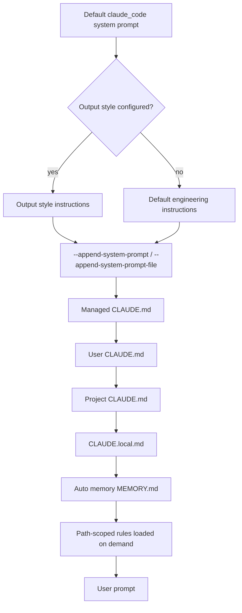

## Overview

Claude Code builds the effective prompt for every session from several ordered layers. The base is the unpublished default system prompt (the `claude_code` preset), which contains tool-use guidance, safety instructions, coding conventions, and dynamic environment context. On top of that, optional output styles, per-invocation append/replace flags, and project-context files such as `CLAUDE.md` and auto memory shape what Claude knows and how it behaves. Subagents run with their own isolated system prompts and return only a summary to the parent session.

## CLI Parameters

Claude Code exposes four flags that directly manipulate the system prompt for a single invocation. They work in both interactive and non-interactive (`-p`) modes.

| Flag | Mode | Effect |
| :--- | :--- | :--- |
| `--append-system-prompt "<text>"` | Append | Adds text to the end of the default system prompt. |
| `--append-system-prompt-file <path>` | Append | Adds the contents of a file to the end of the default system prompt. |
| `--system-prompt "<text>"` | Replace | Replaces the entire default system prompt with the supplied text. |
| `--system-prompt-file <path>` | Replace | Replaces the entire default system prompt with the contents of a file. |

`--system-prompt` and `--system-prompt-file` are mutually exclusive. The append flags can be combined with either replacement flag. Replacement drops the built-in tool guidance and safety instructions, so it is only appropriate when the new prompt supplies everything the task needs. Append is the safer default because it preserves the `claude_code` preset.

Additional related flags:

| Flag | Effect |
| :--- | :--- |
| `--exclude-dynamic-system-prompt-sections` | Moves per-machine sections (working directory, environment info, memory paths, git-repo flag) out of the system prompt and into the first user message to improve cross-machine prompt-cache reuse. Ignored when replacing the system prompt. |
| `--safe-mode` | Disables `CLAUDE.md`, output styles, skills, plugins, hooks, MCP servers, custom commands/agents, workflows, themes, keybindings, status line, LSP servers, and auto-memory for troubleshooting. |
| `--bare` | Uses a minimal system prompt with only Bash, file read, and file edit tools; skips discovery of hooks, skills, plugins, MCP, auto-memory, and `CLAUDE.md`. |

## Configuration and Discovery

Beyond CLI flags, Claude Code discovers persistent instruction sources automatically.

### CLAUDE.md hierarchy

`CLAUDE.md` files are plain Markdown files that load at session start. They are injected into the conversation as project context rather than into the system prompt itself. Discovery walks up the directory tree from the working directory, loading files in this order:

1. Managed policy `CLAUDE.md` (macOS `/Library/Application Support/ClaudeCode/CLAUDE.md`, Linux/WSL `/etc/claude-code/CLAUDE.md`, Windows `C:\Program Files\ClaudeCode\CLAUDE.md`)
2. User `~/.claude/CLAUDE.md`
3. Project `./CLAUDE.md` or `./.claude/CLAUDE.md`
4. Project-local `./CLAUDE.local.md` alongside each loaded `CLAUDE.md`

Within each directory, `CLAUDE.local.md` is appended after `CLAUDE.md`. Files closer to the working directory are loaded later, so more specific instructions take precedence. Subdirectory `CLAUDE.md` files under the working directory load on demand when Claude reads files in those subdirectories.

### Output styles

Output styles are Markdown files stored in `~/.claude/output-styles/` or `./.claude/output-styles/`. They directly modify the system prompt and can replace the default engineering instructions unless their frontmatter sets `keep-coding-instructions: true`. They are activated via the `outputStyle` setting in `settings.json` or through `/config`. Because output styles are part of the system prompt, changes only take effect after `/clear` or a new session.

### Settings files

`settings.json` at user, project, or local scope can set:

- `outputStyle`: selects an output style.
- `agent`: runs the main thread as a named subagent, applying that agent's system prompt and restrictions.
- `includeGitInstructions`: includes or excludes built-in commit/PR workflow instructions and the git status snapshot.
- `claudeMdExcludes`: glob patterns that skip specific `CLAUDE.md` files.
- `claudeMd`: managed-only inline CLAUDE.md-style instructions.

### Subagent definitions

Custom subagents are Markdown files with YAML frontmatter in `~/.claude/agents/` or `./.claude/agents/`. The file body becomes the subagent's system prompt. Definitions can also be passed inline for a single session via the `--agents` CLI flag or configured through managed settings.

### Managed settings

Organizations can deploy managed `CLAUDE.md` files and `claudeMd` content through `managed-settings.json`, MDM plist, or Windows registry entries. Managed policy sources load first and cannot be excluded by user or project settings.

## Prompt Layers and Precedence

The final context for a session is assembled from the following layers, from most foundational to most specific.

Notes on precedence:

- `--system-prompt` or `--system-prompt-file` replaces layers A, B, C, D, and E entirely; `CLAUDE.md` and memory still load as project context.
- `--append-system-prompt` adds to layer E after any output style.
- `CLAUDE.md` and auto memory are user/project-context messages, not part of the system prompt, so they are softer than `--append-system-prompt`.
- Managed policy `CLAUDE.md` cannot be skipped with `claudeMdExcludes`.

## Agents and Subagents

Claude Code supports custom agents defined as Markdown files with YAML frontmatter in `~/.claude/agents/` or `./.claude/agents/`. Each subagent has its own system prompt (the file body), its own tool allowlist or denylist, an optional model, permission mode, MCP servers, hooks, and memory scope.

Key behaviors:

- Subagents run in isolated context windows. Only the final summary returns to the parent.
- The main session can run as a subagent via `claude --agent <name>` or the `agent` setting; this replaces the default system prompt with the agent's system prompt, the same way `--system-prompt` does.
- Built-in subagents include Explore, Plan, and general-purpose. Explore and Plan skip `CLAUDE.md` and the parent git status to keep research fast and inexpensive.
- As of v2.1.198, subagents run in the background by default and can spawn nested subagents up to five levels deep.
- The `Agent` tool replaced the older `Task` tool in v2.1.63; `Task(...)` references still work as aliases.

## Format Recommendations

| Goal | Recommended format | Rationale |
| :--- | :--- | :--- |
| Append | Pure Markdown | Headers, bullet lists, and short paragraphs blend cleanly with the existing structured system prompt. |
| Replace | XML-wrapped Markdown | When the built-in structure is removed, XML tags such as `<rules>`, `<constraints>`, `<context>`, and `<examples>` help the model distinguish instruction categories. |

For replacements, the prompt must explicitly supply any tool-calling guidance, safety instructions, and environment context the task requires because the default `claude_code` preset is removed entirely.

## Recent Changes

- **v2.1.198 (2026-07-01)**: Subagents now run in the background by default and can spawn nested subagents up to five levels deep. The built-in Explore agent inherits the main session's model.
- **v2.1.191 (2026-06-24)**: Foreground subagents now respect the same five-level depth limit as background subagents.
- **v2.1.181 (2026-06-17)**: `/config key=value` syntax now works for any setting, including `outputStyle`, though the system prompt is only rebuilt on `/clear` or restart.
- **v2.1.178 (2026-06-15)**: Nested `.claude/` directories now resolve collisions by proximity to the working directory for output styles, agents, and workflows.
- **v2.1.169 (2026-06-08)**: Added `--safe-mode` and `CLAUDE_CODE_SAFE_MODE` to disable `CLAUDE.md`, output styles, skills, plugins, hooks, MCP, and auto-memory for troubleshooting.
- **v2.1.91 (late 2025)**: Removed the standalone `/output-style` command; use `/config` or edit `outputStyle` directly.
- **v2.1.63 (2026-02)**: Renamed the `Task` tool to `Agent`; existing `Task(...)` references continue to work as aliases.

## Quirks and Workarounds

- `CLAUDE.md` is context, not enforcement. For behavior that must run at a specific lifecycle point, use a hook such as `PreToolUse` or `PostToolUse` rather than relying on `CLAUDE.md` alone.
- If an output style is configured, its instructions are placed before `--append-system-prompt` content, so style rules can shadow appended rules.
- The default prompt includes dynamic per-machine sections that break prompt-cache reuse across machines. Use `--exclude-dynamic-system-prompt-sections` for scripted, multi-user workloads.
- Project-root `CLAUDE.md` survives `/compact`, but nested subdirectory `CLAUDE.md` files do not reload automatically; they come back when Claude next reads a file in that subdirectory.
- `--safe-mode` and `--bare` are useful for verifying whether a misbehavior is caused by local customizations.
- Replacing the system prompt is powerful but removes the built-in tool and safety guidance; most use cases are better served by `--append-system-prompt` or an output style.

## Claudine Delivery Notes

Claudine should continue using its file-based delivery path:

- Discover a `system-prompt.md` file from the launch working-directory hierarchy.
- For append mode, write the resolved content to a temporary file and invoke Claude Code with `--append-system-prompt-file <tmp>`.
- For replace mode, write the resolved content to a temporary file and invoke Claude Code with `--system-prompt-file <tmp>`.
- Both modes are temporary per-invocation changes, so no user `settings.json`, `CLAUDE.md`, or output style is permanently mutated.
- Because Claude Code natively supports both inline and file flags, the file-backed approach avoids argv-length limits and keeps the wrapper simple.

## Sources

- [Claude Code CLI reference](https://code.claude.com/docs/en/cli-reference)
- [Modifying system prompts (Agent SDK)](https://code.claude.com/docs/en/agent-sdk/modifying-system-prompts)
- [How Claude remembers your project](https://code.claude.com/docs/en/memory)
- [Claude Code settings](https://code.claude.com/docs/en/settings)
- [Create custom subagents](https://code.claude.com/docs/en/sub-agents)
- [Output styles](https://code.claude.com/docs/en/output-styles)
- [Explore the context window](https://code.claude.com/docs/en/context-window)
- [Environment variables](https://code.claude.com/docs/en/env-vars)
- [Claude Code changelog](https://code.claude.com/docs/en/changelog)
