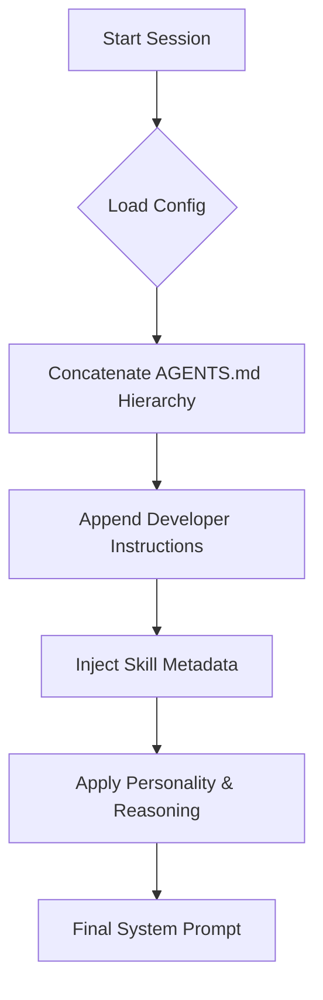

### CLI Switches for System Prompt Manipulation

Unlike other agentic CLIs that offer dedicated `--system-prompt` flags, Codex CLI handles prompt overrides through its universal configuration switch (`-c` or `--config`). This allows for surgical manipulation of the instruction chain at runtime.

| Switch / Config Key       | Action      | Description                                                                                                         |
|:--------------------------|:------------|:--------------------------------------------------------------------------------------------------------------------|
| `model_instructions_file` | **Replace** | Fully replaces the built-in system instructions with the contents of a Markdown file.                               |
| `developer_instructions`  | **Append**  | Injects an inline string of instructions into the session context. Preserves the base instructions.                 |
| `personality`             | **Modify**  | Sets the communication style (e.g., `pragmatic`, `friendly`, `none`), which shapes the persona layer of the prompt. |
| `model_reasoning_effort`  | **Modify**  | Adjusts the reasoning depth (`minimal` to `xhigh`), affecting the "Chain of Thought" portion of the system prompt.  |

### Non-CLI Manipulation Methods

Codex CLI relies heavily on a file-based hierarchy to determine its final system prompt. This hierarchy is rebuilt at session start by concatenating several sources.

1. **`AGENTS.md` Hierarchy**: Codex scans for `AGENTS.md` (and `AGENTS.override.md`) files starting from the Git root down to the current working directory.

    * **Merge Order**: Global Override → Global Base → Project Root → Subdirectories (closest to CWD wins).
    * **Automatic Injection**: These files are automatically appended to the system prompt.

2. **`config.toml`**: Persistent settings in `~/.codex/config.toml` allow users to set a default `model_instructions_file` or `developer_instructions` for all sessions.
3. **Skills Metadata**: As of early 2026, skills (found in `.agents/skills/`) inject their `name` and `description` into the system prompt at startup. The full instructions in `SKILL.md` are only loaded when the agent selects the skill.

### Agents and Subagents (Agent Roles)

Codex supports multi-agent workflows (experimental) through a concept of **Agent Roles**. Each role operates as a distinct entity with its own configuration.

* **Distinct Prompts**: Roles defined in `config.toml` (e.g., `[agents.explorer]`, `[agents.worker]`) can specify their own `developer_instructions` and `config_file`.
* **Isolation**: This allows an "orchestrator" role to have a system prompt focused on planning, while a "worker" role has a prompt focused on safe code implementation.
* **Orchestration**: The orchestrator automatically spawns these roles and collects their results, similar to sub-agents in other ecosystems.

### Quirks and Workarounds

* **32 KiB Limit**: The total size of the instruction chain (excluding built-in instructions) is capped by `project_doc_max_bytes`, which defaults to 32 KiB. Large projects often hit this limit and must use skills to offload documentation.
* **Precedence Footgun**: Because the subdirectory `AGENTS.md` overrides the root `AGENTS.md` for specific blocks, developers sometimes find that global rules are missing when working in deep subfolders.
* **Custom Prompt Deprecation**: The legacy "custom prompts" feature (`~/.codex/prompts/*.md`) is deprecated. Developers are encouraged to migrate these to the `SKILL.md` format.

### Recent Changes

* **Skills Standard (Dec 2025 - Early 2026)**: The most significant change was the introduction and eventual default-enablement of the Agent Skills standard. This moved system prompt manipulation from static files to a more modular "on-demand" instruction system.
* **Reasoning Controls**: The introduction of `model_reasoning_effort` allows users to dynamically shift the prompt between "fast execution" and "deep reasoning" modes.
* **Personality Layer**: Standardized `personality` settings were added to provide a more consistent persona across different LLM backends.

### Recommended Formats

The internal prompt builder in Codex is optimized for Markdown, but the underlying LLMs (OpenAI o3/gpt-5.x) respond better to structure when a full replacement is performed.

| Action        | Format                   | Rationale                                                                                                                                                                                                             |
|:--------------|:-------------------------|:----------------------------------------------------------------------------------------------------------------------------------------------------------------------------------------------------------------------|
| **Appending** | **Pure Markdown**        | Since `AGENTS.md` is concatenated with other files, pure Markdown ensures seamless blending without broken tags.                                                                                                      |
| **Replacing** | **XML-Wrapped Markdown** | When replacing the entire prompt via `model_instructions_file`, using XML tags (e.g., `<rules>`, `<constraints>`, `<context>`) is recommended to help the model distinguish between different instruction categories. |

### Summary of Codex CLI System Prompt Handling

Codex CLI utilizes a layered instruction system that prioritizes repository-local context through a hierarchical file discovery mechanism.

* **Universal Override**: Uses the `-c` flag to override `model_instructions_file` (Replace) or `developer_instructions` (Append) at runtime.
* **Hierarchical Context**: Automatically discovers and concatenates `AGENTS.md` files from the Git root to the CWD, allowing for project-specific and folder-specific behavior.
* **Experimental Multi-Agent**: Supports distinct system prompts for different "Agent Roles," enabling specialized sub-tasks like exploration or implementation to run with dedicated rule sets.
* **Modular Instructions**: Moving away from monolithic prompt files towards "Skills" (`SKILL.md`), which allow instructions to be loaded on-demand based on the task context.
* **Markdown Native**: While Markdown is the standard format, XML wrappers are highly recommended for full-replacement prompts to maintain high instruction-following performance.
