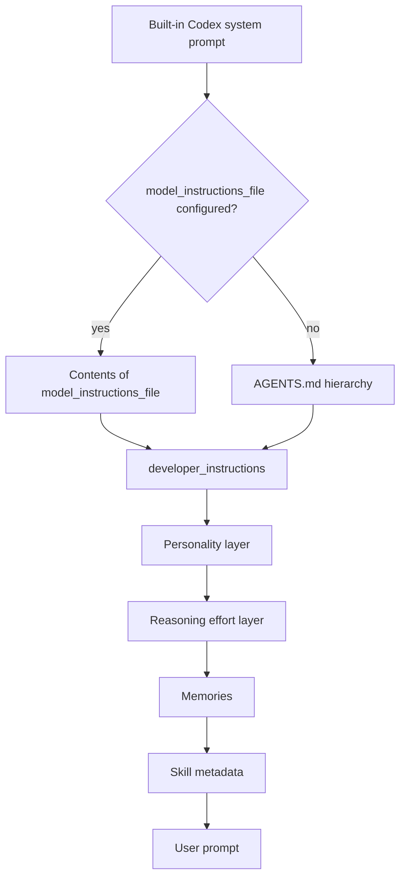

## Overview

Codex CLI builds the effective prompt for every session from a layered instruction chain. Unlike Claude Code, Codex does not expose dedicated `--system-prompt` flags. Instead, it uses the universal `-c` config-override flag to inject `developer_instructions` (append) or point to a `model_instructions_file` (replace). Persistent project instructions are discovered automatically through an `AGENTS.md` hierarchy, while custom subagents carry their own `developer_instructions` in standalone TOML files.

## CLI Parameters

Codex exposes one general-purpose flag that covers prompt overrides, plus feature toggles that indirectly shape the prompt.

| Flag | Mode | Effect |
| :--- | :--- | :--- |
| `-c developer_instructions="..."` | Append | Injects inline instructions on top of the built-in prompt and AGENTS.md chain. |
| `-c model_instructions_file=path` | Replace | Uses the contents of a Markdown file as the instruction chain, replacing the built-in instructions. |
| `--enable <feature>` | Modify | Force-enables a feature flag such as `goals`, `multi_agent`, or `memories`. |
| `--disable <feature>` | Modify | Force-disables a feature flag such as `memories` or `hooks`. |

`-c` values are parsed as TOML when possible; otherwise the literal string is used. This means multi-line `developer_instructions` values must be properly quoted/escaped. Both append and replace are temporary per-invocation changes when passed on the CLI.

## Configuration and Discovery

Beyond CLI overrides, Codex discovers persistent instruction sources automatically.

### config.toml layers

User-level settings live in `~/.codex/config.toml`. Project-scoped overrides live in `.codex/config.toml`, but Codex only loads the project layer when the project is trusted, and it ignores provider, auth, notify, profile, and telemetry keys from that layer.

Relevant config keys:

| Key | Effect |
| :--- | :--- |
| `developer_instructions` | Inline additional instructions appended to the session. |
| `model_instructions_file` | Path to a Markdown file that replaces the built-in instructions. |
| `model_reasoning_effort` | Adjusts reasoning depth (`minimal` to `xhigh`). |
| `personality` | Sets a communication style/persona layer. |
| `features.memories` | Enables memory injection into the prompt. |
| `features.multi_agent` | Enables subagent tools. |
| `project_doc_max_bytes` | Caps the combined AGENTS.md chain (default 32 KiB). |
| `project_doc_fallback_filenames` | Additional filenames treated as instruction files. |

### AGENTS.md hierarchy

Codex reads `AGENTS.md` files before doing any work. Discovery follows this order:

1. Global: `~/.codex/AGENTS.override.md` if it exists; otherwise `~/.codex/AGENTS.md`.
2. Project scope: starting at the project root (usually the Git root), Codex walks down to the current working directory. In each directory it checks `AGENTS.override.md`, then `AGENTS.md`, then any fallback filenames.
3. Merge order: files are concatenated from root to current directory with blank lines. Files closer to the working directory appear later and therefore override earlier guidance.

Codex stops adding files once the combined size reaches `project_doc_max_bytes`.

### Custom agents

Custom agents are standalone TOML files under `~/.codex/agents/` or `.codex/agents/`. Each file must define:

- `name`
- `description`
- `developer_instructions`

Optional fields such as `model`, `model_reasoning_effort`, `sandbox_mode`, `mcp_servers`, and `skills.config` inherit from the parent session when omitted. If a custom agent name matches a built-in agent (`default`, `worker`, `explorer`), the custom definition takes precedence.

### Skills and deprecated custom prompts

Skills are discovered under `~/.codex/skills/`, `.codex/skills/`, and `.agents/skills/`. Skill `name` and `description` are injected at startup; the full `SKILL.md` is loaded when the agent selects the skill. The legacy `~/.codex/prompts/*.md` custom prompt files are deprecated.

## Prompt Layers and Precedence

The final instruction chain is assembled from the following layers, from most foundational to most specific.

Notes on precedence:

- `model_instructions_file` replaces the built-in prompt and the AGENTS.md-based chain.
- `developer_instructions` appends to whatever instruction chain is active.
- `AGENTS.md` files are concatenated and capped at `project_doc_max_bytes`.
- Personality, reasoning effort, memories, and skills modify or append additional structure on top of the base chain.

## Agents and Subagents

Codex supports multi-agent workflows through built-in agents (`default`, `worker`, `explorer`) and user-defined custom agents. Subagents run in isolated threads and only their results return to the parent.

Key behaviors:

- Custom agents are defined as TOML files with their own `developer_instructions`.
- Subagents inherit the parent session's model, reasoning effort, sandbox mode, MCP servers, and skills when those keys are omitted.
- Sandbox and approval controls can be overridden per agent.
- `agents.max_depth` defaults to 1, limiting recursive delegation unless raised.
- `agents.max_threads` defaults to 6, capping concurrent subagent threads.

## Format Recommendations

| Goal | Recommended format | Rationale |
| :--- | :--- | :--- |
| Append | Pure Markdown | Headers, bullet lists, and short paragraphs blend cleanly with the concatenated AGENTS.md chain and built-in instructions. |
| Replace | XML-wrapped Markdown | When the built-in structure is removed, XML tags such as `<rules>`, `<constraints>`, `<context>`, and `<examples>` help the model distinguish instruction categories. |

For replacements, the prompt should explicitly supply any tool-calling guidance, safety instructions, and environment context the task requires because the default built-in instructions are removed.

## Recent Changes

- **Custom agent TOML files (2026-06)**: Subagents can now be defined as standalone TOML files under `~/.codex/agents/` and `.codex/agents/`, each carrying its own `developer_instructions` and optional model/sandbox/MCP overrides.
- **Multi-agent collaboration enabled by default (2026-05)**: Tools such as `spawn_agent`, `send_input`, `resume_agent`, `wait_agent`, and `close_agent` are now on by default.
- **Personality controls stabilized (2026-04)**: The `personality` setting became a stable, on-by-default prompt layer.
- **Reasoning effort controls stabilized (2026-03)**: `model_reasoning_effort` with levels `minimal`/`low`/`medium`/`high`/`xhigh` became the standard way to adjust reasoning depth.
- **AGENTS.md and skills model (late 2025-2026)**: Codex moved from monolithic custom prompt files toward the `AGENTS.md` hierarchy and modular skills.

## Quirks and Workarounds

- Codex has no dedicated system-prompt flag; use the universal `-c` config override.
- Because `-c` values parse as TOML, multi-line `developer_instructions` strings need shell-escaped TOML quoting.
- The AGENTS.md chain is capped at 32 KiB by default; split large guidance across nested directories or raise `project_doc_max_bytes`.
- An `AGENTS.override.md` in the same directory silently shadows `AGENTS.md`, which can confuse users who expect both to load.
- Project-level `.codex/config.toml` cannot override provider, auth, profile, notify, or telemetry keys.
- Replacing instructions via `model_instructions_file` removes Codex's built-in guidance, so the replacement should include any tool/safety rules the task still needs.
- There is no built-in command to dump the effective system prompt; indirect verification requires enabling `log_dir` or asking Codex to summarize loaded instructions.

## Claudine Delivery Notes

Claudine should continue using its existing config-override delivery path:

- Discover a `system-prompt.md` file from the launch working-directory hierarchy.
- For append mode, prepare the content and pass it inline via `-c developer_instructions="..."`.
- For replace mode, write the resolved content to a temporary file and pass the path via `-c model_instructions_file=<tmp>`.
- Both modes are temporary per-invocation changes, so no user `config.toml`, `AGENTS.md`, or skill is permanently mutated.
- Because Codex parses `-c` values as TOML, Claudine must quote/escape multi-line content appropriately; using the file-backed replacement path avoids shell-escaping complexity for large prompts.

## Sources

- [Codex CLI overview](https://developers.openai.com/codex/cli)
- [Command line options](https://developers.openai.com/codex/cli/reference)
- [Prompting Codex](https://developers.openai.com/codex/prompting)
- [Custom instructions with AGENTS.md](https://developers.openai.com/codex/guides/agents-md)
- [Subagents](https://developers.openai.com/codex/subagents)
- [Configuration reference](https://developers.openai.com/codex/config-reference)
- [Environment variables](https://developers.openai.com/codex/environment-variables)
- [Codex GitHub repository](https://github.com/openai/codex)
