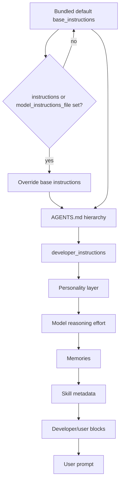

# Codex CLI System-Prompt Surface

## Overview

Codex CLI builds the effective prompt for every session by stacking an order of layers: the **base instructions** (model-specific defaults shipped at `codex-rs/protocol/src/prompts/base_instructions/<model>.md`) at the bottom, optional `AGENTS.md` discovery chained on top, then a developer-role message built from `developer_instructions` (set in `config.toml`, passed inline via `-c`, or declared inside a custom-agent role file), then several opt-in developer/user blocks gated by `include_*_instructions` booleans. The base-instructions replacement surface lives behind the top-level `instructions` key and the documented `model_instructions_file` key. There is no dedicated `--system-prompt` flag; prompt control flows through the universal `-c <key=value>` config-override mechanism.

Claudine already implements this delivery correctly: `model_instructions_file` (replace, file-backed) and `developer_instructions` (append, inline) via `-c`. The schema-driven facts in this document tighten the classification, remove the deprecated `experimental_instructions_file` reference, and update the built-in subagent roster.

## CLI Parameters

Codex exposes one general-purpose flag that covers prompt overrides plus feature toggles that indirectly shape the prompt.

| Flag | Mode | Effect |
| :--- | :--- | :--- |
| `-c instructions="..."` | Replace | Override the bundled base instructions with inline text. |
| `-c model_instructions_file=<path>` | Replace | Override the base instructions with the contents of a Markdown file (top-level `AbsolutePathBuf`). |
| `-c developer_instructions="..."` | Append | Insert an extra developer-role message alongside the base instructions (NOT a system-prompt append). |
| `-c developer_instructions="""..."""` | Append | Multi-line TOML triple-quote form of the same key; preferred for shell delivery. |
| `--enable <feature>` / `--disable <feature>` | Modify | Force-enable or force-disable a feature flag via `-c features.<name>`. |
| `--strict-config` | Other | Error on unknown config keys. Pairs with the `#:schema` directive in `config.toml`. |
| `-p / --profile <name>` | Other | Layer `$CODEX_HOME/<name>.config.toml` on top of the base user config; combine with `-c` for per-invocation overrides. |
| `-m / --model <MODEL>` | Other | Override the configured model; selects which bundled `base_instructions` default applies. |

`-c` values are parsed as TOML when possible; otherwise the literal string is used. Multi-line `instructions` or `developer_instructions` strings must be encoded as TOML triple-quote literals or as escape-quoted shell strings. The wrapper-facing `codex --help` does not list prompt-control flags explicitly; the surface is documented in `developers.openai.com/codex/cli/reference` and the configuration schema at `developers.openai.com/codex/config-schema.json`.

## Configuration and Discovery

### `config.toml` layers

User-level settings live in `~/.codex/config.toml` (or the directory named by `CODEX_HOME`). Project-scoped overrides live in `.codex/config.toml`, but Codex only loads the project layer when the project is trusted, and it ignores provider, auth, notify, profile, and telemetry keys from that layer.

The prompt-affecting keys (verified against `developers.openai.com/codex/config-schema.json`):

| Key | Effect |
| :--- | :--- |
| `instructions` | Inline system instructions (replace). Type: string. Description: "System instructions." |
| `model_instructions_file` | Path to a file whose contents override the bundled base instructions. Type: absolute path. |
| `developer_instructions` | Extra developer-role message appended to the prompt. Type: string. |
| `model_reasoning_effort` | Adjusts reasoning depth (`minimal` to `xhigh`). |
| `plan_mode_reasoning_effort` | Plan-mode-specific reasoning override. |
| `personality` | Personality layer. Enum: `none`, `friendly`, `pragmatic`. Gated on `features.personality = true`. |
| `project_doc_max_bytes` | Caps the combined AGENTS.md chain (default 32 KiB). |
| `project_doc_fallback_filenames` | Additional filenames treated as instruction files. |
| `project_root_markers` | Markers that delimit the project root; defaults to `[".git"]`. |
| `include_apps_instructions` | Inject the `<apps_instructions>` developer block. |
| `include_collaboration_mode_instructions` | Inject the `<collaboration_mode>` developer block. |
| `include_permissions_instructions` | Inject the `<permissions instructions>` developer block. |
| `include_environment_context` | Inject the `<environment_context>` user block. |
| `include_skill_instructions` | Inject the `<skills_instructions>` developer block. |
| `agents.max_depth` | Maximum subagent nesting depth (default 1). |
| `agents.max_threads` | Maximum concurrent subagent threads (default 6). |
| `agents.interrupt_message` | Whether to record a model-visible interrupt message (default true). |
| `agents.job_max_runtime_seconds` | Default max runtime in seconds for agent job workers. |
| `compact_prompt` | Compact prompt used for history compaction. |
| `memories.use_memories` | Skip injecting memory usage instructions into developer prompts. |

### AGENTS.md hierarchy

Codex reads `AGENTS.md` files before doing any work. Discovery follows this order (`codex-rs/core/src/agents_md.rs`):

1. **Global scope**: `$CODEX_HOME/AGENTS.override.md` if present, otherwise `$CODEX_HOME/AGENTS.md`.
2. **Project scope**: starting at the project root (closest ancestor whose directory contains one of `project_root_markers`, default `[".git"]`), walk down to the current working directory. In each directory, check `AGENTS.override.md` first, then `AGENTS.md`, then entries in `project_doc_fallback_filenames`. Include at most one file per directory.
3. **Merge order**: files are concatenated from root down to CWD. Files closer to the working directory appear later and therefore override earlier guidance. User-to-project transition is marked with the separator `\n\n--- project-doc ---\n\n`; otherwise blank lines.

Codex stops once the combined size reaches `project_doc_max_bytes` (default 32 KiB). Multi-environment snapshots (one agent running across multiple roots) relabel the body as `for <env_id> with root <cwd>` before each environment's section.

### Custom agents (subagents)

Custom agents are TOML files under `$CODEX_HOME/agents/` or `.codex/agents/`. Each file must define:

- `name` (string, required)
- `description` (string, required)
- a full `[…]` block with the same shape as `[profile]` plus the top-level `ConfigToml` keys

The minimal role file looks like:

```toml
# ~/.codex/agents/role-name.toml
name = "role-name"
description = "Human-facing summary for spawn_agent guidance"

[profile]
model = "gpt-5"
developer_instructions = """
You are …

Rules:
- …
"""
```

A role file may also point at a sibling config file via `config_file = "<path>.toml"`. Parsing requires the file to contain a valid TOML table; missing fields surface as parse warnings, and a blank `developer_instructions` field is rejected.

### Built-in subagents

`codex-rs/core/src/agent/role.rs` registers only two built-in roles today:

| Role | Defined in | Notes |
| :--- | :--- | :--- |
| `explorer` | `codex-rs/core/src/agent/builtins/explorer.toml` | Empty TOML; inherits the default profile. |
| `awaiter` | `codex-rs/core/src/agent/builtins/awaiter.toml` | Carries its own `developer_instructions` for awaiting long-running tasks. |

`default` is the role-name used when `spawn_agent` is called without `agent_type`; it is the parent's effective config, not a separate TOML.

### Skills and deprecated custom prompts

Skills are discovered under `$CODEX_HOME/skills/`, `.codex/skills/`, and `.agents/skills/`. The skill `name` and `description` are injected at session start; the full `SKILL.md` body is loaded when the agent selects the skill. Closest-to-CWD wins on name collisions. The legacy `$CODEX_HOME/prompts/*.md` custom-slash-prompt surface is deprecated in favour of skills and AGENTS.md.

## Prompt Layers and Precedence

Resolution of the base instructions is hard-coded in `codex-rs/core/src/config/mod.rs`:

```text
base_instructions =
    runtime_override
    .or(file_base_instructions)         # from model_instructions_file
    .or(cfg.instructions);               # from the `instructions` top-level key
```

Beyond the base instructions, the effective prompt is built from:



Notes on precedence:

- `model_instructions_file` beats `instructions` beats the bundled default for the base instructions.
- `developer_instructions` is a separate developer-role message; it is layered alongside the base instructions, not appended into them.
- AGENTS.md files are concatenated and capped at `project_doc_max_bytes`.
- Personality, reasoning effort, memories, and skill metadata modify or append additional structure on top of the base chain.

## Agents and Subagents

Codex supports multi-agent workflows through built-in roles (`explorer`, `awaiter`) and user-defined role TOML files. Subagents run in isolated sessions and only their final assistant reply returns to the parent.

Key behaviours observed in `codex-rs/core/src/agent/role.rs` and `codex-rs/core/src/tools/handlers/multi_agents_v2/spawn.rs`:

- `spawn_agent` accepts `message`, `task_name`, `agent_type`, `model`, `reasoning_effort`, `service_tier`, `fork_turns`. The v2 namespace is `collaboration`; v1 names (`spawn_agent` / `send_input` / `resume_agent` / `wait_agent` / `close_agent`) are superseded.
- The parent resolves `agent_type` to a role name, reads the role's TOML, applies it as a fresh config layer at session-flag precedence, and spawns a new thread.
- Subagents inherit the parent's `model_provider` and `service_tier` unless the role layer sets `model_provider` or `service_tier` explicitly. The parent's `developer_instructions` is NOT inherited automatically; roles must define their own.
- `agents.max_depth` defaults to 1 (root sessions reach one nesting layer). `agents.max_threads` defaults to 6 concurrent threads. The v2 subagent runtime gives every session one slot out of `multi_agent_v2.max_concurrent_threads_per_session` (default 4) with `default_wait_timeout_ms = 30_000`, `min_wait_timeout_ms = 10_000`, `max_wait_timeout_ms = 3_600_000`.
- `Agent(agent_type)` deny/allowlist rules enforced by the v2 tool handler; rejections surface to the parent as a function-call error.

## Format Recommendations

| Goal | Recommended format | Rationale |
| :--- | :--- | :--- |
| Replace (file flag) | Pure Markdown | The bundled base instructions live in `*.md` files (`codex-rs/protocol/src/prompts/base_instructions/<model>.md`); `model_instructions_file` reads the file verbatim. |
| Replace (inline `-c instructions`) | Plain text or TOML-quoted | `instructions` is a TOML string; multi-line content needs TOML triple-quote literals (`instructions=""" … """`). |
| Append (developer_instructions) | Pure Markdown | `developer_instructions` injects text verbatim into a developer-role message. XML wrapper tags are optional because Codex does not parse the block. |
| Custom-agent role TOML | TOML with `name`, `description`, `developer_instructions` | The TOML parser rejects blank `developer_instructions` and surfaces missing fields as startup warnings. |

The file-backed replace path is preferred for any prompt larger than a few hundred characters to avoid shell-quoting footguns. The `-c developer_instructions='"""…"""'` form is preferred over inline shell escaping for multi-line append-style commands.

## Recent Changes

- **Renamed `experimental_instructions_file` to `model_instructions_file` (0.142.5, 2026-07-01)**: the config-reference page annotates "Rename `experimental_instructions_file` to `model_instructions_file`. Codex deprecates the old key; update existing configs to the new name." Wrappers using the old name silently get the bundled default; claudine metadata should migrate to the new key.
- **Built-in subagent roster trimmed (0.142.5)**: only `explorer` (empty config) and `awaiter` (full `developer_instructions`) ship now. The earlier roster of `default`, `worker`, `explorer` is gone. `DEFAULT_ROLE_NAME = "default"` continues to resolve to the parent session's effective config when `agent_type` is omitted.
- **`include_*_instructions` boolean gates added (0.142.5)**: `include_apps_instructions`, `include_collaboration_mode_instructions`, `include_environment_context`, `include_permissions_instructions`, and `include_skill_instructions` let wrappers opt into or out of individual developer/user blocks per invocation.
- **Personality enum stabilised (0.142.5)**: `none | friendly | pragmatic`. Strict-config validation rejects the older values (`concise`, `professional`, …) that circulated in earlier docs.
- **Multi-agent v2 becomes the default (0.142.5)**: tool names are `spawn_agent` / `send_message` / `followup_task` / `wait_agent` / `interrupt_agent` / `list_agents` under the `collaboration` namespace. v1 names (`send_input`, `resume_agent`, `close_agent`) are superseded.
- **Pre-release line at `0.143.0-alpha.35` (2026-07-03)**: latest stable is still `0.142.5` (2026-07-01T01:15:44Z). Wrapper release metadata should track both `latest` and `latest_pre` if it surfaces version info.

## Quirks and Workarounds

- Codex has NO dedicated `--system-prompt` / `--append-system-prompt` flag. Prompt control flows through the universal `-c <key=value>` config override, where `instructions` and `model_instructions_file` provide replacement and `developer_instructions` provides an appended developer-role message.
- Because `-c` values parse as TOML, multi-line `developer_instructions` strings need TOML triple-quote literals (`developer_instructions="""…"""`).
- AGENTS.md discovery prefers `AGENTS.override.md` first; a directory-level override silently shadows `AGENTS.md` in the same directory.
- The AGENTS.md chain is capped at 32 KiB by default. Split guidance across nested directories or raise `project_doc_max_bytes`.
- An `AGENTS.override.md` higher in the directory tree or under `$CODEX_HOME` shadows the regular `AGENTS.md`. Renaming/removing the override is the only way to fall back.
- `model_instructions_file` overrides the bundled base instructions but is documented as "STRONGLY DISCOURAGED" because deviating from Codex-sanctioned instructions is expected to degrade model performance. Wrappers should keep the override narrow or fall back to `developer_instructions` when safety against regression matters more than full control.
- Codex does not publish the full effective built-in prompt at runtime; the bundled defaults live in `codex-rs/protocol/src/prompts/base_instructions/<model>.md` in the source tree, and per-session snapshots live in `~/.codex/sessions/<thread>.jsonl` (`session_meta.payload.base_instructions`). Indirect verification runs `RUST_LOG=codex_core=trace codex -c log_dir=… exec …` and reads the JSONL log.
- Project-level `.codex/config.toml` cannot override provider, auth, profile, notify, or telemetry keys; placing those there is a silent ignore on untrusted projects and a hard error once the project is trusted.
- Custom-agent role files MUST define a non-blank `developer_instructions`; the parser rejects blanks and surfaces missing fields as startup warnings.
- Subagent recursion defaults to depth 1; nested delegation requires `agents.max_depth > 1`.
- Multi-agent v2 collaboration tools are intentionally outside `functions.exec`. Callers must invoke them as direct model tools (`to=functions.collaboration.spawn_agent`).
- `~/.codex/instructions.md` is created empty by the installer but is NOT a Codex-discovered file. Treat it as vestigial; do not add prompt content there and expect it to load.
- The legacy `~/.codex/prompts/*.md` slash-prompt surface is deprecated in favour of skills and AGENTS.md.

## Claudine Delivery Notes

Claudine should continue using the config-override delivery path:

- Discover a `system-prompt.md` file from the launch working-directory hierarchy.
- For **replace** mode, prepare the content with Darkmatter and pass the path via `-c model_instructions_file=<tmp>`. This avoids shell quoting/escaping inside the wrapper and keeps the call stateless.
- For **append** mode, prefer inline `-c developer_instructions="""…"""` with a TOML triple-quote literal. Use a temporary helper file only when the prompt is large enough that shelling out 32 KiB through TOML literal escapes becomes a footgun; in that case write the string to a file and pass `-c developer_instructions="$(cat /tmp/claudine-instructions.txt)"` (still parsed as a TOML literal string).
- Both modes are temporary per-invocation changes, so no user `config.toml`, `AGENTS.md`, role file, or skill is permanently mutated.
- Avoid placing prompt content at `~/.codex/instructions.md`; Codex does not read it. Use `~/.codex/AGENTS.md` or `~/.codex/AGENTS.override.md` only when an opt-in persistent layer is genuinely wanted.
- Project trust gates apply to project-scoped config; setting `projects.<path>.trust_level = "trusted"` in user config is the only way to grant a wrapper permission to load `.codex/config.toml` on an untrusted project.

## Changelog

- **2026-07-03 — refresh**: replaced the prior `developer_instructions` (append) / `model_instructions_file` (replace) pair with a sharper classification (developer-role message append + file-backed replace). Pulled exact schema descriptions from `developers.openai.com/codex/config-schema.json` (`instructions` → "System instructions", `developer_instructions` → "Developer instructions inserted as a `developer` role message", `model_instructions_file` → "Optional path to a file containing model instructions that will override the built-in instructions for the selected model. Users are STRONGLY DISCOURAGED …"). Replaced every `os: all` config_source record with the corresponding macOS/Linux/Windows triple. Verified the resolution order (`runtime > model_instructions_file > cfg.instructions > bundled default`) against `codex-rs/core/src/config/mod.rs`. Confirmed the built-in agent roster via `codex-rs/core/src/agent/role.rs` (only `explorer` and `awaiter`; the prior roster of `default`, `worker`, `explorer` is retired; `default` is the implicit role name). Captured multi-agent v2 namespace, `multi_agent_v2.default_wait_timeout_ms = 30_000`, and v2 tool names (`spawn_agent` / `send_message` / `followup_task` / `wait_agent` / `interrupt_agent` / `list_agents`). Recorded the `experimental_instructions_file` → `model_instructions_file` rename, the new `include_*_instructions` boolean gates, and the `personality` enum stabilisation. Verified the local Codex binary (0.142.5) and `~/.codex/config.toml` (model gpt-5.5, personality pragmatic, multi_agent true). Marked `~/.codex/instructions.md` as a non-Codex surface. Marked `requires_claudine_update: true` because provider metadata for Codex should drop the deprecated key, tighten the append classification, and pick up the new boolean gates.
- **2026-07-02 — initial research (prior refresh, carried in)**: introduced `developer_instructions` (inline) for append and `model_instructions_file` (file) for replace, recorded custom-agent `~/.codex/agents/*.toml`, AGENTS.md discovery walk, `project_doc_max_bytes`, `project_doc_fallback_filenames`, and the `multi_agent`, `personality`, `memories` feature flags.

## Sources

- [Codex CLI overview](https://developers.openai.com/codex/cli)
- [Command line options](https://developers.openai.com/codex/cli/reference)
- [Configuration Reference](https://developers.openai.com/codex/config-reference)
- [Configuration Reference JSON Schema](https://developers.openai.com/codex/config-schema.json)
- [Environment variables](https://developers.openai.com/codex/environment-variables)
- [Custom instructions with AGENTS.md](https://developers.openai.com/codex/guides/agents-md)
- [Prompting Codex](https://developers.openai.com/codex/prompting)
- [Subagents (multi-agent v2)](https://developers.openai.com/codex/subagents)
- [Codex GitHub repository](https://github.com/openai/codex)
- [Codex releases](https://github.com/openai/codex/releases)
- [AGENTS.md discovery source (`codex-rs/core/src/agents_md.rs`)](https://github.com/openai/codex/blob/main/codex-rs/core/src/agents_md.rs)
- [Agent role resolution (`codex-rs/core/src/agent/role.rs`)](https://github.com/openai/codex/blob/main/codex-rs/core/src/agent/role.rs)
- [Custom agent config loader (`codex-rs/core/src/config/agent_roles.rs`)](https://github.com/openai/codex/blob/main/codex-rs/core/src/config/agent_roles.rs)
- [Multi-agent v2 spawn tool (`codex-rs/core/src/tools/handlers/multi_agents_v2/spawn.rs`)](https://github.com/openai/codex/blob/main/codex-rs/core/src/tools/handlers/multi_agents_v2/spawn.rs)
- [Base-instructions defaults (`codex-rs/protocol/src/prompts/base_instructions/default.md`)](https://github.com/openai/codex/blob/main/codex-rs/protocol/src/prompts/base_instructions/default.md)
- [Built-in awaiter role (`codex-rs/core/src/agent/builtins/awaiter.toml`)](https://github.com/openai/codex/blob/main/codex-rs/core/src/agent/builtins/awaiter.toml)
