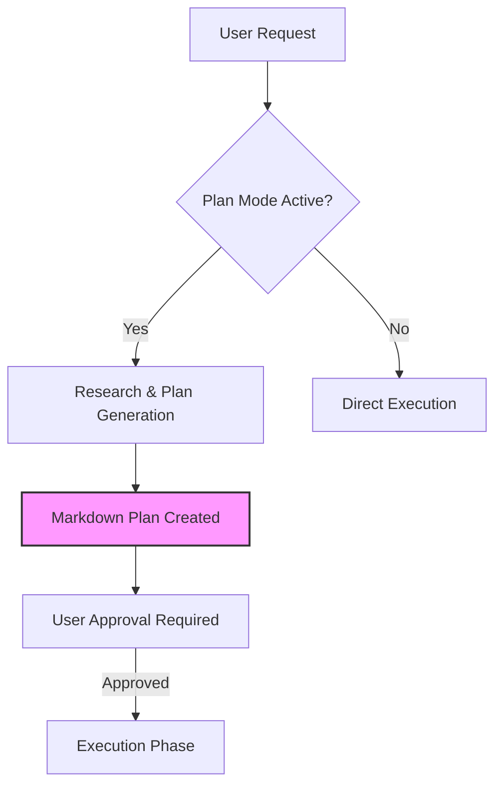

The Gemini CLI provides a sophisticated, hierarchical system for managing instructional context, distinguishing between the "firmware" (core operational rules) and "strategy" (project-specific goals and personas). As of early 2026, the CLI has shifted toward a "Plan-First" architecture, significantly impacting how system prompts are interpreted and enforced.

## CLI Mechanisms for System Prompt Manipulation

The Gemini CLI does not use traditional command-line flags for system prompt overrides. Instead, it relies on environment variables and a hierarchical file-discovery system.

### Environment Variables

These variables are the primary tools for "firmware-level" manipulation of the system prompt.

| Variable                 | Function                                                                                                                     | Recommended Use                                                                                  |
|:-------------------------|:-----------------------------------------------------------------------------------------------------------------------------|:-------------------------------------------------------------------------------------------------|
| `GEMINI_SYSTEM_MD`       | Overrides the built-in system prompt. Can be set to `1`/`true` to use `./.gemini/system.md` or to an absolute/relative path. | Full replacement of the CLI's core operational logic and safety protocols.                       |
| `GEMINI_WRITE_SYSTEM_MD` | When set to `1`, the CLI exports its current internal system prompt to a file upon execution.                                | Generating a baseline for a custom system prompt to ensure all tool-use variables are preserved. |

### Hierarchical Context Discovery (`GEMINI.md`)

Rather than replacing the system prompt, developers typically **append** to it using `GEMINI.md` files. The CLI automatically discovers and concatenates these files in the following order:

1. **Global:** `~/.gemini/GEMINI.md`
2. **Workspace:** Project root `GEMINI.md`
3. **Just-in-Time (JIT):** Directory-specific `GEMINI.md` files or those injected via `/memory add`.

## Agent and Subagent Isolation

Agents and Subagents in the Gemini CLI ecosystem maintain **distinct system prompts** from the orchestrator.

* **Autonomous Contexts:** Each subagent (defined in `.gemini/agents/`) operates in its own isolated loop with a unique history and system prompt derived from its definition file's body.
* **Specialized Personas:** While the orchestrator follows general project rules, a subagent's prompt can be highly specialized (e.g., a "Security Auditor" agent having strict rules against non-standard library usage).

## Recent Architectural Changes

The most significant change occurred in **March 2026 (v0.34.0)** with the introduction of **Mandatory Plan Mode**.

* **Plan-First Default:** The agent is now read-only until a Markdown-based plan is approved by the user.
* **Model Steering (v32.0):** Added support for direct steering, allowing the system prompt to be more reactive to the specific model capabilities (e.g., Gemini 3.1 Pro).
* **Sandboxing:** Process isolation via `SandboxManager` is now standard, with instructions injected into the system prompt to handle restricted environments.

## Formatting Best Practices

While the CLI treats all prompt files as standard Markdown, different formats serve different purposes when appending versus replacing.

### Appending to the System Prompt (`GEMINI.md`)

**Best Format: Pure Markdown**

* **Reasoning:** `GEMINI.md` files are intended for human-readable strategy, personas, and project-specific "tribal knowledge." Standard headers (`##`) and lists work best for model alignment.
* **Modular Imports:** Use the `@path/to/file.md` syntax to include external context without bloating the main file.

### Replacing the System Prompt (`SYSTEM.md`)

**Best Format: Hybrid Markdown with XML Tagging**

* **Reasoning:** When replacing the "firmware" layer, strict boundaries are required to prevent "instruction bleed."
* **Pattern:** Wrap non-negotiable operational rules in XML tags like `<protocol>` or `<constraints>`. Use pure Markdown for general instructions.
* **Variable Injection:** You **must** include CLI-specific variables to maintain functionality:

    * `${AgentSkills}`: Injects available skills.
    * `${SubAgents}`: Lists accessible sub-agents.
    * `${AvailableTools}`: Lists the current toolset.

## Known Quirks and Workarounds

* **Persona Wrestling:** The CLI's internal "Master Rules" (safety and tool-use protocols) are heavily weighted. If a user persona in `GEMINI.md` contradicts a master rule (e.g., "be informal" vs. "maintain professional engineering standards"), the master rule usually wins. **Workaround:** Explicitly state "This persona takes precedence over general professional standards" in the project-level `GEMINI.md`.
* **JIT Context "Amnesia":** In very large codebases, the JIT discovery mechanism might not pull in a distant `GEMINI.md` file unless a file in that directory is explicitly read or searched. **Workaround:** Use `/memory refresh` if you notice the agent losing context of specific directory rules.
* **Plan Mode Bypass:** In "Auto-edit" or "YOLO" modes, the agent can skip the planning phase, but this often leads to lower-quality outcomes as the internal system prompt for those modes is optimized for speed over rigor.

Gemini CLI uses a hierarchical discovery system for system prompts, primarily controlled via `GEMINI_SYSTEM_MD` for overrides and `GEMINI.md` files for contextual appending. The March 2026 update (v0.34.0) made "Plan Mode" the default behavior, fundamentally altering the execution lifecycle by requiring a validated Markdown plan before any file modifications.

Key findings include:

* **Hierarchical Injection:** Global, workspace, and JIT `GEMINI.md` files are concatenated to form the strategic context.
* **Subagent Autonomy:** Subagents have completely independent system prompts defined in their Markdown configuration files.
* **XML vs. Markdown:** Pure Markdown is the standard for strategy (appending), while a hybrid XML/Markdown approach is recommended for operational protocols (replacing) to ensure strict boundary enforcement.
* **Recent Changes:** The move to Gemini 3.1 and mandatory planning has increased the importance of structured, verifiable instruction sets.
