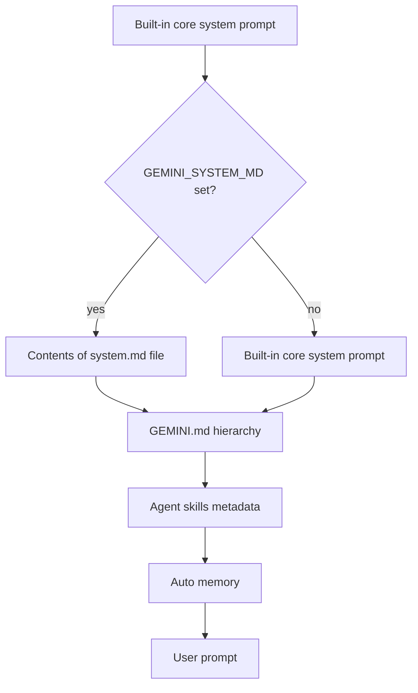

## Overview

Gemini CLI distinguishes between two ways to influence instructions: the **core system prompt** (firmware) and the **project context** (strategy). The core system prompt can be replaced entirely through the `GEMINI_SYSTEM_MD` environment variable, while project context is appended through a hierarchy of `GEMINI.md` files. There are no dedicated CLI flags such as `--append-system-prompt` or `--system-prompt`; manipulation is env-var and file-discovery based. Subagents carry their own isolated system prompts defined in Markdown files.

## CLI Parameters

Gemini CLI does not expose flags that directly append or replace system prompt text. The options that touch the effective prompt do so indirectly:

| Flag | Mode | Effect |
| :--- | :--- | :--- |
| `--approval-mode <mode>` | Modify | Changes execution policy (`default`, `auto_edit`, `plan`, `yolo`). Plan mode is read-only during planning. |
| `--sandbox` / `-s` | Modify | Enables sandbox mode; injects sandbox-aware instructions and restricts tools. |
| `--extensions <names>` / `-e` | Modify | Enables extensions that contribute tools and may appear in prompt variable substitution. |
| `--allowed-mcp-server-names <names>` | Modify | Restricts MCP servers, changing the tool surface available for `${AvailableTools}` substitution. |
| `--include-directories <dirs>` | Modify | Adds workspace directories; `GEMINI.md` files inside them may be discovered as appended context. |
| `--model <alias>` / `-m` | Other | Selects the model; does not change prompt text. |

There are no inline or file-based `--system-prompt` or `--append-system-prompt` equivalents.

## Configuration and Discovery

### Core system prompt replacement (`GEMINI_SYSTEM_MD`)

The core system prompt is replaced by setting the `GEMINI_SYSTEM_MD` environment variable:

- `GEMINI_SYSTEM_MD=1` or `GEMINI_SYSTEM_MD=true` reads `./.gemini/system.md`.
- `GEMINI_SYSTEM_MD=/path/to/system.md` reads the specified file.
- Relative paths and tilde expansion are supported.
- `GEMINI_SYSTEM_MD=0`, `false`, or unset restores the built-in prompt.

If the variable points to a missing file, the CLI errors with `missing system prompt file '<path>'`.

### Project context (`GEMINI.md`)

`GEMINI.md` files provide persistent project instructions. The CLI discovers and concatenates them in this order:

1. `~/.gemini/GEMINI.md` (global user context)
2. Workspace `GEMINI.md` files from configured workspace directories and their parents
3. Just-in-time `GEMINI.md` files in directories accessed by tools, scanned up to a trusted root

The footer shows the count of loaded context files. Use `/memory show` to inspect the concatenated context and `/memory reload` to rescan.

### Imports and custom filenames

- Use `@./path/to/file.md` inside a `GEMINI.md` to import other Markdown files.
- Customize the discovered filename(s) via `context.fileName` in `settings.json`.

### Agent definitions

Custom subagents are Markdown files with YAML frontmatter in `~/.gemini/agents/*.md` or `./.gemini/agents/*.md`. The file body becomes the agent's system prompt. Fields include `name`, `description`, `tools`, `model`, `temperature`, `max_turns`, `timeout_mins`, and `mcpServers`.

## Prompt Layers and Precedence

Notes on precedence:

- `GEMINI_SYSTEM_MD` replaces the built-in core system prompt entirely.
- `GEMINI.md` files append project context on top of whichever core prompt is active.
- Skills, memory, and subagents add further layers.
- Subagents use their own system prompt and do not inherit the parent `GEMINI.md` context automatically.

## Agents and Subagents

Gemini CLI supports built-in subagents (`codebase_investigator`, `cli_help`, `generalist`, `browser_agent`) and user-defined agents. Each subagent has its own system prompt and tool set.

Key behaviors:

- Custom agents are defined as Markdown files with YAML frontmatter; the body is the system prompt.
- Subagents run in isolated context loops with independent history.
- Only the final result returns to the parent session.
- Subagents cannot call other subagents, even with the `*` tool wildcard.
- Tool access is restricted by the `tools` list; if omitted, the subagent inherits the parent's tools.
- Inline MCP servers can be scoped to a subagent via `mcpServers` in the frontmatter.

## Format Recommendations

| Goal | Recommended format | Rationale |
| :--- | :--- | :--- |
| Append (`GEMINI.md`) | Pure Markdown | Headers, lists, and short paragraphs blend with the concatenated context chain. |
| Replace (`GEMINI_SYSTEM_MD`) | Markdown with variable substitution | The custom file must reintroduce dynamic content such as `${AgentSkills}`, `${SubAgents}`, and `${AvailableTools}` to keep tools, skills, and agents usable. |

For replacements, the file should explicitly include any safety rules, tool protocols, and workflow instructions the task still needs, because the built-in prompt is removed entirely.

## Recent Changes

- **v0.45.0 (2026-06-03)**: Context Manager Simplification refactor completed, changing how context files and memory are loaded and ordered.
- **Antigravity CLI transition (2026-06-18)**: Google announced that unpaid-tier and Google One Gemini CLI users will move to Antigravity CLI. This may change system-prompt behavior for affected users.
- **Subagent tool isolation (2026-05)**: Markdown-based agent definitions with isolated tools and MCP servers became stable.
- **Browser agent (2026-04)**: Added a built-in browser automation subagent and updated default model routing.

## Quirks and Workarounds

- There is no CLI flag for system prompt append or replace; use `GEMINI_SYSTEM_MD` for replace and `GEMINI.md` for append.
- `GEMINI.md` is project context, not a hard system-prompt layer, so it can be overridden by strong instructions in a custom `system.md`.
- When `GEMINI_SYSTEM_MD` is active, the CLI displays a `|⌐■_■|` indicator.
- Export the built-in prompt first with `GEMINI_WRITE_SYSTEM_MD=1 gemini` before editing it, so required variables and safety rules are preserved.
- Plan mode is not mandatory for all sessions; it is governed by `general.plan.enabled` and `--approval-mode=plan`.
- Persisting `GEMINI_SYSTEM_MD` in `./.gemini/.env` makes it durable; remove or set it to `0` to restore defaults.

## Claudine Delivery Notes

- **Replace**: Write the resolved replacement prompt to a temporary Markdown file and invoke Gemini CLI with `GEMINI_SYSTEM_MD=<tmp>` set in the environment. This is a per-invocation change that does not mutate user `settings.json` or persistent `GEMINI.md` files.
- **Append**: Gemini CLI has no native per-invocation append mechanism. The documented append surface is the `GEMINI.md` hierarchy, which requires creating or modifying files in the workspace. Claudine should treat append as unsupported for this provider unless it implements a temporary-file workaround.
- **Export/inspect**: Use `GEMINI_WRITE_SYSTEM_MD=1 gemini` to export the current built-in prompt to `./.gemini/system.md` for review.

## Changelog

- Updated `claudine_delivery` to classify replace as `env_var_file` and append as `unsupported`.
- Corrected earlier claims about mandatory plan mode and version-specific firmware changes; plan mode is configurable, not mandatory.
- Added `GEMINI_WRITE_SYSTEM_MD` as the documented export/inspection mechanism.
- Refreshed sources and recent changes against geminicli.com docs and local Gemini CLI v0.46.0 inspection.

## Sources

- [Gemini CLI documentation](https://geminicli.com/docs/)
- [System Prompt Override (GEMINI_SYSTEM_MD)](https://geminicli.com/docs/cli/system-prompt/)
- [Provide context with GEMINI.md files](https://geminicli.com/docs/cli/gemini-md/)
- [Gemini CLI configuration reference](https://geminicli.com/docs/reference/configuration/)
- [Subagents](https://geminicli.com/docs/core/subagents/)
- [CLI cheatsheet](https://geminicli.com/docs/cli/cli-reference/)
- [Latest stable release notes](https://geminicli.com/docs/changelogs/latest/)
- [Gemini CLI GitHub repository](https://github.com/google-gemini/gemini-cli)
