## Overview

Gemini CLI exposes two distinct levers for influencing what the model sees: a **core system prompt** (`system.md` / `GEMINI_SYSTEM_MD`) and a **hierarchical context layer** (`GEMINI.md` and friends). The CLI has no `--append-system-prompt` or `--system-prompt` flag; manipulation is environment-variable or file-discovery based. Custom sub-agents carry their own isolated system prompts defined in Markdown files. Native Skills and Auto Memory add further layers, all of them ultimately rendered into the system prompt through `PromptProvider.getCoreSystemPrompt` and the `renderFinalShell` / `renderUserMemory` snippets in `packages/core/src/prompts/promptProvider.ts`.

The locally installed binary is `gemini 0.46.0` (npm `@google/gemini-cli`, Node.js v22.20.0). The latest stable release on GitHub is **v0.49.0** (released 2026-06-25); v0.50.0-preview.1 and v0.51.0-nightly exist but are not generally recommended. The free-tier migration to Antigravity CLI took effect on **2026-06-18** (per the banner on `geminicli.com/docs/cli/system-prompt/` and PR #27676 / #27765). Anti-gravity CLI is out of scope for this document.

## CLI Parameters

Gemini CLI does not expose a flag that directly appends or replaces system-prompt text. The flags that touch the effective prompt do so indirectly:

| Flag | Mode | Effect |
| :--- | :--- | :--- |
| `--approval-mode <mode>` | Modify | Selects default, auto_edit, plan, or yolo. The Plan preamble is rendered into the system prompt when plan mode is active. |
| `--sandbox` / `-s` | Modify | Activates sandboxing; inserts a sandbox-aware preamble (renderSandbox). |
| `--policy <files…>` | Other | Loads additional Policy Engine TOML paths from the command line (settings key `policyPaths`). |
| `--admin-policy <files…>` | Other | Loads additional admin policy paths from the command line (settings key `adminPolicyPaths`). |
| `--allowed-mcp-server-names <list>` | Modify | Restricts which MCP servers are loaded; narrows the `${AvailableTools}` list. |
| `--include-directories <list>` | Modify | Adds workspace directories — any `GEMINI.md` they contain is appended into the system prompt via `renderUserMemory`. |
| `--extensions <list>` / `-e` | Modify | Enables a subset of extensions; affects what skills / sub-agents / tools the renderer enumerates. |
| `--model <alias>` / `-m` | Other | Selects the model — also gates the modern vs legacy snippet renderer. |
| `--acp` | Other | Starts in Agent Client Protocol mode for editor integrations. |
| `--session-file <path>` / `--session-id <id>` | Other | Resumes a session without re-rendering the system prompt. |
| `--output-format / -o` | Other | Selects text, json, or stream-json output for non-interactive runs. |

Many of these flags are accepted by the binary but absent from `gemini --help` output in v0.46.0 (verified by running the binary against unknown-arg flags). Treat `--policy`, `--admin-policy`, `--session-file`, `--session-id`, `--raw-output`, `--accept-raw-output-risk`, `--screen-reader`, `--list-sessions`, `--delete-session`, `--output-format`, and `--acp` as real flags when wrapping the CLI. There is no inline-text nor file-flag for direct system-prompt replacement or append.

## Configuration and Discovery

### Core system prompt replacement (`GEMINI_SYSTEM_MD`)

The core system prompt is replaced by setting the `GEMINI_SYSTEM_MD` environment variable. The decision is made by `PromptProvider.getCoreSystemPrompt`:

```js
const systemMdResolution = resolvePathFromEnv(process.env["GEMINI_SYSTEM_MD"]);
…
if (systemMdResolution.value && !systemMdResolution.isDisabled) {
  let systemMdPath = path.resolve(path.join(GEMINI_DIR, "system.md"));
  if (!systemMdResolution.isSwitch) {
    systemMdPath = systemMdResolution.value;
  }
  if (!fs.existsSync(systemMdPath)) {
    throw new Error(`missing system prompt file '${systemMdPath}'`);
  }
  basePrompt = fs.readFileSync(systemMdPath, "utf8");
  basePrompt = applySubstitutions(basePrompt, …);
}
```

Rules (per `docs/cli/system-prompt.md` and `docs/reference/configuration.md`):

- `GEMINI_SYSTEM_MD=1` or `GEMINI_SYSTEM_MD=true` reads `./.gemini/system.md`.
- Any other non-empty string is treated as a path (relative/absolute, `~`-expanded).
- `0` / `false` or unset restores the built-in prompt.
- Missing file raises `missing system prompt file '<path>'`.
- The CLI shows a `|⌐■_■|` indicator in the UI when active.

`applySubstitutions` lets a custom file include the dynamic sections it needs:

- `${AgentSkills}` — full section header + bulleted skills list.
- `${SubAgents}` — full section header + bulleted sub-agent names.
- `${AvailableTools}` — bulleted tool list.
- `${<toolName>_ToolName}` — the actual name of a single tool, e.g. `${write_file_ToolName}` or `${run_shell_command_ToolName}`.

### Project and global context (`GEMINI.md`)

`GEMINI.md` files are concatenated into the system prompt by `renderFinalShell` → `renderUserMemory`. They are **not** a soft context channel — they are rendered directly under the base prompt. The CLI documents three layers:

1. `~/.gemini/GEMINI.md` (global)
2. Workspace `GEMINI.md` (configured workspace directories and their parents)
3. Just-in-time `GEMINI.md` files discovered when a tool accesses a directory or its ancestors up to a trusted root

The renderer enforces a strict precedence: sub-directories > workspace root > extensions > global; context can override default operational behaviors but never Core Mandates.

```mermaid
graph TD
  A[Built-in core system prompt] --> B{GEMINI_SYSTEM_MD set?}
  B -- yes --> C[Contents of system.md file<br/>with substitutions applied]
  B -- no --> A
  C --> D[renderFinalShell → renderUserMemory]
  A --> D
  D --> D1[/Global ~/.gemini/GEMINI.md/]
  D --> D2[/Extension memory/]
  D --> D3[/Workspace ./GEMINI.md/]
  D --> D4[/Sub-directory **&#47;GEMINI.md/]
  D --> F[Active topic narration]
  D --> E[Auto-memory MEMORY.md<br/>if enabled]
  D --> P[User prompt]
```



The footer shows the count of loaded context files. `/memory show` displays the concatenated context; `/memory reload` rescans. `GEMINI.md` filenames can be customised via `context.fileName` (string or string[]) in `settings.json`; the renderer repeats the list in the `# Contextual Instructions (<filenames>)` header.

### Imports and custom filenames

`GEMINI.md` files can pull in other Markdown via `@./path/to/file.md` (relative or absolute, recursive up to four hops, code-fence-aware parsing). Importing into a runtime file is supported; the `[DEBUG] [MemoryDiscovery]` warns in source if a directory matches a `GEMINI.md` path but is skipped (e.g. EISDIR virtual drives).

### Sub-agent definitions

Custom sub-agents are Markdown files with YAML frontmatter. Locations:

- `~/.gemini/agents/*.md` (user scope)
- `./.gemini/agents/*.md` (project scope; project overrides user on name collisions — PR #26953, v0.44.0)
- `<extension>/agents/*.md` (extension scope)

The markdown body becomes the sub-agent's system prompt. Frontmatter fields: `name`, `description` (required), `kind` (`local` default or `remote` for A2A), `tools`, `mcp_servers`, `model` (default `inherit`), `temperature`, `max_turns` (default 30), `timeout_mins` (default 10). Configuration overrides live under `agents.overrides` in `settings.json` (`enabled`, `modelConfig.model`, `runConfig.maxTurns`).

### Agent Skills

Skills are folders with a `SKILL.md` frontmatter. At session start, only metadata (name + description) is loaded into the system prompt via `${AgentSkills}`. The full `SKILL.md` body is appended to the conversation when the model calls the `activate_skill` tool. Discovery tiers: built-in > extension > user > workspace; `~/.agents/skills/` and `./.agents/skills/` aliases take precedence over `~/.gemini/skills/` and `./.gemini/skills/` on name collisions.

### Auto Memory

Auto Memory (experimental, `experimental.autoMemory: true`) extracts memory updates and Skill candidates from past sessions. `MEMORY.md` is an index; sibling `*.md` notes hold detail. Candidates are dropped in a project-local inbox for approval before being written. Disabled by default; the flag requires a session restart.

## Prompt Layers and Precedence

The effective prompt is assembled in this order:

```mermaid
graph TD
  A[Built-in core system prompt<br/>snippets.renderPreamble + Core Mandates + Operational Guidelines] --> B{GEMINI_SYSTEM_MD set?}
  B -- yes --> C[system.md contents<br/>applySubstitutions]
  B -- no --> A
  C --> D[renderFinalShell / renderUserMemory<br/>subdirs > workspace > ext > global]
  A --> D
  D --> E[${AgentSkills} metadata<br/>only name + description]
  E --> F[${SubAgents} enumeration<br/>built-ins + custom local + remote]
  F --> G[${AvailableTools} tool list]
  G --> H[Active topic narration<br/>if enabled]
  H --> I[Auto memory MEMORY.md<br/>if experimental.autoMemory]
  I --> J[User prompt]
```

Notes on precedence:

- `GEMINI_SYSTEM_MD` replaces the built-in base entirely. The renderer still appends GEMINI.md context on top of the override (`renderFinalShell` calls `renderUserMemory` after `basePrompt.trim()`).
- Skills, sub-agents, and tools must be re-introduced with the substitution variables in a custom `system.md` if the task still needs them.
- Sub-agents use the body of their Markdown file as their own isolated system prompt; they do not inherit the parent's GEMINI.md content automatically.
- Sub-agents cannot spawn other sub-agents (recursion protection), even when granted the `*` tool wildcard.

## Agents and Subagents

Gemini CLI ships with built-in sub-agents (`codebase_investigator`, `cli_help`, `generalist`, `browser_agent`) and supports local custom sub-agents defined as Markdown files. Each sub-agent has its own system prompt (the markdown body), its own tool set, optional inline MCP servers, and an isolated context loop.

Key behaviors (per `docs/core/subagents.md` and `packages/core/src/agents/local-executor.ts` schema):

- Custom agents live in `~/.gemini/agents/*.md`, `./.gemini/agents/*.md`, or `<extension>/agents/*.md`. Required frontmatter: `name`, `description`. Optional: `kind` (`local`/`remote`, default `local`), `tools`, `mcp_servers`, `model` (default `inherit`), `temperature` (0.0–2.0, default 1), `max_turns` (default 30), `timeout_mins` (default 10).
- Built-in agents are listed via `${SubAgents}` in the main session's prompt and can be forced via `@codebase_investigator …` syntax at the start of a prompt.
- Browser agent requires Chrome ≥144 and is off by default until `agents.overrides.browser_agent.enabled: true` is set in settings.json.
- Custom local sub-agents use `first-wins` collision rules with project > user priority (PR #26953, v0.44.0).
- Each sub-agent runs in its own context loop; only the final result returns to the parent. Sub-agent prompt is independent of the parent's GEMINI.md content unless the parent explicitly invokes it.
- Tools listed in `tools` are explicit; if omitted, the sub-agent inherits the parent's tool set. Wildcards include `*` (all tools), `mcp_*` (all MCP tools), and `mcp_<server>_*` (all tools from a specific server).
- The Policy Engine treats sub-agents as virtual tool names for allow/deny/ask_user decisions: a rule with `toolName = "codebase_investigator"` denies the sub-agent at the system policy level.

## Format Recommendations

| Goal | Recommended format | Rationale |
| :--- | :--- | :--- |
| Append (`GEMINI.md`) | Pure Markdown | Headers, bullet lists, and short paragraphs blend cleanly with the rendered `<loaded_context>` block. |
| Replace (`system.md`) | Markdown with `${…}` substitutions | The renderer passes the file through `applySubstitutions`, so re-introduce skills/sub-agents/tools explicitly. XML tags add no documented advantage here. |

Wrapping a replacement:

```markdown
# Custom system prompt

You are a focused reviewer.

## Dynamic content
${AgentSkills}
${SubAgents}

## Tools available
${AvailableTools}
Use ${run_shell_command_ToolName} for shell access and ${read_file_ToolName} to inspect files.
```

Wrapping an append (drop into a temporary directory and inject via `--include-directories`):

```markdown
# Additional instructions

Always run `pnpm test` after edits.

## Style
- Prefer named exports.
- Avoid `any`.
```

JSON and YAML are not natural fits: the renderer does not parse either as a wrapper envelope and they cost more tokens than plain Markdown in the model context.

## Recent Changes

- **v0.49.0 — 2026-06-25 (latest stable)**: `coreTools` was migrated to `tools.core` (`fix(config): migrate coreTools setting to tools.core` #27947). Zero-quota limits now fail fast to prevent retry loops. MCP tool discovery uses atomic update. Tool output formatting standardised.
- **v0.47.0 — 2026-06-18**: Antigravity CLI migration banner (`update the max amount of times the Antigravity transition banner can be displayed`, PR #27676) and migration documentation (`Add documentation and migration commands for Antigravity CLI`, PR #27765). Policy TOML gets EBUSY fallback and parser recovery. Vertex AI model mapping fix.
- **v0.46.0 — 2026-06-10** (local binary version verified): PTY resize hardening; preferredEditor spam-loop fix; transition to Flash GA model behind an experimental flag. Source-of-truth inspection of `packages/core/src/prompts/promptProvider.ts` confirms `GEMINI_SYSTEM_MD`, `GEMINI_WRITE_SYSTEM_MD`, `${AgentSkills}`, `${SubAgents}`, `${AvailableTools}`.
- **v0.44.0 — 2026-05-27**: Context Manager Simplification completed. PR #26950 (`fix(core): made context files append instead of replace`) confirmed that GEMINI.md content is appended (rendered into the system prompt) rather than treated as a separate context message. PR #26953 made agent registration first-wins with project > user priority. Browser agent stabilized enough to drop "experimental" from docs.
- **v0.42.x — 2026-05-12**: Auto Memory inbox flow introduced (`chore: clean up launched memory features`, PR #26941). Off by default; opt-in via `experimental.autoMemory: true`.
- **Antigravity CLI transition — 2026-06-18**: Free-tier and Google One Gemini CLI users moved to Antigravity CLI. Banner is preserved on `geminicli.com/docs/cli/system-prompt/` after this date; the Gemini CLI binary remains available for paid tiers.

## Quirks and Workarounds

- **No CLI flag for direct prompt override.** Use `GEMINI_SYSTEM_MD` for replacement and the `GEMINI.md` hierarchy (or `--include-directories` + a temp file) for append.
- **GEMINI.md is rendered into the system prompt**, not a soft context layer. The renderer concatenates context under `# Contextual Instructions (GEMINI.md)` inside a `<loaded_context>` block; sub-directory rules beat workspace root, which beats extension memory, which beats global — but context cannot override Core Mandates.
- **GEMINI_SYSTEM_MD does not stop context discovery.** Even when the override is active, `renderUserMemory` still appends the `<loaded_context>` block on top of the custom file. To stop GEMINI.md from being included, the wrapper must use a shadow HOME or a clean `--include-directories` workspace with no GEMINI.md files in scope.
- **Replacement drops dynamic content.** Skills (`${AgentSkills}`), sub-agents (`${SubAgents}`), tools (`${AvailableTools}`), and `${<toolName>_ToolName}` substitutions must be reintroduced explicitly when shipping a custom `system.md`.
- **The CLI shows a `|⌐■_■|` indicator** in the UI when `GEMINI_SYSTEM_MD` is active.
- **Export first, then edit.** `GEMINI_WRITE_SYSTEM_MD=1 gemini` writes the current built-in prompt to `./.gemini/system.md`. Make modifications from that baseline so required Core Mandates and tool protocols stay intact.
- **Plan mode is configurable, not mandatory.** Governed by `general.plan.enabled` (default `true`) and `--approval-mode=plan`. The Plan preamble appears as a sub-shell in the rendered system prompt and lists tools with `<tool>` tags.
- **`--help` is incomplete in v0.46.0.** `--policy`, `--admin-policy`, `--session-file`, `--session-id`, `--list-sessions`, `--delete-session`, `--raw-output`, `--accept-raw-output-risk`, `--screen-reader`, `--output-format`, and `--acp` are accepted by the binary but absent from `--help`. Do not rely on `--help` to detect them in scripts.
- **Sub-agents cannot recursively spawn other sub-agents**, even with the `*` tool wildcard.
- **Persisting `GEMINI_SYSTEM_MD=1`** in `./.gemini/.env` makes the override durable for the project. Set it to `0` or remove it to restore defaults.
- **Custom context filenames** (`context.fileName` in settings.json) rename the discovered context file and its `# Contextual Instructions (<filenames>)` header label; the precedence chain remains the same.
- **`tools.core` (v0.49.0)** replaces the deprecated `coreTools` setting; settings.json templates still emitting `coreTools` will silently no-op.
- **Bundled docs lag the GitHub releases.** The `docs/changelogs/latest.md` shipped with v0.46 still references v0.44.0 as the latest stable; the GitHub releases page lists v0.49.0 as the current latest stable.
- **Antigravity CLI banner** for free-tier users runs on every session unless the CLI explicitly suppresses the migration notice. The system-prompt mechanism for Antigravity CLI may differ from this topic's scope.

## Claudine Delivery Notes

- **Replace** — Write the resolved replacement prompt to a temporary Markdown file and invoke Gemini CLI with `GEMINI_SYSTEM_MD=<tmp>` set in the environment. Per-invocation, persistent-free, no mutation of user settings.json or persistent GEMINI.md files. Optional `${AgentSkills}` / `${SubAgents}` / `${AvailableTools}` substitutions preserve dynamic content.
- **Append** — Drop a Markdown file into a temporary directory and pass that directory via `--include-directories` so MemoryDiscoveryService picks it up as a runtime GEMINI.md. The directory must not contain a real `GEMINI.md` at the root or the file naming convention must be overridden via `context.fileName`. Use `GEMINI.md.<hash>.tmp` as the file name to avoid collision with the user's persistent `GEMINI.md`.
- **Export / inspect** — Run `GEMINI_WRITE_SYSTEM_MD=1 gemini` (or `GEMINI_WRITE_SYSTEM_MD=<tmp-dir>/DEFAULT.md gemini`) once to dump the built-in prompt to a file the wrapper can read.
- **Avoid persistent mutation** — Do not write to `~/.gemini/settings.json`, project `./.gemini/settings.json`, the active workspace `GEMINI.md`, or `./.gemini/.env`. A shadow HOME or a temp-directory-driven `--include-directories` keeps the user's config untouched.
- **Traps to avoid** — `GEMINI_SYSTEM_MD` does not stop GEMINI.md discovery (the renderer still appends `<loaded_context>` on top of an override). For pure replacement the wrapper should also pass a clean `--include-directories` list with no in-scope GEMINI.md files, or use a shadow HOME so MemoryDiscoveryService cannot find any user context.

## Changelog

- **2026-07-03 — refresh**
  - Split `os: all` `config_sources` records into per-OS entries (macos / linux / windows) to satisfy the `_schema.yaml` `os` enum. The previous research violated validation because `os: all` is not in the schema's allowed values.
  - Updated `last_updated` to `2026-07-03`, set `agent` to `open_code` and `model` to `minimax/MiniMax-M3`.
  - Refreshed `recent_changes` against the GitHub releases page: latest stable is **v0.49.0** (2026-06-25); the bundled docs in v0.46 are stale and still call v0.44.0 "latest".
  - Added `--policy`, `--admin-policy`, `--acp`, `--session-file`, `--session-id`, and `--output-format` to `cli_params`; verified accepted by `gemini` in v0.46.0 but absent from `gemini --help`.
  - Corrected the body: `GEMINI.md` content is rendered into the system prompt via `renderFinalShell` → `renderUserMemory` (`packages/core/src/prompts/promptProvider.ts` in the bundle), not treated as a soft context channel. The prior research's \"softer than a true system-prompt append\" framing was technically wrong — GEMINI.md is appended inside `<loaded_context>` at the bottom of the system prompt with strict sub-directory > workspace > extension > global precedence.
  - Recorded the v0.49.0 `coreTools` → `tools.core` migration as a wrapper-relevant change.
  - Added per-OS `config_sources` entries for system defaults/settings, extension sub-agents, Agent Skills, and the project `.env` so all documented surfaces are covered.
  - New quirks: many flags absent from `--help` are accepted by the binary; bundled docs lag releases.
  - New gaps: Auto Memory's exact rendering effect, the Antigravity CLI replacement, and the lack of a flag to disable GEMINI.md discovery in the same invocation.
  - `claudine_delivery` adjusted to call append strategy `shadow_home_file` (drop a runtime GEMINI.md into a temporary directory surfaced via `--include-directories`) rather than `unsupported`. Replace strategy stays `env_var_file`.

- **2026-07-02 — prior refresh** (carried in): introduced `GEMINI_SYSTEM_MD` (replace via env + path), `GEMINI_WRITE_SYSTEM_MD` (export/inspect), `context.fileName`, `agents.overrides`, sub-agent Markdown frontmatter, Agent Skills, Auto Memory, Plan Mode, the `|⌐■_■|` UI indicator, and the Antigravity CLI migration.

## Sources

- [Gemini CLI documentation](https://geminicli.com/docs/)
- [System Prompt Override (GEMINI_SYSTEM_MD)](https://geminicli.com/docs/cli/system-prompt/)
- [Provide context with GEMINI.md files](https://geminicli.com/docs/cli/gemini-md/)
- [Gemini CLI configuration reference](https://geminicli.com/docs/reference/configuration/)
- [Subagents](https://geminicli.com/docs/core/subagents/)
- [CLI cheatsheet](https://geminicli.com/docs/cli/cli-reference/)
- [Latest stable release notes (v0.49.0)](https://geminicli.com/docs/changelogs/latest/)
- [Release notes index](https://geminicli.com/docs/changelogs/)
- [Agent Skills](https://geminicli.com/docs/cli/skills/)
- [Auto Memory](https://geminicli.com/docs/cli/auto-memory/)
- [Plan mode](https://geminicli.com/docs/cli/plan-mode/)
- [Headless mode](https://geminicli.com/docs/cli/headless/)
- [Policy engine](https://geminicli.com/docs/reference/policy-engine/)
- [Project context (GEMINI.md)](https://geminicli.com/docs/cli/gemini-md/)
- [Gemini CLI GitHub repository](https://github.com/google-gemini/gemini-cli)
- [Gemini CLI GitHub releases](https://github.com/google-gemini/gemini-cli/releases)
- [v0.49.0 release notes](https://github.com/google-gemini/gemini-cli/releases/tag/v0.49.0)
- [v0.47.0 release notes](https://github.com/google-gemini/gemini-cli/releases/tag/v0.47.0)
- [v0.46.0 release notes](https://github.com/google-gemini/gemini-cli/releases/tag/v0.46.0)
- Local inspection: `gemini 0.46.0` (`npm install -g @google/gemini-cli`), `~/.gemini/settings.json`, `~/.gemini/agents/*.md`, `~/.gemini/GEMINI.md`. Bundle source: `packages/core/src/prompts/promptProvider.ts` and `packages/core/src/agents/local-executor.ts` in `/Users/ken/.nvm/versions/node/v22.20.0/lib/node_modules/@google/gemini-cli/bundle/`.
