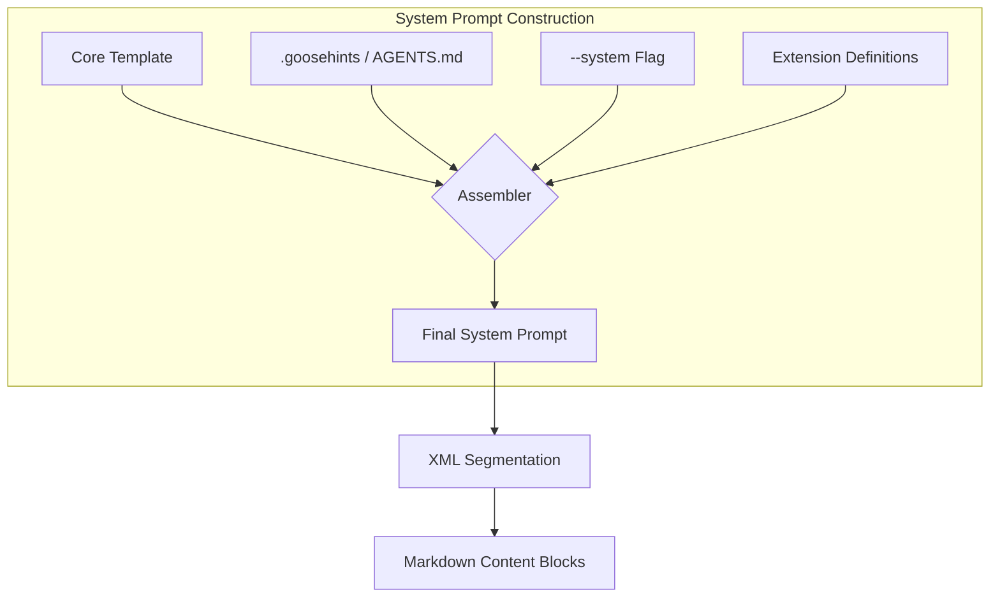

I will research the Goose CLI's system prompt handling by searching for its documentation, CLI options, and developer discussions to answer your specific questions.

I will now perform targeted searches to determine if Goose subagents can have distinct system prompts, identify developer-reported quirks, and investigate the most effective formatting for prompt manipulation.

I will research the most recent updates to the Goose CLI's system prompt handling and investigate whether XML or Markdown is the preferred formatting for prompt manipulation.

I will now search for the Goose CLI changelog spanning 2025 and early 2026, while also investigating whether XML or Markdown is the preferred formatting for prompt manipulation.

In-depth research into the **Goose CLI** (by Block/AAIF) reveals a sophisticated, multi-layered approach to system prompt management that has evolved significantly through late 2025 and early 2026. Goose utilizes a hybrid architecture that balances user-friendly Markdown for content with the structural precision of XML for agent steering.

### **CLI Switches for System Prompt Manipulation**

The primary entry points for modifying the system prompt via the command line are:

* **`--system <TEXT>`**: Directly **appends** the provided text to the agent's core system instructions for the current session. This is the most common way to apply "one-off" behavioral constraints.
* **`-i, --instructions <FILE>`**: Loads a specific instruction set from a local file. Unlike `--system`, this often defines the *entire* goal or behavior of the run, treating the file as the primary source of truth for the agent's task-specific identity.
* **`-t, --text <TEXT>`**: While primarily used for the initial user query, it is often used in combination with `-i` to provide a "context-heavy" start where the instructions define the "who" and the text defines the "what."

### **Non-CLI Manipulation Methods**

Goose is designed to be "context-aware" and automatically discovers configuration files in the working directory:

* **`.goosehints` / `AGENTS.md`**: Goose automatically parses these files and injects their content into the system prompt. `AGENTS.md` became a formalized standard in late 2025 (via the AAIF) to provide a "README for agents."
* **`CONTEXT_FILE_NAMES` Environment Variable**: This allows developers to point Goose to alternative "rules" files, such as `.cursorrules` or `CLAUDE.md`, enabling cross-tool compatibility.
* **`~/.config/goose/prompts/`**: Advanced users can override the default system prompt template by placing a custom `system.md` in this directory.
* **Recipes**: Located in the `recipes/` config folder, these YAML/Markdown hybrids allow for the creation of specialized personas (e.g., "Security Specialist") that swap out the entire system prompt and toolset.

### **Agent vs. Subagent System Prompts**

Goose supports a hierarchical agent model where subagents can maintain **distinct identities**:

* **Delegation Isolation**: When a main agent uses the `delegate()` tool, it creates a new `Agent` instance. This subagent does **not** inherit the full conversation history, which prevents context bloat.
* **Custom Instructions**: The `delegate(instructions: "...")` parameter allows the orchestrator to provide a targeted system prompt to the subagent, making its behavior distinct from the parent.
* **Skill Gaps**: A known quirk is that subagents do not automatically inherit all "Skills" (Markdown-based capability descriptions) unless explicitly passed or loaded via a specific recipe.

### **Developer Quirks & Workarounds**

| Quirk                 | Observation                                                                                                     | Workaround                                                                                                |
|:----------------------|:----------------------------------------------------------------------------------------------------------------|:----------------------------------------------------------------------------------------------------------|
| **Extension Shadows** | Enabling the "Code Execution" extension can sometimes disable the "Subagent" tool visibility.                   | Disable high-privilege code execution if complex orchestration is required.                               |
| **Recursion Limits**  | Subagents are generally blocked from spawning further subagents to prevent "infinite loop" token spend.         | Flatten the architecture so the main agent orchestrates all sub-tasks directly.                           |
| **Context Leaks**     | Instructions in `.goosehints` can sometimes conflict with `--system` flags, leading to "instruction confusion." | Use XML tags in both files to give the LLM clear hierarchy (e.g., `<global_rules>` vs `<session_rules>`). |

### **Recent Changes (2025–2026)**

The transition to the **Agentic AI Foundation (AAIF)** in December 2025 triggered several key updates:

* **User-Configurable Prompts (Jan 2026)**: Shifted from hardcoded system strings to a templated system, allowing per-model optimization (e.g., XML for Claude vs. Concise Markdown for GPT-4o).
* **Standardized `Agents.md` (Aug 2025)**: Adopted as the universal "handshake" file for project-specific system prompts.
* **Multi-Chat Identity (Early 2026)**: Introduced the ability for an agent to maintain different "personalities" across multiple concurrent chat sessions.

### **Best Formatting Practices**

Research and community feedback suggest a **Hybrid Format** is most effective for Goose:

#### **For Appending (`.goosehints`, `AGENTS.md`):**

* **Pure Markdown**: Best for readability and token efficiency. Use H2/H3 headers to separate concerns (e.g., `## Coding Standards`, `## File Naming`).
* **Directives**: Use imperative language (e.g., "Always use TypeScript," not "The project uses TypeScript").

#### **For Replacing/Structural (System Templates):**

* **XML Wrappers**: Wrap distinct sections in tags like `<instructions>`, `<constraints>`, and `<tool_context>`.
* **Why XML?** It creates "hard boundaries" that prevent the model from getting confused by large amounts of project context. It is the "gold standard" for steering Anthropic-based models, which form the core of most Goose implementations.

### **Summary of Findings**

Goose CLI employs a highly modular system prompt architecture that prioritizes **context isolation** and **automatic discovery**. By leveraging the `--system` flag for temporary tweaks and `.goosehints`/`AGENTS.md` for persistent project rules, it allows for seamless behavioral adaptation.

**Key Takeaways:**

* **Hybrid Formatting:** Use XML tags for structural boundaries and Markdown for the actual instructions to achieve the highest reliability.
* **Subagent Independence:** Subagents are distinct instances that receive targeted instructions via delegation, rather than inheriting the parent's entire state.
* **2026 Evolution:** The move toward **User Configurable Prompt Editing** has transformed the system prompt from a static artifact into a dynamic, templated resource optimized for specific LLM providers.
