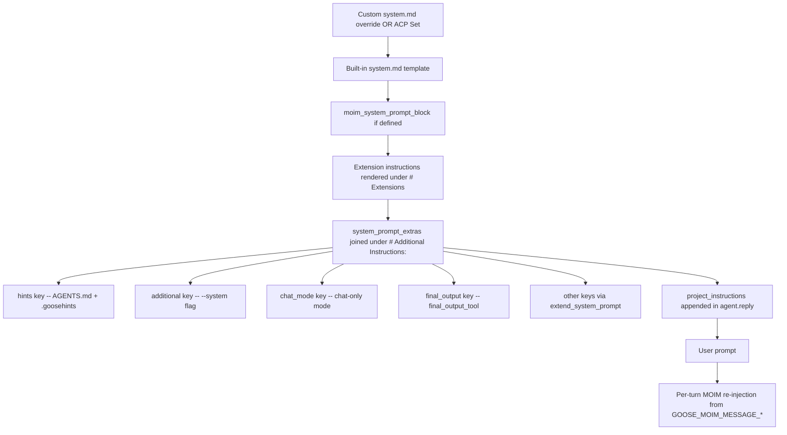

# Goose CLI System Prompt Research

## Overview

Goose CLI builds the effective prompt for each session from several layers. The base is a Jinja2 template stored as `crates/goose/src/prompts/system.md` (or `subagent_system.md` for subagents). Users can override the base template by writing a custom `system.md` under `~/.config/goose/prompts/` (macOS/Linux) or `%APPDATA%\Block\goose\config\prompts\` (Windows). On top of the base, the prompt builder renders extension instructions, then appends an ordered set of `system_prompt_extras` under the heading `# Additional Instructions:`. Extras come from four sources: a `hints` key (the AGENTS.md / .goosehints hierarchy), an `additional` key (`goose run --system <TEXT>`), a `chat_mode` key when chat-only mode is active, and a `final_output` key when the final-output tool is engaged. MOIM persistent instructions (`GOOSE_MOIM_MESSAGE_TEXT` / `GOOSE_MOIM_MESSAGE_FILE`) are injected into the base template's `moim_system_prompt_block` and re-read fresh every turn, making them stronger than one-shot system-prompt additions. Recipe `instructions` do not replace the core system prompt; they layer task-specific instructions on top via `recipe::apply_recipe_components`. There is no `--system-prompt` or `--system-prompt-file` CLI flag; the only programmatic replace paths are a custom `system.md` file, the undocumented `GOOSE_SYSTEM_PROMPT_FILE_PATH` config param, or the ACP `set_session_system_prompt` method.

## CLI Parameters

The `goose run` subcommand exposes the only native system-prompt flag. There is no equivalent on `goose session`.

| Flag | Mode | Effect |
| :--- | :--- | :--- |
| `--system <TEXT>` | Append | Adds the supplied text as an extra under the key `additional`; appended to the rendered prompt under `# Additional Instructions:`. |
| `--recipe <FILE>` | Modify | Loads a recipe whose `instructions` and `prompt` fields become task instructions. Mutually exclusive with `--system`. |
| `--sub-recipe <FILE>` | Modify | Adds a subrecipe alongside the main recipe; auto-injects the `summon` platform extension. |
| `--with-extension <COMMAND>` | Other | Adds a stdio extension whose `instructions` are rendered into the `# Extensions` section of the base template. |
| `--with-streamable-http-extension <URL>` | Other | Adds a remote extension; same prompt impact as stdio. |
| `--with-builtin <name>` | Other | Enables a builtin extension; same prompt impact. |
| `--render-recipe` | Inspect | Prints the rendered recipe instead of running it. |
| `--explain` | Inspect | Shows the recipe's title, description, and parameters. |
| `--no-session` | Other | Disables session persistence; no prompt-surface change. |
| `--interactive / -s` | Other | Continues in interactive mode after initial input; no prompt-surface change. |

The `--system` flag is wired in `crates/goose-cli/src/cli.rs` (`input.system -> input_config.additional_system_prompt -> SessionBuilderConfig.additional_system_prompt -> agent.extend_system_prompt("additional", text)`). It conflicts with `--recipe` in clap, so the two cannot be combined on a single `goose run` invocation.

## Configuration and Discovery

### Prompt templates

Goose's built-in prompts live under `crates/goose/src/prompts/` and are registered in `crates/goose/src/prompt_template.rs`. The user can override any of them by writing the same filename under `~/.config/goose/prompts/` (macOS/Linux) or `%APPDATA%\Block\goose\config\prompts\` (Windows).

| Template | Effect |
| :--- | :--- |
| `system.md` | Replaces the main session system prompt. |
| `subagent_system.md` | Replaces the system prompt used for subagents. |
| `plan.md` | Overrides the planning-mode prompt. |
| `compaction.md` | Overrides the conversation-compaction prompt. |
| `permission_judge.md` | Overrides the read-only permission classifier. |
| `recipe.md` | Overrides the recipe-generation prompt. |
| `apps_create.md`, `apps_iterate.md` | Override the standalone-apps prompts (Desktop only). |

Overriding `system.md` or `subagent_system.md` is the only fully supported persistent replace path. Changes take effect only in new sessions.

### Hints and context files

Goose discovers two filenames by default and merges them into the `hints` system-prompt extra at session start:

- **Global**: `~/.config/goose/.goosehints` (macOS/Linux), `%APPDATA%\Block\goose\config\.goosehints` (Windows)
- **Global**: `~/.agents/AGENTS.md` (all OSes, as of v1.41.0)
- **Project**: `./.goosehints` and `./AGENTS.md` from the working directory up to the repo root

Filenames can be customized with `CONTEXT_FILE_NAMES` (JSON array). Nested files load on demand as Goose reads files in those directories, then remain active for the rest of the session. Local files override global files on name collisions.

### Recipes

Recipes are YAML or JSON files that package instructions, extensions, parameters, retry logic, and a structured `response.json_schema`. At least one of `instructions` or `prompt` must be present. Recipes are launched via `goose run --recipe <file>` and supply task-specific guidance on top of the core system prompt. Recipes with an explicit `extensions` block must include `summon` (type: platform) or the `delegate` tool will be unavailable; recipes that define `sub_recipes` auto-inject `summon`.

### MOIM persistent instructions

`GOOSE_MOIM_MESSAGE_TEXT` and `GOOSE_MOIM_MESSAGE_FILE` inject text into Goose's MOIM working memory every turn. Both are concatenated when both are set. Content is capped at 64 KB with UTF-8 safe truncation. Unlike `.goosehints`, MOIM instructions cannot be forgotten as context grows, making them the strongest documented lever for "must never be ignored" guardrails.

### ACP runtime setters (undocumented in user docs; in code)

The `goose acp` server exposes a `set_session_system_prompt` JSON-RPC method:

- `mode = "set"`: Replaces the prompt template for the active session via `agent.override_system_prompt(text)`. Empty text clears the override.
- `mode = "append"`: Adds an extra under a caller-supplied `key` via `agent.extend_system_prompt(key, text)`. Empty text removes the extra under that key.

These setters are exposed only via ACP, not via the CLI.

## Prompt Layers and Precedence

The effective system prompt for a session is assembled in this order:

Notes on precedence:

- A custom `system.md` (or ACP `Set` mode) replaces the built-in template entirely; the rest of the layers still attach.
- `.goosehints` and `AGENTS.md` are appended as the `hints` extra inside `# Additional Instructions:`.
- `--system` is appended under the `additional` key; it does not replace anything.
- `GOOSE_MOIM_MESSAGE_*` instructions appear in the base template's `moim_system_prompt_block` AND are re-read fresh every turn via the MOIM component.
- Recipe `instructions` and `prompt` are layered on top by `recipe::apply_recipe_components` and never replace the core system prompt.

## Agents and Subagents

Goose supports two distinct agent surfaces: custom agents (loaded into the current session or delegated to) and subagents (spawned through the `summon` platform extension).

### Custom agents

Custom agents live as Markdown files with YAML frontmatter (`name` required; `description` and `model` optional) under:

- Global: `~/.agents/agents/*.md` (macOS/Linux/Windows)
- Project: `<project>/.agents/agents/*.md`

Compatibility paths also discovered: `.goose/agents/`, `.claude/agents/`, `~/.goose/agents/`, `~/.claude/agents/`. The Markdown body becomes the agent's instructions.

| Use | Mechanism |
| :--- | :--- |
| Load into current session | `@code-reviewer` mention, or "Load the code-reviewer agent" |
| Delegate to a new session | "Delegate to code-reviewer: ..." (via `summon` `delegate` tool) |

A delegated agent runs in a separate session with its own `prompt_manager` and returns a summary to the parent.

### Subagents

Subagents are spawned via the `summon` platform extension's `delegate` and `load` tools. They run in isolated sessions with the `subagent_system.md` template (or a custom override) plus the task instructions.

| Setting | Default | Override |
| :--- | :--- | :--- |
| Max turns | 25 | `GOOSE_SUBAGENT_MAX_TURNS`, `recipe.settings.max_turns`, or per-call `max_turns` parameter |
| Timeout | 5 minutes | Per-call prompt override |
| Extensions | Inherited from parent | Restrict via per-call prompt |
| Return mode | Full details | Per-call "summary only" prompt |

Documented security constraints: subagents cannot spawn further subagents, enable/disable extensions, or manage scheduled tasks. External subagents are MCP servers (e.g., Codex running as `mcp-server`) that inherit the parent's `env_keys`.

## Format Recommendations

| Goal | Recommended format | Rationale |
| :--- | :--- | :--- |
| Append (`--system`, `.goosehints`, AGENTS.md) | Pure Markdown | Headers, bullet lists, and short paragraphs blend cleanly with Goose's Markdown system prompt. XML tags add tokens without a documented benefit. |
| Replace (custom `system.md`, recipe `instructions`) | Pure Markdown | Goose's templates use Markdown with Jinja2 substitutions; XML wrapping would break Jinja2-aware processing and is not used in any documented example. |

The base template uses Jinja2 substitutions, so variables like `{{ extensions }}`, `{{ hints }}`, and `{{ moim_system_prompt_block }}` are reserved inside the template. Avoid writing `{{ ... }}` in appended content unless you intend literal Jinja2 substitution.

## Recent Changes

- **v1.41.0 (2026-07-03)**: Global hints now load from `~/.agents/AGENTS.md` in addition to `~/.config/goose/.goosehints`. Discovery is configurable via `CONTEXT_FILE_NAMES`.
- **v1.39.0 (2026-06-25)**: Added the ACP `set_session_system_prompt` method with `Set` and `Append` modes. Replaces or appends to the active session's system prompt programmatically.
- **v1.34.0–v1.38.0 (2026-05–2026-06)**: Projects can act as backend sources with system-prompt injection via `load_project_instructions`. Project metadata feeds into the rendered prompt in `agent.reply()`.
- **v1.27.0 (2026-02)**: Restored correct subagent system-prompt behavior; custom `subagent_system.md` overrides are honored again.
- **v1.41.0 (2026-07-03)**: Added the `--edit` session flag for editing a session's conversation before forking (`goose session --resume --edit --fork`). Unrelated to system prompts; listed here for completeness because it appears in the same release.

## Quirks and Workarounds

- `--system` only works on `goose run`. For interactive sessions, use `.goosehints`, AGENTS.md, `GOOSE_MOIM_MESSAGE_TEXT` / `GOOSE_MOIM_MESSAGE_FILE`, or load a custom agent.
- There is no CLI flag to replace the entire system prompt. The supported persistent replace path is a custom `~/.config/goose/prompts/system.md`; the undocumented per-session replace path is `GOOSE_SYSTEM_PROMPT_FILE_PATH`.
- `--system` and `--recipe` are mutually exclusive in clap. Combine them by writing the instructions into a recipe's `instructions` field, or by using `.goosehints` / AGENTS.md instead of `--system`.
- MOIM persistent instructions are re-read fresh every turn and are stronger than one-shot `--system` text because they cannot be forgotten as context grows.
- Nested `.goosehints` / `AGENTS.md` files are sticky: once loaded for a directory, they remain active for the rest of the session.
- Recipes with an explicit `extensions` block must list `summon` (type: platform) or delegation/subagent tools will not be available. Recipes with `sub_recipes` auto-inject `summon`.
- Custom `system.md` / `subagent_system.md` overrides only apply to new sessions; restart after editing.
- Goose has no CLI to export the fully rendered effective system prompt as plain text. The closest is `--render-recipe`, which only covers the recipe layer.
- `CONTEXT_FILE_NAMES` default is documented inconsistently between the environment variables guide (`[".goosehints"]`) and the hints guide (`["AGENTS.md", ".goosehints"]`); the hints guide reflects v1.41.0+ behavior.
- `GOOSE_SYSTEM_PROMPT_FILE_PATH` is wired in `crates/goose-cli/src/session/builder.rs` but is absent from the public environment variables guide. Treat as an undocumented internal mechanism.
- Subagents cannot spawn further subagents, enable/disable extensions, or manage scheduled tasks. Default subagent turn limit is 25; default timeout is 5 minutes.
- A delegated custom agent runs in a separate session with the agent file body as its instructions. Loading an agent (via `@mention` or "Load the X agent") adds its instructions to the current conversation context without creating a separate session.

## Claudine Delivery Notes

- **Append (non-interactive)**: Use `goose run --system <TEXT>` to append composed content for a single run. This is per-invocation and does not mutate user config.
- **Append (interactive)**: There is no native CLI flag. The wrapper can fall back to writing a shadow `.goosehints` under a temporary working directory (or to `GOOSE_MOIM_MESSAGE_FILE`) to inject instructions that survive across turns. Neither path mutates the user's actual config files.
- **Replace (CLI)**: Not supported natively. The supported persistent replace path is a custom `system.md`, which would persist beyond the wrapper run — not desirable for ephemeral wrapping. The undocumented `GOOSE_SYSTEM_PROMPT_FILE_PATH` config param is a per-session replace that the wrapper can set via `Config::global().set_param(...)`, but it is not part of the public API and should be treated as fragile. A safer alternative for non-interactive runs is to write a shadow `system.md` under a shadowed config root via `GOOSE_PATH_ROOT`.
- **Replace (ACP)**: For ACP clients, use the `set_session_system_prompt` JSON-RPC method. Not applicable to non-ACP wrappers.
- **No temp file needed for append**: `--system <TEXT>` accepts inline text, so a temp file is unnecessary for append. Keep content within platform argv limits.
- **Temp file for replace (if used)**: If using a shadowed `system.md` or `GOOSE_SYSTEM_PROMPT_FILE_PATH`, the wrapper must write a temp file containing the composed prompt and reference it from the config layer.

## Changelog

- 2026-07-03 — refresh: split `os: all` config_sources records into separate macOS/Linux/Windows records to satisfy the `_schema.yaml` `os` enum (a formatting fix, not a behavior change). Documented the previously undocumented `GOOSE_SYSTEM_PROMPT_FILE_PATH` config param discovered in `crates/goose-cli/src/session/builder.rs`. Documented the ACP `set_session_system_prompt` method (Set / Append modes) from `crates/goose/src/acp/server/manage_sessions.rs`. Promoted `replace_support` from `none` to `indirect` to reflect the runtime replace paths (`system_prompt_override` via custom `system.md`, `GOOSE_SYSTEM_PROMPT_FILE_PATH`, and ACP `Set`). Added the prompt-layer rendering order inferred from `crates/goose/src/agents/prompt_manager.rs` (`system_prompt_extras` IndexMap → `# Additional Instructions:` join). Added the Mermaid diagram of the prompt layer order. Added a note on the `CONTEXT_FILE_NAMES` default inconsistency between the two relevant docs. Verified v1.41.0 release notes for `~/.agents/AGENTS.md` global hints (PR #9736). Cross-referenced the recipe `summon` requirement, subagent security constraints, and `conflicts_with = "recipe"` clap constraint.

## Sources

- [Goose CLI commands](https://goose-docs.ai/docs/guides/goose-cli-commands/)
- [Customizing prompt templates](https://goose-docs.ai/docs/guides/context-engineering/prompt-templates/)
- [Using goosehints](https://goose-docs.ai/docs/guides/context-engineering/using-goosehints)
- [Persistent instructions](https://goose-docs.ai/docs/guides/context-engineering/using-persistent-instructions)
- [Subagents](https://goose-docs.ai/docs/guides/context-engineering/subagents)
- [Custom agents](https://goose-docs.ai/docs/guides/context-engineering/custom-agents)
- [Configuration files](https://goose-docs.ai/docs/guides/config-files)
- [Environment variables](https://goose-docs.ai/docs/guides/environment-variables)
- [Recipe reference](https://goose-docs.ai/docs/guides/recipes/recipe-reference)
- [Goose moves to AAIF](https://goose-docs.ai/blog/2026/04/07/goose-moves-to-aaif/)
- [Goose releases on GitHub](https://github.com/aaif-goose/goose/releases)
- [Built-in `system.md` template source](https://github.com/aaif-goose/goose/blob/main/crates/goose/src/prompts/system.md)
- [Built-in `subagent_system.md` template source](https://github.com/aaif-goose/goose/blob/main/crates/goose/src/prompts/subagent_system.md)
- [Prompt manager (`system_prompt_extras` + builder)](https://github.com/aaif-goose/goose/blob/main/crates/goose/src/agents/prompt_manager.rs)
- [CLI `--system` wiring (`InputConfig.additional_system_prompt`)](https://github.com/aaif-goose/goose/blob/main/crates/goose-cli/src/cli.rs)
- [Session builder (extend_system_prompt + GOOSE_SYSTEM_PROMPT_FILE_PATH)](https://github.com/aaif-goose/goose/blob/main/crates/goose-cli/src/session/builder.rs)
- [ACP set_session_system_prompt handler](https://github.com/aaif-goose/goose/blob/main/crates/goose/src/acp/server/manage_sessions.rs)
- [ACP server new_session / fork_session entry points](https://github.com/aaif-goose/goose/tree/main/crates/goose/src/acp/server)